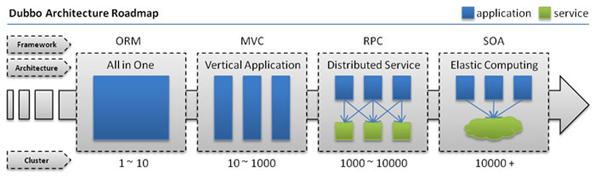
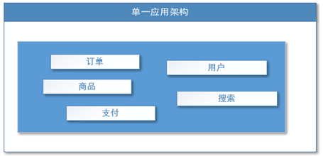
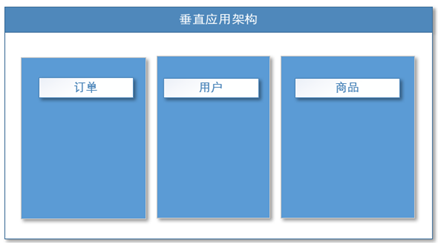
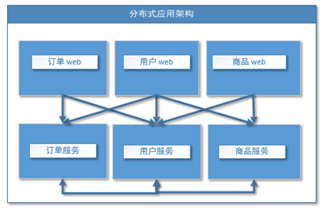
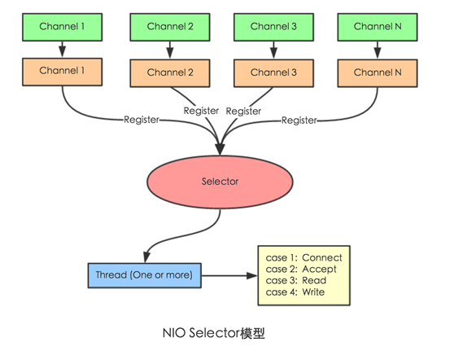
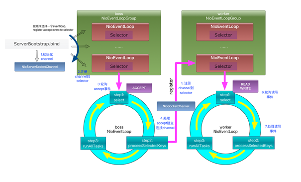

# dubbo

## 1、分布式基础理论

“分布式系统是若干独立计算机的集合，这些计算机对于用户来说就像单个相关系统”

分布式系统（distributed system）是建立在网络之上的软件系统。

## 2、发展演变

- 单一应用架构

  当网站流量很小时，只需一个应用，将所有功能都部署在一起，以减少部署节点和成本。此时，用于简化增删改查工作量的数据访问框架(ORM)是关键。

  

  适用于小型网站，小型管理系统，将所有功能都部署到一个功能里，简单易用。

  缺点： 1、性能扩展比较难

  ​    		 2、协同开发问题

  ​    		 3、不利于升级维护

- 垂直应用架构

当访问量逐渐增大，单一应用增加机器带来的加速度越来越小，将应用拆成互不相干的几个应用，以提升效率。此时，用于加速前端页面开发的Web框架(MVC)是关键。

通过切分业务来实现各个模块独立部署，降低了维护和部署的难度，团队各司其职更易管理，性能扩展也更方便，更有针对性。

缺点： 公用模块无法重复利用，开发性的浪费

- 分布式服务架构

当垂直应用越来越多，应用之间交互不可避免，将核心业务抽取出来，作为独立的服务，逐渐形成稳定的服务中心，使前端应用能更快速的响应多变的市场需求。此时，用于提高业务复用及整合的`分布式服务框架RPC`是关键。

- 流动计算架构

当服务越来越多，容量的评估，小服务资源的浪费等问题逐渐显现，此时需增加一个调度中心基于访问压力实时管理集群容量，提高集群利用率。此时，用于`提高机器利用率的资源调度和治理中心(SOA)[ Service Oriented Architecture]`是关键。

## 3、PRC

RPC【Remote Procedure Call】是指远程过程调用，是一种进程间通信方式，他是一种技术的思想，而不是规范。它允许程序调用另一个地址空间（通常是共享网络的另一台机器上）的过程或函数，而不用程序员显式编码这个远程调用的细节。即程序员无论是调用本地的还是远程的函数，本质上编写的调用代码基本相同。

RPC两个核心模块：通讯，序列化。

### 3.1、核心概念

Apache Dubbo (incubating) |ˈdʌbəʊ| 是一款高性能、轻量级的开源Java RPC框架，它提供了三大核心能力：面向接口的远程方法调用，智能容错和负载均衡，以及服务自动注册和发现。

[官网](http://dubbo.apache.org/)

**服务提供者（Provider）**：暴露服务的服务提供方，服务提供者在启动时，向注册中心注册自己提供的服务。

**服务消费者（Consumer）**: 调用远程服务的服务消费方，服务消费者在启动时，向注册中心订阅自己所需的服务，服务消费者，从提供者地址列表中，基于软负载均衡算法，选一台提供者进行调用，如果调用失败，再选另一台调用。

**注册中心（Registry）**：注册中心返回服务提供者地址列表给消费者，如果有变更，注册中心将基于长连接推送变更数据给消费者

**监控中心（Monitor）**：服务消费者和提供者，在内存中累计调用次数和调用时间，定时每分钟发送一次统计数据到监控中心

**调用关系说明：**

- 服务容器负责启动，加载，运行服务提供者。

- 服务提供者在启动时，向注册中心注册自己提供的服务。

- 服务消费者在启动时，向注册中心订阅自己所需的服务。

- 注册中心返回服务提供者地址列表给消费者，如果有变更，注册中心将基于长连接推送变更数据给消费者。

- 服务消费者，从提供者地址列表中，基于软负载均衡算法，选一台提供者进行调用，如果调用失败，再选另一台调用。

- 服务消费者和提供者，在内存中累计调用次数和调用时间，定时每分钟发送一次统计数据到监控中心。

### 3.2、PRC原理

一次完整的RPC调用流程（同步调用，异步另说）如下：

1）服务消费方（client）调用以本地调用方式调用服务； 

2）client stub接收到调用后负责将方法、参数等组装成能够进行网络传输的消息体； 

3）client stub找到服务地址，并将消息发送到服务端； 

4）server stub收到消息后进行解码； 

5）server stub根据解码结果调用本地的服务； 

6）本地服务执行并将结果返回给server stub； 

7）server stub将返回结果打包成消息并发送至消费方； 

8）client stub接收到消息，并进行解码； 

9）服务消费方得到最终结果。

RPC框架的目标就是要2~8这些步骤都封装起来，这些细节对用户来说是透明的，不可见的。

### 3.3、netty通信原理

Netty是一个异步事件驱动的网络应用程序框架， 用于快速开发可维护的高性能协议服务器和客户端。它极大地简化并简化了TCP和UDP套接字服务器等网络编程。

BIO：(Blocking IO)

NIO (Non-Blocking IO)

Selector 一般称 为选择器 ，也可以翻译为 多路复用器，
Connect（连接就绪）、Accept（接受就绪）、Read（读就绪）、Write（写就绪）
Netty基本原理：

### 3.4、dubbo原理

#### dubbo原理 -框架设计

