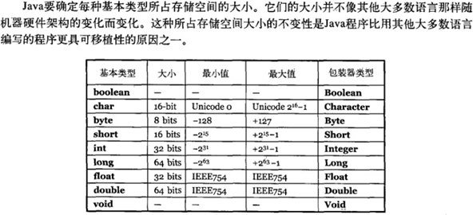
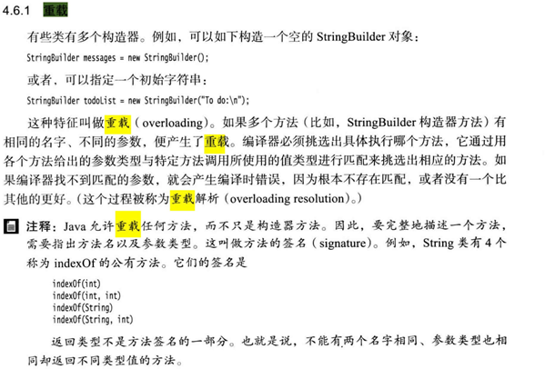

# Java基础

##   Java 语⾔有哪些特点?

1.	简单易学；
2.	⾯向对象（封装，继承，多态）；
3.	平台⽆关性（ Java 虚拟机实现平台⽆关性）；
4.	可靠性；
5.	安全性；
6.	⽀持多线程（ C++ 语⾔没有内置的多线程机制，因此必须调⽤操作系统的多线程功能来进⾏多线程程序设计，⽽ Java 语⾔却提供了多线程⽀持）；

7.	⽀持⽹络编程并且很⽅便（ Java 语⾔诞⽣本身就是为简化⽹络编程设计的，因此 Java  语⾔不仅⽀持⽹络编程⽽且很⽅便）；
8.	编译与解释并存；

## 字符型常量和字符串常量的区别?

1.	形式上: 字符常量是单引号引起的⼀个字符; 字符串常量是双引号引起的若⼲个字符
2.	含义上: 字符常量相当于⼀个整型值( ASCII 值),可以参加表达式运算; 字符串常量代表⼀个地址值(该字符串在内存中存放位置)
3.	占内存⼤⼩ 字符常量只占 2 个字节; 字符串常量占若⼲个字节 (注意： char 在 Java 中占两个字节)

## 构造器 Constructor 是否可被 override?

Constructor 不能被 override（重写）,但是可以 overload（重载）,所以你可以看到⼀个类中有多个构造函数的情况。

## 重载和重写的区别

重载就是同样的⼀个⽅法能够根据输⼊数据的不同，做出不同的处理
重写就是当⼦类继承⾃⽗类的相同⽅法，输⼊数据⼀样，但要做出有别于⽗类的响应时，你就要覆    盖⽗类⽅法
重载发⽣在同⼀个类中，⽅法名必须相同，参数类型不同、个数不同、顺序不同，⽅法返回值和访问修饰符    可以不同。
下⾯是《Java 核⼼技术》对重载这个概念的介绍：

综上：重载就是同⼀个类中多个同名⽅法根据不同的传参来执⾏不同的逻辑处理。
重写发⽣在运⾏期，是⼦类对⽗类的允许访问的⽅法的实现过程进⾏重新编写。

1. 返回值类型、⽅法名、参数列表必须相同，抛出的异常范围⼩于等于⽗类，访问修饰符范围⼤于     等于⽗类。

2.	如果⽗类⽅法访问修饰符为 private/final/static 则⼦类就不能重写该⽅法，但是被 static修饰的⽅法能够被再次声明。

3. 构造⽅法⽆法被重写

   综上：重写就是⼦类对⽗类⽅法的重新改造，外部样⼦不能改变，内部逻辑可以改变 。

| **区别点** | **重载⽅法** | **重写⽅法**                                   |
| ---------- | ------------ | ---------------------------------------------- |
| 发⽣范围   | 同⼀个类     | 子类中                                         |
| 参数列表   | 必须修改     | ⼀定不能修改                                   |
| 返回类型   | 可修改       | ⼀定不能修改                                   |
| 异常       | 可修改       | 可以减少或删除，⼀定不能抛出新的或者更⼴的异常 |
| 访问修饰符 | 可修改       | ⼀定不能做更严格的限制（可以降低限制）         |
| 发⽣阶段   | 编译期       | 运⾏期                                         |

##  Java⾯向对象编程三大特性：封装 继承 多态

## == 与 equals(重要)

##  hashCode 与 equals (重要)

## 

## 

##

##

##

# 集合

# 多线程

# Spring

# 微服务

# Netty和PRC

