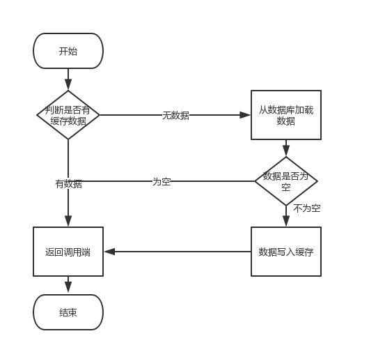
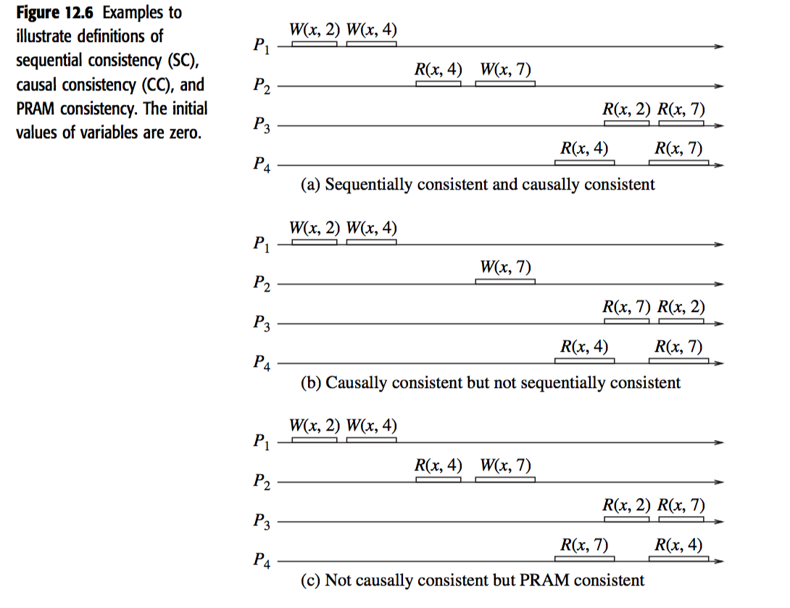
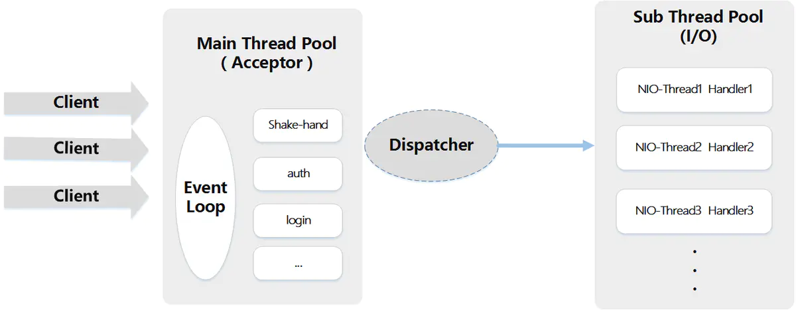

# Java 基础


## 数据类型

### 基本类型

- byte/8
- char/16
- short/16
- int/32
- float/32
- long/64
- double/64
- boolean/\~

boolean 只有两个值：true、false，可以使用 1 bit 来存储，但是具体大小没有明确规定。JVM 会在编译时期将 boolean 类型的数据转换为 int，使用 1 来表示 true，0 表示 false。JVM 支持 boolean 数组，但是是通过读写 byte 数组来实现的。

- [Primitive Data Types](https://docs.oracle.com/javase/tutorial/java/nutsandbolts/datatypes.html)
- [The Java® Virtual Machine Specification](https://docs.oracle.com/javase/specs/jvms/se8/jvms8.pdf)

### 包装类型

#### 为什么需要

- 由于基本数据类型不是对象，所以java并不是纯面向对象的语言，好处是效率较高（全部包装为对象效率较低)。
- Java是一个面向对象的编程语言，基本类型并不具有对象的性质，为了让基本类型也具有对象的特征，就出现了包装类型（如我们在使用集合类型Collection时就一定要使用包装类型而非基本类型)，它相当于将基本类型“包装起来”，使得它具有了对象的性质，并且为其添加了属性和方法，丰富了基本类型的操作。
- 

#### 有哪些

 基本类型  	  包装器类型  
boolean	Boolean
char	Character
int	Integer
byte	Byte
short	Short
long	Long
float	Float
double	Double

- Number是所有数字包装类的父类

#### 自动装箱、自动拆箱（编译器行为)

- 自动装箱：可以将基础数据类型包装成对应的包装类
- Integer i = 10000; // 编译器会改为new Integer(10000)
- 自动拆箱：可以将包装类转为对应的基础数据类型
- int i = new Integer(1000);//编译器会修改为   int i = new Integer(1000).intValue();

- 自动拆箱时如果包装类是null，那么会抛出NPE

#### Integer.valueOf

```
public static Integer valueOf(int i) {
    if (i >= IntegerCache.low && i <= IntegerCache.high)
        return IntegerCache.cache[i + (-IntegerCache.low)];
    return new Integer(i);
}
```


- 调用Integer.valueOf时-128~127的对象被缓存起来。
- 所以在此访问内的Integer对象使用==和equals结果是一样的。
- 如果Integer的值一致，且在此范围内，因为是同一个对象，所以==返回true；但此访问之外的对象==比较的是内存地址，值相同，也是返回false。

基本类型都有对应的包装类型，基本类型与其对应的包装类型之间的赋值使用自动装箱与拆箱完成。

```java
Integer x = 2;     // 装箱 调用了 Integer.valueOf(2)
int y = x;         // 拆箱 调用了 X.intValue()
```

- [Autoboxing and Unboxing](https://docs.oracle.com/javase/tutorial/java/data/autoboxing.html)

### 缓存池

new Integer(123) 与 Integer.valueOf(123) 的区别在于：

- new Integer(123) 每次都会新建一个对象；
- Integer.valueOf(123) 会使用缓存池中的对象，多次调用会取得同一个对象的引用。

```java
Integer x = new Integer(123);
Integer y = new Integer(123);
System.out.println(x == y);    // false
Integer z = Integer.valueOf(123);
Integer k = Integer.valueOf(123);
System.out.println(z == k);   // true
```

valueOf() 方法的实现比较简单，就是先判断值是否在缓存池中，如果在的话就直接返回缓存池的内容。

```java
public static Integer valueOf(int i) {
    if (i >= IntegerCache.low && i <= IntegerCache.high)
        return IntegerCache.cache[i + (-IntegerCache.low)];
    return new Integer(i);
}
```

在 Java 8 中，Integer 缓存池的大小默认为 -128\~127。

```java
static final int low = -128;
static final int high;
static final Integer cache[];

static {
    // high value may be configured by property
    int h = 127;
    String integerCacheHighPropValue =
        sun.misc.VM.getSavedProperty("java.lang.Integer.IntegerCache.high");
    if (integerCacheHighPropValue != null) {
        try {
            int i = parseInt(integerCacheHighPropValue);
            i = Math.max(i, 127);
            // Maximum array size is Integer.MAX_VALUE
            h = Math.min(i, Integer.MAX_VALUE - (-low) -1);
        } catch( NumberFormatException nfe) {
            // If the property cannot be parsed into an int, ignore it.
        }
    }
    high = h;

    cache = new Integer[(high - low) + 1];
    int j = low;
    for(int k = 0; k < cache.length; k++)
        cache[k] = new Integer(j++);

    // range [-128, 127] must be interned (JLS7 5.1.7)
    assert IntegerCache.high >= 127;
}
```

编译器会在自动装箱过程调用 valueOf() 方法，因此多个值相同且值在缓存池范围内的 Integer 实例使用自动装箱来创建，那么就会引用相同的对象。

```java
Integer m = 123;
Integer n = 123;
System.out.println(m == n); // true
```

基本类型对应的缓冲池如下：

- boolean values true and false
- all byte values
- short values between -128 and 127
- int values between -128 and 127
- char in the range \u0000 to \u007F

在使用这些基本类型对应的包装类型时，如果该数值范围在缓冲池范围内，就可以直接使用缓冲池中的对象。

在 jdk 1.8 所有的数值类缓冲池中，Integer 的缓冲池 IntegerCache 很特殊，这个缓冲池的下界是 - 128，上界默认是 127，但是这个上界是可调的，在启动 jvm 的时候，通过 -XX:AutoBoxCacheMax=&lt;size&gt; 来指定这个缓冲池的大小，该选项在 JVM 初始化的时候会设定一个名为 java.lang.IntegerCache.high 系统属性，然后 IntegerCache 初始化的时候就会读取该系统属性来决定上界。

[StackOverflow : Differences between new Integer(123), Integer.valueOf(123) and just 123

](https://stackoverflow.com/questions/9030817/differences-between-new-integer123-integer-valueof123-and-just-123)

## 四种引用类型

- 目的：避免对象长期占用内存，

### 强引用

- StringReference GC时不回收
- 当内存空间不足，Java虚拟机宁愿抛出OutOfMemoryError错误，使程序异常终止，也不会靠随意回收具有强引用的对象来解决内存不足问题。

### 软引用

- SoftReference GC时如果JVM内存不足时会回收
- 软引用可用来实现内存敏感的高速缓存。 软引用可以和一个引用队列（ReferenceQueue)联合使用，如果软引用所引用的对象被垃圾回收，Java虚拟机就会把这个软引用加入到与之关联的引用队列中。

### 弱引用

- WeakReference GC时立即回收
- 弱引用与软引用的区别在于：只具有弱引用的对象拥有更短暂的生命周期。
- 弱引用可以和一个引用队列（ReferenceQueue)联合使用，如果弱引用所引用的对象被垃圾回收，Java虚拟机就会把这个弱引用加入到与之关联的引用队列中。

### 虚引用

- PhantomReference 
- 如果一个对象仅持有虚引用，那么它就和没有任何引用一样，在任何时候都可能被垃圾回收。 虚引用主要用来跟踪对象被垃圾回收的活动。虚引用与软引用和弱引用的一个区别在于：虚引用必须和引用队列（ReferenceQueue)联合使用。当垃圾回收器准备回收一个对象时，如果发现它还有虚引用，就会在回收对象的内存之前，把这个虚引用加入到与之关联的引用队列中。程序可以通过判断引用队列中是否已经加入了虚引用，来了解被引用的对象是否将要被垃圾回收。程序如果发现某个虚引用已经被加入到引用队列，那么就可以在所引用的对象的内存被回收之前采取必要的行动。

- 在Java集合中有一种特殊的Map类型：WeakHashMap， 在这种Map中存放了键对象的弱引用，当一个键对象被垃圾回收，那么相应的值对象的引用会从Map中删除。WeakHashMap能够节约存储空间，可用来缓存那些非必须存在的数据。

## String

### 概览

String 被声明为 final，因此它不可被继承。(Integer 等包装类也不能被继承）

在 Java 8 中，String 内部使用 char 数组存储数据。

```java
public final class String
    implements java.io.Serializable, Comparable<String>, CharSequence {
    /** The value is used for character storage. */
    private final char value[];
}
```

在 Java 9 之后，String 类的实现改用 byte 数组存储字符串，同时使用 `coder` 来标识使用了哪种编码。

```java
public final class String
    implements java.io.Serializable, Comparable<String>, CharSequence {
    /** The value is used for character storage. */
    private final byte[] value;

    /** The identifier of the encoding used to encode the bytes in {@code value}. */
    private final byte coder;
}
```

value 数组被声明为 final，这意味着 value 数组初始化之后就不能再引用其它数组。并且 String 内部没有改变 value 数组的方法，因此可以保证 String 不可变。

### 不可变的好处

**1. 可以缓存 hash 值**  

因为 String 的 hash 值经常被使用，例如 String 用做 HashMap 的 key。不可变的特性可以使得 hash 值也不可变，因此只需要进行一次计算。

**2. String Pool 的需要**  

如果一个 String 对象已经被创建过了，那么就会从 String Pool 中取得引用。只有 String 是不可变的，才可能使用 String Pool。

<div align="center">  </div><br>

**3. 安全性**  

String 经常作为参数，String 不可变性可以保证参数不可变。例如在作为网络连接参数的情况下如果 String 是可变的，那么在网络连接过程中，String 被改变，改变 String 的那一方以为现在连接的是其它主机，而实际情况却不一定是。

**4. 线程安全**  

String 不可变性天生具备线程安全，可以在多个线程中安全地使用。

[Program Creek : Why String is immutable in Java?](https://www.programcreek.com/2013/04/why-string-is-immutable-in-java/)

### String, StringBuffer and StringBuilder	

**1. 可变性**  

- 都是final类，不允许继承
- String 不可变，StringBuffer 和 StringBuilder 可变

**2. 线程安全**  

- String 不可变，因此是线程安全的
- StringBuilder 不是线程安全的
- StringBuffer 是线程安全的，内部使用 synchronized 进行同步

[StackOverflow : String, StringBuffer, and StringBuilder](https://stackoverflow.com/questions/2971315/string-stringbuffer-and-stringbuilder)

### String Pool

字符串常量池（String Pool）保存着所有字符串字面量（literal strings），这些字面量在编译时期就确定。不仅如此，还可以使用 String 的 intern() 方法在运行过程将字符串添加到 String Pool 中。

当一个字符串调用 intern() 方法时，如果 String Pool 中已经存在一个字符串和该字符串值相等（使用 equals() 方法进行确定），那么就会返回 String Pool 中字符串的引用；否则，就会在 String Pool 中添加一个新的字符串，并返回这个新字符串的引用。

下面示例中，s1 和 s2 采用 new String() 的方式新建了两个不同字符串，而 s3 和 s4 是通过 s1.intern() 和 s2.intern() 方法取得同一个字符串引用。intern() 首先把 "aaa" 放到 String Pool 中，然后返回这个字符串引用，因此 s3 和 s4 引用的是同一个字符串。

```java
String s1 = new String("aaa");
String s2 = new String("aaa");
System.out.println(s1 == s2);           // false
String s3 = s1.intern();
String s4 = s2.intern();
System.out.println(s3 == s4);           // true
```

如果是采用 "bbb" 这种字面量的形式创建字符串，会自动地将字符串放入 String Pool 中。

```java
String s5 = "bbb";
String s6 = "bbb";
System.out.println(s5 == s6);  // true
```

在 Java 7 之前，String Pool 被放在运行时常量池中，它属于永久代。而在 Java 7，String Pool 被移到堆中。这是因为永久代的空间有限，在大量使用字符串的场景下会导致 OutOfMemoryError 错误。

- [StackOverflow : What is String interning?](https://stackoverflow.com/questions/10578984/what-is-string-interning)
- [深入解析 String#intern](https://tech.meituan.com/in_depth_understanding_string_intern.html)

### new String("abc")

使用这种方式一共会创建两个字符串对象（前提是 String Pool 中还没有 "abc" 字符串对象）。

- "abc" 属于字符串字面量，因此编译时期会在 String Pool 中创建一个字符串对象，指向这个 "abc" 字符串字面量；
- 而使用 new 的方式会在堆中创建一个字符串对象。

创建一个测试类，其 main 方法中使用这种方式来创建字符串对象。

```java
public class NewStringTest {
    public static void main(String[] args) {
        String s = new String("abc");
    }
}
```

使用 javap -verbose 进行反编译，得到以下内容：

```java
// ...
Constant pool:
// ...
   #2 = Class              #18            // java/lang/String
   #3 = String             #19            // abc
// ...
  #18 = Utf8               java/lang/String
  #19 = Utf8               abc
// ...

  public static void main(java.lang.String[]);
    descriptor: ([Ljava/lang/String;)V
    flags: ACC_PUBLIC, ACC_STATIC
    Code:
      stack=3, locals=2, args_size=1
         0: new           #2                  // class java/lang/String
         3: dup
         4: ldc           #3                  // String abc
         6: invokespecial #4                  // Method java/lang/String."<init>":(Ljava/lang/String;)V
         9: astore_1
// ...
```

在 Constant Pool 中，#19 存储这字符串字面量 "abc"，#3 是 String Pool 的字符串对象，它指向 #19 这个字符串字面量。在 main 方法中，0: 行使用 new #2 在堆中创建一个字符串对象，并且使用 ldc #3 将 String Pool 中的字符串对象作为 String 构造函数的参数。

以下是 String 构造函数的源码，可以看到，在将一个字符串对象作为另一个字符串对象的构造函数参数时，并不会完全复制 value 数组内容，而是都会指向同一个 value 数组。

```java
public String(String original) {
    this.value = original.value;
    this.hash = original.hash;
}
```

## 运算

### 参数传递

Java 的参数是以值传递的形式传入方法中，而不是引用传递。

以下代码中 Dog dog 的 dog 是一个指针，存储的是对象的地址。在将一个参数传入一个方法时，本质上是将对象的地址以值的方式传递到形参中。

```java
public class Dog {

    String name;

    Dog(String name) {
        this.name = name;
    }

    String getName() {
        return this.name;
    }

    void setName(String name) {
        this.name = name;
    }

    String getObjectAddress() {
        return super.toString();
    }
}
```

在方法中改变对象的字段值会改变原对象该字段值，因为引用的是同一个对象。

```java
class PassByValueExample {
    public static void main(String[] args) {
        Dog dog = new Dog("A");
        func(dog);
        System.out.println(dog.getName());          // B
    }

    private static void func(Dog dog) {
        dog.setName("B");
    }
}
```

但是在方法中将指针引用了其它对象，那么此时方法里和方法外的两个指针指向了不同的对象，在一个指针改变其所指向对象的内容对另一个指针所指向的对象没有影响。

```java
public class PassByValueExample {
    public static void main(String[] args) {
        Dog dog = new Dog("A");
        System.out.println(dog.getObjectAddress()); // Dog@4554617c
        func(dog);
        System.out.println(dog.getObjectAddress()); // Dog@4554617c
        System.out.println(dog.getName());          // A
    }

    private static void func(Dog dog) {
        System.out.println(dog.getObjectAddress()); // Dog@4554617c
        dog = new Dog("B");
        System.out.println(dog.getObjectAddress()); // Dog@74a14482
        System.out.println(dog.getName());          // B
    }
}
```

[StackOverflow: Is Java “pass-by-reference” or “pass-by-value”?](https://stackoverflow.com/questions/40480/is-java-pass-by-reference-or-pass-by-value)

### float 与 double

Java 不能隐式执行向下转型，因为这会使得精度降低。

1.1 字面量属于 double 类型，不能直接将 1.1 直接赋值给 float 变量，因为这是向下转型。

```java
// float f = 1.1;
```

1.1f 字面量才是 float 类型。

```java
float f = 1.1f;
```

### 隐式类型转换

因为字面量 1 是 int 类型，它比 short 类型精度要高，因此不能隐式地将 int 类型向下转型为 short 类型。

```java
short s1 = 1;
// s1 = s1 + 1;
```

但是使用 += 或者 ++ 运算符会执行隐式类型转换。

```java
s1 += 1;
s1++;
```

上面的语句相当于将 s1 + 1 的计算结果进行了向下转型：

```java
s1 = (short) (s1 + 1);
```

[StackOverflow : Why don't Java's +=, -=, *=, /= compound assignment operators require casting?](https://stackoverflow.com/questions/8710619/why-dont-javas-compound-assignment-operators-require-casting)

### switch

从 Java 7 开始，可以在 switch 条件判断语句中使用 String 对象。

```java
String s = "a";
switch (s) {
    case "a":
        System.out.println("aaa");
        break;
    case "b":
        System.out.println("bbb");
        break;
}
```

switch 不支持 long、float、double，是因为 switch 的设计初衷是对那些只有少数几个值的类型进行等值判断，如果值过于复杂，那么还是用 if 比较合适。

```java
// long x = 111;
// switch (x) { // Incompatible types. Found: 'long', required: 'char, byte, short, int, Character, Byte, Short, Integer, String, or an enum'
//     case 111:
//         System.out.println(111);
//         break;
//     case 222:
//         System.out.println(222);
//         break;
// }
```

[StackOverflow : Why can't your switch statement data type be long, Java?](https://stackoverflow.com/questions/2676210/why-cant-your-switch-statement-data-type-be-long-java)

## 关键字

### final

**1. 数据**  

声明数据为常量，可以是编译时常量，也可以是在运行时被初始化后不能被改变的常量。

- 对于基本类型，final 使数值不变；
- 对于引用类型，final 使引用不变，也就不能引用其它对象，但是被引用的对象本身是可以修改的。

```java
final int x = 1;
// x = 2;  // cannot assign value to final variable 'x'
final A y = new A();
y.a = 1;
```

**2. 方法**  

声明方法不能被子类重写。

private 方法隐式地被指定为 final，如果在子类中定义的方法和基类中的一个 private 方法签名相同，此时子类的方法不是重写基类方法，而是在子类中定义了一个新的方法。

**3. 类**  

声明类不允许被继承。

### static

**1. 静态变量**  

- 静态变量：又称为类变量，也就是说这个变量属于类的，类所有的实例都共享静态变量，可以直接通过类名来访问它。静态变量在内存中只存在一份。
- 实例变量：每创建一个实例就会产生一个实例变量，它与该实例同生共死。

```java
public class A {

    private int x;         // 实例变量
    private static int y;  // 静态变量

    public static void main(String[] args) {
        // int x = A.x;  // Non-static field 'x' cannot be referenced from a static context
        A a = new A();
        int x = a.x;
        int y = A.y;
    }
}
```

**2. 静态方法**  

静态方法在类加载的时候就存在了，它不依赖于任何实例。所以静态方法必须有实现，也就是说它不能是抽象方法。

```java
public abstract class A {
    public static void func1(){
    }
    // public abstract static void func2();  // Illegal combination of modifiers: 'abstract' and 'static'
}
```

只能访问所属类的静态字段和静态方法，方法中不能有 this 和 super 关键字，因此这两个关键字与具体对象关联。

```java
public class A {

    private static int x;
    private int y;

    public static void func1(){
        int a = x;
        // int b = y;  // Non-static field 'y' cannot be referenced from a static context
        // int b = this.y;     // 'A.this' cannot be referenced from a static context
    }
}
```

**3. 静态语句块**  

静态语句块在类初始化时运行一次。

```java
public class A {
    static {
        System.out.println("123");
    }

    public static void main(String[] args) {
        A a1 = new A();
        A a2 = new A();
    }
}
```

```html
123
```

**4. 静态内部类**  

非静态内部类依赖于外部类的实例，也就是说需要先创建外部类实例，才能用这个实例去创建非静态内部类。而静态内部类不需要。

```java
public class OuterClass {

    class InnerClass {
    }

    static class StaticInnerClass {
    }

    public static void main(String[] args) {
        // InnerClass innerClass = new InnerClass(); // 'OuterClass.this' cannot be referenced from a static context
        OuterClass outerClass = new OuterClass();
        InnerClass innerClass = outerClass.new InnerClass();
        StaticInnerClass staticInnerClass = new StaticInnerClass();
    }
}
```

静态内部类不能访问外部类的非静态的变量和方法。

**5. 静态导包**  

在使用静态变量和方法时不用再指明 ClassName，从而简化代码，但可读性大大降低。

```java
import static com.xxx.ClassName.*
```

**6. 初始化顺序**  

静态变量和静态语句块优先于实例变量和普通语句块，静态变量和静态语句块的初始化顺序取决于它们在代码中的顺序。

```java
public static String staticField = "静态变量";
```

```java
static {
    System.out.println("静态语句块");
}
```

```java
public String field = "实例变量";
```

```java
{
    System.out.println("普通语句块");
}
```

最后才是构造函数的初始化。

```java
public InitialOrderTest() {
    System.out.println("构造函数");
}
```

存在继承的情况下，初始化顺序为：

- 父类（静态变量、静态语句块）
- 子类（静态变量、静态语句块）
- 父类（实例变量、普通语句块）
- 父类（构造函数）
- 子类（实例变量、普通语句块）
- 子类（构造函数）

## Object 通用方法

### 概览

```java
public native int hashCode()

public boolean equals(Object obj)

protected native Object clone() throws CloneNotSupportedException

public String toString()

public final native Class<?> getClass()

protected void finalize() throws Throwable {}

public final native void notify()

public final native void notifyAll()

public final native void wait(long timeout) throws InterruptedException

public final void wait(long timeout, int nanos) throws InterruptedException

public final void wait() throws InterruptedException
```

### equals()

**1. 等价关系**  

两个对象具有等价关系，需要满足以下五个条件：

Ⅰ 自反性

```java
x.equals(x); // true
```

Ⅱ 对称性

```java
x.equals(y) == y.equals(x); // true
```

Ⅲ 传递性

```java
if (x.equals(y) && y.equals(z))
    x.equals(z); // true;
```

Ⅳ 一致性

多次调用 equals() 方法结果不变

```java
x.equals(y) == x.equals(y); // true
```

Ⅴ 与 null 的比较

对任何不是 null 的对象 x 调用 x.equals(null) 结果都为 false

```java
x.equals(null); // false;
```

**2.==和equals的区别**

- 对于基本类型，== 判断两个值是否相等，基本类型没有 equals() 方法。
- 对于引用类型，== 判断两个变量是否引用同一个对象，而 equals() 判断引用的对象是否等价。
- 如果两个引用类型变量使用==运算符，那么比较的是地址，它们分别指向的是否是同一地址的对象。结果一定是false，因为两个对象不可能存放在同一地址处。
- 要求是两个对象都不是能空值，与空值比较返回false。
- ==不能实现比较对象的值是否相同。
- 所有对象都有equals方法，默认是Object类的equals，其结果与==一样。
- 如果希望比较对象的值相同，必须重写equals方法。

```java
Integer x = new Integer(1);
Integer y = new Integer(1);
System.out.println(x.equals(y)); // true
System.out.println(x == y);      // false
```

**3. 实现**  

- 检查是否为同一个对象的引用，如果是直接返回 true；
- 检查是否是同一个类型，如果不是，直接返回 false；
- 将 Object 对象进行转型；
- 判断每个关键域是否相等。

```java
public class EqualExample {

    private int x;
    private int y;
    private int z;

    public EqualExample(int x, int y, int z) {
        this.x = x;
        this.y = y;
        this.z = z;
    }

    @Override
    public boolean equals(Object o) {
        if (this == o) return true;
        if (o == null || getClass() != o.getClass()) return false;

        EqualExample that = (EqualExample) o;

        if (x != that.x) return false;
        if (y != that.y) return false;
        return z == that.z;
    }
}
```

### hashCode()

hashCode() 返回哈希值，而 equals() 是用来判断两个对象是否等价。等价的两个对象散列值一定相同，但是散列值相同的两个对象不一定等价，这是因为计算哈希值具有随机性，两个值不同的对象可能计算出相同的哈希值。

在覆盖 equals() 方法时应当总是覆盖 hashCode() 方法，保证等价的两个对象哈希值也相等。

HashSet  和 HashMap 等集合类使用了 hashCode()  方法来计算对象应该存储的位置，因此要将对象添加到这些集合类中，需要让对应的类实现 hashCode()  方法。

下面的代码中，新建了两个等价的对象，并将它们添加到 HashSet 中。我们希望将这两个对象当成一样的，只在集合中添加一个对象。但是 EqualExample 没有实现 hashCode() 方法，因此这两个对象的哈希值是不同的，最终导致集合添加了两个等价的对象。

```java
EqualExample e1 = new EqualExample(1, 1, 1);
EqualExample e2 = new EqualExample(1, 1, 1);
System.out.println(e1.equals(e2)); // true
HashSet<EqualExample> set = new HashSet<>();
set.add(e1);
set.add(e2);
System.out.println(set.size());   // 2
```

理想的哈希函数应当具有均匀性，即不相等的对象应当均匀分布到所有可能的哈希值上。这就要求了哈希函数要把所有域的值都考虑进来。可以将每个域都当成 R 进制的某一位，然后组成一个 R 进制的整数。

R 一般取 31，因为它是一个奇素数，如果是偶数的话，当出现乘法溢出，信息就会丢失，因为与 2 相乘相当于向左移一位，最左边的位丢失。并且一个数与 31 相乘可以转换成移位和减法：`31*x == (x<<5)-x`，编译器会自动进行这个优化。

```java
@Override
public int hashCode() {
    int result = 17;
    result = 31 * result + x;
    result = 31 * result + y;
    result = 31 * result + z;
    return result;
}
```

### toString()

默认返回 ToStringExample@4554617c 这种形式，其中 @ 后面的数值为散列码的无符号十六进制表示。

```java
public class ToStringExample {

    private int number;

    public ToStringExample(int number) {
        this.number = number;
    }
}
```

```java
ToStringExample example = new ToStringExample(123);
System.out.println(example.toString());
```

```html
ToStringExample@4554617c
```

### clone()

**1. cloneable**  

clone() 是 Object 的 protected 方法，它不是 public，一个类不显式去重写 clone()，其它类就不能直接去调用该类实例的 clone() 方法。

```java
public class CloneExample {
    private int a;
    private int b;
}
```

```java
CloneExample e1 = new CloneExample();
// CloneExample e2 = e1.clone(); // 'clone()' has protected access in 'java.lang.Object'
```

重写 clone() 得到以下实现：

```java
public class CloneExample {
    private int a;
    private int b;

    @Override
    public CloneExample clone() throws CloneNotSupportedException {
        return (CloneExample)super.clone();
    }
}
```

```java
CloneExample e1 = new CloneExample();
try {
    CloneExample e2 = e1.clone();
} catch (CloneNotSupportedException e) {
    e.printStackTrace();
}
```

```html
java.lang.CloneNotSupportedException: CloneExample
```

以上抛出了 CloneNotSupportedException，这是因为 CloneExample 没有实现 Cloneable 接口。

应该注意的是，clone() 方法并不是 Cloneable 接口的方法，而是 Object 的一个 protected 方法。Cloneable 接口只是规定，如果一个类没有实现 Cloneable 接口又调用了 clone() 方法，就会抛出 CloneNotSupportedException。

```java
public class CloneExample implements Cloneable {
    private int a;
    private int b;

    @Override
    public Object clone() throws CloneNotSupportedException {
        return super.clone();
    }
}
```

**2. 浅拷贝**  

拷贝对象和原始对象的引用类型引用同一个对象。

```java
public class ShallowCloneExample implements Cloneable {

    private int[] arr;

    public ShallowCloneExample() {
        arr = new int[10];
        for (int i = 0; i < arr.length; i++) {
            arr[i] = i;
        }
    }

    public void set(int index, int value) {
        arr[index] = value;
    }

    public int get(int index) {
        return arr[index];
    }

    @Override
    protected ShallowCloneExample clone() throws CloneNotSupportedException {
        return (ShallowCloneExample) super.clone();
    }
}
```

```java
ShallowCloneExample e1 = new ShallowCloneExample();
ShallowCloneExample e2 = null;
try {
    e2 = e1.clone();
} catch (CloneNotSupportedException e) {
    e.printStackTrace();
}
e1.set(2, 222);
System.out.println(e2.get(2)); // 222
```

**3. 深拷贝**  

拷贝对象和原始对象的引用类型引用不同对象。

```java
public class DeepCloneExample implements Cloneable {

    private int[] arr;

    public DeepCloneExample() {
        arr = new int[10];
        for (int i = 0; i < arr.length; i++) {
            arr[i] = i;
        }
    }

    public void set(int index, int value) {
        arr[index] = value;
    }

    public int get(int index) {
        return arr[index];
    }

    @Override
    protected DeepCloneExample clone() throws CloneNotSupportedException {
        DeepCloneExample result = (DeepCloneExample) super.clone();
        result.arr = new int[arr.length];
        for (int i = 0; i < arr.length; i++) {
            result.arr[i] = arr[i];
        }
        return result;
    }
}
```

```java
DeepCloneExample e1 = new DeepCloneExample();
DeepCloneExample e2 = null;
try {
    e2 = e1.clone();
} catch (CloneNotSupportedException e) {
    e.printStackTrace();
}
e1.set(2, 222);
System.out.println(e2.get(2)); // 2
```

**4. clone() 的替代方案**  

使用 clone() 方法来拷贝一个对象即复杂又有风险，它会抛出异常，并且还需要类型转换。Effective Java 书上讲到，最好不要去使用 clone()，可以使用拷贝构造函数或者拷贝工厂来拷贝一个对象。

```java
public class CloneConstructorExample {

    private int[] arr;

    public CloneConstructorExample() {
        arr = new int[10];
        for (int i = 0; i < arr.length; i++) {
            arr[i] = i;
        }
    }

    public CloneConstructorExample(CloneConstructorExample original) {
        arr = new int[original.arr.length];
        for (int i = 0; i < original.arr.length; i++) {
            arr[i] = original.arr[i];
        }
    }

    public void set(int index, int value) {
        arr[index] = value;
    }

    public int get(int index) {
        return arr[index];
    }
}
```

```java
CloneConstructorExample e1 = new CloneConstructorExample();
CloneConstructorExample e2 = new CloneConstructorExample(e1);
e1.set(2, 222);
System.out.println(e2.get(2)); // 2
```

## 继承

### 访问权限

Java 中有三个访问权限修饰符：private、protected 以及 public，如果不加访问修饰符，表示包级可见。

可以对类或类中的成员（字段和方法）加上访问修饰符。

- 类可见表示其它类可以用这个类创建实例对象。
- 成员可见表示其它类可以用这个类的实例对象访问到该成员；

protected 用于修饰成员，表示在继承体系中成员对于子类可见，但是这个访问修饰符对于类没有意义。

设计良好的模块会隐藏所有的实现细节，把它的 API 与它的实现清晰地隔离开来。模块之间只通过它们的 API 进行通信，一个模块不需要知道其他模块的内部工作情况，这个概念被称为信息隐藏或封装。因此访问权限应当尽可能地使每个类或者成员不被外界访问。

如果子类的方法重写了父类的方法，那么子类中该方法的访问级别不允许低于父类的访问级别。这是为了确保可以使用父类实例的地方都可以使用子类实例去代替，也就是确保满足里氏替换原则。

字段决不能是公有的，因为这么做的话就失去了对这个字段修改行为的控制，客户端可以对其随意修改。例如下面的例子中，AccessExample 拥有 id 公有字段，如果在某个时刻，我们想要使用 int 存储 id 字段，那么就需要修改所有的客户端代码。

```java
public class AccessExample {
    public String id;
}
```

可以使用公有的 getter 和 setter 方法来替换公有字段，这样的话就可以控制对字段的修改行为。

```java
public class AccessExample {

    private int id;

    public String getId() {
        return id + "";
    }

    public void setId(String id) {
        this.id = Integer.valueOf(id);
    }
}
```

但是也有例外，如果是包级私有的类或者私有的嵌套类，那么直接暴露成员不会有特别大的影响。

```java
public class AccessWithInnerClassExample {

    private class InnerClass {
        int x;
    }

    private InnerClass innerClass;

    public AccessWithInnerClassExample() {
        innerClass = new InnerClass();
    }

    public int getValue() {
        return innerClass.x;  // 直接访问
    }
}
```

### 抽象类与接口

**1. 抽象类**  

抽象类和抽象方法都使用 abstract 关键字进行声明。如果一个类中包含抽象方法，那么这个类必须声明为抽象类。

抽象类和普通类最大的区别是，抽象类不能被实例化，只能被继承。

```java
public abstract class AbstractClassExample {

    protected int x;
    private int y;

    public abstract void func1();

    public void func2() {
        System.out.println("func2");
    }
}
```

```java
public class AbstractExtendClassExample extends AbstractClassExample {
    @Override
    public void func1() {
        System.out.println("func1");
    }
}
```

```java
// AbstractClassExample ac1 = new AbstractClassExample(); // 'AbstractClassExample' is abstract; cannot be instantiated
AbstractClassExample ac2 = new AbstractExtendClassExample();
ac2.func1();
```

**2. 接口**  

接口是抽象类的延伸，在 Java 8 之前，它可以看成是一个完全抽象的类，也就是说它不能有任何的方法实现。

从 Java 8 开始，接口也可以拥有默认的方法实现，这是因为不支持默认方法的接口的维护成本太高了。在 Java 8 之前，如果一个接口想要添加新的方法，那么要修改所有实现了该接口的类，让它们都实现新增的方法。

接口的成员（字段 + 方法）默认都是 public 的，并且不允许定义为 private 或者 protected。从 Java 9 开始，允许将方法定义为 private，这样就能定义某些复用的代码又不会把方法暴露出去。

接口的字段默认都是 static 和 final 的。

```java
public interface InterfaceExample {

    void func1();

    default void func2(){
        System.out.println("func2");
    }

    int x = 123;
    // int y;               // Variable 'y' might not have been initialized
    public int z = 0;       // Modifier 'public' is redundant for interface fields
    // private int k = 0;   // Modifier 'private' not allowed here
    // protected int l = 0; // Modifier 'protected' not allowed here
    // private void fun3(); // Modifier 'private' not allowed here
}
```

```java
public class InterfaceImplementExample implements InterfaceExample {
    @Override
    public void func1() {
        System.out.println("func1");
    }
}
```

```java
// InterfaceExample ie1 = new InterfaceExample(); // 'InterfaceExample' is abstract; cannot be instantiated
InterfaceExample ie2 = new InterfaceImplementExample();
ie2.func1();
System.out.println(InterfaceExample.x);
```

**3. 比较**  

- 从设计层面上看，抽象类提供了一种 IS-A 关系，需要满足里式替换原则，即子类对象必须能够替换掉所有父类对象。而接口更像是一种 LIKE-A 关系，它只是提供一种方法实现契约，并不要求接口和实现接口的类具有 IS-A 关系。
- 从使用上来看，一个类可以实现多个接口，但是不能继承多个抽象类。
- 接口的字段只能是 static 和 final 类型的，而抽象类的字段没有这种限制。
- 接口的成员只能是 public 的，而抽象类的成员可以有多种访问权限。

**4. 使用选择**  

使用接口：

- 需要让不相关的类都实现一个方法，例如不相关的类都可以实现 Comparable 接口中的 compareTo() 方法；
- 需要使用多重继承。

使用抽象类：

- 需要在几个相关的类中共享代码。
- 需要能控制继承来的成员的访问权限，而不是都为 public。
- 需要继承非静态和非常量字段。

在很多情况下，接口优先于抽象类。因为接口没有抽象类严格的类层次结构要求，可以灵活地为一个类添加行为。并且从 Java 8 开始，接口也可以有默认的方法实现，使得修改接口的成本也变的很低。

- [Abstract Methods and Classes](https://docs.oracle.com/javase/tutorial/java/IandI/abstract.html)
- [深入理解 abstract class 和 interface](https://www.ibm.com/developerworks/cn/java/l-javainterface-abstract/)
- [When to Use Abstract Class and Interface](https://dzone.com/articles/when-to-use-abstract-class-and-intreface)
- [Java 9 Private Methods in Interfaces](https://www.journaldev.com/12850/java-9-private-methods-interfaces)


### super

- 访问父类的构造函数：可以使用 super() 函数访问父类的构造函数，从而委托父类完成一些初始化的工作。应该注意到，子类一定会调用父类的构造函数来完成初始化工作，一般是调用父类的默认构造函数，如果子类需要调用父类其它构造函数，那么就可以使用 super() 函数。
- 访问父类的成员：如果子类重写了父类的某个方法，可以通过使用 super 关键字来引用父类的方法实现。

```java
public class SuperExample {

    protected int x;
    protected int y;

    public SuperExample(int x, int y) {
        this.x = x;
        this.y = y;
    }

    public void func() {
        System.out.println("SuperExample.func()");
    }
}
```

```java
public class SuperExtendExample extends SuperExample {

    private int z;

    public SuperExtendExample(int x, int y, int z) {
        super(x, y);
        this.z = z;
    }

    @Override
    public void func() {
        super.func();
        System.out.println("SuperExtendExample.func()");
    }
}
```

```java
SuperExample e = new SuperExtendExample(1, 2, 3);
e.func();
```

```html
SuperExample.func()
SuperExtendExample.func()
```

[Using the Keyword super](https://docs.oracle.com/javase/tutorial/java/IandI/super.html)

### 重写与重载

**1. 重写（Override）**  

存在于继承体系中，指子类实现了一个与父类在方法声明上完全相同的一个方法。

为了满足里式替换原则，重写有以下三个限制：

- 子类方法的访问权限必须大于等于父类方法；
- 子类方法的返回类型必须是父类方法返回类型或为其子类型。
- 子类方法抛出的异常类型必须是父类抛出异常类型或为其子类型。

使用 @Override 注解，可以让编译器帮忙检查是否满足上面的三个限制条件。

下面的示例中，SubClass 为 SuperClass 的子类，SubClass 重写了 SuperClass 的 func() 方法。其中：

- 子类方法访问权限为 public，大于父类的 protected。
- 子类的返回类型为 ArrayList\<Integer\>，是父类返回类型 List\<Integer\> 的子类。
- 子类抛出的异常类型为 Exception，是父类抛出异常 Throwable 的子类。
- 子类重写方法使用 @Override 注解，从而让编译器自动检查是否满足限制条件。

```java
class SuperClass {
    protected List<Integer> func() throws Throwable {
        return new ArrayList<>();
    }
}

class SubClass extends SuperClass {
    @Override
    public ArrayList<Integer> func() throws Exception {
        return new ArrayList<>();
    }
}
```

在调用一个方法时，先从本类中查找看是否有对应的方法，如果没有再到父类中查看，看是否从父类继承来。否则就要对参数进行转型，转成父类之后看是否有对应的方法。总的来说，方法调用的优先级为：

- this.func(this)
- super.func(this)
- this.func(super)
- super.func(super)


```java
/*
    A
    |
    B
    |
    C
    |
    D
 */


class A {

    public void show(A obj) {
        System.out.println("A.show(A)");
    }

    public void show(C obj) {
        System.out.println("A.show(C)");
    }
}

class B extends A {

    @Override
    public void show(A obj) {
        System.out.println("B.show(A)");
    }
}

class C extends B {
}

class D extends C {
}
```

```java
public static void main(String[] args) {

    A a = new A();
    B b = new B();
    C c = new C();
    D d = new D();

    // 在 A 中存在 show(A obj)，直接调用
    a.show(a); // A.show(A)
    // 在 A 中不存在 show(B obj)，将 B 转型成其父类 A
    a.show(b); // A.show(A)
    // 在 B 中存在从 A 继承来的 show(C obj)，直接调用
    b.show(c); // A.show(C)
    // 在 B 中不存在 show(D obj)，但是存在从 A 继承来的 show(C obj)，将 D 转型成其父类 C
    b.show(d); // A.show(C)

    // 引用的还是 B 对象，所以 ba 和 b 的调用结果一样
    A ba = new B();
    ba.show(c); // A.show(C)
    ba.show(d); // A.show(C)
}
```

**2. 重载（Overload）**  

存在于同一个类中，指一个方法与已经存在的方法名称上相同，但是参数类型、个数、顺序至少有一个不同。

应该注意的是，返回值不同，其它都相同不算是重载。

```java
class OverloadingExample {
    public void show(int x) {
        System.out.println(x);
    }

    public void show(int x, String y) {
        System.out.println(x + " " + y);
    }
}
```

```java
public static void main(String[] args) {
    OverloadingExample example = new OverloadingExample();
    example.show(1);
    example.show(1, "2");
}
```

## 反射

每个类都有一个   **Class**   对象，包含了与类有关的信息。当编译一个新类时，会产生一个同名的 .class 文件，该文件内容保存着 Class 对象。

类加载相当于 Class 对象的加载，类在第一次使用时才动态加载到 JVM 中。也可以使用 `Class.forName("com.mysql.jdbc.Driver")` 这种方式来控制类的加载，该方法会返回一个 Class 对象。

反射可以提供运行时的类信息，并且这个类可以在运行时才加载进来，甚至在编译时期该类的 .class 不存在也可以加载进来。

Class 和 java.lang.reflect 一起对反射提供了支持，java.lang.reflect 类库主要包含了以下三个类：

-  **Field**  ：可以使用 get() 和 set() 方法读取和修改 Field 对象关联的字段；
-  **Method**  ：可以使用 invoke() 方法调用与 Method 对象关联的方法；
-  **Constructor**  ：可以用 Constructor 的 newInstance() 创建新的对象。

**反射的优点：**  

-  **可扩展性**   ：应用程序可以利用全限定名创建可扩展对象的实例，来使用来自外部的用户自定义类。
-  **类浏览器和可视化开发环境**   ：一个类浏览器需要可以枚举类的成员。可视化开发环境（如 IDE）可以从利用反射中可用的类型信息中受益，以帮助程序员编写正确的代码。
-  **调试器和测试工具**   ： 调试器需要能够检查一个类里的私有成员。测试工具可以利用反射来自动地调用类里定义的可被发现的 API 定义，以确保一组测试中有较高的代码覆盖率。

**反射的缺点：**  

尽管反射非常强大，但也不能滥用。如果一个功能可以不用反射完成，那么最好就不用。在我们使用反射技术时，下面几条内容应该牢记于心。

-  **性能开销**   ：反射涉及了动态类型的解析，所以 JVM 无法对这些代码进行优化。因此，反射操作的效率要比那些非反射操作低得多。我们应该避免在经常被执行的代码或对性能要求很高的程序中使用反射。

-  **安全限制**   ：使用反射技术要求程序必须在一个没有安全限制的环境中运行。如果一个程序必须在有安全限制的环境中运行，如 Applet，那么这就是个问题了。

-  **内部暴露**   ：由于反射允许代码执行一些在正常情况下不被允许的操作（比如访问私有的属性和方法），所以使用反射可能会导致意料之外的副作用，这可能导致代码功能失调并破坏可移植性。反射代码破坏了抽象性，因此当平台发生改变的时候，代码的行为就有可能也随着变化。

-  [Trail: The Reflection API](https://docs.oracle.com/javase/tutorial/reflect/index.html)
-  [深入解析 Java 反射（1）- 基础](http://www.sczyh30.com/posts/Java/java-reflection-1/)

## 异常

Throwable 可以用来表示任何可以作为异常抛出的类，分为两种：  **Error**   和 **Exception**。其中 Error 用来表示 JVM 无法处理的错误，Exception 分为两种：

-   **受检异常**  ：需要用 try...catch... 语句捕获并进行处理，并且可以从异常中恢复；
-   **非受检异常**  ：是程序运行时错误，例如除 0 会引发 Arithmetic Exception，此时程序崩溃并且无法恢复。

<div align="center">  </div><br>

- [Java 入门之异常处理](https://www.cnblogs.com/Blue-Keroro/p/8875898.html)
- [Java Exception Interview Questions and Answers](https://www.journaldev.com/2167/java-exception-interview-questions-and-answersl)

## 泛型

```java
public class Box<T> {
    // T stands for "Type"
    private T t;
    public void set(T t) { this.t = t; }
    public T get() { return t; }
}
```

- [Java 泛型详解](https://www.cnblogs.com/Blue-Keroro/p/8875898.html)
- [10 道 Java 泛型面试题](https://cloud.tencent.com/developer/article/1033693)

## 注解

Java 注解是附加在代码中的一些元信息，用于一些工具在编译、运行时进行解析和使用，起到说明、配置的功能。注解不会也不能影响代码的实际逻辑，仅仅起到辅助性的作用。

[注解 Annotation 实现原理与自定义注解例子](https://www.cnblogs.com/acm-bingzi/p/javaAnnotation.html)

## 特性

### Java 各版本的新特性

**New highlights in Java SE 8**  

1. Lambda Expressions
2. Pipelines and Streams
3. Date and Time API
4. Default Methods
5. Type Annotations
6. Nashhorn JavaScript Engine
7. Concurrent Accumulators
8. Parallel operations
9. PermGen Error Removed

**New highlights in Java SE 7**  

1. Strings in Switch Statement
2. Type Inference for Generic Instance Creation
3. Multiple Exception Handling
4. Support for Dynamic Languages
5. Try with Resources
6. Java nio Package
7. Binary Literals, Underscore in literals
8. Diamond Syntax

- [Difference between Java 1.8 and Java 1.7?](http://www.selfgrowth.com/articles/difference-between-java-18-and-java-17)
- [Java 8 特性](http://www.importnew.com/19345.html)

### Java 与 C++ 的区别

- Java 是纯粹的面向对象语言，所有的对象都继承自 java.lang.Object，C++ 为了兼容 C 即支持面向对象也支持面向过程。
- Java 通过虚拟机从而实现跨平台特性，但是 C++ 依赖于特定的平台。
- Java 没有指针，它的引用可以理解为安全指针，而 C++ 具有和 C 一样的指针。
- Java 支持自动垃圾回收，而 C++ 需要手动回收。
- Java 不支持多重继承，只能通过实现多个接口来达到相同目的，而 C++ 支持多重继承。
- Java 不支持操作符重载，虽然可以对两个 String 对象执行加法运算，但是这是语言内置支持的操作，不属于操作符重载，而 C++ 可以。
- Java 的 goto 是保留字，但是不可用，C++ 可以使用 goto。

[What are the main differences between Java and C++?](http://cs-fundamentals.com/tech-interview/java/differences-between-java-and-cpp.php)

### JRE or JDK

- JRE：Java Runtime Environment，Java 运行环境的简称，为 Java 的运行提供了所需的环境。它是一个 JVM 程序，主要包括了 JVM 的标准实现和一些 Java 基本类库。
- JDK：Java Development Kit，Java 开发工具包，提供了 Java 的开发及运行环境。JDK 是 Java 开发的核心，集成了 JRE 以及一些其它的工具，比如编译 Java 源码的编译器 javac 等。

## 参考资料

- Eckel B. Java 编程思想[M]. 机械工业出版社, 2002.
- Bloch J. Effective java[M]. Addison-Wesley Professional, 2017.

# Java 容器

## 概览

容器主要包括 Collection 和 Map 两种，Collection 存储着对象的集合，而 Map 存储着键值对（两个对象）的映射表。

### Collection

<div align="center">  </div><br>

#### 1. Set

- TreeSet：基于红黑树实现，支持有序性操作，例如根据一个范围查找元素的操作。但是查找效率不如 HashSet，HashSet 查找的时间复杂度为 O(1)，TreeSet 则为 O(logN)。

- HashSet：基于哈希表实现，支持快速查找，但不支持有序性操作。并且失去了元素的插入顺序信息，也就是说使用 Iterator 遍历 HashSet 得到的结果是不确定的。

- LinkedHashSet：具有 HashSet 的查找效率，并且内部使用双向链表维护元素的插入顺序。

#### 2. List

- ArrayList：基于动态数组实现，支持随机访问。

- Vector：和 ArrayList 类似，但它是线程安全的。

- LinkedList：基于双向链表实现，只能顺序访问，但是可以快速地在链表中间插入和删除元素。不仅如此，LinkedList 还可以用作栈、队列和双向队列。

#### 3. Queue

- LinkedList：可以用它来实现双向队列。

- PriorityQueue：基于堆结构实现，可以用它来实现优先队列。

### Map

<div align="center">  </div><br>

- TreeMap：基于红黑树实现。
- HashMap：基于哈希表实现。
- HashTable：和 HashMap 类似，但它是线程安全的，这意味着同一时刻多个线程同时写入 HashTable 不会导致数据不一致。它是遗留类，不应该去使用它，而是使用 ConcurrentHashMap 来支持线程安全，ConcurrentHashMap 的效率会更高，因为 ConcurrentHashMap 引入了分段锁。
- LinkedHashMap：使用双向链表来维护元素的顺序，顺序为插入顺序或者最近最少使用（LRU）顺序。

## 容器的基本机制


## 容器中的设计模式

### 迭代器模式

<div align="center">  </div><br>

Collection 继承了 Iterable 接口，其中的 iterator() 方法能够产生一个 Iterator 对象，通过这个对象就可以迭代遍历 Collection 中的元素。

从 JDK 1.5 之后可以使用 foreach 方法来遍历实现了 Iterable 接口的聚合对象。

```java
List<String> list = new ArrayList<>();
list.add("a");
list.add("b");
for (String item : list) {
    System.out.println(item);
}
```

### 适配器模式

java.util.Arrays#asList() 可以把数组类型转换为 List 类型。

```java
@SafeVarargs
public static <T> List<T> asList(T... a)
```

应该注意的是 asList() 的参数为泛型的变长参数，不能使用基本类型数组作为参数，只能使用相应的包装类型数组。

```java
Integer[] arr = {1, 2, 3};
List list = Arrays.asList(arr);
```

也可以使用以下方式调用 asList()：

```java
List list = Arrays.asList(1, 2, 3);
```

## 源码分析

如果没有特别说明，以下源码分析基于 JDK 1.8。

在 IDEA 中 double shift 调出 Search EveryWhere，查找源码文件，找到之后就可以阅读源码。

### ArrayList

#### 概览

因为 ArrayList 是基于数组实现的，所以支持快速随机访问。RandomAccess 接口标识着该类支持快速随机访问。

```java
public class ArrayList<E> extends AbstractList<E>
        implements List<E>, RandomAccess, Cloneable, java.io.Serializable
```

数组的默认大小为 10。

```java
private static final int DEFAULT_CAPACITY = 10;
```

<div align="center">  </div><br>

#### 2. 扩容

添加元素时使用 ensureCapacityInternal() 方法来保证容量足够，如果不够时，需要使用 grow() 方法进行扩容，新容量的大小为 `oldCapacity + (oldCapacity >> 1)`，即 oldCapacity+oldCapacity/2。其中 oldCapacity >> 1 需要取整，所以新容量大约是旧容量的 1.5 倍左右。（oldCapacity 为偶数就是 1.5 倍，为奇数就是 1.5 倍-0.5）

扩容操作需要调用 `Arrays.copyOf()` 把原数组整个复制到新数组中，这个操作代价很高，因此最好在创建 ArrayList 对象时就指定大概的容量大小，减少扩容操作的次数。

```java
public boolean add(E e) {
    ensureCapacityInternal(size + 1);  // Increments modCount!!
    elementData[size++] = e;
    return true;
}

private void ensureCapacityInternal(int minCapacity) {
    if (elementData == DEFAULTCAPACITY_EMPTY_ELEMENTDATA) {
        minCapacity = Math.max(DEFAULT_CAPACITY, minCapacity);
    }
    ensureExplicitCapacity(minCapacity);
}

private void ensureExplicitCapacity(int minCapacity) {
    modCount++;
    // overflow-conscious code
    if (minCapacity - elementData.length > 0)
        grow(minCapacity);
}

private void grow(int minCapacity) {
    // overflow-conscious code
    int oldCapacity = elementData.length;
    int newCapacity = oldCapacity + (oldCapacity >> 1);
    if (newCapacity - minCapacity < 0)
        newCapacity = minCapacity;
    if (newCapacity - MAX_ARRAY_SIZE > 0)
        newCapacity = hugeCapacity(minCapacity);
    // minCapacity is usually close to size, so this is a win:
    elementData = Arrays.copyOf(elementData, newCapacity);
}
```

#### 3. 删除元素

需要调用 System.arraycopy() 将 index+1 后面的元素都复制到 index 位置上，该操作的时间复杂度为 O(N)，可以看到 ArrayList 删除元素的代价是非常高的。

```java
public E remove(int index) {
    rangeCheck(index);
    modCount++;
    E oldValue = elementData(index);
    int numMoved = size - index - 1;
    if (numMoved > 0)
        System.arraycopy(elementData, index+1, elementData, index, numMoved);
    elementData[--size] = null; // clear to let GC do its work
    return oldValue;
}
```

#### 4. 序列化

ArrayList 基于数组实现，并且具有动态扩容特性，因此保存元素的数组不一定都会被使用，那么就没必要全部进行序列化。

保存元素的数组 elementData 使用 transient 修饰，该关键字声明数组默认不会被序列化。

```java
transient Object[] elementData; // non-private to simplify nested class access
```

ArrayList 实现了 writeObject() 和 readObject() 来控制只序列化数组中有元素填充那部分内容。

```java
private void readObject(java.io.ObjectInputStream s)
    throws java.io.IOException, ClassNotFoundException {
    elementData = EMPTY_ELEMENTDATA;

    // Read in size, and any hidden stuff
    s.defaultReadObject();

    // Read in capacity
    s.readInt(); // ignored

    if (size > 0) {
        // be like clone(), allocate array based upon size not capacity
        ensureCapacityInternal(size);

        Object[] a = elementData;
        // Read in all elements in the proper order.
        for (int i=0; i<size; i++) {
            a[i] = s.readObject();
        }
    }
}
```

```java
private void writeObject(java.io.ObjectOutputStream s)
    throws java.io.IOException{
    // Write out element count, and any hidden stuff
    int expectedModCount = modCount;
    s.defaultWriteObject();

    // Write out size as capacity for behavioural compatibility with clone()
    s.writeInt(size);

    // Write out all elements in the proper order.
    for (int i=0; i<size; i++) {
        s.writeObject(elementData[i]);
    }

    if (modCount != expectedModCount) {
        throw new ConcurrentModificationException();
    }
}
```

序列化时需要使用 ObjectOutputStream 的 writeObject() 将对象转换为字节流并输出。而 writeObject() 方法在传入的对象存在 writeObject() 的时候会去反射调用该对象的 writeObject() 来实现序列化。反序列化使用的是 ObjectInputStream 的 readObject() 方法，原理类似。

```java
ArrayList list = new ArrayList();
ObjectOutputStream oos = new ObjectOutputStream(new FileOutputStream(file));
oos.writeObject(list);
```

#### 5. Fail-Fast

modCount 用来记录 ArrayList 结构发生变化的次数。结构发生变化是指添加或者删除至少一个元素的所有操作，或者是调整内部数组的大小，仅仅只是设置元素的值不算结构发生变化。

在进行序列化或者迭代等操作时，需要比较操作前后 modCount 是否改变，如果改变了需要抛出 ConcurrentModificationException。代码参考上节序列化中的 writeObject() 方法。


### Vector

#### 1. 同步

它的实现与 ArrayList 类似，但是使用了 synchronized 进行同步。

```java
public synchronized boolean add(E e) {
    modCount++;
    ensureCapacityHelper(elementCount + 1);
    elementData[elementCount++] = e;
    return true;
}

public synchronized E get(int index) {
    if (index >= elementCount)
        throw new ArrayIndexOutOfBoundsException(index);

    return elementData(index);
}
```

#### 2. 扩容

Vector 的构造函数可以传入 capacityIncrement 参数，它的作用是在扩容时使容量 capacity 增长 capacityIncrement。如果这个参数的值小于等于 0，扩容时每次都令 capacity 为原来的两倍。

```java
public Vector(int initialCapacity, int capacityIncrement) {
    super();
    if (initialCapacity < 0)
        throw new IllegalArgumentException("Illegal Capacity: "+
                                           initialCapacity);
    this.elementData = new Object[initialCapacity];
    this.capacityIncrement = capacityIncrement;
}
```

```java
private void grow(int minCapacity) {
    // overflow-conscious code
    int oldCapacity = elementData.length;
    int newCapacity = oldCapacity + ((capacityIncrement > 0) ?
                                     capacityIncrement : oldCapacity);
    if (newCapacity - minCapacity < 0)
        newCapacity = minCapacity;
    if (newCapacity - MAX_ARRAY_SIZE > 0)
        newCapacity = hugeCapacity(minCapacity);
    elementData = Arrays.copyOf(elementData, newCapacity);
}
```

调用没有 capacityIncrement 的构造函数时，capacityIncrement 值被设置为 0，也就是说默认情况下 Vector 每次扩容时容量都会翻倍。

```java
public Vector(int initialCapacity) {
    this(initialCapacity, 0);
}

public Vector() {
    this(10);
}
```

#### 3. 与 ArrayList 的比较

- Vector 是同步的，因此开销就比 ArrayList 要大，访问速度更慢。最好使用 ArrayList 而不是 Vector，因为同步操作完全可以由程序员自己来控制；
- Vector 每次扩容请求其大小的 2 倍（也可以通过构造函数设置增长的容量），而 ArrayList 是 1.5 倍。

#### 4. 替代方案

可以使用 `Collections.synchronizedList();` 得到一个线程安全的 ArrayList。

```java
List<String> list = new ArrayList<>();
List<String> synList = Collections.synchronizedList(list);
```

也可以使用 concurrent 并发包下的 CopyOnWriteArrayList 类。

```java
List<String> list = new CopyOnWriteArrayList<>();
```

### CopyOnWriteArrayList

#### 1. 读写分离

写操作在一个复制的数组上进行，读操作还是在原始数组中进行，读写分离，互不影响。

写操作需要加锁，防止并发写入时导致写入数据丢失。

写操作结束之后需要把原始数组指向新的复制数组。

```java
public boolean add(E e) {
    final ReentrantLock lock = this.lock;
    lock.lock();
    try {
        Object[] elements = getArray();
        int len = elements.length;
        Object[] newElements = Arrays.copyOf(elements, len + 1);
        newElements[len] = e;
        setArray(newElements);
        return true;
    } finally {
        lock.unlock();
    }
}

final void setArray(Object[] a) {
    array = a;
}
```

```java
@SuppressWarnings("unchecked")
private E get(Object[] a, int index) {
    return (E) a[index];
}
```

#### 2. 适用场景

CopyOnWriteArrayList 在写操作的同时允许读操作，大大提高了读操作的性能，因此很适合读多写少的应用场景。

但是 CopyOnWriteArrayList 有其缺陷：

- 内存占用：在写操作时需要复制一个新的数组，使得内存占用为原来的两倍左右；
- 数据不一致：读操作不能读取实时性的数据，因为部分写操作的数据还未同步到读数组中。

所以 CopyOnWriteArrayList 不适合内存敏感以及对实时性要求很高的场景。

### LinkedList

#### 1. 概览

基于双向链表实现，使用 Node 存储链表节点信息。

```java
private static class Node<E> {
    E item;
    Node<E> next;
    Node<E> prev;
}
```

每个链表存储了 first 和 last 指针：

```java
transient Node<E> first;
transient Node<E> last;
```

<div align="center">  </div><br>

#### 2. 与 ArrayList 的比较

ArrayList 基于动态数组实现，LinkedList 基于双向链表实现。ArrayList 和 LinkedList 的区别可以归结为数组和链表的区别：

- 数组支持随机访问，但插入删除的代价很高，需要移动大量元素；
- 链表不支持随机访问，但插入删除只需要改变指针。

### HashMap

为了便于理解，以下源码分析以 JDK 1.7 为主。

#### 1. 存储结构

内部包含了一个 Entry 类型的数组 table。Entry 存储着键值对。它包含了四个字段，从 next 字段我们可以看出 Entry 是一个链表。即数组中的每个位置被当成一个桶，一个桶存放一个链表。HashMap 使用拉链法来解决冲突，同一个链表中存放哈希值和散列桶取模运算结果相同的 Entry。

<div align="center">  </div><br>

```java
transient Entry[] table;
```

```java
static class Entry<K,V> implements Map.Entry<K,V> {
    final K key;
    V value;
    Entry<K,V> next;
    int hash;

    Entry(int h, K k, V v, Entry<K,V> n) {
        value = v;
        next = n;
        key = k;
        hash = h;
    }

    public final K getKey() {
        return key;
    }

    public final V getValue() {
        return value;
    }

    public final V setValue(V newValue) {
        V oldValue = value;
        value = newValue;
        return oldValue;
    }

    public final boolean equals(Object o) {
        if (!(o instanceof Map.Entry))
            return false;
        Map.Entry e = (Map.Entry)o;
        Object k1 = getKey();
        Object k2 = e.getKey();
        if (k1 == k2 || (k1 != null && k1.equals(k2))) {
            Object v1 = getValue();
            Object v2 = e.getValue();
            if (v1 == v2 || (v1 != null && v1.equals(v2)))
                return true;
        }
        return false;
    }

    public final int hashCode() {
        return Objects.hashCode(getKey()) ^ Objects.hashCode(getValue());
    }

    public final String toString() {
        return getKey() + "=" + getValue();
    }
}
```

#### 2. 拉链法的工作原理

```java
HashMap<String, String> map = new HashMap<>();
map.put("K1", "V1");
map.put("K2", "V2");
map.put("K3", "V3");
```

- 新建一个 HashMap，默认大小为 16；
- 插入 &lt;K1,V1\> 键值对，先计算 K1 的 hashCode 为 115，使用除留余数法得到所在的桶下标 115%16=3。
- 插入 &lt;K2,V2\> 键值对，先计算 K2 的 hashCode 为 118，使用除留余数法得到所在的桶下标 118%16=6。
- 插入 &lt;K3,V3\> 键值对，先计算 K3 的 hashCode 为 118，使用除留余数法得到所在的桶下标 118%16=6，插在 &lt;K2,V2\> 前面。

应该注意到链表的插入是以头插法方式进行的，例如上面的 &lt;K3,V3\> 不是插在 &lt;K2,V2\> 后面，而是插入在链表头部。

查找需要分成两步进行：

- 计算键值对所在的桶；
- 在链表上顺序查找，时间复杂度显然和链表的长度成正比。

<div align="center">  </div><br>

#### 3. put 操作

```java
public V put(K key, V value) {
    if (table == EMPTY_TABLE) {
        inflateTable(threshold);
    }
    // 键为 null 单独处理
    if (key == null)
        return putForNullKey(value);
    int hash = hash(key);
    // 确定桶下标
    int i = indexFor(hash, table.length);
    // 先找出是否已经存在键为 key 的键值对，如果存在的话就更新这个键值对的值为 value
    for (Entry<K,V> e = table[i]; e != null; e = e.next) {
        Object k;
        if (e.hash == hash && ((k = e.key) == key || key.equals(k))) {
            V oldValue = e.value;
            e.value = value;
            e.recordAccess(this);
            return oldValue;
        }
    }

    modCount++;
    // 插入新键值对
    addEntry(hash, key, value, i);
    return null;
}
```

HashMap 允许插入键为 null 的键值对。但是因为无法调用 null 的 hashCode() 方法，也就无法确定该键值对的桶下标，只能通过强制指定一个桶下标来存放。HashMap 使用第 0 个桶存放键为 null 的键值对。

```java
private V putForNullKey(V value) {
    for (Entry<K,V> e = table[0]; e != null; e = e.next) {
        if (e.key == null) {
            V oldValue = e.value;
            e.value = value;
            e.recordAccess(this);
            return oldValue;
        }
    }
    modCount++;
    addEntry(0, null, value, 0);
    return null;
}
```

使用链表的头插法，也就是新的键值对插在链表的头部，而不是链表的尾部。

```java
void addEntry(int hash, K key, V value, int bucketIndex) {
    if ((size >= threshold) && (null != table[bucketIndex])) {
        resize(2 * table.length);
        hash = (null != key) ? hash(key) : 0;
        bucketIndex = indexFor(hash, table.length);
    }

    createEntry(hash, key, value, bucketIndex);
}

void createEntry(int hash, K key, V value, int bucketIndex) {
    Entry<K,V> e = table[bucketIndex];
    // 头插法，链表头部指向新的键值对
    table[bucketIndex] = new Entry<>(hash, key, value, e);
    size++;
}
```

```java
Entry(int h, K k, V v, Entry<K,V> n) {
    value = v;
    next = n;
    key = k;
    hash = h;
}
```

#### 4. 确定桶下标

很多操作都需要先确定一个键值对所在的桶下标。

```java
int hash = hash(key);
int i = indexFor(hash, table.length);
```

**4.1 计算 hash 值**  

```java
final int hash(Object k) {
    int h = hashSeed;
    if (0 != h && k instanceof String) {
        return sun.misc.Hashing.stringHash32((String) k);
    }

    h ^= k.hashCode();

    // This function ensures that hashCodes that differ only by
    // constant multiples at each bit position have a bounded
    // number of collisions (approximately 8 at default load factor).
    h ^= (h >>> 20) ^ (h >>> 12);
    return h ^ (h >>> 7) ^ (h >>> 4);
}
```

```java
public final int hashCode() {
    return Objects.hashCode(key) ^ Objects.hashCode(value);
}
```

**4.2 取模**  

令 x = 1\<\<4，即 x 为 2 的 4 次方，它具有以下性质：

```
x   : 00010000
x-1 : 00001111
```

令一个数 y 与 x-1 做与运算，可以去除 y 位级表示的第 4 位以上数：

```
y       : 10110010
x-1     : 00001111
y&(x-1) : 00000010
```

这个性质和 y 对 x 取模效果是一样的：

```
y   : 10110010
x   : 00010000
y%x : 00000010
```

我们知道，位运算的代价比求模运算小的多，因此在进行这种计算时用位运算的话能带来更高的性能。

确定桶下标的最后一步是将 key 的 hash 值对桶个数取模：hash%capacity，如果能保证 capacity 为 2 的 n 次方，那么就可以将这个操作转换为位运算。

```java
static int indexFor(int h, int length) {
    return h & (length-1);
}
```

#### 5. 扩容-基本原理

设 HashMap 的 table 长度为 M，需要存储的键值对数量为 N，如果哈希函数满足均匀性的要求，那么每条链表的长度大约为 N/M，因此查找的复杂度为 O(N/M)。

为了让查找的成本降低，应该使 N/M 尽可能小，因此需要保证 M 尽可能大，也就是说 table 要尽可能大。HashMap 采用动态扩容来根据当前的 N 值来调整 M 值，使得空间效率和时间效率都能得到保证。

和扩容相关的参数主要有：capacity、size、threshold 和 load_factor。

|    参数    | 含义                                                         |
| :--------: | :----------------------------------------------------------- |
|  capacity  | table 的容量大小，默认为 16。需要注意的是 capacity 必须保证为 2 的 n 次方。 |
|    size    | 键值对数量。                                                 |
| threshold  | size 的临界值，当 size 大于等于 threshold 就必须进行扩容操作。 |
| loadFactor | 装载因子，table 能够使用的比例，threshold = (int)(capacity* loadFactor)。 |

```java
static final int DEFAULT_INITIAL_CAPACITY = 16;

static final int MAXIMUM_CAPACITY = 1 << 30;

static final float DEFAULT_LOAD_FACTOR = 0.75f;

transient Entry[] table;

transient int size;

int threshold;

final float loadFactor;

transient int modCount;
```

从下面的添加元素代码中可以看出，当需要扩容时，令 capacity 为原来的两倍。

```java
void addEntry(int hash, K key, V value, int bucketIndex) {
    Entry<K,V> e = table[bucketIndex];
    table[bucketIndex] = new Entry<>(hash, key, value, e);
    if (size++ >= threshold)
        resize(2 * table.length);
}
```

扩容使用 resize() 实现，需要注意的是，扩容操作同样需要把 oldTable 的所有键值对重新插入 newTable 中，因此这一步是很费时的。

```java
void resize(int newCapacity) {
    Entry[] oldTable = table;
    int oldCapacity = oldTable.length;
    if (oldCapacity == MAXIMUM_CAPACITY) {
        threshold = Integer.MAX_VALUE;
        return;
    }
    Entry[] newTable = new Entry[newCapacity];
    transfer(newTable);
    table = newTable;
    threshold = (int)(newCapacity * loadFactor);
}

void transfer(Entry[] newTable) {
    Entry[] src = table;
    int newCapacity = newTable.length;
    for (int j = 0; j < src.length; j++) {
        Entry<K,V> e = src[j];
        if (e != null) {
            src[j] = null;
            do {
                Entry<K,V> next = e.next;
                int i = indexFor(e.hash, newCapacity);
                e.next = newTable[i];
                newTable[i] = e;
                e = next;
            } while (e != null);
        }
    }
}
```

#### 6. 扩容-重新计算桶下标

在进行扩容时，需要把键值对重新计算桶下标，从而放到对应的桶上。在前面提到，HashMap 使用 hash%capacity 来确定桶下标。HashMap capacity 为 2 的 n 次方这一特点能够极大降低重新计算桶下标操作的复杂度。

假设原数组长度 capacity 为 16，扩容之后 new capacity 为 32：

```html
capacity     : 00010000
new capacity : 00100000
```

对于一个 Key，它的哈希值 hash 在第 5 位：

- 为 0，那么 hash%00010000 = hash%00100000，桶位置和原来一致；
- 为 1，hash%00010000 = hash%00100000 + 16，桶位置是原位置 + 16。

#### 7. 计算数组容量

HashMap 构造函数允许用户传入的容量不是 2 的 n 次方，因为它可以自动地将传入的容量转换为 2 的 n 次方。

先考虑如何求一个数的掩码，对于 10010000，它的掩码为 11111111，可以使用以下方法得到：

```
mask |= mask >> 1    11011000
mask |= mask >> 2    11111110
mask |= mask >> 4    11111111
```

mask+1 是大于原始数字的最小的 2 的 n 次方。

```
num     10010000
mask+1 100000000
```

以下是 HashMap 中计算数组容量的代码：

```java
static final int tableSizeFor(int cap) {
    int n = cap - 1;
    n |= n >>> 1;
    n |= n >>> 2;
    n |= n >>> 4;
    n |= n >>> 8;
    n |= n >>> 16;
    return (n < 0) ? 1 : (n >= MAXIMUM_CAPACITY) ? MAXIMUM_CAPACITY : n + 1;
}
```

#### 8. 链表转红黑树

从 JDK 1.8 开始，一个桶存储的链表长度大于等于 8 时会将链表转换为红黑树。

#### 9. 与 Hashtable 的比较

- Hashtable 使用 synchronized 来进行同步。
- HashMap 可以插入键为 null 的 Entry。
- HashMap 的迭代器是 fail-fast 迭代器。
- HashMap 不能保证随着时间的推移 Map 中的元素次序是不变的。

### ConcurrentHashMap

#### 1. 存储结构

<div align="center">  </div><br>

```java
static final class HashEntry<K,V> {
    final int hash;
    final K key;
    volatile V value;
    volatile HashEntry<K,V> next;
}
```

ConcurrentHashMap 和 HashMap 实现上类似，最主要的差别是 ConcurrentHashMap 采用了分段锁（Segment），每个分段锁维护着几个桶（HashEntry），多个线程可以同时访问不同分段锁上的桶，从而使其并发度更高（并发度就是 Segment 的个数）。

Segment 继承自 ReentrantLock。

```java
static final class Segment<K,V> extends ReentrantLock implements Serializable {

    private static final long serialVersionUID = 2249069246763182397L;

    static final int MAX_SCAN_RETRIES =
        Runtime.getRuntime().availableProcessors() > 1 ? 64 : 1;

    transient volatile HashEntry<K,V>[] table;

    transient int count;

    transient int modCount;

    transient int threshold;

    final float loadFactor;
}
```

```java
final Segment<K,V>[] segments;
```

默认的并发级别为 16，也就是说默认创建 16 个 Segment。

```java
static final int DEFAULT_CONCURRENCY_LEVEL = 16;
```

#### 2. size 操作

每个 Segment 维护了一个 count 变量来统计该 Segment 中的键值对个数。

```java
/**
 * The number of elements. Accessed only either within locks
 * or among other volatile reads that maintain visibility.
 */
transient int count;
```

在执行 size 操作时，需要遍历所有 Segment 然后把 count 累计起来。

ConcurrentHashMap 在执行 size 操作时先尝试不加锁，如果连续两次不加锁操作得到的结果一致，那么可以认为这个结果是正确的。

尝试次数使用 RETRIES_BEFORE_LOCK 定义，该值为 2，retries 初始值为 -1，因此尝试次数为 3。

如果尝试的次数超过 3 次，就需要对每个 Segment 加锁。

```java
/**
 * Number of unsynchronized retries in size and containsValue
 * methods before resorting to locking. This is used to avoid
 * unbounded retries if tables undergo continuous modification
 * which would make it impossible to obtain an accurate result.
 */
static final int RETRIES_BEFORE_LOCK = 2;

public int size() {
    // Try a few times to get accurate count. On failure due to
    // continuous async changes in table, resort to locking.
    final Segment<K,V>[] segments = this.segments;
    int size;
    boolean overflow; // true if size overflows 32 bits
    long sum;         // sum of modCounts
    long last = 0L;   // previous sum
    int retries = -1; // first iteration isn't retry
    try {
        for (;;) {
            // 超过尝试次数，则对每个 Segment 加锁
            if (retries++ == RETRIES_BEFORE_LOCK) {
                for (int j = 0; j < segments.length; ++j)
                    ensureSegment(j).lock(); // force creation
            }
            sum = 0L;
            size = 0;
            overflow = false;
            for (int j = 0; j < segments.length; ++j) {
                Segment<K,V> seg = segmentAt(segments, j);
                if (seg != null) {
                    sum += seg.modCount;
                    int c = seg.count;
                    if (c < 0 || (size += c) < 0)
                        overflow = true;
                }
            }
            // 连续两次得到的结果一致，则认为这个结果是正确的
            if (sum == last)
                break;
            last = sum;
        }
    } finally {
        if (retries > RETRIES_BEFORE_LOCK) {
            for (int j = 0; j < segments.length; ++j)
                segmentAt(segments, j).unlock();
        }
    }
    return overflow ? Integer.MAX_VALUE : size;
}
```

#### 3. JDK 1.8 的改动

JDK 1.7 使用分段锁机制来实现并发更新操作，核心类为 Segment，它继承自重入锁 ReentrantLock，并发度与 Segment 数量相等。

JDK 1.8 使用了 CAS 操作来支持更高的并发度，在 CAS 操作失败时使用内置锁 synchronized。

并且 JDK 1.8 的实现也在链表过长时会转换为红黑树。

### LinkedHashMap

#### 存储结构

继承自 HashMap，因此具有和 HashMap 一样的快速查找特性。

```java
public class LinkedHashMap<K,V> extends HashMap<K,V> implements Map<K,V>
```

内部维护了一个双向链表，用来维护插入顺序或者 LRU 顺序。

```java
/**
 * The head (eldest) of the doubly linked list.
 */
transient LinkedHashMap.Entry<K,V> head;

/**
 * The tail (youngest) of the doubly linked list.
 */
transient LinkedHashMap.Entry<K,V> tail;
```

accessOrder 决定了顺序，默认为 false，此时维护的是插入顺序。

```java
final boolean accessOrder;
```

LinkedHashMap 最重要的是以下用于维护顺序的函数，它们会在 put、get 等方法中调用。

```java
void afterNodeAccess(Node<K,V> p) { }
void afterNodeInsertion(boolean evict) { }
```

#### afterNodeAccess()

当一个节点被访问时，如果 accessOrder 为 true，则会将该节点移到链表尾部。也就是说指定为 LRU 顺序之后，在每次访问一个节点时，会将这个节点移到链表尾部，保证链表尾部是最近访问的节点，那么链表首部就是最近最久未使用的节点。

```java
void afterNodeAccess(Node<K,V> e) { // move node to last
    LinkedHashMap.Entry<K,V> last;
    if (accessOrder && (last = tail) != e) {
        LinkedHashMap.Entry<K,V> p =
            (LinkedHashMap.Entry<K,V>)e, b = p.before, a = p.after;
        p.after = null;
        if (b == null)
            head = a;
        else
            b.after = a;
        if (a != null)
            a.before = b;
        else
            last = b;
        if (last == null)
            head = p;
        else {
            p.before = last;
            last.after = p;
        }
        tail = p;
        ++modCount;
    }
}
```

#### afterNodeInsertion()

在 put 等操作之后执行，当 removeEldestEntry() 方法返回 true 时会移除最晚的节点，也就是链表首部节点 first。

evict 只有在构建 Map 的时候才为 false，在这里为 true。

```java
void afterNodeInsertion(boolean evict) { // possibly remove eldest
    LinkedHashMap.Entry<K,V> first;
    if (evict && (first = head) != null && removeEldestEntry(first)) {
        K key = first.key;
        removeNode(hash(key), key, null, false, true);
    }
}
```

removeEldestEntry() 默认为 false，如果需要让它为 true，需要继承 LinkedHashMap 并且覆盖这个方法的实现，这在实现 LRU 的缓存中特别有用，通过移除最近最久未使用的节点，从而保证缓存空间足够，并且缓存的数据都是热点数据。

```java
protected boolean removeEldestEntry(Map.Entry<K,V> eldest) {
    return false;
}
```

#### LRU 缓存

以下是使用 LinkedHashMap 实现的一个 LRU 缓存：

- 设定最大缓存空间 MAX_ENTRIES  为 3；
- 使用 LinkedHashMap 的构造函数将 accessOrder 设置为 true，开启 LRU 顺序；
- 覆盖 removeEldestEntry() 方法实现，在节点多于 MAX_ENTRIES 就会将最近最久未使用的数据移除。

```java
class LRUCache<K, V> extends LinkedHashMap<K, V> {
    private static final int MAX_ENTRIES = 3;

    protected boolean removeEldestEntry(Map.Entry eldest) {
        return size() > MAX_ENTRIES;
    }

    LRUCache() {
        super(MAX_ENTRIES, 0.75f, true);
    }
}
```

```java
public static void main(String[] args) {
    LRUCache<Integer, String> cache = new LRUCache<>();
    cache.put(1, "a");
    cache.put(2, "b");
    cache.put(3, "c");
    cache.get(1);
    cache.put(4, "d");
    System.out.println(cache.keySet());
}
```

```html
[3, 1, 4]
```

### WeakHashMap

#### 存储结构

WeakHashMap 的 Entry 继承自 WeakReference，被 WeakReference 关联的对象在下一次垃圾回收时会被回收。

WeakHashMap 主要用来实现缓存，通过使用 WeakHashMap 来引用缓存对象，由 JVM 对这部分缓存进行回收。

```java
private static class Entry<K,V> extends WeakReference<Object> implements Map.Entry<K,V>
```

#### ConcurrentCache

Tomcat 中的 ConcurrentCache 使用了 WeakHashMap 来实现缓存功能。

ConcurrentCache 采取的是分代缓存：

- 经常使用的对象放入 eden 中，eden 使用 ConcurrentHashMap 实现，不用担心会被回收（伊甸园）；
- 不常用的对象放入 longterm，longterm 使用 WeakHashMap 实现，这些老对象会被垃圾收集器回收。
- 当调用  get() 方法时，会先从 eden 区获取，如果没有找到的话再到 longterm 获取，当从 longterm 获取到就把对象放入 eden 中，从而保证经常被访问的节点不容易被回收。
- 当调用 put() 方法时，如果 eden 的大小超过了 size，那么就将 eden 中的所有对象都放入 longterm 中，利用虚拟机回收掉一部分不经常使用的对象。

```java
public final class ConcurrentCache<K, V> {

    private final int size;

    private final Map<K, V> eden;

    private final Map<K, V> longterm;

    public ConcurrentCache(int size) {
        this.size = size;
        this.eden = new ConcurrentHashMap<>(size);
        this.longterm = new WeakHashMap<>(size);
    }

    public V get(K k) {
        V v = this.eden.get(k);
        if (v == null) {
            v = this.longterm.get(k);
            if (v != null)
                this.eden.put(k, v);
        }
        return v;
    }

    public void put(K k, V v) {
        if (this.eden.size() >= size) {
            this.longterm.putAll(this.eden);
            this.eden.clear();
        }
        this.eden.put(k, v);
    }
}
```


# Java 并发与多线程

## 多线程相关概念

### 什么是线程？什么是进程

**何为进程**

进程是程序的一次执行过程，是系统运行程序的基本单位，因此进程是动态的。系统运行一个程序即是一个进程从创建，运行到消亡的过程。

在 Java 中，当我们启动 main 函数时其实就是启动了一个 JVM 的进程，而 main 函数所在的线程就是这个进程中的一个线程，也称主线程。

如下图所示，在 windows 中通过查看任务管理器的方式，我们就可以清楚看到 window 当前运行的进程（.exe 文件的运行）。


**何为线程?**

线程与进程相似，但线程是一个比进程更小的执行单位。一个进程在其执行的过程中可以产生多个线程。与进程不同的是同类的多个线程共享进程的**堆**和**方法区**资源，但每个线程有自己的**程序计数器**、**虚拟机栈**和**本地方法栈**，所以系统在产生一个线程，或是在各个线程之间作切换工作时，负担要比进程小得多，也正因为如此，线程也被称为轻量级进程。

Java 程序天生就是多线程程序，我们可以通过 JMX 来看一下一个普通的 Java 程序有哪些线程，代码如下。

```java
public class MultiThread {
	public static void main(String[] args) {
		// 获取 Java 线程管理 MXBean
	ThreadMXBean threadMXBean = ManagementFactory.getThreadMXBean();
		// 不需要获取同步的 monitor 和 synchronizer 信息，仅获取线程和线程堆栈信息
		ThreadInfo[] threadInfos = threadMXBean.dumpAllThreads(false, false);
		// 遍历线程信息，仅打印线程 ID 和线程名称信息
		for (ThreadInfo threadInfo : threadInfos) {
			System.out.println("[" + threadInfo.getThreadId() + "] " + threadInfo.getThreadName());
		}
	}
}
```

上述程序输出如下（输出内容可能不同，不用太纠结下面每个线程的作用，只用知道 main 线程执行 main 方法即可）：

```
[5] Attach Listener //添加事件
[4] Signal Dispatcher // 分发处理给 JVM 信号的线程
[3] Finalizer //调用对象 finalize 方法的线程
[2] Reference Handler //清除 reference 线程
[1] main //main 线程,程序入口
```

从上面的输出内容可以看出：**一个 Java 程序的运行是 main 线程和多个其他线程同时运行**。

###  请简要描述线程与进程的关系,区别及优缺点？

**从 JVM 角度说进程和线程之间的关系**

#### 图解进程和线程的关系

下图是 Java 内存区域，通过下图我们从 JVM 的角度来说一下线程和进程之间的关系。如果你对 Java 内存区域 (运行时数据区) 这部分知识不太了解的话可以阅读一下这篇文章：[《可能是把 Java 内存区域讲的最清楚的一篇文章》](https://github.com/Snailclimb/JavaGuide/blob/3965c02cc0f294b0bd3580df4868d5e396959e2e/Java%E7%9B%B8%E5%85%B3/%E5%8F%AF%E8%83%BD%E6%98%AF%E6%8A%8AJava%E5%86%85%E5%AD%98%E5%8C%BA%E5%9F%9F%E8%AE%B2%E7%9A%84%E6%9C%80%E6%B8%85%E6%A5%9A%E7%9A%84%E4%B8%80%E7%AF%87%E6%96%87%E7%AB%A0.md "《可能是把 Java 内存区域讲的最清楚的一篇文章》")

<div align="center">  

</div>


从上图可以看出：一个进程中可以有多个线程，多个线程共享进程的**堆**和**方法区 (JDK1.8 之后的元空间)**资源，但是每个线程有自己的**程序计数器**、**虚拟机栈** 和 **本地方法栈**。

**总结：** 线程 是 进程 划分成的更小的运行单位。线程和进程最大的不同在于基本上各进程是独立的，而各线程则不一定，因为同一进程中的线程极有可能会相互影响。线程执行开销小，但不利于资源的管理和保护；而进程正相反

下面是该知识点的扩展内容！

下面来思考这样一个问题：为什么**程序计数器**、**虚拟机栈**和**本地方法栈**是线程私有的呢？为什么堆和方法区是线程共享的呢？

#### 程序计数器为什么是私有的?

程序计数器主要有下面两个作用：

1. 字节码解释器通过改变程序计数器来依次读取指令，从而实现代码的流程控制，如：顺序执行、选择、循环、异常处理。
2. 在多线程的情况下，程序计数器用于记录当前线程执行的位置，从而当线程被切换回来的时候能够知道该线程上次运行到哪儿了。

需要注意的是，如果执行的是 native 方法，那么程序计数器记录的是 undefined 地址，只有执行的是 Java 代码时程序计数器记录的才是下一条指令的地址。

所以，程序计数器私有主要是为了**线程切换后能恢复到正确的执行位置**。

#### 虚拟机栈和本地方法栈为什么是私有的?

- **虚拟机栈：** 每个 Java 方法在执行的同时会创建一个栈帧用于存储局部变量表、操作数栈、常量池引用等信息。从方法调用直至执行完成的过程，就对应着一个栈帧在 Java 虚拟机栈中入栈和出栈的过程。
- **本地方法栈：** 和虚拟机栈所发挥的作用非常相似，区别是： **虚拟机栈为虚拟机执行 Java 方法 （也就是字节码）服务，而本地方法栈则为虚拟机使用到的 Native 方法服务。** 在 HotSpot 虚拟机中和 Java 虚拟机栈合二为一。

所以，为了**保证线程中的局部变量不被别的线程访问到**，虚拟机栈和本地方法栈是线程私有的。

####  一句话简单了解堆和方法区

堆和方法区是所有线程共享的资源，其中堆是进程中最大的一块内存，主要用于存放新创建的对象 (所有对象都在这里分配内存)，方法区主要用于存放已被加载的类信息、常量、静态变量、即时编译器编译后的代码等数据。

###  说说并发与并行的区别?

- **并发：** 同一时间段，多个任务都在执行 (单位时间内不一定同时执行)；
- **并行：** 单位时间内，多个任务同时执行。

###  为什么要使用多线程呢?

先从总体上来说：

- **从计算机底层来说：** 线程可以比作是轻量级的进程，是程序执行的最小单位,线程间的切换和调度的成本远远小于进程。另外，多核 CPU 时代意味着多个线程可以同时运行，这减少了线程上下文切换的开销。
- **从当代互联网发展趋势来说：** 现在的系统动不动就要求百万级甚至千万级的并发量，而多线程并发编程正是开发高并发系统的基础，利用好多线程机制可以大大提高系统整体的并发能力以及性能。

再深入到计算机底层来探讨：

- **单核时代：** 在单核时代多线程主要是为了提高 CPU 和 IO 设备的综合利用率。举个例子：当只有一个线程的时候会导致 CPU 计算时，IO 设备空闲；进行 IO 操作时，CPU 空闲。我们可以简单地说这两者的利用率目前都是 50%左右。但是当有两个线程的时候就不一样了，当一个线程执行 CPU 计算时，另外一个线程可以进行 IO 操作，这样两个的利用率就可以在理想情况下达到 100%了。
- **多核时代:** 多核时代多线程主要是为了提高 CPU 利用率。举个例子：假如我们要计算一个复杂的任务，我们只用一个线程的话，CPU 只会一个 CPU 核心被利用到，而创建多个线程就可以让多个 CPU 核心被利用到，这样就提高了 CPU 的利用率。

### 使用多线程可能带来什么问题?

并发编程的目的就是为了能提高程序的执行效率提高程序运行速度，但是并发编程并不总是能提高程序运行速度的，而且并发编程可能会遇到很多问题，比如：**内存泄漏**、**上下文切换**、**死锁** 。

## 使用线程

有三种使用线程的方法：

- 实现 Runnable 接口；
- 实现 Callable 接口；
- 继承 Thread 类。

实现 Runnable 和 Callable 接口的类只能当做一个可以在线程中运行的任务，不是真正意义上的线程，因此最后还需要通过 Thread 来调用。可以理解为任务是通过线程驱动从而执行的。

### 实现 Runnable 接口

需要实现接口中的 run() 方法。

```java
public class MyRunnable implements Runnable {
    @Override
    public void run() {
        // ...
    }
}
```

使用 Runnable 实例再创建一个 Thread 实例，然后调用 Thread 实例的 start() 方法来启动线程。

```java
public static void main(String[] args) {
    MyRunnable instance = new MyRunnable();
    Thread thread = new Thread(instance);
    thread.start();
}
```

### 实现 Callable 接口

与 Runnable 相比，Callable 可以有返回值，返回值通过 FutureTask 进行封装。

```java
public class MyCallable implements Callable<Integer> {
    public Integer call() {
        return 123;
    }
}
```

```java
public static void main(String[] args) throws ExecutionException, InterruptedException {
    MyCallable mc = new MyCallable();
    FutureTask<Integer> ft = new FutureTask<>(mc);
    Thread thread = new Thread(ft);
    thread.start();
    System.out.println(ft.get());
}
```

### 继承 Thread 类

同样也是需要实现 run() 方法，因为 Thread 类也实现了 Runable 接口。

当调用 start() 方法启动一个线程时，虚拟机会将该线程放入就绪队列中等待被调度，当一个线程被调度时会执行该线程的 run() 方法。

```java
public class MyThread extends Thread {
    public void run() {
        // ...
    }
}
```

```java
public static void main(String[] args) {
    MyThread mt = new MyThread();
    mt.start();
}
```

### 实现接口 VS 继承 Thread

实现接口会更好一些，因为：

- Java 不支持多重继承，因此继承了 Thread 类就无法继承其它类，但是可以实现多个接口；
- 类可能只要求可执行就行，继承整个 Thread 类开销过大。

## 基础线程机制

### Executor

Executor 管理多个异步任务的执行，而无需程序员显式地管理线程的生命周期。这里的异步是指多个任务的执行互不干扰，不需要进行同步操作。

主要有三种 Executor：

- CachedThreadPool：一个任务创建一个线程；
- FixedThreadPool：所有任务只能使用固定大小的线程；
- SingleThreadExecutor：相当于大小为 1 的 FixedThreadPool。

```java
public static void main(String[] args) {
    ExecutorService executorService = Executors.newCachedThreadPool();
    for (int i = 0; i < 5; i++) {
        executorService.execute(new MyRunnable());
    }
    executorService.shutdown();
}
```

### Daemon

守护线程是程序运行时在后台提供服务的线程，不属于程序中不可或缺的部分。

当所有非守护线程结束时，程序也就终止，同时会杀死所有守护线程。

main() 属于非守护线程。

在线程启动之前使用 setDaemon() 方法可以将一个线程设置为守护线程。

```java
public static void main(String[] args) {
    Thread thread = new Thread(new MyRunnable());
    thread.setDaemon(true);
}
```

### sleep()

Thread.sleep(millisec) 方法会休眠当前正在执行的线程，millisec 单位为毫秒。

sleep() 可能会抛出 InterruptedException，因为异常不能跨线程传播回 main() 中，因此必须在本地进行处理。线程中抛出的其它异常也同样需要在本地进行处理。

```java
public void run() {
    try {
        Thread.sleep(3000);
    } catch (InterruptedException e) {
        e.printStackTrace();
    }
}
```

### yield()

对静态方法 Thread.yield() 的调用声明了当前线程已经完成了生命周期中最重要的部分，可以切换给其它线程来执行。该方法只是对线程调度器的一个建议，而且也只是建议具有相同优先级的其它线程可以运行。

```java
public void run() {
    Thread.yield();
}
```

## 中断

一个线程执行完毕之后会自动结束，如果在运行过程中发生异常也会提前结束。

### InterruptedException

通过调用一个线程的 interrupt() 来中断该线程，如果该线程处于阻塞、限期等待或者无限期等待状态，那么就会抛出 InterruptedException，从而提前结束该线程。但是不能中断 I/O 阻塞和 synchronized 锁阻塞。

对于以下代码，在 main() 中启动一个线程之后再中断它，由于线程中调用了 Thread.sleep() 方法，因此会抛出一个 InterruptedException，从而提前结束线程，不执行之后的语句。

```java
public class InterruptExample {

    private static class MyThread1 extends Thread {
        @Override
        public void run() {
            try {
                Thread.sleep(2000);
                System.out.println("Thread run");
            } catch (InterruptedException e) {
                e.printStackTrace();
            }
        }
    }
}
```

```java
public static void main(String[] args) throws InterruptedException {
    Thread thread1 = new MyThread1();
    thread1.start();
    thread1.interrupt();
    System.out.println("Main run");
}
```

```html
Main run
java.lang.InterruptedException: sleep interrupted
    at java.lang.Thread.sleep(Native Method)
    at InterruptExample.lambda$main$0(InterruptExample.java:5)
    at InterruptExample$$Lambda$1/713338599.run(Unknown Source)
    at java.lang.Thread.run(Thread.java:745)
```

### interrupted()

如果一个线程的 run() 方法执行一个无限循环，并且没有执行 sleep() 等会抛出 InterruptedException 的操作，那么调用线程的 interrupt() 方法就无法使线程提前结束。

但是调用 interrupt() 方法会设置线程的中断标记，此时调用 interrupted() 方法会返回 true。因此可以在循环体中使用 interrupted() 方法来判断线程是否处于中断状态，从而提前结束线程。

```java
public class InterruptExample {

    private static class MyThread2 extends Thread {
        @Override
        public void run() {
            while (!interrupted()) {
                // ..
            }
            System.out.println("Thread end");
        }
    }
}
```

```java
public static void main(String[] args) throws InterruptedException {
    Thread thread2 = new MyThread2();
    thread2.start();
    thread2.interrupt();
}
```

```html
Thread end
```

### Executor 的中断操作

调用 Executor 的 shutdown() 方法会等待线程都执行完毕之后再关闭，但是如果调用的是 shutdownNow() 方法，则相当于调用每个线程的 interrupt() 方法。

以下使用 Lambda 创建线程，相当于创建了一个匿名内部线程。

```java
public static void main(String[] args) {
    ExecutorService executorService = Executors.newCachedThreadPool();
    executorService.execute(() -> {
        try {
            Thread.sleep(2000);
            System.out.println("Thread run");
        } catch (InterruptedException e) {
            e.printStackTrace();
        }
    });
    executorService.shutdownNow();
    System.out.println("Main run");
}
```

```html
Main run
java.lang.InterruptedException: sleep interrupted
    at java.lang.Thread.sleep(Native Method)
    at ExecutorInterruptExample.lambda$main$0(ExecutorInterruptExample.java:9)
    at ExecutorInterruptExample$$Lambda$1/1160460865.run(Unknown Source)
    at java.util.concurrent.ThreadPoolExecutor.runWorker(ThreadPoolExecutor.java:1142)
    at java.util.concurrent.ThreadPoolExecutor$Worker.run(ThreadPoolExecutor.java:617)
    at java.lang.Thread.run(Thread.java:745)
```

如果只想中断 Executor 中的一个线程，可以通过使用 submit() 方法来提交一个线程，它会返回一个 Future\<?\> 对象，通过调用该对象的 cancel(true) 方法就可以中断线程。

```java
Future<?> future = executorService.submit(() -> {
    // ..
});
future.cancel(true);
```

## 互斥同步

Java 提供了两种锁机制来控制多个线程对共享资源的互斥访问，第一个是 JVM 实现的 synchronized，而另一个是 JDK 实现的 ReentrantLock。

### synchronized

**1. 同步一个代码块**  

```java
public void func() {
    synchronized (this) {
        // ...
    }
}
```

它只作用于同一个对象，如果调用两个对象上的同步代码块，就不会进行同步。

对于以下代码，使用 ExecutorService 执行了两个线程，由于调用的是同一个对象的同步代码块，因此这两个线程会进行同步，当一个线程进入同步语句块时，另一个线程就必须等待。

```java
public class SynchronizedExample {

    public void func1() {
        synchronized (this) {
            for (int i = 0; i < 10; i++) {
                System.out.print(i + " ");
            }
        }
    }
}
```

```java
public static void main(String[] args) {
    SynchronizedExample e1 = new SynchronizedExample();
    ExecutorService executorService = Executors.newCachedThreadPool();
    executorService.execute(() -> e1.func1());
    executorService.execute(() -> e1.func1());
}
```

```html
0 1 2 3 4 5 6 7 8 9 0 1 2 3 4 5 6 7 8 9
```

对于以下代码，两个线程调用了不同对象的同步代码块，因此这两个线程就不需要同步。从输出结果可以看出，两个线程交叉执行。

```java
public static void main(String[] args) {
    SynchronizedExample e1 = new SynchronizedExample();
    SynchronizedExample e2 = new SynchronizedExample();
    ExecutorService executorService = Executors.newCachedThreadPool();
    executorService.execute(() -> e1.func1());
    executorService.execute(() -> e2.func1());
}
```

```html
0 0 1 1 2 2 3 3 4 4 5 5 6 6 7 7 8 8 9 9
```


**2. 同步一个方法**  

```java
public synchronized void func () {
    // ...
}
```

它和同步代码块一样，作用于同一个对象。

**3. 同步一个类**  

```java
public void func() {
    synchronized (SynchronizedExample.class) {
        // ...
    }
}
```

作用于整个类，也就是说两个线程调用同一个类的不同对象上的这种同步语句，也会进行同步。

```java
public class SynchronizedExample {

    public void func2() {
        synchronized (SynchronizedExample.class) {
            for (int i = 0; i < 10; i++) {
                System.out.print(i + " ");
            }
        }
    }
}
```

```java
public static void main(String[] args) {
    SynchronizedExample e1 = new SynchronizedExample();
    SynchronizedExample e2 = new SynchronizedExample();
    ExecutorService executorService = Executors.newCachedThreadPool();
    executorService.execute(() -> e1.func2());
    executorService.execute(() -> e2.func2());
}
```

```html
0 1 2 3 4 5 6 7 8 9 0 1 2 3 4 5 6 7 8 9
```

**4. 同步一个静态方法**  

```java
public synchronized static void fun() {
    // ...
}
```

作用于整个类。

### ReentrantLock

ReentrantLock 是 java.util.concurrent（J.U.C）包中的锁。

```java
public class LockExample {

    private Lock lock = new ReentrantLock();

    public void func() {
        lock.lock();
        try {
            for (int i = 0; i < 10; i++) {
                System.out.print(i + " ");
            }
        } finally {
            lock.unlock(); // 确保释放锁，从而避免发生死锁。
        }
    }
}
```

```java
public static void main(String[] args) {
    LockExample lockExample = new LockExample();
    ExecutorService executorService = Executors.newCachedThreadPool();
    executorService.execute(() -> lockExample.func());
    executorService.execute(() -> lockExample.func());
}
```

```html
0 1 2 3 4 5 6 7 8 9 0 1 2 3 4 5 6 7 8 9
```


### 比较

**1. 锁的实现**  

synchronized 是 JVM 实现的，而 ReentrantLock 是 JDK 实现的。

**2. 性能**  

新版本 Java 对 synchronized 进行了很多优化，例如自旋锁等，synchronized 与 ReentrantLock 大致相同。

**3. 等待可中断**  

当持有锁的线程长期不释放锁的时候，正在等待的线程可以选择放弃等待，改为处理其他事情。

ReentrantLock 可中断，而 synchronized 不行。

**4. 公平锁**  

公平锁是指多个线程在等待同一个锁时，必须按照申请锁的时间顺序来依次获得锁。

synchronized 中的锁是非公平的，ReentrantLock 默认情况下也是非公平的，但是也可以是公平的。

**5. 锁绑定多个条件**  

一个 ReentrantLock 可以同时绑定多个 Condition 对象。

### 使用选择

除非需要使用 ReentrantLock 的高级功能，否则优先使用 synchronized。这是因为 synchronized 是 JVM 实现的一种锁机制，JVM 原生地支持它，而 ReentrantLock 不是所有的 JDK 版本都支持。并且使用 synchronized 不用担心没有释放锁而导致死锁问题，因为 JVM 会确保锁的释放。

## 线程之间的协作

当多个线程可以一起工作去解决某个问题时，如果某些部分必须在其它部分之前完成，那么就需要对线程进行协调。

### join()

在线程中调用另一个线程的 join() 方法，会将当前线程挂起，而不是忙等待，直到目标线程结束。

对于以下代码，虽然 b 线程先启动，但是因为在 b 线程中调用了 a 线程的 join() 方法，b 线程会等待 a 线程结束才继续执行，因此最后能够保证 a 线程的输出先于 b 线程的输出。

```java
public class JoinExample {

    private class A extends Thread {
        @Override
        public void run() {
            System.out.println("A");
        }
    }

    private class B extends Thread {

        private A a;

        B(A a) {
            this.a = a;
        }

        @Override
        public void run() {
            try {
                a.join();
            } catch (InterruptedException e) {
                e.printStackTrace();
            }
            System.out.println("B");
        }
    }

    public void test() {
        A a = new A();
        B b = new B(a);
        b.start();
        a.start();
    }
}
```

```java
public static void main(String[] args) {
    JoinExample example = new JoinExample();
    example.test();
}
```

```
A
B
```

### wait() notify() notifyAll()

调用 wait() 使得线程等待某个条件满足，线程在等待时会被挂起，当其他线程的运行使得这个条件满足时，其它线程会调用 notify() 或者 notifyAll() 来唤醒挂起的线程。

它们都属于 Object 的一部分，而不属于 Thread。

只能用在同步方法或者同步控制块中使用，否则会在运行时抛出 IllegalMonitorStateException。

使用 wait() 挂起期间，线程会释放锁。这是因为，如果没有释放锁，那么其它线程就无法进入对象的同步方法或者同步控制块中，那么就无法执行 notify() 或者 notifyAll() 来唤醒挂起的线程，造成死锁。

```java
public class WaitNotifyExample {

    public synchronized void before() {
        System.out.println("before");
        notifyAll();
    }

    public synchronized void after() {
        try {
            wait();
        } catch (InterruptedException e) {
            e.printStackTrace();
        }
        System.out.println("after");
    }
}
```

```java
public static void main(String[] args) {
    ExecutorService executorService = Executors.newCachedThreadPool();
    WaitNotifyExample example = new WaitNotifyExample();
    executorService.execute(() -> example.after());
    executorService.execute(() -> example.before());
}
```

```html
before
after
```

**wait() 和 sleep() 的区别**  

- wait() 是 Object 的方法，而 sleep() 是 Thread 的静态方法；
- wait() 会释放锁，sleep() 不会。

### await() signal() signalAll()

java.util.concurrent 类库中提供了 Condition 类来实现线程之间的协调，可以在 Condition 上调用 await() 方法使线程等待，其它线程调用 signal() 或 signalAll() 方法唤醒等待的线程。

相比于 wait() 这种等待方式，await() 可以指定等待的条件，因此更加灵活。

使用 Lock 来获取一个 Condition 对象。

```java
public class AwaitSignalExample {

    private Lock lock = new ReentrantLock();
    private Condition condition = lock.newCondition();

    public void before() {
        lock.lock();
        try {
            System.out.println("before");
            condition.signalAll();
        } finally {
            lock.unlock();
        }
    }

    public void after() {
        lock.lock();
        try {
            condition.await();
            System.out.println("after");
        } catch (InterruptedException e) {
            e.printStackTrace();
        } finally {
            lock.unlock();
        }
    }
}
```

```java
public static void main(String[] args) {
    ExecutorService executorService = Executors.newCachedThreadPool();
    AwaitSignalExample example = new AwaitSignalExample();
    executorService.execute(() -> example.after());
    executorService.execute(() -> example.before());
}
```

```html
before
after
```

## 线程状态

一个线程只能处于一种状态，并且这里的线程状态特指 Java 虚拟机的线程状态，不能反映线程在特定操作系统下的状态。

### 新建（NEW）

创建后尚未启动。

### 可运行（RUNABLE）

正在 Java 虚拟机中运行。但是在操作系统层面，它可能处于运行状态，也可能等待资源调度（例如处理器资源），资源调度完成就进入运行状态。所以该状态的可运行是指可以被运行，具体有没有运行要看底层操作系统的资源调度。

### 阻塞（BLOCKED）

请求获取 monitor lock 从而进入 synchronized 函数或者代码块，但是其它线程已经占用了该 monitor lock，所以出于阻塞状态。要结束该状态进入从而 RUNABLE 需要其他线程释放 monitor lock。

### 无限期等待（WAITING）

等待其它线程显式地唤醒。

阻塞和等待的区别在于，阻塞是被动的，它是在等待获取 monitor lock。而等待是主动的，通过调用  Object.wait() 等方法进入。

| 进入方法                                   | 退出方法                             |
| ------------------------------------------ | ------------------------------------ |
| 没有设置 Timeout 参数的 Object.wait() 方法 | Object.notify() / Object.notifyAll() |
| 没有设置 Timeout 参数的 Thread.join() 方法 | 被调用的线程执行完毕                 |
| LockSupport.park() 方法                    | LockSupport.unpark(Thread)           |

### 限期等待（TIMED_WAITING）

无需等待其它线程显式地唤醒，在一定时间之后会被系统自动唤醒。

| 进入方法                                 | 退出方法                                        |
| ---------------------------------------- | ----------------------------------------------- |
| Thread.sleep() 方法                      | 时间结束                                        |
| 设置了 Timeout 参数的 Object.wait() 方法 | 时间结束 / Object.notify() / Object.notifyAll() |
| 设置了 Timeout 参数的 Thread.join() 方法 | 时间结束 / 被调用的线程执行完毕                 |
| LockSupport.parkNanos() 方法             | LockSupport.unpark(Thread)                      |
| LockSupport.parkUntil() 方法             | LockSupport.unpark(Thread)                      |

调用 Thread.sleep() 方法使线程进入限期等待状态时，常常用“使一个线程睡眠”进行描述。调用 Object.wait() 方法使线程进入限期等待或者无限期等待时，常常用“挂起一个线程”进行描述。睡眠和挂起是用来描述行为，而阻塞和等待用来描述状态。

### 死亡（TERMINATED）

可以是线程结束任务之后自己结束，或者产生了异常而结束。

[Java SE 9 Enum Thread.State](https://docs.oracle.com/javase/9/docs/api/java/lang/Thread.State.html)

## J.U.C - AQS

java.util.concurrent（J.U.C）大大提高了并发性能，AQS 被认为是 J.U.C 的核心。

### CountDownLatch

用来控制一个或者多个线程等待多个线程。

维护了一个计数器 cnt，每次调用 countDown() 方法会让计数器的值减 1，减到 0 的时候，那些因为调用 await() 方法而在等待的线程就会被唤醒。

<div align="center">  </div><br>

```java
public class CountdownLatchExample {

    public static void main(String[] args) throws InterruptedException {
        final int totalThread = 10;
        CountDownLatch countDownLatch = new CountDownLatch(totalThread);
        ExecutorService executorService = Executors.newCachedThreadPool();
        for (int i = 0; i < totalThread; i++) {
            executorService.execute(() -> {
                System.out.print("run..");
                countDownLatch.countDown();
            });
        }
        countDownLatch.await();
        System.out.println("end");
        executorService.shutdown();
    }
}
```

```html
run..run..run..run..run..run..run..run..run..run..end
```

### CyclicBarrier

用来控制多个线程互相等待，只有当多个线程都到达时，这些线程才会继续执行。

和 CountdownLatch 相似，都是通过维护计数器来实现的。线程执行 await() 方法之后计数器会减 1，并进行等待，直到计数器为 0，所有调用 await() 方法而在等待的线程才能继续执行。

CyclicBarrier 和 CountdownLatch 的一个区别是，CyclicBarrier 的计数器通过调用 reset() 方法可以循环使用，所以它才叫做循环屏障。

CyclicBarrier 有两个构造函数，其中 parties 指示计数器的初始值，barrierAction 在所有线程都到达屏障的时候会执行一次。

```java
public CyclicBarrier(int parties, Runnable barrierAction) {
    if (parties <= 0) throw new IllegalArgumentException();
    this.parties = parties;
    this.count = parties;
    this.barrierCommand = barrierAction;
}

public CyclicBarrier(int parties) {
    this(parties, null);
}
```

<div align="center">  </div><br>

```java
public class CyclicBarrierExample {

    public static void main(String[] args) {
        final int totalThread = 10;
        CyclicBarrier cyclicBarrier = new CyclicBarrier(totalThread);
        ExecutorService executorService = Executors.newCachedThreadPool();
        for (int i = 0; i < totalThread; i++) {
            executorService.execute(() -> {
                System.out.print("before..");
                try {
                    cyclicBarrier.await();
                } catch (InterruptedException | BrokenBarrierException e) {
                    e.printStackTrace();
                }
                System.out.print("after..");
            });
        }
        executorService.shutdown();
    }
}
```

```html
before..before..before..before..before..before..before..before..before..before..after..after..after..after..after..after..after..after..after..after..
```

### Semaphore

Semaphore 类似于操作系统中的信号量，可以控制对互斥资源的访问线程数。

以下代码模拟了对某个服务的并发请求，每次只能有 3 个客户端同时访问，请求总数为 10。

```java
public class SemaphoreExample {

    public static void main(String[] args) {
        final int clientCount = 3;
        final int totalRequestCount = 10;
        Semaphore semaphore = new Semaphore(clientCount);
        ExecutorService executorService = Executors.newCachedThreadPool();
        for (int i = 0; i < totalRequestCount; i++) {
            executorService.execute(()->{
                try {
                    semaphore.acquire();
                    System.out.print(semaphore.availablePermits() + " ");
                } catch (InterruptedException e) {
                    e.printStackTrace();
                } finally {
                    semaphore.release();
                }
            });
        }
        executorService.shutdown();
    }
}
```

```html
2 1 2 2 2 2 2 1 2 2
```

## J.U.C - 其它组件

### FutureTask

在介绍 Callable 时我们知道它可以有返回值，返回值通过 Future\<V\> 进行封装。FutureTask 实现了 RunnableFuture 接口，该接口继承自 Runnable 和 Future\<V\> 接口，这使得 FutureTask 既可以当做一个任务执行，也可以有返回值。

```java
public class FutureTask<V> implements RunnableFuture<V>
```

```java
public interface RunnableFuture<V> extends Runnable, Future<V>
```

FutureTask 可用于异步获取执行结果或取消执行任务的场景。当一个计算任务需要执行很长时间，那么就可以用 FutureTask 来封装这个任务，主线程在完成自己的任务之后再去获取结果。

```java
public class FutureTaskExample {

    public static void main(String[] args) throws ExecutionException, InterruptedException {
        FutureTask<Integer> futureTask = new FutureTask<Integer>(new Callable<Integer>() {
            @Override
            public Integer call() throws Exception {
                int result = 0;
                for (int i = 0; i < 100; i++) {
                    Thread.sleep(10);
                    result += i;
                }
                return result;
            }
        });

        Thread computeThread = new Thread(futureTask);
        computeThread.start();

        Thread otherThread = new Thread(() -> {
            System.out.println("other task is running...");
            try {
                Thread.sleep(1000);
            } catch (InterruptedException e) {
                e.printStackTrace();
            }
        });
        otherThread.start();
        System.out.println(futureTask.get());
    }
}
```

```html
other task is running...
4950
```

### BlockingQueue

java.util.concurrent.BlockingQueue 接口有以下阻塞队列的实现：

-   **FIFO 队列**  ：LinkedBlockingQueue、ArrayBlockingQueue（固定长度）
-   **优先级队列**  ：PriorityBlockingQueue

提供了阻塞的 take() 和 put() 方法：如果队列为空 take() 将阻塞，直到队列中有内容；如果队列为满 put() 将阻塞，直到队列有空闲位置。

**使用 BlockingQueue 实现生产者消费者问题**  

```java
public class ProducerConsumer {

    private static BlockingQueue<String> queue = new ArrayBlockingQueue<>(5);

    private static class Producer extends Thread {
        @Override
        public void run() {
            try {
                queue.put("product");
            } catch (InterruptedException e) {
                e.printStackTrace();
            }
            System.out.print("produce..");
        }
    }

    private static class Consumer extends Thread {

        @Override
        public void run() {
            try {
                String product = queue.take();
            } catch (InterruptedException e) {
                e.printStackTrace();
            }
            System.out.print("consume..");
        }
    }
}
```

```java
public static void main(String[] args) {
    for (int i = 0; i < 2; i++) {
        Producer producer = new Producer();
        producer.start();
    }
    for (int i = 0; i < 5; i++) {
        Consumer consumer = new Consumer();
        consumer.start();
    }
    for (int i = 0; i < 3; i++) {
        Producer producer = new Producer();
        producer.start();
    }
}
```

```html
produce..produce..consume..consume..produce..consume..produce..consume..produce..consume..
```

### ForkJoin

主要用于并行计算中，和 MapReduce 原理类似，都是把大的计算任务拆分成多个小任务并行计算。

```java
public class ForkJoinExample extends RecursiveTask<Integer> {

    private final int threshold = 5;
    private int first;
    private int last;

    public ForkJoinExample(int first, int last) {
        this.first = first;
        this.last = last;
    }

    @Override
    protected Integer compute() {
        int result = 0;
        if (last - first <= threshold) {
            // 任务足够小则直接计算
            for (int i = first; i <= last; i++) {
                result += i;
            }
        } else {
            // 拆分成小任务
            int middle = first + (last - first) / 2;
            ForkJoinExample leftTask = new ForkJoinExample(first, middle);
            ForkJoinExample rightTask = new ForkJoinExample(middle + 1, last);
            leftTask.fork();
            rightTask.fork();
            result = leftTask.join() + rightTask.join();
        }
        return result;
    }
}
```

```java
public static void main(String[] args) throws ExecutionException, InterruptedException {
    ForkJoinExample example = new ForkJoinExample(1, 10000);
    ForkJoinPool forkJoinPool = new ForkJoinPool();
    Future result = forkJoinPool.submit(example);
    System.out.println(result.get());
}
```

ForkJoin 使用 ForkJoinPool 来启动，它是一个特殊的线程池，线程数量取决于 CPU 核数。

```java
public class ForkJoinPool extends AbstractExecutorService
```

ForkJoinPool 实现了工作窃取算法来提高 CPU 的利用率。每个线程都维护了一个双端队列，用来存储需要执行的任务。工作窃取算法允许空闲的线程从其它线程的双端队列中窃取一个任务来执行。窃取的任务必须是最晚的任务，避免和队列所属线程发生竞争。例如下图中，Thread2 从 Thread1 的队列中拿出最晚的 Task1 任务，Thread1 会拿出 Task2 来执行，这样就避免发生竞争。但是如果队列中只有一个任务时还是会发生竞争。

<div align="center">  </div><br>

## 线程不安全示例

如果多个线程对同一个共享数据进行访问而不采取同步操作的话，那么操作的结果是不一致的。

以下代码演示了 1000 个线程同时对 cnt 执行自增操作，操作结束之后它的值有可能小于 1000。

```java
public class ThreadUnsafeExample {

    private int cnt = 0;

    public void add() {
        cnt++;
    }

    public int get() {
        return cnt;
    }
}
```

```java
public static void main(String[] args) throws InterruptedException {
    final int threadSize = 1000;
    ThreadUnsafeExample example = new ThreadUnsafeExample();
    final CountDownLatch countDownLatch = new CountDownLatch(threadSize);
    ExecutorService executorService = Executors.newCachedThreadPool();
    for (int i = 0; i < threadSize; i++) {
        executorService.execute(() -> {
            example.add();
            countDownLatch.countDown();
        });
    }
    countDownLatch.await();
    executorService.shutdown();
    System.out.println(example.get());
}
```

```html
997
```

## Java 内存模型

Java 内存模型试图屏蔽各种硬件和操作系统的内存访问差异，以实现让 Java 程序在各种平台下都能达到一致的内存访问效果。

### 主内存与工作内存

处理器上的寄存器的读写的速度比内存快几个数量级，为了解决这种速度矛盾，在它们之间加入了高速缓存。

加入高速缓存带来了一个新的问题：缓存一致性。如果多个缓存共享同一块主内存区域，那么多个缓存的数据可能会不一致，需要一些协议来解决这个问题。

<div align="center">  </div><br>

所有的变量都存储在主内存中，每个线程还有自己的工作内存，工作内存存储在高速缓存或者寄存器中，保存了该线程使用的变量的主内存副本拷贝。

线程只能直接操作工作内存中的变量，不同线程之间的变量值传递需要通过主内存来完成。

<div align="center">  </div><br>

### 内存间交互操作

Java 内存模型定义了 8 个操作来完成主内存和工作内存的交互操作。

<div align="center">  </div><br>

- read：把一个变量的值从主内存传输到工作内存中
- load：在 read 之后执行，把 read 得到的值放入工作内存的变量副本中
- use：把工作内存中一个变量的值传递给执行引擎
- assign：把一个从执行引擎接收到的值赋给工作内存的变量
- store：把工作内存的一个变量的值传送到主内存中
- write：在 store 之后执行，把 store 得到的值放入主内存的变量中
- lock：作用于主内存的变量
- unlock

### 内存模型三大特性

#### 1. 原子性

Java 内存模型保证了 read、load、use、assign、store、write、lock 和 unlock 操作具有原子性，例如对一个 int 类型的变量执行 assign 赋值操作，这个操作就是原子性的。但是 Java 内存模型允许虚拟机将没有被 volatile 修饰的 64 位数据（long，double）的读写操作划分为两次 32 位的操作来进行，即 load、store、read 和 write 操作可以不具备原子性。

有一个错误认识就是，int 等原子性的类型在多线程环境中不会出现线程安全问题。前面的线程不安全示例代码中，cnt 属于 int 类型变量，1000 个线程对它进行自增操作之后，得到的值为 997 而不是 1000。

为了方便讨论，将内存间的交互操作简化为 3 个：load、assign、store。

下图演示了两个线程同时对 cnt 进行操作，load、assign、store 这一系列操作整体上看不具备原子性，那么在 T1 修改 cnt 并且还没有将修改后的值写入主内存，T2 依然可以读入旧值。可以看出，这两个线程虽然执行了两次自增运算，但是主内存中 cnt 的值最后为 1 而不是 2。因此对 int 类型读写操作满足原子性只是说明 load、assign、store 这些单个操作具备原子性。

<div align="center">  </div><br>

AtomicInteger 能保证多个线程修改的原子性。

<div align="center">  </div><br>

使用 AtomicInteger 重写之前线程不安全的代码之后得到以下线程安全实现：

```java
public class AtomicExample {
    private AtomicInteger cnt = new AtomicInteger();

    public void add() {
        cnt.incrementAndGet();
    }

    public int get() {
        return cnt.get();
    }
}
```

```java
public static void main(String[] args) throws InterruptedException {
    final int threadSize = 1000;
    AtomicExample example = new AtomicExample(); // 只修改这条语句
    final CountDownLatch countDownLatch = new CountDownLatch(threadSize);
    ExecutorService executorService = Executors.newCachedThreadPool();
    for (int i = 0; i < threadSize; i++) {
        executorService.execute(() -> {
            example.add();
            countDownLatch.countDown();
        });
    }
    countDownLatch.await();
    executorService.shutdown();
    System.out.println(example.get());
}
```

```html
1000
```

除了使用原子类之外，也可以使用 synchronized 互斥锁来保证操作的原子性。它对应的内存间交互操作为：lock 和 unlock，在虚拟机实现上对应的字节码指令为 monitorenter 和 monitorexit。

```java
public class AtomicSynchronizedExample {
    private int cnt = 0;

    public synchronized void add() {
        cnt++;
    }

    public synchronized int get() {
        return cnt;
    }
}
```

```java
public static void main(String[] args) throws InterruptedException {
    final int threadSize = 1000;
    AtomicSynchronizedExample example = new AtomicSynchronizedExample();
    final CountDownLatch countDownLatch = new CountDownLatch(threadSize);
    ExecutorService executorService = Executors.newCachedThreadPool();
    for (int i = 0; i < threadSize; i++) {
        executorService.execute(() -> {
            example.add();
            countDownLatch.countDown();
        });
    }
    countDownLatch.await();
    executorService.shutdown();
    System.out.println(example.get());
}
```

```html
1000
```

#### 2. 可见性

可见性指当一个线程修改了共享变量的值，其它线程能够立即得知这个修改。Java 内存模型是通过在变量修改后将新值同步回主内存，在变量读取前从主内存刷新变量值来实现可见性的。

主要有三种实现可见性的方式：

- volatile
- synchronized，对一个变量执行 unlock 操作之前，必须把变量值同步回主内存。
- final，被 final 关键字修饰的字段在构造器中一旦初始化完成，并且没有发生 this 逃逸（其它线程通过 this 引用访问到初始化了一半的对象），那么其它线程就能看见 final 字段的值。

对前面的线程不安全示例中的 cnt 变量使用 volatile 修饰，不能解决线程不安全问题，因为 volatile 并不能保证操作的原子性。

#### 3. 有序性

有序性是指：在本线程内观察，所有操作都是有序的。在一个线程观察另一个线程，所有操作都是无序的，无序是因为发生了指令重排序。在 Java 内存模型中，允许编译器和处理器对指令进行重排序，重排序过程不会影响到单线程程序的执行，却会影响到多线程并发执行的正确性。

volatile 关键字通过添加内存屏障的方式来禁止指令重排，即重排序时不能把后面的指令放到内存屏障之前。

也可以通过 synchronized 来保证有序性，它保证每个时刻只有一个线程执行同步代码，相当于是让线程顺序执行同步代码。

### 先行发生原则

上面提到了可以用 volatile 和 synchronized 来保证有序性。除此之外，JVM 还规定了先行发生原则，让一个操作无需控制就能先于另一个操作完成。

#### 1. 单一线程原则

> Single Thread rule

在一个线程内，在程序前面的操作先行发生于后面的操作。

<div align="center">  </div><br>

#### 2. 管程锁定规则

> Monitor Lock Rule

一个 unlock 操作先行发生于后面对同一个锁的 lock 操作。

<div align="center">  </div><br>

#### 3. volatile 变量规则

> Volatile Variable Rule

对一个 volatile 变量的写操作先行发生于后面对这个变量的读操作。

<div align="center">  </div><br>

#### 4. 线程启动规则

> Thread Start Rule

Thread 对象的 start() 方法调用先行发生于此线程的每一个动作。

<div align="center">  </div><br>

#### 5. 线程加入规则

> Thread Join Rule

Thread 对象的结束先行发生于 join() 方法返回。

<div align="center">  </div><br>

#### 6. 线程中断规则

> Thread Interruption Rule

对线程 interrupt() 方法的调用先行发生于被中断线程的代码检测到中断事件的发生，可以通过 interrupted() 方法检测到是否有中断发生。

#### 7. 对象终结规则

> Finalizer Rule

一个对象的初始化完成（构造函数执行结束）先行发生于它的 finalize() 方法的开始。

#### 8. 传递性

> Transitivity

如果操作 A 先行发生于操作 B，操作 B 先行发生于操作 C，那么操作 A 先行发生于操作 C。

## 线程安全

多个线程不管以何种方式访问某个类，并且在主调代码中不需要进行同步，都能表现正确的行为。

线程安全有以下几种实现方式：

### 不可变

不可变（Immutable）的对象一定是线程安全的，不需要再采取任何的线程安全保障措施。只要一个不可变的对象被正确地构建出来，永远也不会看到它在多个线程之中处于不一致的状态。多线程环境下，应当尽量使对象成为不可变，来满足线程安全。

不可变的类型：

- final 关键字修饰的基本数据类型
- String
- 枚举类型
- Number 部分子类，如 Long 和 Double 等数值包装类型，BigInteger 和 BigDecimal 等大数据类型。但同为 Number 的原子类 AtomicInteger 和 AtomicLong 则是可变的。

对于集合类型，可以使用 Collections.unmodifiableXXX() 方法来获取一个不可变的集合。

```java
public class ImmutableExample {
    public static void main(String[] args) {
        Map<String, Integer> map = new HashMap<>();
        Map<String, Integer> unmodifiableMap = Collections.unmodifiableMap(map);
        unmodifiableMap.put("a", 1);
    }
}
```

```html
Exception in thread "main" java.lang.UnsupportedOperationException
    at java.util.Collections$UnmodifiableMap.put(Collections.java:1457)
    at ImmutableExample.main(ImmutableExample.java:9)
```

Collections.unmodifiableXXX() 先对原始的集合进行拷贝，需要对集合进行修改的方法都直接抛出异常。

```java
public V put(K key, V value) {
    throw new UnsupportedOperationException();
}
```

### 互斥同步

synchronized 和 ReentrantLock。

### 非阻塞同步

互斥同步最主要的问题就是线程阻塞和唤醒所带来的性能问题，因此这种同步也称为阻塞同步。

互斥同步属于一种悲观的并发策略，总是认为只要不去做正确的同步措施，那就肯定会出现问题。无论共享数据是否真的会出现竞争，它都要进行加锁（这里讨论的是概念模型，实际上虚拟机会优化掉很大一部分不必要的加锁）、用户态核心态转换、维护锁计数器和检查是否有被阻塞的线程需要唤醒等操作。

随着硬件指令集的发展，我们可以使用基于冲突检测的乐观并发策略：先进行操作，如果没有其它线程争用共享数据，那操作就成功了，否则采取补偿措施（不断地重试，直到成功为止）。这种乐观的并发策略的许多实现都不需要将线程阻塞，因此这种同步操作称为非阻塞同步。

#### 1. CAS

乐观锁需要操作和冲突检测这两个步骤具备原子性，这里就不能再使用互斥同步来保证了，只能靠硬件来完成。硬件支持的原子性操作最典型的是：比较并交换（Compare-and-Swap，CAS）。CAS 指令需要有 3 个操作数，分别是内存地址 V、旧的预期值 A 和新值 B。当执行操作时，只有当 V 的值等于 A，才将 V 的值更新为 B。

#### 2. AtomicInteger

J.U.C 包里面的整数原子类 AtomicInteger 的方法调用了 Unsafe 类的 CAS 操作。

以下代码使用了 AtomicInteger 执行了自增的操作。

```java
private AtomicInteger cnt = new AtomicInteger();

public void add() {
    cnt.incrementAndGet();
}
```

以下代码是 incrementAndGet() 的源码，它调用了 Unsafe 的 getAndAddInt() 。

```java
public final int incrementAndGet() {
    return unsafe.getAndAddInt(this, valueOffset, 1) + 1;
}
```

以下代码是 getAndAddInt() 源码，var1 指示对象内存地址，var2 指示该字段相对对象内存地址的偏移，var4 指示操作需要加的数值，这里为 1。通过 getIntVolatile(var1, var2) 得到旧的预期值，通过调用 compareAndSwapInt() 来进行 CAS 比较，如果该字段内存地址中的值等于 var5，那么就更新内存地址为 var1+var2 的变量为 var5+var4。

可以看到 getAndAddInt() 在一个循环中进行，发生冲突的做法是不断的进行重试。

```java
public final int getAndAddInt(Object var1, long var2, int var4) {
    int var5;
    do {
        var5 = this.getIntVolatile(var1, var2);
    } while(!this.compareAndSwapInt(var1, var2, var5, var5 + var4));

    return var5;
}
```

#### 3. ABA

如果一个变量初次读取的时候是 A 值，它的值被改成了 B，后来又被改回为 A，那 CAS 操作就会误认为它从来没有被改变过。

J.U.C 包提供了一个带有标记的原子引用类 AtomicStampedReference 来解决这个问题，它可以通过控制变量值的版本来保证 CAS 的正确性。大部分情况下 ABA 问题不会影响程序并发的正确性，如果需要解决 ABA 问题，改用传统的互斥同步可能会比原子类更高效。

### 无同步方案

要保证线程安全，并不是一定就要进行同步。如果一个方法本来就不涉及共享数据，那它自然就无须任何同步措施去保证正确性。

#### 1. 栈封闭

多个线程访问同一个方法的局部变量时，不会出现线程安全问题，因为局部变量存储在虚拟机栈中，属于线程私有的。

```java
public class StackClosedExample {
    public void add100() {
        int cnt = 0;
        for (int i = 0; i < 100; i++) {
            cnt++;
        }
        System.out.println(cnt);
    }
}
```

```java
public static void main(String[] args) {
    StackClosedExample example = new StackClosedExample();
    ExecutorService executorService = Executors.newCachedThreadPool();
    executorService.execute(() -> example.add100());
    executorService.execute(() -> example.add100());
    executorService.shutdown();
}
```

```html
100
100
```

#### 2. 线程本地存储（Thread Local Storage）

如果一段代码中所需要的数据必须与其他代码共享，那就看看这些共享数据的代码是否能保证在同一个线程中执行。如果能保证，我们就可以把共享数据的可见范围限制在同一个线程之内，这样，无须同步也能保证线程之间不出现数据争用的问题。

符合这种特点的应用并不少见，大部分使用消费队列的架构模式（如“生产者-消费者”模式）都会将产品的消费过程尽量在一个线程中消费完。其中最重要的一个应用实例就是经典 Web 交互模型中的“一个请求对应一个服务器线程”（Thread-per-Request）的处理方式，这种处理方式的广泛应用使得很多 Web 服务端应用都可以使用线程本地存储来解决线程安全问题。

可以使用 java.lang.ThreadLocal 类来实现线程本地存储功能。

对于以下代码，thread1 中设置 threadLocal 为 1，而 thread2 设置 threadLocal 为 2。过了一段时间之后，thread1 读取 threadLocal 依然是 1，不受 thread2 的影响。

```java
public class ThreadLocalExample {
    public static void main(String[] args) {
        ThreadLocal threadLocal = new ThreadLocal();
        Thread thread1 = new Thread(() -> {
            threadLocal.set(1);
            try {
                Thread.sleep(1000);
            } catch (InterruptedException e) {
                e.printStackTrace();
            }
            System.out.println(threadLocal.get());
            threadLocal.remove();
        });
        Thread thread2 = new Thread(() -> {
            threadLocal.set(2);
            threadLocal.remove();
        });
        thread1.start();
        thread2.start();
    }
}
```

```html
1
```

为了理解 ThreadLocal，先看以下代码：

```java
public class ThreadLocalExample1 {
    public static void main(String[] args) {
        ThreadLocal threadLocal1 = new ThreadLocal();
        ThreadLocal threadLocal2 = new ThreadLocal();
        Thread thread1 = new Thread(() -> {
            threadLocal1.set(1);
            threadLocal2.set(1);
        });
        Thread thread2 = new Thread(() -> {
            threadLocal1.set(2);
            threadLocal2.set(2);
        });
        thread1.start();
        thread2.start();
    }
}
```

它所对应的底层结构图为：

<div align="center">  </div><br>

每个 Thread 都有一个 ThreadLocal.ThreadLocalMap 对象。

```java
/* ThreadLocal values pertaining to this thread. This map is maintained
 * by the ThreadLocal class. */
ThreadLocal.ThreadLocalMap threadLocals = null;
```

当调用一个 ThreadLocal 的 set(T value) 方法时，先得到当前线程的 ThreadLocalMap 对象，然后将 ThreadLocal-\>value 键值对插入到该 Map 中。

```java
public void set(T value) {
    Thread t = Thread.currentThread();
    ThreadLocalMap map = getMap(t);
    if (map != null)
        map.set(this, value);
    else
        createMap(t, value);
}
```

get() 方法类似。

```java
public T get() {
    Thread t = Thread.currentThread();
    ThreadLocalMap map = getMap(t);
    if (map != null) {
        ThreadLocalMap.Entry e = map.getEntry(this);
        if (e != null) {
            @SuppressWarnings("unchecked")
            T result = (T)e.value;
            return result;
        }
    }
    return setInitialValue();
}
```

ThreadLocal 从理论上讲并不是用来解决多线程并发问题的，因为根本不存在多线程竞争。

在一些场景 (尤其是使用线程池) 下，由于 ThreadLocal.ThreadLocalMap 的底层数据结构导致 ThreadLocal 有内存泄漏的情况，应该尽可能在每次使用 ThreadLocal 后手动调用 remove()，以避免出现 ThreadLocal 经典的内存泄漏甚至是造成自身业务混乱的风险。

#### 3. 可重入代码（Reentrant Code）

这种代码也叫做纯代码（Pure Code），可以在代码执行的任何时刻中断它，转而去执行另外一段代码（包括递归调用它本身），而在控制权返回后，原来的程序不会出现任何错误。

可重入代码有一些共同的特征，例如不依赖存储在堆上的数据和公用的系统资源、用到的状态量都由参数中传入、不调用非可重入的方法等。

## 锁优化

这里的锁优化主要是指 JVM 对 synchronized 的优化。

### 自旋锁

互斥同步进入阻塞状态的开销都很大，应该尽量避免。在许多应用中，共享数据的锁定状态只会持续很短的一段时间。自旋锁的思想是让一个线程在请求一个共享数据的锁时执行忙循环（自旋）一段时间，如果在这段时间内能获得锁，就可以避免进入阻塞状态。

自旋锁虽然能避免进入阻塞状态从而减少开销，但是它需要进行忙循环操作占用 CPU 时间，它只适用于共享数据的锁定状态很短的场景。

在 JDK 1.6 中引入了自适应的自旋锁。自适应意味着自旋的次数不再固定了，而是由前一次在同一个锁上的自旋次数及锁的拥有者的状态来决定。

### 锁消除

锁消除是指对于被检测出不可能存在竞争的共享数据的锁进行消除。

锁消除主要是通过逃逸分析来支持，如果堆上的共享数据不可能逃逸出去被其它线程访问到，那么就可以把它们当成私有数据对待，也就可以将它们的锁进行消除。

对于一些看起来没有加锁的代码，其实隐式的加了很多锁。例如下面的字符串拼接代码就隐式加了锁：

```java
public static String concatString(String s1, String s2, String s3) {
    return s1 + s2 + s3;
}
```

String 是一个不可变的类，编译器会对 String 的拼接自动优化。在 JDK 1.5 之前，会转化为 StringBuffer 对象的连续 append() 操作：

```java
public static String concatString(String s1, String s2, String s3) {
    StringBuffer sb = new StringBuffer();
    sb.append(s1);
    sb.append(s2);
    sb.append(s3);
    return sb.toString();
}
```

每个 append() 方法中都有一个同步块。虚拟机观察变量 sb，很快就会发现它的动态作用域被限制在 concatString() 方法内部。也就是说，sb 的所有引用永远不会逃逸到 concatString() 方法之外，其他线程无法访问到它，因此可以进行消除。

### 锁粗化

如果一系列的连续操作都对同一个对象反复加锁和解锁，频繁的加锁操作就会导致性能损耗。

上一节的示例代码中连续的 append() 方法就属于这类情况。如果虚拟机探测到由这样的一串零碎的操作都对同一个对象加锁，将会把加锁的范围扩展（粗化）到整个操作序列的外部。对于上一节的示例代码就是扩展到第一个 append() 操作之前直至最后一个 append() 操作之后，这样只需要加锁一次就可以了。

### 轻量级锁

JDK 1.6 引入了偏向锁和轻量级锁，从而让锁拥有了四个状态：无锁状态（unlocked）、偏向锁状态（biasble）、轻量级锁状态（lightweight locked）和重量级锁状态（inflated）。

以下是 HotSpot 虚拟机对象头的内存布局，这些数据被称为 Mark Word。其中 tag bits 对应了五个状态，这些状态在右侧的 state 表格中给出。除了 marked for gc 状态，其它四个状态已经在前面介绍过了。

<div align="center">  </div><br>

下图左侧是一个线程的虚拟机栈，其中有一部分称为 Lock Record 的区域，这是在轻量级锁运行过程创建的，用于存放锁对象的 Mark Word。而右侧就是一个锁对象，包含了 Mark Word 和其它信息。

<div align="center">  </div><br>

轻量级锁是相对于传统的重量级锁而言，它使用 CAS 操作来避免重量级锁使用互斥量的开销。对于绝大部分的锁，在整个同步周期内都是不存在竞争的，因此也就不需要都使用互斥量进行同步，可以先采用 CAS 操作进行同步，如果 CAS 失败了再改用互斥量进行同步。

当尝试获取一个锁对象时，如果锁对象标记为 0 01，说明锁对象的锁未锁定（unlocked）状态。此时虚拟机在当前线程的虚拟机栈中创建 Lock Record，然后使用 CAS 操作将对象的 Mark Word 更新为 Lock Record 指针。如果 CAS 操作成功了，那么线程就获取了该对象上的锁，并且对象的 Mark Word 的锁标记变为 00，表示该对象处于轻量级锁状态。

<div align="center">  </div><br>

如果 CAS 操作失败了，虚拟机首先会检查对象的 Mark Word 是否指向当前线程的虚拟机栈，如果是的话说明当前线程已经拥有了这个锁对象，那就可以直接进入同步块继续执行，否则说明这个锁对象已经被其他线程线程抢占了。如果有两条以上的线程争用同一个锁，那轻量级锁就不再有效，要膨胀为重量级锁。

### 偏向锁

偏向锁的思想是偏向于让第一个获取锁对象的线程，这个线程在之后获取该锁就不再需要进行同步操作，甚至连 CAS 操作也不再需要。

当锁对象第一次被线程获得的时候，进入偏向状态，标记为 1 01。同时使用 CAS 操作将线程 ID 记录到 Mark Word 中，如果 CAS 操作成功，这个线程以后每次进入这个锁相关的同步块就不需要再进行任何同步操作。

当有另外一个线程去尝试获取这个锁对象时，偏向状态就宣告结束，此时撤销偏向（Revoke Bias）后恢复到未锁定状态或者轻量级锁状态。

<div align="center">  </div><br>

## 多线程开发良好的实践

- 给线程起个有意义的名字，这样可以方便找 Bug。

- 缩小同步范围，从而减少锁争用。例如对于 synchronized，应该尽量使用同步块而不是同步方法。

- 多用同步工具少用 wait() 和 notify()。首先，CountDownLatch, CyclicBarrier, Semaphore 和 Exchanger 这些同步类简化了编码操作，而用 wait() 和 notify() 很难实现复杂控制流；其次，这些同步类是由最好的企业编写和维护，在后续的 JDK 中还会不断优化和完善。

- 使用 BlockingQueue 实现生产者消费者问题。

- 多用并发集合少用同步集合，例如应该使用 ConcurrentHashMap 而不是 Hashtable。

- 使用本地变量和不可变类来保证线程安全。

- 使用线程池而不是直接创建线程，这是因为创建线程代价很高，线程池可以有效地利用有限的线程来启动任务。

# Java 虚拟机


本文大部分内容参考   **周志明《深入理解 Java 虚拟机》**  ，想要深入学习的话请看原书。

## 一、运行时数据区域

<div align="center">  </div><br>

### 程序计数器

记录正在执行的虚拟机字节码指令的地址（如果正在执行的是本地方法则为空）。

### Java 虚拟机栈

每个 Java 方法在执行的同时会创建一个栈帧用于存储局部变量表、操作数栈、常量池引用等信息。从方法调用直至执行完成的过程，对应着一个栈帧在 Java 虚拟机栈中入栈和出栈的过程。

<div align="center">  </div><br>

可以通过 -Xss 这个虚拟机参数来指定每个线程的 Java 虚拟机栈内存大小，在 JDK 1.4 中默认为 256K，而在 JDK 1.5+ 默认为 1M：

```java
java -Xss2M HackTheJava
```

该区域可能抛出以下异常：

- 当线程请求的栈深度超过最大值，会抛出 StackOverflowError 异常；
- 栈进行动态扩展时如果无法申请到足够内存，会抛出 OutOfMemoryError 异常。

### 本地方法栈

本地方法栈与 Java 虚拟机栈类似，它们之间的区别只不过是本地方法栈为本地方法服务。

本地方法一般是用其它语言（C、C++ 或汇编语言等）编写的，并且被编译为基于本机硬件和操作系统的程序，对待这些方法需要特别处理。

<div align="center">  </div><br>

### 堆

所有对象都在这里分配内存，是垃圾收集的主要区域（"GC 堆"）。

现代的垃圾收集器基本都是采用分代收集算法，其主要的思想是针对不同类型的对象采取不同的垃圾回收算法。可以将堆分成两块：

- 新生代（Young Generation）
- 老年代（Old Generation）

堆不需要连续内存，并且可以动态增加其内存，增加失败会抛出 OutOfMemoryError 异常。

可以通过 -Xms 和 -Xmx 这两个虚拟机参数来指定一个程序的堆内存大小，第一个参数设置初始值，第二个参数设置最大值。

```java
java -Xms1M -Xmx2M HackTheJava
```

### 方法区

用于存放已被加载的类信息、常量、静态变量、即时编译器编译后的代码等数据。

和堆一样不需要连续的内存，并且可以动态扩展，动态扩展失败一样会抛出 OutOfMemoryError 异常。

对这块区域进行垃圾回收的主要目标是对常量池的回收和对类的卸载，但是一般比较难实现。

HotSpot 虚拟机把它当成永久代来进行垃圾回收。但很难确定永久代的大小，因为它受到很多因素影响，并且每次 Full GC 之后永久代的大小都会改变，所以经常会抛出 OutOfMemoryError 异常。为了更容易管理方法区，从 JDK 1.8 开始，移除永久代，并把方法区移至元空间，它位于本地内存中，而不是虚拟机内存中。

方法区是一个 JVM 规范，永久代与元空间都是其一种实现方式。在 JDK 1.8 之后，原来永久代的数据被分到了堆和元空间中。元空间存储类的元信息，静态变量和常量池等放入堆中。

### 运行时常量池

运行时常量池是方法区的一部分。

Class 文件中的常量池（编译器生成的字面量和符号引用）会在类加载后被放入这个区域。

除了在编译期生成的常量，还允许动态生成，例如 String 类的 intern()。

### 直接内存

在 JDK 1.4 中新引入了 NIO 类，它可以使用 Native 函数库直接分配堆外内存，然后通过 Java 堆里的 DirectByteBuffer 对象作为这块内存的引用进行操作。这样能在一些场景中显著提高性能，因为避免了在堆内存和堆外内存来回拷贝数据。

## 二、垃圾收集

垃圾收集主要是针对堆和方法区进行。程序计数器、虚拟机栈和本地方法栈这三个区域属于线程私有的，只存在于线程的生命周期内，线程结束之后就会消失，因此不需要对这三个区域进行垃圾回收。

### 判断一个对象是否可被回收

#### 1. 引用计数算法

为对象添加一个引用计数器，当对象增加一个引用时计数器加 1，引用失效时计数器减 1。引用计数为 0 的对象可被回收。

在两个对象出现循环引用的情况下，此时引用计数器永远不为 0，导致无法对它们进行回收。正是因为循环引用的存在，因此 Java 虚拟机不使用引用计数算法。

```java
public class Test {

    public Object instance = null;

    public static void main(String[] args) {
        Test a = new Test();
        Test b = new Test();
        a.instance = b;
        b.instance = a;
        a = null;
        b = null;
        doSomething();
    }
}
```

在上述代码中，a 与 b 引用的对象实例互相持有了对象的引用，因此当我们把对 a 对象与 b 对象的引用去除之后，由于两个对象还存在互相之间的引用，导致两个 Test 对象无法被回收。

#### 2. 可达性分析算法

以 GC Roots 为起始点进行搜索，可达的对象都是存活的，不可达的对象可被回收。

Java 虚拟机使用该算法来判断对象是否可被回收，GC Roots 一般包含以下内容：

- 虚拟机栈中局部变量表中引用的对象
- 本地方法栈中 JNI 中引用的对象
- 方法区中类静态属性引用的对象
- 方法区中的常量引用的对象

<div align="center">  </div><br>


#### 3. 方法区的回收

因为方法区主要存放永久代对象，而永久代对象的回收率比新生代低很多，所以在方法区上进行回收性价比不高。

主要是对常量池的回收和对类的卸载。

为了避免内存溢出，在大量使用反射和动态代理的场景都需要虚拟机具备类卸载功能。

类的卸载条件很多，需要满足以下三个条件，并且满足了条件也不一定会被卸载：

- 该类所有的实例都已经被回收，此时堆中不存在该类的任何实例。
- 加载该类的 ClassLoader 已经被回收。
- 该类对应的 Class 对象没有在任何地方被引用，也就无法在任何地方通过反射访问该类方法。

#### 4. finalize()

类似 C++ 的析构函数，用于关闭外部资源。但是 try-finally 等方式可以做得更好，并且该方法运行代价很高，不确定性大，无法保证各个对象的调用顺序，因此最好不要使用。

当一个对象可被回收时，如果需要执行该对象的 finalize() 方法，那么就有可能在该方法中让对象重新被引用，从而实现自救。自救只能进行一次，如果回收的对象之前调用了 finalize() 方法自救，后面回收时不会再调用该方法。

### 引用类型

无论是通过引用计数算法判断对象的引用数量，还是通过可达性分析算法判断对象是否可达，判定对象是否可被回收都与引用有关。

Java 提供了四种强度不同的引用类型。

#### 1. 强引用

被强引用关联的对象不会被回收。

使用 new 一个新对象的方式来创建强引用。

```java
Object obj = new Object();
```

#### 2. 软引用

被软引用关联的对象只有在内存不够的情况下才会被回收。

使用 SoftReference 类来创建软引用。

```java
Object obj = new Object();
SoftReference<Object> sf = new SoftReference<Object>(obj);
obj = null;  // 使对象只被软引用关联
```

#### 3. 弱引用

被弱引用关联的对象一定会被回收，也就是说它只能存活到下一次垃圾回收发生之前。

使用 WeakReference 类来创建弱引用。

```java
Object obj = new Object();
WeakReference<Object> wf = new WeakReference<Object>(obj);
obj = null;
```

#### 4. 虚引用

又称为幽灵引用或者幻影引用，一个对象是否有虚引用的存在，不会对其生存时间造成影响，也无法通过虚引用得到一个对象。

为一个对象设置虚引用的唯一目的是能在这个对象被回收时收到一个系统通知。

使用 PhantomReference 来创建虚引用。

```java
Object obj = new Object();
PhantomReference<Object> pf = new PhantomReference<Object>(obj, null);
obj = null;
```

### 垃圾收集算法

#### 1. 标记 - 清除

<div align="center">  </div><br>

在标记阶段，程序会检查每个对象是否为活动对象，如果是活动对象，则程序会在对象头部打上标记。

在清除阶段，会进行对象回收并取消标志位，另外，还会判断回收后的分块与前一个空闲分块是否连续，若连续，会合并这两个分块。回收对象就是把对象作为分块，连接到被称为 “空闲链表” 的单向链表，之后进行分配时只需要遍历这个空闲链表，就可以找到分块。

在分配时，程序会搜索空闲链表寻找空间大于等于新对象大小 size 的块 block。如果它找到的块等于 size，会直接返回这个分块；如果找到的块大于 size，会将块分割成大小为 size 与 (block - size) 的两部分，返回大小为 size 的分块，并把大小为 (block - size) 的块返回给空闲链表。

不足：

- 标记和清除过程效率都不高；
- 会产生大量不连续的内存碎片，导致无法给大对象分配内存。

#### 2. 标记 - 整理

<div align="center">  </div><br>

让所有存活的对象都向一端移动，然后直接清理掉端边界以外的内存。

优点:

- 不会产生内存碎片

不足:

- 需要移动大量对象，处理效率比较低。

#### 3. 复制

<div align="center">  </div><br>

将内存划分为大小相等的两块，每次只使用其中一块，当这一块内存用完了就将还存活的对象复制到另一块上面，然后再把使用过的内存空间进行一次清理。

主要不足是只使用了内存的一半。

现在的商业虚拟机都采用这种收集算法回收新生代，但是并不是划分为大小相等的两块，而是一块较大的 Eden 空间和两块较小的 Survivor 空间，每次使用 Eden 和其中一块 Survivor。在回收时，将 Eden 和 Survivor 中还存活着的对象全部复制到另一块 Survivor 上，最后清理 Eden 和使用过的那一块 Survivor。

HotSpot 虚拟机的 Eden 和 Survivor 大小比例默认为 8:1，保证了内存的利用率达到 90%。如果每次回收有多于 10% 的对象存活，那么一块 Survivor 就不够用了，此时需要依赖于老年代进行空间分配担保，也就是借用老年代的空间存储放不下的对象。

#### 4. 分代收集

现在的商业虚拟机采用分代收集算法，它根据对象存活周期将内存划分为几块，不同块采用适当的收集算法。

一般将堆分为新生代和老年代。

- 新生代使用：复制算法
- 老年代使用：标记 - 清除 或者 标记 - 整理 算法

### 垃圾收集器

<div align="center">  </div><br>

以上是 HotSpot 虚拟机中的 7 个垃圾收集器，连线表示垃圾收集器可以配合使用。

- 单线程与多线程：单线程指的是垃圾收集器只使用一个线程，而多线程使用多个线程；
- 串行与并行：串行指的是垃圾收集器与用户程序交替执行，这意味着在执行垃圾收集的时候需要停顿用户程序；并行指的是垃圾收集器和用户程序同时执行。除了 CMS 和 G1 之外，其它垃圾收集器都是以串行的方式执行。

#### 1. Serial 收集器

<div align="center">  </div><br>

Serial 翻译为串行，也就是说它以串行的方式执行。

它是单线程的收集器，只会使用一个线程进行垃圾收集工作。

它的优点是简单高效，在单个 CPU 环境下，由于没有线程交互的开销，因此拥有最高的单线程收集效率。

它是 Client 场景下的默认新生代收集器，因为在该场景下内存一般来说不会很大。它收集一两百兆垃圾的停顿时间可以控制在一百多毫秒以内，只要不是太频繁，这点停顿时间是可以接受的。

#### 2. ParNew 收集器

<div align="center">  </div><br>

它是 Serial 收集器的多线程版本。

它是 Server 场景下默认的新生代收集器，除了性能原因外，主要是因为除了 Serial 收集器，只有它能与 CMS 收集器配合使用。

#### 3. Parallel Scavenge 收集器

与 ParNew 一样是多线程收集器。

其它收集器目标是尽可能缩短垃圾收集时用户线程的停顿时间，而它的目标是达到一个可控制的吞吐量，因此它被称为“吞吐量优先”收集器。这里的吞吐量指 CPU 用于运行用户程序的时间占总时间的比值。

停顿时间越短就越适合需要与用户交互的程序，良好的响应速度能提升用户体验。而高吞吐量则可以高效率地利用 CPU 时间，尽快完成程序的运算任务，适合在后台运算而不需要太多交互的任务。

缩短停顿时间是以牺牲吞吐量和新生代空间来换取的：新生代空间变小，垃圾回收变得频繁，导致吞吐量下降。

可以通过一个开关参数打开 GC 自适应的调节策略（GC Ergonomics），就不需要手工指定新生代的大小（-Xmn）、Eden 和 Survivor 区的比例、晋升老年代对象年龄等细节参数了。虚拟机会根据当前系统的运行情况收集性能监控信息，动态调整这些参数以提供最合适的停顿时间或者最大的吞吐量。

#### 4. Serial Old 收集器

<div align="center">  </div><br>

是 Serial 收集器的老年代版本，也是给 Client 场景下的虚拟机使用。如果用在 Server 场景下，它有两大用途：

- 在 JDK 1.5 以及之前版本（Parallel Old 诞生以前）中与 Parallel Scavenge 收集器搭配使用。
- 作为 CMS 收集器的后备预案，在并发收集发生 Concurrent Mode Failure 时使用。

#### 5. Parallel Old 收集器

<div align="center">  </div><br>

是 Parallel Scavenge 收集器的老年代版本。

在注重吞吐量以及 CPU 资源敏感的场合，都可以优先考虑 Parallel Scavenge 加 Parallel Old 收集器。

#### 6. CMS 收集器

<div align="center">  </div><br>

CMS（Concurrent Mark Sweep），Mark Sweep 指的是标记 - 清除算法。

分为以下四个流程：

- 初始标记：仅仅只是标记一下 GC Roots 能直接关联到的对象，速度很快，需要停顿。
- 并发标记：进行 GC Roots Tracing 的过程，它在整个回收过程中耗时最长，不需要停顿。
- 重新标记：为了修正并发标记期间因用户程序继续运作而导致标记产生变动的那一部分对象的标记记录，需要停顿。
- 并发清除：不需要停顿。

在整个过程中耗时最长的并发标记和并发清除过程中，收集器线程都可以与用户线程一起工作，不需要进行停顿。

具有以下缺点：

- 吞吐量低：低停顿时间是以牺牲吞吐量为代价的，导致 CPU 利用率不够高。
- 无法处理浮动垃圾，可能出现 Concurrent Mode Failure。浮动垃圾是指并发清除阶段由于用户线程继续运行而产生的垃圾，这部分垃圾只能到下一次 GC 时才能进行回收。由于浮动垃圾的存在，因此需要预留出一部分内存，意味着 CMS 收集不能像其它收集器那样等待老年代快满的时候再回收。如果预留的内存不够存放浮动垃圾，就会出现 Concurrent Mode Failure，这时虚拟机将临时启用 Serial Old 来替代 CMS。
- 标记 - 清除算法导致的空间碎片，往往出现老年代空间剩余，但无法找到足够大连续空间来分配当前对象，不得不提前触发一次 Full GC。

#### 7. G1 收集器

G1（Garbage-First），它是一款面向服务端应用的垃圾收集器，在多 CPU 和大内存的场景下有很好的性能。HotSpot 开发团队赋予它的使命是未来可以替换掉 CMS 收集器。

堆被分为新生代和老年代，其它收集器进行收集的范围都是整个新生代或者老年代，而 G1 可以直接对新生代和老年代一起回收。

<div align="center">  </div><br>

G1 把堆划分成多个大小相等的独立区域（Region），新生代和老年代不再物理隔离。

<div align="center">  </div><br>

通过引入 Region 的概念，从而将原来的一整块内存空间划分成多个的小空间，使得每个小空间可以单独进行垃圾回收。这种划分方法带来了很大的灵活性，使得可预测的停顿时间模型成为可能。通过记录每个 Region 垃圾回收时间以及回收所获得的空间（这两个值是通过过去回收的经验获得），并维护一个优先列表，每次根据允许的收集时间，优先回收价值最大的 Region。

每个 Region 都有一个 Remembered Set，用来记录该 Region 对象的引用对象所在的 Region。通过使用 Remembered Set，在做可达性分析的时候就可以避免全堆扫描。

<div align="center">  </div><br>

如果不计算维护 Remembered Set 的操作，G1 收集器的运作大致可划分为以下几个步骤：

- 初始标记
- 并发标记
- 最终标记：为了修正在并发标记期间因用户程序继续运作而导致标记产生变动的那一部分标记记录，虚拟机将这段时间对象变化记录在线程的 Remembered Set Logs 里面，最终标记阶段需要把 Remembered Set Logs 的数据合并到 Remembered Set 中。这阶段需要停顿线程，但是可并行执行。
- 筛选回收：首先对各个 Region 中的回收价值和成本进行排序，根据用户所期望的 GC 停顿时间来制定回收计划。此阶段其实也可以做到与用户程序一起并发执行，但是因为只回收一部分 Region，时间是用户可控制的，而且停顿用户线程将大幅度提高收集效率。

具备如下特点：

- 空间整合：整体来看是基于“标记 - 整理”算法实现的收集器，从局部（两个 Region 之间）上来看是基于“复制”算法实现的，这意味着运行期间不会产生内存空间碎片。
- 可预测的停顿：能让使用者明确指定在一个长度为 M 毫秒的时间片段内，消耗在 GC 上的时间不得超过 N 毫秒。

## 三、内存分配与回收策略

### Minor GC 和 Full GC

- Minor GC：回收新生代，因为新生代对象存活时间很短，因此 Minor GC 会频繁执行，执行的速度一般也会比较快。

- Full GC：回收老年代和新生代，老年代对象其存活时间长，因此 Full GC 很少执行，执行速度会比 Minor GC 慢很多。

### 内存分配策略

#### 1. 对象优先在 Eden 分配

大多数情况下，对象在新生代 Eden 上分配，当 Eden 空间不够时，发起 Minor GC。

#### 2. 大对象直接进入老年代

大对象是指需要连续内存空间的对象，最典型的大对象是那种很长的字符串以及数组。

经常出现大对象会提前触发垃圾收集以获取足够的连续空间分配给大对象。

-XX:PretenureSizeThreshold，大于此值的对象直接在老年代分配，避免在 Eden 和 Survivor 之间的大量内存复制。

#### 3. 长期存活的对象进入老年代

为对象定义年龄计数器，对象在 Eden 出生并经过 Minor GC 依然存活，将移动到 Survivor 中，年龄就增加 1 岁，增加到一定年龄则移动到老年代中。

-XX:MaxTenuringThreshold 用来定义年龄的阈值。

#### 4. 动态对象年龄判定

虚拟机并不是永远要求对象的年龄必须达到 MaxTenuringThreshold 才能晋升老年代，如果在 Survivor 中相同年龄所有对象大小的总和大于 Survivor 空间的一半，则年龄大于或等于该年龄的对象可以直接进入老年代，无需等到 MaxTenuringThreshold 中要求的年龄。

#### 5. 空间分配担保

在发生 Minor GC 之前，虚拟机先检查老年代最大可用的连续空间是否大于新生代所有对象总空间，如果条件成立的话，那么 Minor GC 可以确认是安全的。

如果不成立的话虚拟机会查看 HandlePromotionFailure 的值是否允许担保失败，如果允许那么就会继续检查老年代最大可用的连续空间是否大于历次晋升到老年代对象的平均大小，如果大于，将尝试着进行一次 Minor GC；如果小于，或者 HandlePromotionFailure 的值不允许冒险，那么就要进行一次 Full GC。

### Full GC 的触发条件

对于 Minor GC，其触发条件非常简单，当 Eden 空间满时，就将触发一次 Minor GC。而 Full GC 则相对复杂，有以下条件：

#### 1. 调用 System.gc()

只是建议虚拟机执行 Full GC，但是虚拟机不一定真正去执行。不建议使用这种方式，而是让虚拟机管理内存。

#### 2. 老年代空间不足

老年代空间不足的常见场景为前文所讲的大对象直接进入老年代、长期存活的对象进入老年代等。

为了避免以上原因引起的 Full GC，应当尽量不要创建过大的对象以及数组。除此之外，可以通过 -Xmn 虚拟机参数调大新生代的大小，让对象尽量在新生代被回收掉，不进入老年代。还可以通过 -XX:MaxTenuringThreshold 调大对象进入老年代的年龄，让对象在新生代多存活一段时间。

#### 3. 空间分配担保失败

使用复制算法的 Minor GC 需要老年代的内存空间作担保，如果担保失败会执行一次 Full GC。具体内容请参考上面的第 5 小节。

#### 4. JDK 1.7 及以前的永久代空间不足

在 JDK 1.7 及以前，HotSpot 虚拟机中的方法区是用永久代实现的，永久代中存放的为一些 Class 的信息、常量、静态变量等数据。

当系统中要加载的类、反射的类和调用的方法较多时，永久代可能会被占满，在未配置为采用 CMS GC 的情况下也会执行 Full GC。如果经过 Full GC 仍然回收不了，那么虚拟机会抛出 java.lang.OutOfMemoryError。

为避免以上原因引起的 Full GC，可采用的方法为增大永久代空间或转为使用 CMS GC。

#### 5. Concurrent Mode Failure

执行 CMS GC 的过程中同时有对象要放入老年代，而此时老年代空间不足（可能是 GC 过程中浮动垃圾过多导致暂时性的空间不足），便会报 Concurrent Mode Failure 错误，并触发 Full GC。

## 四、类加载机制

类是在运行期间第一次使用时动态加载的，而不是一次性加载所有类。因为如果一次性加载，那么会占用很多的内存。

### 类的生命周期

<div align="center">  </div><br>

包括以下 7 个阶段：

-   **加载（Loading）**  
-   **验证（Verification）**  
-   **准备（Preparation）**  
-   **解析（Resolution）**  
-   **初始化（Initialization）**  
-   使用（Using）
-   卸载（Unloading）

### 类加载过程

包含了加载、验证、准备、解析和初始化这 5 个阶段。

#### 1. 加载

加载是类加载的一个阶段，注意不要混淆。

加载过程完成以下三件事：

- 通过类的完全限定名称获取定义该类的二进制字节流。
- 将该字节流表示的静态存储结构转换为方法区的运行时存储结构。
- 在内存中生成一个代表该类的 Class 对象，作为方法区中该类各种数据的访问入口。


其中二进制字节流可以从以下方式中获取：

- 从 ZIP 包读取，成为 JAR、EAR、WAR 格式的基础。
- 从网络中获取，最典型的应用是 Applet。
- 运行时计算生成，例如动态代理技术，在 java.lang.reflect.Proxy 使用 ProxyGenerator.generateProxyClass 的代理类的二进制字节流。
- 由其他文件生成，例如由 JSP 文件生成对应的 Class 类。

#### 2. 验证

确保 Class 文件的字节流中包含的信息符合当前虚拟机的要求，并且不会危害虚拟机自身的安全。

#### 3. 准备

类变量是被 static 修饰的变量，准备阶段为类变量分配内存并设置初始值，使用的是方法区的内存。

实例变量不会在这阶段分配内存，它会在对象实例化时随着对象一起被分配在堆中。应该注意到，实例化不是类加载的一个过程，类加载发生在所有实例化操作之前，并且类加载只进行一次，实例化可以进行多次。

初始值一般为 0 值，例如下面的类变量 value 被初始化为 0 而不是 123。

```java
public static int value = 123;
```

如果类变量是常量，那么它将初始化为表达式所定义的值而不是 0。例如下面的常量 value 被初始化为 123 而不是 0。

```java
public static final int value = 123;
```

#### 4. 解析

将常量池的符号引用替换为直接引用的过程。

其中解析过程在某些情况下可以在初始化阶段之后再开始，这是为了支持 Java 的动态绑定。

#### 5. 初始化

<div data="modify -->"></div>

初始化阶段才真正开始执行类中定义的 Java 程序代码。初始化阶段是虚拟机执行类构造器 &lt;clinit\>() 方法的过程。在准备阶段，类变量已经赋过一次系统要求的初始值，而在初始化阶段，根据程序员通过程序制定的主观计划去初始化类变量和其它资源。

&lt;clinit\>() 是由编译器自动收集类中所有类变量的赋值动作和静态语句块中的语句合并产生的，编译器收集的顺序由语句在源文件中出现的顺序决定。特别注意的是，静态语句块只能访问到定义在它之前的类变量，定义在它之后的类变量只能赋值，不能访问。例如以下代码：

```java
public class Test {
    static {
        i = 0;                // 给变量赋值可以正常编译通过
        System.out.print(i);  // 这句编译器会提示“非法向前引用”
    }
    static int i = 1;
}
```

由于父类的 &lt;clinit\>() 方法先执行，也就意味着父类中定义的静态语句块的执行要优先于子类。例如以下代码：

```java
static class Parent {
    public static int A = 1;
    static {
        A = 2;
    }
}

static class Sub extends Parent {
    public static int B = A;
}

public static void main(String[] args) {
     System.out.println(Sub.B);  // 2
}
```

接口中不可以使用静态语句块，但仍然有类变量初始化的赋值操作，因此接口与类一样都会生成 &lt;clinit\>() 方法。但接口与类不同的是，执行接口的 &lt;clinit\>() 方法不需要先执行父接口的 &lt;clinit\>() 方法。只有当父接口中定义的变量使用时，父接口才会初始化。另外，接口的实现类在初始化时也一样不会执行接口的 &lt;clinit\>() 方法。

虚拟机会保证一个类的 &lt;clinit\>() 方法在多线程环境下被正确的加锁和同步，如果多个线程同时初始化一个类，只会有一个线程执行这个类的 &lt;clinit\>() 方法，其它线程都会阻塞等待，直到活动线程执行 &lt;clinit\>() 方法完毕。如果在一个类的 &lt;clinit\>() 方法中有耗时的操作，就可能造成多个线程阻塞，在实际过程中此种阻塞很隐蔽。

### 类初始化时机

#### 1. 主动引用

虚拟机规范中并没有强制约束何时进行加载，但是规范严格规定了有且只有下列五种情况必须对类进行初始化（加载、验证、准备都会随之发生）：

- 遇到 new、getstatic、putstatic、invokestatic 这四条字节码指令时，如果类没有进行过初始化，则必须先触发其初始化。最常见的生成这 4 条指令的场景是：使用 new 关键字实例化对象的时候；读取或设置一个类的静态字段（被 final 修饰、已在编译期把结果放入常量池的静态字段除外）的时候；以及调用一个类的静态方法的时候。

- 使用 java.lang.reflect 包的方法对类进行反射调用的时候，如果类没有进行初始化，则需要先触发其初始化。

- 当初始化一个类的时候，如果发现其父类还没有进行过初始化，则需要先触发其父类的初始化。

- 当虚拟机启动时，用户需要指定一个要执行的主类（包含 main() 方法的那个类），虚拟机会先初始化这个主类；

- 当使用 JDK 1.7 的动态语言支持时，如果一个 java.lang.invoke.MethodHandle 实例最后的解析结果为 REF_getStatic, REF_putStatic, REF_invokeStatic 的方法句柄，并且这个方法句柄所对应的类没有进行过初始化，则需要先触发其初始化；

#### 2. 被动引用

以上 5 种场景中的行为称为对一个类进行主动引用。除此之外，所有引用类的方式都不会触发初始化，称为被动引用。被动引用的常见例子包括：

- 通过子类引用父类的静态字段，不会导致子类初始化。

```java
System.out.println(SubClass.value);  // value 字段在 SuperClass 中定义
```

- 通过数组定义来引用类，不会触发此类的初始化。该过程会对数组类进行初始化，数组类是一个由虚拟机自动生成的、直接继承自 Object 的子类，其中包含了数组的属性和方法。

```java
SuperClass[] sca = new SuperClass[10];
```

- 常量在编译阶段会存入调用类的常量池中，本质上并没有直接引用到定义常量的类，因此不会触发定义常量的类的初始化。

```java
System.out.println(ConstClass.HELLOWORLD);
```

### 类与类加载器

两个类相等，需要类本身相等，并且使用同一个类加载器进行加载。这是因为每一个类加载器都拥有一个独立的类名称空间。

这里的相等，包括类的 Class 对象的 equals() 方法、isAssignableFrom() 方法、isInstance() 方法的返回结果为 true，也包括使用 instanceof 关键字做对象所属关系判定结果为 true。

### 类加载器分类

从 Java 虚拟机的角度来讲，只存在以下两种不同的类加载器：

- 启动类加载器（Bootstrap ClassLoader），使用 C++ 实现，是虚拟机自身的一部分；

- 所有其它类的加载器，使用 Java 实现，独立于虚拟机，继承自抽象类 java.lang.ClassLoader。

从 Java 开发人员的角度看，类加载器可以划分得更细致一些：

- 启动类加载器（Bootstrap ClassLoader）此类加载器负责将存放在 &lt;JRE_HOME\>\lib 目录中的，或者被 -Xbootclasspath 参数所指定的路径中的，并且是虚拟机识别的（仅按照文件名识别，如 rt.jar，名字不符合的类库即使放在 lib 目录中也不会被加载）类库加载到虚拟机内存中。启动类加载器无法被 Java 程序直接引用，用户在编写自定义类加载器时，如果需要把加载请求委派给启动类加载器，直接使用 null 代替即可。

- 扩展类加载器（Extension ClassLoader）这个类加载器是由 ExtClassLoader（sun.misc.Launcher$ExtClassLoader）实现的。它负责将 &lt;JAVA_HOME\>/lib/ext 或者被 java.ext.dir 系统变量所指定路径中的所有类库加载到内存中，开发者可以直接使用扩展类加载器。

- 应用程序类加载器（Application ClassLoader）这个类加载器是由 AppClassLoader（sun.misc.Launcher$AppClassLoader）实现的。由于这个类加载器是 ClassLoader 中的 getSystemClassLoader() 方法的返回值，因此一般称为系统类加载器。它负责加载用户类路径（ClassPath）上所指定的类库，开发者可以直接使用这个类加载器，如果应用程序中没有自定义过自己的类加载器，一般情况下这个就是程序中默认的类加载器。

### 双亲委派模型

应用程序是由三种类加载器互相配合从而实现类加载，除此之外还可以加入自己定义的类加载器。

下图展示了类加载器之间的层次关系，称为双亲委派模型（Parents Delegation Model）。该模型要求除了顶层的启动类加载器外，其它的类加载器都要有自己的父类加载器。这里的父子关系一般通过组合关系（Composition）来实现，而不是继承关系（Inheritance）。

<div align="center">  </div><br>

#### 1. 工作过程

一个类加载器首先将类加载请求转发到父类加载器，只有当父类加载器无法完成时才尝试自己加载。

#### 2. 好处

使得 Java 类随着它的类加载器一起具有一种带有优先级的层次关系，从而使得基础类得到统一。

例如 java.lang.Object 存放在 rt.jar 中，如果编写另外一个 java.lang.Object 并放到 ClassPath 中，程序可以编译通过。由于双亲委派模型的存在，所以在 rt.jar 中的 Object 比在 ClassPath 中的 Object 优先级更高，这是因为 rt.jar 中的 Object 使用的是启动类加载器，而 ClassPath 中的 Object 使用的是应用程序类加载器。rt.jar 中的 Object 优先级更高，那么程序中所有的 Object 都是这个 Object。

#### 3. 实现

以下是抽象类 java.lang.ClassLoader 的代码片段，其中的 loadClass() 方法运行过程如下：先检查类是否已经加载过，如果没有则让父类加载器去加载。当父类加载器加载失败时抛出 ClassNotFoundException，此时尝试自己去加载。

```java
public abstract class ClassLoader {
    // The parent class loader for delegation
    private final ClassLoader parent;

    public Class<?> loadClass(String name) throws ClassNotFoundException {
        return loadClass(name, false);
    }

    protected Class<?> loadClass(String name, boolean resolve) throws ClassNotFoundException {
        synchronized (getClassLoadingLock(name)) {
            // First, check if the class has already been loaded
            Class<?> c = findLoadedClass(name);
            if (c == null) {
                try {
                    if (parent != null) {
                        c = parent.loadClass(name, false);
                    } else {
                        c = findBootstrapClassOrNull(name);
                    }
                } catch (ClassNotFoundException e) {
                    // ClassNotFoundException thrown if class not found
                    // from the non-null parent class loader
                }

                if (c == null) {
                    // If still not found, then invoke findClass in order
                    // to find the class.
                    c = findClass(name);
                }
            }
            if (resolve) {
                resolveClass(c);
            }
            return c;
        }
    }

    protected Class<?> findClass(String name) throws ClassNotFoundException {
        throw new ClassNotFoundException(name);
    }
}
```

### 自定义类加载器实现

以下代码中的 FileSystemClassLoader 是自定义类加载器，继承自 java.lang.ClassLoader，用于加载文件系统上的类。它首先根据类的全名在文件系统上查找类的字节代码文件（.class 文件），然后读取该文件内容，最后通过 defineClass() 方法来把这些字节代码转换成 java.lang.Class 类的实例。

java.lang.ClassLoader 的 loadClass() 实现了双亲委派模型的逻辑，自定义类加载器一般不去重写它，但是需要重写 findClass() 方法。

```java
public class FileSystemClassLoader extends ClassLoader {

    private String rootDir;

    public FileSystemClassLoader(String rootDir) {
        this.rootDir = rootDir;
    }

    protected Class<?> findClass(String name) throws ClassNotFoundException {
        byte[] classData = getClassData(name);
        if (classData == null) {
            throw new ClassNotFoundException();
        } else {
            return defineClass(name, classData, 0, classData.length);
        }
    }

    private byte[] getClassData(String className) {
        String path = classNameToPath(className);
        try {
            InputStream ins = new FileInputStream(path);
            ByteArrayOutputStream baos = new ByteArrayOutputStream();
            int bufferSize = 4096;
            byte[] buffer = new byte[bufferSize];
            int bytesNumRead;
            while ((bytesNumRead = ins.read(buffer)) != -1) {
                baos.write(buffer, 0, bytesNumRead);
            }
            return baos.toByteArray();
        } catch (IOException e) {
            e.printStackTrace();
        }
        return null;
    }

    private String classNameToPath(String className) {
        return rootDir + File.separatorChar
                + className.replace('.', File.separatorChar) + ".class";
    }
}
```

## 参考资料

- 周志明. 深入理解 Java 虚拟机 [M]. 机械工业出版社, 2011.
- [Chapter 2. The Structure of the Java Virtual Machine](https://docs.oracle.com/javase/specs/jvms/se8/html/jvms-2.html#jvms-2.5.4)
- [Jvm memory](https://www.slideshare.net/benewu/jvm-memory)
  [Getting Started with the G1 Garbage Collector](http://www.oracle.com/webfolder/technetwork/tutorials/obe/java/G1GettingStarted/index.html)
- [JNI Part1: Java Native Interface Introduction and “Hello World” application](http://electrofriends.com/articles/jni/jni-part1-java-native-interface/)
- [Memory Architecture Of JVM(Runtime Data Areas)](https://hackthejava.wordpress.com/2015/01/09/memory-architecture-by-jvmruntime-data-areas/)
- [JVM Run-Time Data Areas](https://www.programcreek.com/2013/04/jvm-run-time-data-areas/)
- [Android on x86: Java Native Interface and the Android Native Development Kit](http://www.drdobbs.com/architecture-and-design/android-on-x86-java-native-interface-and/240166271)
- [深入理解 JVM(2)——GC 算法与内存分配策略](https://crowhawk.github.io/2017/08/10/jvm_2/)
- [深入理解 JVM(3)——7 种垃圾收集器](https://crowhawk.github.io/2017/08/15/jvm_3/)
- [JVM Internals](http://blog.jamesdbloom.com/JVMInternals.html)
- [深入探讨 Java 类加载器](https://www.ibm.com/developerworks/cn/java/j-lo-classloader/index.html#code6)
- [Guide to WeakHashMap in Java](http://www.baeldung.com/java-weakhashmap)
- [Tomcat example source code file (ConcurrentCache.java)](https://alvinalexander.com/java/jwarehouse/apache-tomcat-6.0.16/java/org/apache/el/util/ConcurrentCache.java.shtml)

# Java IO

## 概览

Java 的 I/O 大概可以分成以下几类：

- 磁盘操作：File
- 字节操作：InputStream 和 OutputStream
- 字符操作：Reader 和 Writer
- 对象操作：Serializable
- 网络操作：Socket
- 新的输入/输出：NIO

## 磁盘操作

File 类可以用于表示文件和目录的信息，但是它不表示文件的内容。

递归地列出一个目录下所有文件：

```java
public static void listAllFiles(File dir) {
    if (dir == null || !dir.exists()) {
        return;
    }
    if (dir.isFile()) {
        System.out.println(dir.getName());
        return;
    }
    for (File file : dir.listFiles()) {
        listAllFiles(file);
    }
}
```

从 Java7 开始，可以使用 Paths 和 Files 代替 File。

##  字节操作

### 实现文件复制

```java
public static void copyFile(String src, String dist) throws IOException {
    FileInputStream in = new FileInputStream(src);
    FileOutputStream out = new FileOutputStream(dist);

    byte[] buffer = new byte[20 * 1024];
    int cnt;

    // read() 最多读取 buffer.length 个字节
    // 返回的是实际读取的个数
    // 返回 -1 的时候表示读到 eof，即文件尾
    while ((cnt = in.read(buffer, 0, buffer.length)) != -1) {
        out.write(buffer, 0, cnt);
    }

    in.close();
    out.close();
}
```

### 装饰者模式

Java I/O 使用了装饰者模式来实现。以 InputStream 为例，

- InputStream 是抽象组件；
- FileInputStream 是 InputStream 的子类，属于具体组件，提供了字节流的输入操作；
- FilterInputStream 属于抽象装饰者，装饰者用于装饰组件，为组件提供额外的功能。例如 BufferedInputStream 为 FileInputStream 提供缓存的功能。

<div align="center">  </div><br>

实例化一个具有缓存功能的字节流对象时，只需要在 FileInputStream 对象上再套一层 BufferedInputStream 对象即可。

```java
FileInputStream fileInputStream = new FileInputStream(filePath);
BufferedInputStream bufferedInputStream = new BufferedInputStream(fileInputStream);
```

DataInputStream 装饰者提供了对更多数据类型进行输入的操作，比如 int、double 等基本类型。

## 字符操作

### 编码与解码

编码就是把字符转换为字节，而解码是把字节重新组合成字符。

如果编码和解码过程使用不同的编码方式那么就出现了乱码。

- GBK 编码中，中文字符占 2 个字节，英文字符占 1 个字节；
- UTF-8 编码中，中文字符占 3 个字节，英文字符占 1 个字节；
- UTF-16be 编码中，中文字符和英文字符都占 2 个字节。

UTF-16be 中的 be 指的是 Big Endian，也就是大端。相应地也有 UTF-16le，le 指的是 Little Endian，也就是小端。

Java 的内存编码使用双字节编码 UTF-16be，这不是指 Java 只支持这一种编码方式，而是说 char 这种类型使用 UTF-16be 进行编码。char 类型占 16 位，也就是两个字节，Java 使用这种双字节编码是为了让一个中文或者一个英文都能使用一个 char 来存储。

### String 的编码方式

String 可以看成一个字符序列，可以指定一个编码方式将它编码为字节序列，也可以指定一个编码方式将一个字节序列解码为 String。

```java
String str1 = "中文";
byte[] bytes = str1.getBytes("UTF-8");
String str2 = new String(bytes, "UTF-8");
System.out.println(str2);
```

在调用无参数 getBytes() 方法时，默认的编码方式不是 UTF-16be。双字节编码的好处是可以使用一个 char 存储中文和英文，而将 String 转为 bytes[] 字节数组就不再需要这个好处，因此也就不再需要双字节编码。getBytes() 的默认编码方式与平台有关，一般为 UTF-8。

```java
byte[] bytes = str1.getBytes();
```

### Reader 与 Writer

不管是磁盘还是网络传输，最小的存储单元都是字节，而不是字符。但是在程序中操作的通常是字符形式的数据，因此需要提供对字符进行操作的方法。

- InputStreamReader 实现从字节流解码成字符流；
- OutputStreamWriter 实现字符流编码成为字节流。

### 实现逐行输出文本文件的内容

```java
public static void readFileContent(String filePath) throws IOException {

    FileReader fileReader = new FileReader(filePath);
    BufferedReader bufferedReader = new BufferedReader(fileReader);

    String line;
    while ((line = bufferedReader.readLine()) != null) {
        System.out.println(line);
    }

    // 装饰者模式使得 BufferedReader 组合了一个 Reader 对象
    // 在调用 BufferedReader 的 close() 方法时会去调用 Reader 的 close() 方法
    // 因此只要一个 close() 调用即可
    bufferedReader.close();
}
```

## 对象操作

### 序列化

序列化就是将一个对象转换成字节序列，方便存储和传输。

- 序列化：ObjectOutputStream.writeObject()
- 反序列化：ObjectInputStream.readObject()

不会对静态变量进行序列化，因为序列化只是保存对象的状态，静态变量属于类的状态。

### Serializable

序列化的类需要实现 Serializable 接口，它只是一个标准，没有任何方法需要实现，但是如果不去实现它的话而进行序列化，会抛出异常。

```java
public static void main(String[] args) throws IOException, ClassNotFoundException {

    A a1 = new A(123, "abc");
    String objectFile = "file/a1";

    ObjectOutputStream objectOutputStream = new ObjectOutputStream(new FileOutputStream(objectFile));
    objectOutputStream.writeObject(a1);
    objectOutputStream.close();

    ObjectInputStream objectInputStream = new ObjectInputStream(new FileInputStream(objectFile));
    A a2 = (A) objectInputStream.readObject();
    objectInputStream.close();
    System.out.println(a2);
}

private static class A implements Serializable {

    private int x;
    private String y;

    A(int x, String y) {
        this.x = x;
        this.y = y;
    }

    @Override
    public String toString() {
        return "x = " + x + "  " + "y = " + y;
    }
}
```

### transient

transient 关键字可以使一些属性不会被序列化。

ArrayList 中存储数据的数组 elementData 是用 transient 修饰的，因为这个数组是动态扩展的，并不是所有的空间都被使用，因此就不需要所有的内容都被序列化。通过重写序列化和反序列化方法，使得可以只序列化数组中有内容的那部分数据。

```java
private transient Object[] elementData;
```

## 网络操作

Java 中的网络支持：

- InetAddress：用于表示网络上的硬件资源，即 IP 地址；
- URL：统一资源定位符；
- Sockets：使用 TCP 协议实现网络通信；
- Datagram：使用 UDP 协议实现网络通信。

### InetAddress

没有公有的构造函数，只能通过静态方法来创建实例。

```java
InetAddress.getByName(String host);
InetAddress.getByAddress(byte[] address);
```

### URL

可以直接从 URL 中读取字节流数据。

```java
public static void main(String[] args) throws IOException {

    URL url = new URL("http://www.baidu.com");

    /* 字节流 */
    InputStream is = url.openStream();

    /* 字符流 */
    InputStreamReader isr = new InputStreamReader(is, "utf-8");

    /* 提供缓存功能 */
    BufferedReader br = new BufferedReader(isr);

    String line;
    while ((line = br.readLine()) != null) {
        System.out.println(line);
    }

    br.close();
}
```

### Sockets

- ServerSocket：服务器端类
- Socket：客户端类
- 服务器和客户端通过 InputStream 和 OutputStream 进行输入输出。

<div align="center">  </div><br>

### Datagram

- DatagramSocket：通信类
- DatagramPacket：数据包类

## NIO

新的输入/输出 (NIO) 库是在 JDK 1.4 中引入的，弥补了原来的 I/O 的不足，提供了高速的、面向块的 I/O。

### 流与块

I/O 与 NIO 最重要的区别是数据打包和传输的方式，I/O 以流的方式处理数据，而 NIO 以块的方式处理数据。

面向流的 I/O 一次处理一个字节数据：一个输入流产生一个字节数据，一个输出流消费一个字节数据。为流式数据创建过滤器非常容易，链接几个过滤器，以便每个过滤器只负责复杂处理机制的一部分。不利的一面是，面向流的 I/O 通常相当慢。

面向块的 I/O 一次处理一个数据块，按块处理数据比按流处理数据要快得多。但是面向块的 I/O 缺少一些面向流的 I/O 所具有的优雅性和简单性。

I/O 包和 NIO 已经很好地集成了，java.io.\* 已经以 NIO 为基础重新实现了，所以现在它可以利用 NIO 的一些特性。例如，java.io.\* 包中的一些类包含以块的形式读写数据的方法，这使得即使在面向流的系统中，处理速度也会更快。

### 通道与缓冲区

#### 1. 通道

通道 Channel 是对原 I/O 包中的流的模拟，可以通过它读取和写入数据。

通道与流的不同之处在于，流只能在一个方向上移动(一个流必须是 InputStream 或者 OutputStream 的子类)，而通道是双向的，可以用于读、写或者同时用于读写。

通道包括以下类型：

- FileChannel：从文件中读写数据；
- DatagramChannel：通过 UDP 读写网络中数据；
- SocketChannel：通过 TCP 读写网络中数据；
- ServerSocketChannel：可以监听新进来的 TCP 连接，对每一个新进来的连接都会创建一个 SocketChannel。

#### 2. 缓冲区

发送给一个通道的所有数据都必须首先放到缓冲区中，同样地，从通道中读取的任何数据都要先读到缓冲区中。也就是说，不会直接对通道进行读写数据，而是要先经过缓冲区。

缓冲区实质上是一个数组，但它不仅仅是一个数组。缓冲区提供了对数据的结构化访问，而且还可以跟踪系统的读/写进程。

缓冲区包括以下类型：

- ByteBuffer
- CharBuffer
- ShortBuffer
- IntBuffer
- LongBuffer
- FloatBuffer
- DoubleBuffer

### 缓冲区状态变量

- capacity：最大容量；
- position：当前已经读写的字节数；
- limit：还可以读写的字节数。

状态变量的改变过程举例：

① 新建一个大小为 8 个字节的缓冲区，此时 position 为 0，而 limit = capacity = 8。capacity 变量不会改变，下面的讨论会忽略它。

<div align="center">  </div><br>

② 从输入通道中读取 5 个字节数据写入缓冲区中，此时 position 为 5，limit 保持不变。

<div align="center">  </div><br>

③ 在将缓冲区的数据写到输出通道之前，需要先调用 flip() 方法，这个方法将 limit 设置为当前 position，并将 position 设置为 0。

<div align="center">  </div><br>

④ 从缓冲区中取 4 个字节到输出缓冲中，此时 position 设为 4。

<div align="center">  </div><br>

⑤ 最后需要调用 clear() 方法来清空缓冲区，此时 position 和 limit 都被设置为最初位置。

<div align="center">  </div><br>

### 文件 NIO 实例

以下展示了使用 NIO 快速复制文件的实例：

```java
public static void fastCopy(String src, String dist) throws IOException {

    /* 获得源文件的输入字节流 */
    FileInputStream fin = new FileInputStream(src);

    /* 获取输入字节流的文件通道 */
    FileChannel fcin = fin.getChannel();

    /* 获取目标文件的输出字节流 */
    FileOutputStream fout = new FileOutputStream(dist);

    /* 获取输出字节流的文件通道 */
    FileChannel fcout = fout.getChannel();

    /* 为缓冲区分配 1024 个字节 */
    ByteBuffer buffer = ByteBuffer.allocateDirect(1024);

    while (true) {

        /* 从输入通道中读取数据到缓冲区中 */
        int r = fcin.read(buffer);

        /* read() 返回 -1 表示 EOF */
        if (r == -1) {
            break;
        }

        /* 切换读写 */
        buffer.flip();

        /* 把缓冲区的内容写入输出文件中 */
        fcout.write(buffer);

        /* 清空缓冲区 */
        buffer.clear();
    }
}
```

### 选择器

NIO 常常被叫做非阻塞 IO，主要是因为 NIO 在网络通信中的非阻塞特性被广泛使用。

NIO 实现了 IO 多路复用中的 Reactor 模型，一个线程 Thread 使用一个选择器 Selector 通过轮询的方式去监听多个通道 Channel 上的事件，从而让一个线程就可以处理多个事件。

通过配置监听的通道 Channel 为非阻塞，那么当 Channel 上的 IO 事件还未到达时，就不会进入阻塞状态一直等待，而是继续轮询其它 Channel，找到 IO 事件已经到达的 Channel 执行。

因为创建和切换线程的开销很大，因此使用一个线程来处理多个事件而不是一个线程处理一个事件，对于 IO 密集型的应用具有很好地性能。

应该注意的是，只有套接字 Channel 才能配置为非阻塞，而 FileChannel 不能，为 FileChannel 配置非阻塞也没有意义。

<div align="center">  </div><br>

#### 1. 创建选择器

```java
Selector selector = Selector.open();
```

#### 2. 将通道注册到选择器上

```java
ServerSocketChannel ssChannel = ServerSocketChannel.open();
ssChannel.configureBlocking(false);
ssChannel.register(selector, SelectionKey.OP_ACCEPT);
```

通道必须配置为非阻塞模式，否则使用选择器就没有任何意义了，因为如果通道在某个事件上被阻塞，那么服务器就不能响应其它事件，必须等待这个事件处理完毕才能去处理其它事件，显然这和选择器的作用背道而驰。

在将通道注册到选择器上时，还需要指定要注册的具体事件，主要有以下几类：

- SelectionKey.OP_CONNECT
- SelectionKey.OP_ACCEPT
- SelectionKey.OP_READ
- SelectionKey.OP_WRITE

它们在 SelectionKey 的定义如下：

```java
public static final int OP_READ = 1 << 0;
public static final int OP_WRITE = 1 << 2;
public static final int OP_CONNECT = 1 << 3;
public static final int OP_ACCEPT = 1 << 4;
```

可以看出每个事件可以被当成一个位域，从而组成事件集整数。例如：

```java
int interestSet = SelectionKey.OP_READ | SelectionKey.OP_WRITE;
```

#### 3. 监听事件

```java
int num = selector.select();
```

使用 select() 来监听到达的事件，它会一直阻塞直到有至少一个事件到达。

#### 4. 获取到达的事件

```java
Set<SelectionKey> keys = selector.selectedKeys();
Iterator<SelectionKey> keyIterator = keys.iterator();
while (keyIterator.hasNext()) {
    SelectionKey key = keyIterator.next();
    if (key.isAcceptable()) {
        // ...
    } else if (key.isReadable()) {
        // ...
    }
    keyIterator.remove();
}
```

#### 5. 事件循环

因为一次 select() 调用不能处理完所有的事件，并且服务器端有可能需要一直监听事件，因此服务器端处理事件的代码一般会放在一个死循环内。

```java
while (true) {
    int num = selector.select();
    Set<SelectionKey> keys = selector.selectedKeys();
    Iterator<SelectionKey> keyIterator = keys.iterator();
    while (keyIterator.hasNext()) {
        SelectionKey key = keyIterator.next();
        if (key.isAcceptable()) {
            // ...
        } else if (key.isReadable()) {
            // ...
        }
        keyIterator.remove();
    }
}
```

### 套接字 NIO 实例

```java
public class NIOServer {

    public static void main(String[] args) throws IOException {

        Selector selector = Selector.open();

        ServerSocketChannel ssChannel = ServerSocketChannel.open();
        ssChannel.configureBlocking(false);
        ssChannel.register(selector, SelectionKey.OP_ACCEPT);

        ServerSocket serverSocket = ssChannel.socket();
        InetSocketAddress address = new InetSocketAddress("127.0.0.1", 8888);
        serverSocket.bind(address);

        while (true) {

            selector.select();
            Set<SelectionKey> keys = selector.selectedKeys();
            Iterator<SelectionKey> keyIterator = keys.iterator();

            while (keyIterator.hasNext()) {

                SelectionKey key = keyIterator.next();

                if (key.isAcceptable()) {

                    ServerSocketChannel ssChannel1 = (ServerSocketChannel) key.channel();

                    // 服务器会为每个新连接创建一个 SocketChannel
                    SocketChannel sChannel = ssChannel1.accept();
                    sChannel.configureBlocking(false);

                    // 这个新连接主要用于从客户端读取数据
                    sChannel.register(selector, SelectionKey.OP_READ);

                } else if (key.isReadable()) {

                    SocketChannel sChannel = (SocketChannel) key.channel();
                    System.out.println(readDataFromSocketChannel(sChannel));
                    sChannel.close();
                }

                keyIterator.remove();
            }
        }
    }

    private static String readDataFromSocketChannel(SocketChannel sChannel) throws IOException {

        ByteBuffer buffer = ByteBuffer.allocate(1024);
        StringBuilder data = new StringBuilder();

        while (true) {

            buffer.clear();
            int n = sChannel.read(buffer);
            if (n == -1) {
                break;
            }
            buffer.flip();
            int limit = buffer.limit();
            char[] dst = new char[limit];
            for (int i = 0; i < limit; i++) {
                dst[i] = (char) buffer.get(i);
            }
            data.append(dst);
            buffer.clear();
        }
        return data.toString();
    }
}
```

```java
public class NIOClient {

    public static void main(String[] args) throws IOException {
        Socket socket = new Socket("127.0.0.1", 8888);
        OutputStream out = socket.getOutputStream();
        String s = "hello world";
        out.write(s.getBytes());
        out.close();
    }
}
```

### 内存映射文件

内存映射文件 I/O 是一种读和写文件数据的方法，它可以比常规的基于流或者基于通道的 I/O 快得多。

向内存映射文件写入可能是危险的，只是改变数组的单个元素这样的简单操作，就可能会直接修改磁盘上的文件。修改数据与将数据保存到磁盘是没有分开的。

下面代码行将文件的前 1024 个字节映射到内存中，map() 方法返回一个 MappedByteBuffer，它是 ByteBuffer 的子类。因此，可以像使用其他任何 ByteBuffer 一样使用新映射的缓冲区，操作系统会在需要时负责执行映射。

```java
MappedByteBuffer mbb = fc.map(FileChannel.MapMode.READ_WRITE, 0, 1024);
```

### 对比

NIO 与普通 I/O 的区别主要有以下两点：

- NIO 是非阻塞的；
- NIO 面向块，I/O 面向流。
- http://labojava.blogspot.com/2012/12/socket-multicast.html)
- BIO：同步阻塞，每个客户端的连接会对应服务器的一个线程
- NIO：同步非阻塞，多路复用器轮询客户端的请求，每个客户端的IO请求会对应服务器的一个线程
- AIO： 异步非阻塞，客户端的IO请求由OS完成后再通知服务器启动线程处理（需要OS支持)
- 1、进程向操作系统请求数据 
- 2、操作系统把外部数据加载到内核的缓冲区中， 
- 3、操作系统把内核的缓冲区拷贝到进程的缓冲区 
- 4、进程获得数据完成自己的功能

- Java NIO属于同步非阻塞IO，即IO多路复用，单个线程可以支持多个IO
- 即询问时从IO没有完毕时直接阻塞，变成了立即返回一个是否完成IO的信号。

- 异步IO就是指AIO，AIO需要操作系统支持。

# 分布式系统

## 软件架构分类

### 单体架构

软件架构的发展经历了由单体架构、垂直架构、SOA架构到微服务架构的演进过程，下面我们分别了解一下这几个架构。

### 单体架构


架构说明：

 全部功能集中在一个项目内（All in one）。

架构优点：

​      架构简单，前期开发成本低、开发周期短，适合小型项目。

架构缺点：

​       全部功能集成在一个工程中，对于大型项目不易开发、扩展和维护。

​       技术栈受限，只能使用一种语言开发。

​       系统性能扩展只能通过扩展集群节点，成本高。

###  垂直架构


架构说明：       

​      按照业务进行切割，形成小的单体项目。

架构优点：

​      技术栈可扩展（不同的系统可以用不同的编程语言编写）。

架构缺点：

​       功能集中在一个项目中，不利于开发、扩展、维护。

​       系统扩张只能通过集群的方式。

​       项目之间功能冗余、数据冗余、耦合性强。

### SOA架构

SOA全称为Service-Oriented Architecture，即面向服务的架构。它可以根据需求通过网络对松散耦合的粗粒度应用组件(服务)进行分布式部署、组合和使用。一个服务通常以独立的形式存在于操作系统进程中。

站在功能的角度，把业务逻辑抽象成可复用的服务，通过服务的编排实现业务的快速再生，目的：把原先固有的业务功能转变为通用的业务服务，实现业务逻辑的快速复用。


架构说明：

​      将重复功能或模块抽取成组件的形式，对外提供服务，在项目与服务之间使用ESB（企业服务总线）的形式作为通信的桥梁。

架构优点：

​       重复功能或模块抽取为服务，提高开发效率。

​       可重用性高。

​       可维护性高。

架构缺点：

​       各系统之间业务不同，很难确认功能或模块是重复的。

​       抽取服务的粒度大。

​       系统和服务之间耦合度高。

### 微服务架构


架构说明：

​       将系统服务层完全独立出来，抽取为一个一个的微服务。

​       抽取的粒度更细，遵循单一原则。

​       采用轻量级框架协议传输。

架构优点：

​       服务拆分粒度更细，有利于提高开发效率。 

​       可以针对不同服务制定对应的优化方案。

​       适用于互联网时代，产品迭代周期更短。

架构缺点：

​      粒度太细导致服务太多，维护成本高。

​      分布式系统开发的技术成本高，对团队的挑战大。

## 分布式锁

在单机场景下，可以使用语言的内置锁来实现进程同步。但是在分布式场景下，需要同步的进程可能位于不同的节点上，那么就需要使用分布式锁。

阻塞锁通常使用互斥量来实现：

- 互斥量为 0 表示有其它进程在使用锁，此时处于锁定状态；
- 互斥量为 1 表示未锁定状态。

1 和 0 可以用一个整型值表示，也可以用某个数据是否存在表示。

### 数据库的唯一索引

获得锁时向表中插入一条记录，释放锁时删除这条记录。唯一索引可以保证该记录只被插入一次，那么就可以用这个记录是否存在来判断是否处于锁定状态。

存在以下几个问题：

- 锁没有失效时间，解锁失败的话其它进程无法再获得该锁；
- 只能是非阻塞锁，插入失败直接就报错了，无法重试；
- 不可重入，已经获得锁的进程也必须重新获取锁。

### Redis 的 SETNX 指令

使用 SETNX（set if not exist）指令插入一个键值对，如果 Key 已经存在，那么会返回 False，否则插入成功并返回 True。

SETNX 指令和数据库的唯一索引类似，保证了只存在一个 Key 的键值对，那么可以用一个 Key 的键值对是否存在来判断是否存于锁定状态。

EXPIRE 指令可以为一个键值对设置一个过期时间，从而避免了数据库唯一索引实现方式中释放锁失败的问题。

### Redis 的 RedLock 算法

使用了多个 Redis 实例来实现分布式锁，这是为了保证在发生单点故障时仍然可用。

- 尝试从 N 个互相独立 Redis 实例获取锁；
- 计算获取锁消耗的时间，只有时间小于锁的过期时间，并且从大多数（N / 2 + 1）实例上获取了锁，才认为获取锁成功；
- 如果获取锁失败，就到每个实例上释放锁。

### Zookeeper 的有序节点

#### 1. Zookeeper 抽象模型

Zookeeper 提供了一种树形结构的命名空间，/app1/p_1 节点的父节点为 /app1。

<div align="center">  </div><br>

#### 2. 节点类型

- 永久节点：不会因为会话结束或者超时而消失；
- 临时节点：如果会话结束或者超时就会消失；
- 有序节点：会在节点名的后面加一个数字后缀，并且是有序的，例如生成的有序节点为 /lock/node-0000000000，它的下一个有序节点则为 /lock/node-0000000001，以此类推。

#### 3. 监听器

为一个节点注册监听器，在节点状态发生改变时，会给客户端发送消息。

#### 4. 分布式锁实现

- 创建一个锁目录 /lock；
- 当一个客户端需要获取锁时，在 /lock 下创建临时的且有序的子节点；
- 客户端获取 /lock 下的子节点列表，判断自己创建的子节点是否为当前子节点列表中序号最小的子节点，如果是则认为获得锁；否则监听自己的前一个子节点，获得子节点的变更通知后重复此步骤直至获得锁；
- 执行业务代码，完成后，删除对应的子节点。

#### 5. 会话超时

如果一个已经获得锁的会话超时了，因为创建的是临时节点，所以该会话对应的临时节点会被删除，其它会话就可以获得锁了。可以看到，这种实现方式不会出现数据库的唯一索引实现方式释放锁失败的问题。

#### 6. 羊群效应

一个节点未获得锁，只需要监听自己的前一个子节点，这是因为如果监听所有的子节点，那么任意一个子节点状态改变，其它所有子节点都会收到通知（羊群效应，一只羊动起来，其它羊也会一哄而上），而我们只希望它的后一个子节点收到通知。

## 分布式事务

指事务的操作位于不同的节点上，需要保证事务的 ACID 特性。

例如在下单场景下，库存和订单如果不在同一个节点上，就涉及分布式事务。

分布式锁和分布式事务区别：

- 锁问题的关键在于进程操作的互斥关系，例如多个进程同时修改账户的余额，如果没有互斥关系则会导致该账户的余额不正确。
- 而事务问题的关键则在于事务涉及的一系列操作需要满足 ACID 特性，例如要满足原子性操作则需要这些操作要么都执行，要么都不执行。

### 2PC

两阶段提交（Two-phase Commit，2PC），通过引入协调者（Coordinator）来协调参与者的行为，并最终决定这些参与者是否要真正执行事务。

#### 1. 运行过程

##### 1.1 准备阶段

协调者询问参与者事务是否执行成功，参与者发回事务执行结果。询问可以看成一种投票，需要参与者都同意才能执行。

<div align="center">  </div><br>

##### 1.2 提交阶段

如果事务在每个参与者上都执行成功，事务协调者发送通知让参与者提交事务；否则，协调者发送通知让参与者回滚事务。

需要注意的是，在准备阶段，参与者执行了事务，但是还未提交。只有在提交阶段接收到协调者发来的通知后，才进行提交或者回滚。

<div align="center">  </div><br>

#### 2. 存在的问题

##### 2.1 同步阻塞

所有事务参与者在等待其它参与者响应的时候都处于同步阻塞等待状态，无法进行其它操作。

##### 2.2 单点问题

协调者在 2PC 中起到非常大的作用，发生故障将会造成很大影响。特别是在提交阶段发生故障，所有参与者会一直同步阻塞等待，无法完成其它操作。

##### 2.3 数据不一致

在提交阶段，如果协调者只发送了部分 Commit 消息，此时网络发生异常，那么只有部分参与者接收到 Commit 消息，也就是说只有部分参与者提交了事务，使得系统数据不一致。

##### 2.4 太过保守

任意一个节点失败就会导致整个事务失败，没有完善的容错机制。

### 本地消息表

本地消息表与业务数据表处于同一个数据库中，这样就能利用本地事务来保证在对这两个表的操作满足事务特性，并且使用了消息队列来保证最终一致性。

1. 在分布式事务操作的一方完成写业务数据的操作之后向本地消息表发送一个消息，本地事务能保证这个消息一定会被写入本地消息表中。
2. 之后将本地消息表中的消息转发到消息队列中，如果转发成功则将消息从本地消息表中删除，否则继续重新转发。
3. 在分布式事务操作的另一方从消息队列中读取一个消息，并执行消息中的操作。

<div align="center">  </div><br>

## CAP

分布式系统不可能同时满足一致性（C：Consistency）、可用性（A：Availability）和分区容忍性（P：Partition Tolerance），最多只能同时满足其中两项。

<div align="center">  </div><br>

### 一致性

一致性指的是多个数据副本是否能保持一致的特性，在一致性的条件下，系统在执行数据更新操作之后能够从一致性状态转移到另一个一致性状态。

对系统的一个数据更新成功之后，如果所有用户都能够读取到最新的值，该系统就被认为具有强一致性。

### 可用性

可用性指分布式系统在面对各种异常时可以提供正常服务的能力，可以用系统可用时间占总时间的比值来衡量，4 个 9 的可用性表示系统 99.99% 的时间是可用的。

在可用性条件下，要求系统提供的服务一直处于可用的状态，对于用户的每一个操作请求总是能够在有限的时间内返回结果。

### 分区容忍性

网络分区指分布式系统中的节点被划分为多个区域，每个区域内部可以通信，但是区域之间无法通信。

在分区容忍性条件下，分布式系统在遇到任何网络分区故障的时候，仍然需要能对外提供一致性和可用性的服务，除非是整个网络环境都发生了故障。

### 权衡

在分布式系统中，分区容忍性必不可少，因为需要总是假设网络是不可靠的。因此，CAP 理论实际上是要在可用性和一致性之间做权衡。

可用性和一致性往往是冲突的，很难使它们同时满足。在多个节点之间进行数据同步时，

- 为了保证一致性（CP），不能访问未同步完成的节点，也就失去了部分可用性；
- 为了保证可用性（AP），允许读取所有节点的数据，但是数据可能不一致。

## BASE

BASE 是基本可用（Basically Available）、软状态（Soft State）和最终一致性（Eventually Consistent）三个短语的缩写。

BASE 理论是对 CAP 中一致性和可用性权衡的结果，它的核心思想是：即使无法做到强一致性，但每个应用都可以根据自身业务特点，采用适当的方式来使系统达到最终一致性。

### 基本可用

指分布式系统在出现故障的时候，保证核心可用，允许损失部分可用性。

例如，电商在做促销时，为了保证购物系统的稳定性，部分消费者可能会被引导到一个降级的页面。

### 软状态

指允许系统中的数据存在中间状态，并认为该中间状态不会影响系统整体可用性，即允许系统不同节点的数据副本之间进行同步的过程存在时延。

### 最终一致性

最终一致性强调的是系统中所有的数据副本，在经过一段时间的同步后，最终能达到一致的状态。

ACID 要求强一致性，通常运用在传统的数据库系统上。而 BASE 要求最终一致性，通过牺牲强一致性来达到可用性，通常运用在大型分布式系统中。

在实际的分布式场景中，不同业务单元和组件对一致性的要求是不同的，因此 ACID 和 BASE 往往会结合在一起使用。

## Paxos

用于达成共识性问题，即对多个节点产生的值，该算法能保证只选出唯一一个值。

主要有三类节点：

- 提议者（Proposer）：提议一个值；
- 接受者（Acceptor）：对每个提议进行投票；
- 告知者（Learner）：被告知投票的结果，不参与投票过程。

<div align="center">  </div><br>

### 执行过程

规定一个提议包含两个字段：[n, v]，其中 n 为序号（具有唯一性），v 为提议值。

#### 1. Prepare 阶段

下图演示了两个 Proposer 和三个 Acceptor 的系统中运行该算法的初始过程，每个 Proposer 都会向所有 Acceptor 发送 Prepare 请求。

<div align="center">  </div><br>

当 Acceptor 接收到一个 Prepare 请求，包含的提议为 [n1, v1]，并且之前还未接收过 Prepare 请求，那么发送一个 Prepare 响应，设置当前接收到的提议为 [n1, v1]，并且保证以后不会再接受序号小于 n1 的提议。

如下图，Acceptor X 在收到 [n=2, v=8] 的 Prepare 请求时，由于之前没有接收过提议，因此就发送一个 [no previous] 的 Prepare 响应，设置当前接收到的提议为 [n=2, v=8]，并且保证以后不会再接受序号小于 2 的提议。其它的 Acceptor 类似。

<div align="center">  </div><br>

如果 Acceptor 接收到一个 Prepare 请求，包含的提议为 [n2, v2]，并且之前已经接收过提议 [n1, v1]。如果 n1 \> n2，那么就丢弃该提议请求；否则，发送 Prepare 响应，该 Prepare 响应包含之前已经接收过的提议 [n1, v1]，设置当前接收到的提议为 [n2, v2]，并且保证以后不会再接受序号小于 n2 的提议。

如下图，Acceptor Z 收到 Proposer A 发来的 [n=2, v=8] 的 Prepare 请求，由于之前已经接收过 [n=4, v=5] 的提议，并且 n \> 2，因此就抛弃该提议请求；Acceptor X 收到 Proposer B 发来的 [n=4, v=5] 的 Prepare 请求，因为之前接收到的提议为 [n=2, v=8]，并且 2 \<= 4，因此就发送 [n=2, v=8] 的 Prepare 响应，设置当前接收到的提议为 [n=4, v=5]，并且保证以后不会再接受序号小于 4 的提议。Acceptor Y 类似。

<div align="center">  </div><br>

#### 2. Accept 阶段

当一个 Proposer 接收到超过一半 Acceptor 的 Prepare 响应时，就可以发送 Accept 请求。

Proposer A 接收到两个 Prepare 响应之后，就发送 [n=2, v=8] Accept 请求。该 Accept 请求会被所有 Acceptor 丢弃，因为此时所有 Acceptor 都保证不接受序号小于 4 的提议。

Proposer B 过后也收到了两个 Prepare 响应，因此也开始发送 Accept 请求。需要注意的是，Accept 请求的 v 需要取它收到的最大提议编号对应的 v 值，也就是 8。因此它发送 [n=4, v=8] 的 Accept 请求。

<div align="center">  </div><br>

#### 3. Learn 阶段

Acceptor 接收到 Accept 请求时，如果序号大于等于该 Acceptor 承诺的最小序号，那么就发送 Learn 提议给所有的 Learner。当 Learner 发现有大多数的 Acceptor 接收了某个提议，那么该提议的提议值就被 Paxos 选择出来。

<div align="center">  </div><br>

### 约束条件

#### 1\. 正确性

指只有一个提议值会生效。

因为 Paxos 协议要求每个生效的提议被多数 Acceptor 接收，并且 Acceptor 不会接受两个不同的提议，因此可以保证正确性。

#### 2\. 可终止性

指最后总会有一个提议生效。

Paxos 协议能够让 Proposer 发送的提议朝着能被大多数 Acceptor 接受的那个提议靠拢，因此能够保证可终止性。

## Raft

Raft 也是分布式一致性协议，主要是用来竞选主节点。

- [Raft: Understandable Distributed Consensus](http://thesecretlivesofdata.com/raft)

### 单个 Candidate 的竞选

有三种节点：Follower、Candidate 和 Leader。Leader 会周期性的发送心跳包给 Follower。每个 Follower 都设置了一个随机的竞选超时时间，一般为 150ms\~300ms，如果在这个时间内没有收到 Leader 的心跳包，就会变成 Candidate，进入竞选阶段。

- 下图展示一个分布式系统的最初阶段，此时只有 Follower 没有 Leader。Node A 等待一个随机的竞选超时时间之后，没收到 Leader 发来的心跳包，因此进入竞选阶段。

<div align="center">  </div><br>

- 此时 Node A 发送投票请求给其它所有节点。

<div align="center">  </div><br>

- 其它节点会对请求进行回复，如果超过一半的节点回复了，那么该 Candidate 就会变成 Leader。

<div align="center">  </div><br>

- 之后 Leader 会周期性地发送心跳包给 Follower，Follower 接收到心跳包，会重新开始计时。

<div align="center">  </div><br>

### 多个 Candidate 竞选

- 如果有多个 Follower 成为 Candidate，并且所获得票数相同，那么就需要重新开始投票。例如下图中 Node B 和 Node D 都获得两票，需要重新开始投票。

<div align="center">  </div><br>

- 由于每个节点设置的随机竞选超时时间不同，因此下一次再次出现多个 Candidate 并获得同样票数的概率很低。

<div align="center">  </div><br>

### 数据同步

- 来自客户端的修改都会被传入 Leader。注意该修改还未被提交，只是写入日志中。

<div align="center">  </div><br>

- Leader 会把修改复制到所有 Follower。

<div align="center">  </div><br>

- Leader 会等待大多数的 Follower 也进行了修改，然后才将修改提交。

<div align="center">  </div><br>

- 此时 Leader 会通知的所有 Follower 让它们也提交修改，此时所有节点的值达成一致。

<div align="center">  </div><br>


5. 

## 分布式缓存

高并发环境下，例如典型的淘宝双11秒杀，几分钟内上亿的用户涌入淘宝，这个时候如果访问不加拦截，让大量的读写请求涌向数据库，由于磁盘的处理速度与内存显然不在一个量级，服务器马上就要宕机。**从减轻数据库的压力和提高系统响应速度两个角度来考虑，都会在数据库之前加一层缓存**，访问压力越大的，在缓存之前就开始 CDN 拦截图片等访问请求。

并且由于最早的单台机器的内存资源以及承载能力有限，如果大量使用本地缓存，也会使相同的数据被不同的节点存储多份，对内存资源造成较大的浪费，因此，才催生出了分布式缓存。


### 应用场景

  1. **页面缓存**：用来缓存Web 页面的内容片段,包括HTML、CSS 和图片等;
  1. **应用对象缓存**：缓存系统作为ORM 框架的二级缓存对外提供服务,目的是减轻数据库的负载压力,加速应用访问;解决分布式Web部署的 session 同步问题，状态缓存.缓存包括Session 会话状态及应用横向扩展时的状态数据等,这类数据一般是难以恢复的,对可用性要求较高,多应用于高可用集群。
  1. **并行处理**：通常涉及大量中间计算结果需要共享;
  1. **云计算领域提供分布式缓存服务**

### 常见问题和挑战

#### 缓存雪崩

缓存雪崩我们可以简单的理解为：由于原有缓存失效、新缓存未到之间(**例如：我们设置缓存时采用了相同的过期时间，在同一时刻出现大面积的缓存过期**)，所有原本应该访问缓存的请求都去查询数据库了，而对数据库CPU和内存造成巨大压力，严重的会造成数据库宕机。从而形成一系列连锁反应，造成整个系统崩溃。

#### 缓存穿透

缓存穿透是指用户查询数据，在数据库没有，自然在缓存中也不会有。**这样就导致用户查询的时候，在缓存中找不到，每次都要去数据库再查询一遍，然后返回空**（*相当于进行了两次无用的查询*）。这样请求就绕过缓存直接查数据库，这也是经常提的缓存命中率问题。

#### 缓存预热

缓存预热这个应该是一个比较常见的概念，相信很多小伙伴都应该可以很容易的理解，缓存预热就是系统上线后，将相关的缓存数据直接加载到缓存系统。这样就可以避免在用户请求的时候，先查询数据库，然后再将数据缓存的问题！用户直接查询事先被预热的缓存数据！

#### 缓存更新

除了缓存服务器自带的缓存失效策略之外，我们还可以根据具体的业务需求进行自定义的缓存淘汰，常见的策略有两种：

    1. 定时去清理过期的缓存；
    2. 当有用户请求过来时，再判断这个请求所用到的缓存是否过期，过期的话就去底层系统得到新数据并更新缓存。

两者各有优劣，第一种的缺点是维护大量缓存的key是比较麻烦的，第二种的缺点就是每次用户请求过来都要判断缓存失效，逻辑相对比较复杂！具体用哪种方案，大家可以根据自己的应用场景来权衡。

#### 缓存降级

当访问量剧增、服务出现问题（如响应时间慢或不响应）或非核心服务影响到核心流程的性能时，仍然需要保证服务还是可用的，即使是有损服务。系统可以根据一些关键数据进行自动降级，也可以配置开关实现人工降级。

降级的最终目的是 **保证核心服务可用，即使是有损的**。而且有些服务是无法降级的（如加入购物车、结算）。

在进行降级之前要对系统进行梳理，看看系统是不是可以丢卒保帅；从而梳理出哪些必须誓死保护，哪些可降级；比如可以参考日志级别设置预案：

    1. **一般**：比如有些服务偶尔因为网络抖动或者服务正在上线而超时，可以自动降级；
    2. **警告**：有些服务在一段时间内成功率有波动（如在95~100%之间），可以自动降级或人工降级，并发送告警；
    3. **错误**：比如可用率低于90%，或者数据库连接池被打爆了，或者访问量突然猛增到系统能承受的最大阀值，此时可以根据情况自动降级或者人工降级；
    4. **严重错误**：比如因为特殊原因数据错误了，此时需要紧急人工降级。

#### 缓存与数据库不一致问题

首先，缓存由于其高并发和高性能的特性，已经在项目中被广泛使用。在读取缓存方面，大家没啥疑问，都是按照下图的流程来进行业务操作。



但是在更新缓存方面，对于更新完数据库，是更新缓存呢，还是删除缓存。又或者是先删除缓存，再更新数据库，其实大家存在很大的争议。

从理论上来说，给 **缓存设置过期时间，是保证最终一致性的解决方案**。这种方案下，我们可以对存入缓存的数据设置过期时间，所有的写操作以数据库为准，对缓存操作只是尽最大努力即可。也就是说如果数据库写成功，缓存更新失败，那么只要到达过期时间，则后面的读请求自然会从数据库中读取新值然后回填缓存。

##### 先删除缓存，再更新数据库

该方案会导致不一致的原因是。同时有一个请求A进行更新操作，另一个请求B进行查询操作。那么会出现如下情形:

  1. 请求A进行写操作，删除缓存
  1. 请求B查询发现缓存不存在
  1. 请求B去数据库查询得到旧值
  1. 请求B将旧值写入缓存
  1. 请求A将新值写入数据库

上述情况就会导致不一致的情形出现。而且，如果不采用给缓存设置过期时间策略，该数据永远都是脏数据。

可以通过：

    1. 更新操作数据库后，再次更新缓存来实现
    2. 缓存设置过期时间，等待过期时间后，数据恢复

## 一致性

在分布式系统中，一致性(Consistency，早期也叫 Agreement)是指对于系统中的多个服务节点，给定一系列操作，在协议（往往通过某种共识算法）保障下，试图使得它们对处理结果达成某种程度的一致。

> 一致性并不代表结果正确与否，而是系统对外呈现的状态一致与否，例如，所有节点都达成失败状态也是一种一致。

### 分布式的挑战

在实际的计算机集群系统（看似强大的计算机系统，很多地方都比人类世界要脆弱的多）中，存在如下的问题：

1. 节点之间的网络通讯是不可靠的，包括任意延迟和内容故障；
1. 节点的处理可能是错误的，甚至节点自身随时可能宕机；
1. 同步调用会让系统变得不具备可扩展性。

要解决这些挑战，愿意动脑筋的读者可能会很快想出一些不错的思路。为了简化理解，仍然以两个电影院一起卖票的例子。可能有如下的解决思路：

1. 每次要卖一张票前打电话给另外一家电影院，确认下当前票数并没超售；
1. 两家电影院提前约好，奇数小时内一家可以卖票，偶数小时内另外一家可以卖；
1. 成立一个第三方的存票机构，票都放到他那里，每次卖票找他询问；

这些思路大致都是可行的。实际上，这些方法背后的思想，**将可能引发不一致的并行操作进行串行化**，就是现在计算机系统里处理分布式一致性问题的基础思路和唯一秘诀。只是因为计算机系统比较傻，需要考虑得更全面一些；而人们又希望计算机系统能工作的更快更稳定，所以算法需要设计得再精巧一些。

规范的说，理想的分布式系统一致性应该满足：

1. 可终止性（Termination）：一致的结果在有限时间内能完成；
2. 共识性（Consensus）：不同节点最终完成决策的结果应该相同；
3. 合法性（Validity）：决策的结果必须是其它进程提出的提案。

第一点很容易理解，这是计算机系统可以被使用的前提。需要注意，在现实生活中这点并不是总能得到保障的，例如取款机有时候会是 `服务中断` 状态，电话有时候是 `无法连通` 的。

第二点看似容易，但是隐藏了一些潜在信息。算法考虑的是任意的情形，凡事一旦推广到任意情形，就往往有一些惊人的结果。例如现在就剩一张票了，中关村和西单的电影院也分别刚确认过这张票的存在，然后两个电影院同时来了一个顾客要买票，从各自观察看来，自己的顾客都是第一个到的……怎么能达成结果的共识呢？记住我们的唯一秘诀：**核心在于需要把两件事情进行排序，而且这个顺序还得是大家都认可的**。

第三点看似绕口，但是其实比较容易理解，即达成的结果必须是节点执行操作的结果。仍以卖票为例，如果两个影院各自卖出去一千张，那么达成的结果就是还剩八千张，决不能认为票售光了。

### 强一致性

#### 线性一致性

线性一致性或称 **原子一致性** 或 **严格一致性** 指的是程序在执行的历史中在存在可线性化点P的执行模型，这意味着一个操作将在程序的调用和返回之间的某个点P起作用。这里“起作用”的意思是被系统中并发运行的所有其他线程所感知。要求如下：

1. **写后读** 这里写和读是两个操作，如果写操作在完成之后，读才开始，读要能读到最新的数据，而且保证以后也能读操作也都能读到这个最新的数据。
2. **所有操作的时序与真实物理时间一致**，要求即使不相关的两个操作，如果执行有先后顺序，线性一致性要求最终执行的结果也需要满足这个先后顺序。比如，操作序列(写A，读A，写B，读B)，那么不仅，读A，读B能读到最新A值和B值；而且要保证，如果读B读到最新值时，读A一定也能读到最新值，也就是需要保证执行时序与真实时序相同。
3. 如果两个操作是并发的(比如读A没有结束时，写B开始了)，那么这个并发时序不确定，但从最终执行的结果来看，要确保所有线程(进程，节点)看到的执行序列是一致的。

#### 顺序一致性

相比线性一致性，主要区别在于，**对于物理上有先后顺序的操作，不保证这个时序**。具体而言，对于单个线程，操作的顺序仍然要保留，对于多个线程(进程，节点)，执行的事件的先后顺序与物理时钟顺序不保证。但是要求，从执行结果来看，所有线程(进程，节点)看到的执行序列是一样的。

#### 线性一致性和顺序一致性。


1. 图1 是顺序一致性：从这两个进程的角度来看，顺序应该是这样的 `write(y,2) -> read(x,0) -> write(x,4) -> read(y,2)` ，每个进程内部的读写顺序都是合理的，但是这个顺序与全局时钟下看到的顺序并不一样，`write(x,4)` 先于 `read(x,0)` 执行，但是 read 却没有读到最新值。
2. 图2 是线性一致性：每个读操作都读到了该变量的最新写的结果，同时 **两个进程看到的操作顺序与全局时钟的顺序一样**，都是 `write(y,2) -> write(x,4) -> read(x,4) -> read(y,2)`。
3. 图3 不符合顺序一致性，更加不符合线性一致性，两个进程内部的顺序可能是：`write(x,4) -> read(y,0) -> write(y,2) -> read(x,0)`、或者：`write(y,2) -> read(x,0) -> write(x,4) -> read(y,0)` 显然两个顺序又不能同时被 P1、P2 满足，因此这个顺序是有冲突的，不满足顺序一致性。

#### 因果一致性

因果一致性，被认为是比 顺序一致性 更弱的一致性，在因果一致性中，只对有因果关系的事件有顺序要求。



对于 `P1` 和 `P2` 的操作是没有先后关系的，因此谁先发生都是可以的。

- 从 P3 的视角来看，操作执行序列是 `w(x,7) -> r(x,7) -> w(x,2) -> r(x,2) -> w(x,4)`
- 从 P4 的视角来看，操作执行序列是 `w(x,2) -> w(x,4) -> r(x,4) -> w(x,7) -> r(x,7)` 

但是不同进程看到的执行序列不一样，所以不符合顺序一致性。

### 带约束的一致性

绝对理想的 **强一致性（Strong Consistency）** 代价很大。除非不发生任何故障，所有节点之间的通信无需任何时间，这个时候其实就等价于一台机器了。实际上，越强的一致性要求往往意味着越弱的性能、越低的可用性。

强一致的系统往往比较难实现。很多时候，人们发现实际需求并没有那么强，可以适当放宽一致性要求，降低系统实现的难度。例如在一定约束下实现所谓 **最终一致性（Eventual Consistency）**，即总会存在一个时刻（而不是立刻），系统达到一致的状态，这对于大部分的 Web 系统来说已经足够了。这一类弱化的一致性，被笼统称为 **弱一致性（Weak Consistency）**。

#### 最终一致性

最终一致性也被称为 **乐观复制(optimistic replication)**，用户只能读到某次更新后的值，但系统保证数据将最终达到完全一致的状态，只是所需时间不能保障。这个达成一致所需要的时间，我们称为 **窗口时间**。

我们常见的 **异步复制的主从架构实现的是最终一致性** 。它的一个典型常见是用户读取异步从库时，可能读取到较旧的信息，因为该从库尚未完全与主库同步。注意，同步复制的主从架构会出现任一节点宕机导致的单点问题。

### 共识算法

**共识算法解决的是对某个提案（Proposal），大家达成一致意见的过程**。提案的含义在分布式系统中十分宽泛，如多个事件发生的顺序、某个键对应的值、谁是领导……等等，可以认为任何需要达成一致的信息都是一个提案。

> 实践中，一致性的结果往往还需要客户端的特殊支持，典型地通过访问足够多个服务节点来验证确保获取共识后结果。

### 拜占庭问题

拜占庭将军问题描述了一个如下的场景，有一组将军分别指挥一部分军队，每一个将军都不知道其它将军是否是可靠的，也不知道其他将军传递的信息是否可靠，但是它们需要通过投票选择是否要进攻或者撤退。

在这时，无论将军是否可靠，只要所有的将军达成了统一的方案，选择进攻或者撤退其实就是没有任何问题的。上述的情况不会对当前的战局有太多的影响，也不会造成损失，但是如果其中的一个将军告诉其中一部分将军选择进攻、另一部分选择撤退，就会出现非常严重的问题了。

由于将军的队伍中出了一个叛徒或者信息在传递的过程中被拦截，会导致一部分将军会选择进攻，剩下的一部分会选择撤退，它们都认为自己的选择是大多数人的选择，这时就出现了严重的不一致问题。

**拜占庭将军问题是对分布式系统容错的最高要求**，然而这不是日常工作中使用的大多数分布式系统中会面对的问题，我们遇到更多的还是节点故障宕机或者不响应等情况，这就大大简化了系统对容错的要求。

### 问题挑战

实际上，如果分布式系统中各个节点都能保证以十分强大的性能（瞬间响应、高吞吐）无故障的运行，则实现共识过程并不复杂，简单通过多播过程投票即可。

很可惜的是，现实中这样完美的系统并不存在，如响应请求往往存在时延、网络会发生中断、节点会发生故障、甚至存在恶意节点故意要破坏系统。

一般地，把故障（不响应）的情况称为 `非拜占庭错误` ，恶意响应的情况称为 `拜占庭错误`（对应节点为拜占庭节点）。

### 常见算法

针对非拜占庭错误的情况，一般包括 `Paxos`、`Raft` 及其变种。

对于要能容忍拜占庭错误的情况，一般包括 `PBFT` 系列、 `PoW` 系列算法等。从概率角度，PBFT 系列算法是确定的，一旦达成共识就不可逆转；而 PoW 系列算法则是不确定的，随着时间推移，被推翻的概率越来越小。

### 理论界限

搞学术的人都喜欢对问题先确定一个界限，那么，这个问题的最坏界限在哪里呢？很不幸，**一般情况下，分布式系统的共识问题无解**。

当节点之间的通信网络自身不可靠情况下，很显然，无法确保实现共识。但好在，一个设计得当的网络可以在大概率上实现可靠的通信。然而，即便在网络通信可靠情况下，一个可扩展的分布式系统的共识问题的下限是无解。

这个结论，被称为 **FLP 不可能性** 原理，可以看做分布式领域的“测不准原理”。

### FLP

FLP 不可能定理是分布式系统领域最重要的定理之一，它给出了一个非常重要的结论：**在网络可靠并且存在节点失效的异步模型系统中，不存在一个可以解决一致性问题的确定性算法**。

这个定理其实也就是告诉我们不要浪费时间去为异步分布式系统设计在任意场景上都能够实现共识的算法，异步系统完全没有办法保证能在有限时间内达成一致。理解这一原理的一个不严谨的例子是：

三个人在不同房间，进行投票（投票结果是 0 或者 1）。三个人彼此可以通过电话进行沟通，但经常会有人时不时地睡着。比如某个时候，`A` 投票 0，`B` 投票 1，`C` 收到了两人的投票，然后 `C` 睡着了。`A` 和 `B` 则永远无法在有限时间内获知最终的结果。如果可以重新投票，则类似情形每次在取得结果前发生。

这岂不是意味着研究一致性问题压根没有意义吗？

先别这么悲观，学术界做研究，考虑的是数学和物理意义上最极端的情形，很多时候现实生活要美好的多。Paxos算法的场景比FLP的系统模型还要松散，除了异步通信，Paxos允许消息丢失（通信不健壮），但Paxos却被认为是最牛的一致性算法，其作者 Lamport 也获得2014年的图灵奖，这又是为什么？

其实仔细回忆Paxos论文会发现， **Paxos 中存在活锁，理论上的活锁会导致 Paxos 算法无法满足 Termination 属性，也就不算一个正确的一致性算法**。Lamport 在自己的论文中也提到 `FLP结果表明，不存在完全满足一致性的异步算法...` ，因此他建议通过 `Leader` 来代替 Paxos 中的 `Proposer` ，而 `Leader` 则通过随机或其他方式来选定（Paxos中假如随机过程会极大降低FLP发生的概率）。也就是说Paxos算法其实也不算理论上完全正确的，只是在工程实现中避免了一些理论上存在的问题。

> 科学告诉你什么是不可能的；工程则告诉你，付出一些代价，我可以把它变成可能。

### 一致性（Consistency）与共识（Consensus）

我们常说的 **一致性（Consistency）** 在分布式系统中指的是 `副本（Replication）` 问题中对于同一个数据的多个副本，其对外表现的数据一致性，如 `线性一致性` 、`因果一致性`、`最终一致性`等，都是用来描述副本问题中的一致性的。

而 **共识（Consensus）** 则不同，共识问题中所有的节点要最终达成共识，由于最终目标是所有节点都要达成一致，所以根本 **不存在一致性强弱** 之分。

只有当你使用像 `Paxos` 这样的共识算法作为解决副本问题的核心组件时，才会对外展现出不同的一致性级别。但是，即使是在这样的场景下，讨论一个共识算法的一致性也是不合适的，因为 **整个副本系统最终的一致性并不单单取决于共识算法** ，Client 访问所遵循的规范也会有决定性的作用。比如说：即使副本系统使用 **multi-paxos** 在所有副本服务器上同步了日志序号，但如果 Client 被允许从非 Leader 节点获取数据，则整个副本系统仍然不是强一致的。

#### CAP

分布式计算系统不可能同时确保一致性（Consistency）、可用性（Availablity）和分区容忍性（Partition），设计中往往需要弱化对某个特性的保证。

- #### **一致性（Consistency - 线性一致性）**：任何操作应该都是原子的，发生在后面的事件能看到前面事件发生导致的结果，注意这里指的是强一致性；

- **可用性（Availablity）**：在有限时间内，任何非失败节点都能应答请求；

- **分区容忍性（Partition）**：网络可能发生分区，即节点之间的通信不可保障。

比较直观地理解，当网络可能出现分区时候，系统是无法同时保证一致性和可用性的。要么，节点收到请求后因为没有得到其他人的确认就不应答，要么节点只能应答非一致的结果。

好在大部分时候网络被认为是可靠的，因此系统可以提供一致可靠的服务；当网络不可靠时，系统要么牺牲掉一致性（大部分时候都是如此），要么牺牲掉可用性。

既然 CAP 不可同时满足，则设计系统时候必然要弱化对某个特性的支持。

#### 弱化一致性

对结果一致性不敏感的应用，可以允许在新版本上线后过一段时间才更新成功，期间不保证一致性。例如网站静态页面内容、实时性较弱的查询类数据库等，CouchDB、Cassandra 等为此设计。

#### 弱化可用性

对结果一致性很敏感的应用，例如银行取款机，当系统故障时候会拒绝服务。MongoDB、Redis 等为此设计。Paxos、Raft 等算法，主要处理这种情况。

#### 弱化分区容忍性

现实中，网络分区出现概率减小，但较难避免。某些关系型数据库、ZooKeeper 即为此设计。实践中，网络通过双通道等机制增强可靠性，达到高稳定的网络通信。

#### Paxos

Paxos 其实是一类能够解决分布式一致性问题的协议，它能够让分布式网络中的节点在出现错误时仍然保持一致；Leslie Lamport 提出的 Paxos 可以在没有恶意节点的前提下保证系统中节点的一致性，也是第一个被证明完备的共识算法，目前的完备的共识算法包括 Raft 本质上都是 Paxos 的变种。

#### Basic Paxos

Basic Paxos 是 Paxos 中最为基础的协议，每一个 Basic Paxos 的协议实例最终都会选择唯一一个结果；使用 Paxos 作为共识算法的分布式系统中，节点都会有三种身份，分别是 `Proposer`、`Acceptor` 和 `Learner`。

Paxos 的运行过程分为两个阶段，分别是准备阶段（Prepare）和接受阶段（Accept），当 Proposer 接收到来自客户端的请求时，就会进入如下流程：


在整个共识算法运行的过程中，Proposer 负责提出提案并向 Acceptor 分别发出两次 RPC 请求，Prepare 和 Accept；Acceptor 会根据其持有的信息 `minProposal`、`acceptedProposal` 和 `acceptedValue` 选择接受或者拒绝当前的提案，当某一个提案被过半数的 Acceptor 接受之后，我们就认为当前提案被整个集群接受了。

#### Multi-Paxos

由于大多数的分布式集群都需要接受一系列的值，如果使用 Basic Paxos 来处理数据流，那么就会导致非常明显的性能损失，而 Multi-Paxos 是前者的加强版，如果集群中的 Leader 是非常稳定的，那么我们往往不需要准备阶段的工作，这样就能够将 RPC 的数量减少一半。


上述图片中描述的就是稳定阶段 Multi-Paxos 的处理过程，S1 是整个集群的 Leader，当其他的服务器接收到来自客户端的请求时，都会将请求转发给 Leader 进行处理。

当然，Leader 角色的出现自然会带来另一个问题，也就是 Leader 究竟应该如何选举，在 Paxos Made Simple 一文中并没有给出 Multi-Paxos 的具体实现方法和细节，所以不同 Multi-Paxos 的实现上总有各种各样细微的差别。

#### Raft

Raft 其实就是 Multi-Paxos 的一个变种，Raft 通过简化 Multi-Paxos 的模型，实现了一种更容易让人理解的共识算法，它们两者都能够对一系列连续的问题达成一致。

Raft 在 Multi-Paxos 的基础之上做了两个限制，首先是 Raft 中追加日志的操作必须是连续的，而 Multi-Paxos 中追加日志的操作是并发的，但是对于节点内部的状态机来说两者都是有序的，第二就是 Raft 对 Leader 选举的条件做了限制，只有拥有最新、最全日志的节点才能够当选 Leader，但是 Multi-Paxos 由于任意节点都可以写日志，所以在选择 Leader 上也没有什么限制，只是在选择 Leader 之后需要将 Leader 中的日志补全。

在 Raft 中，所有 Follower 的日志都是 Leader 的子集，而 Multi-Paxos 中的日志并不会做这个保证，由于 Raft 对日志追加的方式和选举过程进行了限制，所以在实现上会更加容易和简单。

从理论上来讲，**支持并发日志追加的 Paxos 会比 Raft 有更优秀的性能，不过其理解和实现上还是比较复杂的**，很多人都会说 Paxos 是科学，而 Raft 是工程，当作者需要去实现一个共识算法，会选择使用 Raft 和更简洁的实现，避免因为一些边界条件而带来的复杂问题。

Raft协议将一致性协议的核心内容分拆成为几个关键阶段，以简化流程，提高协议的可理解性。

#### Leader election

Raft协议的每个副本都会处于三种状态之一：

- Leader：所有请求的处理者，Leader副本接受client的更新请求，本地处理后再同步至多个其他副本
- Follower：请求的被动更新者，从Leader接受更新请求，然后写入本地日志文件
- Candidate：如果 Follower 副本在一段时间内没有收到 Leader 副本的心跳，则判断 Leader 可能已经故障，此时启动选主过程，此时副本会变成 Candidate 状态，直到选主结束。

**时间被分为很多连续的随机长度的 term ， term 有唯一的 id，每个 term 最多只有一个 Leader** 。每个 term 一开始就进行选主：

1. Follower 将自己维护的 `current_term_id` 加 1。
1. 然后将自己的状态转成 `Candidate`
1. 发送 `RequestVoteRPC` 消息(带上 `current_term_id` ) 给 其它所有 Server

本轮选举成功，当收到了 majority 的投票后，状态切成 Leader ，并且定期给其它的所有 Server 发心跳消息（不带 Log 的 `AppendEntriesRPC` ）以告诉对方自己是 `current_term_id` 所标识的 term 的 Leader 。`term id` 作为`Logical clock`，在每个 RPC 消息中都会带上，用于**检测过期**的消息。

- 当一个 Server 收到的 RPC 消息中的 `rpc_term_id` 比本地的 `current_term_id` 更大时，就更新 `current_term_id` 为 `rpc_term_id` ，并且如果当前 state 为 Leader 或者 candidate 时，将自己的状态切成 follower。
- 当 `rpc_term_id` 比本地的 `current_term_id` 更小，则拒绝这个RPC消息。

本轮选举失败，则没有任何一个 candidate 收到了 majority 的 vote 时，没有 Leader 被选出。这种情况下，每个 candidate 等待的投票的过程就超时了，接着 candidates 都会将本地的 `current_term_id` 再加1，再等待 `150ms ~ 300ms` 之后随机发起 `RequestVoteRPC` 进行新一轮的 Leader election，以避免再次选主失败。

#### Log Replication

当 Leader 被选出来后，就可以接受客户端发来的请求了，每个请求包含一条需要被 `replicated state machines` 执行的命令。 Leader 会把它作为一个 Log Entry append 到日志中，然后给其它的 Server 发 AppendEntriesRPC 请求。当 Leader 确定一个 Log Entry 被 `safely replicated` 了（大多数副本已经将该命令写入日志当中），就 apply 这条 Log Entry 到状态机中然后返回结果给客户端。如果某个 Follower 宕机了或者运行的很慢，或者网络丢包了，则会一直给这个 Follower 发 AppendEntriesRPC 直到日志一致。

当一条日志是 commited 时，Leader 才可以将它应用到状态机中。Raft 保证一条 commited 的 Log Entry 已经持久化了并且会被所有的节点执行。当一个新的 Leader 被选出来时，它的日志和其它的 Follower 的日志可能不一样，这个时候，就需要一个机制来保证日志的一致性。

因此，需要有一种机制来让 Leader 和 Follower 对 Log 达成一致， Leader 会为每个 Follower 维护一个 `nextIndex` ，表示 Leader 给各个 Follower 发送的下一条 Log Entry 在 Log 中的 `index` ，初始化为 Leader 的最后一条 Log Entry 的下一个位置。leader 给 Follower 发送 AppendEntriesRPC 消息，带着 `(term_id, nextIndex-1)`， `term_id` 即 `nextIndex-1` 这个槽位的 Log Entry `的term_id` ，Follower 接收到 AppendEntriesRPC 后，会从自己的 Log 中找是不是存在这样的 Log Entry，如果不存在，就给 Leader 回复拒绝消息，然后 Leader 则将 `nextIndex` 减1，再重复，直到 AppendEntriesRPC 消息被接收。

#### Safety

Raft 保证被选为新 Leader 的节点拥有所有已提交的 Log Entry。这个保证是在 RequestVoteRPC 阶段做的，candidate 在发送 RequestVoteRPC 时，会带上自己的最后一条日志记录的 `term_id,index` ，其他节点收到消息时，**如果发现自己的日志比 RPC 请求中携带的更新，拒绝投票**。日志比较的原则是，如果本地的最后一条 Log Entry 的 `term id` 更大，则更新，如果 `term id` 一样大，则 index 更大的更大。

#### Log Compaction

在实际的系统中，不能让日志无限增长，否则系统重启时需要花很长的时间进行回放，从而影响 availability 。Raft 采用对整个系统进行 snapshot 来处理， snapshot 之前的日志都可以丢弃。Snapshot 技术在 Chubby 和 ZooKeeper 系统中都有采用。

Raft使用的方案是：**每个副本独立的对自己的系统状态进行 Snapshot ，并且只能对已经提交的日志记录（已经应用到状态机）进行snapshot**。

#### POW

无论是 Paxos 还是 Raft 其实都只能解决非拜占庭将军容错的一致性问题，不能够应对分布式网络中出现的极端情况，但是这在传统的分布式系统都不是什么问题，无论是分布式数据库还是消息队列集群，它们内部的节点并不会故意的发送错误信息，在类似系统中，最常见的问题就是节点失去响应或者失效，所以它们在这种前提下是有效可行的，也是充分的。

**工作量证明（POW，Proof-of-Work）** 是一个用于阻止拒绝服务攻击和类似垃圾邮件等服务错误问题的协议，它在 1993 年被 Cynthia Dwork 和 Moni Naor 提出，它能够帮助分布式系统达到拜占庭容错。

工作量证明的关键特点就是，分布式系统中的请求服务的节点必须解决一个一般难度但是可行（feasible）的问题，但是验证问题答案的过程对于服务提供者来说却非常容易，也就是一个**不容易解答但是容易验证**的问题。

工作量证明的原理其实非常简单，比特币网络选择的谜题非常好的适应了工作量证明定义中的问题，比较难以寻找同时又易于证明，我们可以简单理解为工作量证明防止错误或者无效请求的原理就是增加客户端请求服务的工作量，而适合难度的谜题又能够保证合法的请求不会受到影响。

由于工作量证明需要消耗大量的算力，同时比特币大约 10min 才会产生一个区块，区块的大小也只有 1MB，仅仅能够包含 3、4000 笔交易，平均下来每秒只能够处理 5~7（个位数）笔交易，所以比特币网络的拥堵状况非常严重。

### 可靠性指标

很多领域一般都喜欢谈服务可靠性，用几个 9 来说事。这几个 9 其实是粗略代表了概率意义上系统能提供服务的可靠性指标，最初是电信领域提出的概念。

下表给出不同指标下，每年允许服务出现不可用时间的参考值。

| 指标   | 概率可靠性  | 每年允许不可用时间 | 典型场景 |
| :----- | :---------- | :----------------- | :------- |
| 一个九 | 90%         | 1.2 个月           | 不可用   |
| 二个九 | 99%         | 3.6 天             | 普通单点 |
| 三个九 | 99.9%       | 8.6 小时           | 普通企业 |
| 四个九 | 99.99%      | 51.6 分钟          | 高可用   |
| 五个九 | 99.999%     | 5 分钟             | 电信级   |
| 六个九 | 99.9999%    | 31 秒              | 极高要求 |
| 七个九 | 99.99999%   | 3 秒               | N/A      |
| 八个九 | 99.999999%  | 0.3 秒             | N/A      |
| 九个九 | 99.9999999% | 30 毫秒            | N/A      |

一般来说，单点的服务器系统至少应能满足两个九；普通企业信息系统三个九就肯定足够了（大家可以统计下自己企业内因系统维护每年要停多少时间），系统能达到四个九已经是业界领先水平了（参考 AWS）。电信级的应用一般号称能达到五个九，这已经很厉害了，一年里面最多允许五分钟的服务停用。

那么，该如何提升可靠性呢？有两个思路：一是让系统中的单点变得更可靠；二是消灭单点。然而，依靠单点实现的可靠性毕竟是有限的，要想进一步的提升，那就只好消灭单点，通过主从、多活等模式让多个节点集体完成原先单点的工作。这可以**从概率意义上改善服务的可靠性，也是分布式系统的一个重要用途**。


# 消息队列

## MQ

消息队列技术(Message Queue) 是分布式应用间交换信息的一种技术。消息队列可驻留在内存或磁盘上, 队列存储消息直到它们被应用程序读走。通过消息队列，应用程序可独立地执行 ———— 它们不需要知道彼此的位置、或在继续执行前不需要等待接收程序接收此消息。在分布式计算环境中，为了集成分布式应用，开发者需要对异构网络环境下的分布式应用提供有效的通信手段。

### MQ使用场景

1. **异步通信**：有些业务不想也不需要立即处理消息。消息队列提供了异步处理机制，允许用户把一个消息放入队列，但并不立即处理它。想向队列中放入多少消息就放多少，然后在需要的时候再去处理它们。

2. **解耦**：降低工程间的强依赖程度，针对异构系统进行适配。在项目启动之初来预测将来项目会碰到什么需求，是极其困难的。通过消息系统在处理过程中间插入了一个隐含的、基于数据的接口层，两边的处理过程都要实现这一接口，当应用发生变化时，可以独立的扩展或修改两边的处理过程，只要确保它们遵守同样的接口约束

3. **冗余**：有些情况下，处理数据的过程会失败。除非数据被持久化，否则将造成丢失。消息队列把数据进行持久化直到它们已经被完全处理，通过这一方式规避了数据丢失风险。许多消息队列所采用的"插入-获取-删除"范式中，在把一个消息从队列中删除之前，需要你的处理系统明确的指出该消息已经被处理完毕，从而确保你的数据被安全的保存直到你使用完毕。

4. **扩展性**：因为消息队列解耦了你的处理过程，所以增大消息入队和处理的频率是很容易的，只要另外增加处理过程即可。不需要改变代码、不需要调节参数。便于分布式扩容

5. **过载保护**：在访问量剧增的情况下，应用仍然需要继续发挥作用，但是这样的突发流量无法提取预知；如果以为了能处理这类瞬间峰值访问为标准来投入资源随时待命无疑是巨大的浪费。使用消息队列能够使关键组件顶住突发的访问压力，而不会因为突发的超负荷的请求而完全崩溃

6. **可恢复性**：系统的一部分组件失效时，不会影响到整个系统。消息队列降低了进程间的耦合度，所以即使一个处理消息的进程挂掉，加入队列中的消息仍然可以在系统恢复后被处理。 

7. **顺序保证**：在大多使用场景下，数据处理的顺序都很重要。大部分消息队列本来就是排序的，并且能保证数据会按照特定的顺序来处理。 

8. **缓冲**：在任何重要的系统中，都会有需要不同的处理时间的元素。消息队列通过一个缓冲层来帮助任务最高效率的执行，该缓冲有助于控制和优化数据流经过系统的速度。以调节系统响应时间。

9. **数据流处理**：分布式系统产生的海量数据流，如：业务日志、监控数据、用户行为等，针对这些数据流进行实时或批量采集汇总，然后进行大数据分析是当前互联网的必备技术，通过消息队列完成此类数据收集是最好的选择

### MQ缺点

1. 系统可用性降低：系统引入的外部依赖越多，越容易挂掉。本来你就是 `A` 系统调用 `BCD` 三个系统的接口就好了， `ABCD` 四个系统好好的，没啥问题，你偏加个 `MQ` 进来，万一 `MQ` `挂了咋整，MQ` 一挂，整套系统崩溃的，你不就完了？如何保证消息队列的高可用。

2. 系统复杂度提高：硬生生加个 `MQ` 进来，你怎么保证消息没有重复消费？怎么处理消息丢失的情况？怎么保证消息传递的顺序性？头大头大，问题一大堆，痛苦不已。

3. 一致性问题： `A` 系统处理完了直接返回成功了，人都以为你这个请求就成功了；但是问题是，要是 `BCD` 三个系统那里， `BD` 两个系统写库成功了，结果 `C` 系统写库失败了，咋整？你这数据就不一致了。

### MQ常用协议

  - **AMQP协议** AMQP即Advanced Message Queuing Protocol,一个提供统一消息服务的应用层标准高级消息队列协议,是应用层协议的一个开放标准,为面向消息的中间件设计。基于此协议的客户端与消息中间件可传递消息，并不受客户端/中间件不同产品，不同开发语言等条件的限制。

    > 优点：可靠、通用

  - **MQTT协议** MQTT（Message Queuing Telemetry Transport，消息队列遥测传输）是IBM开发的一个即时通讯协议，有可能成为物联网的重要组成部分。该协议支持所有平台，几乎可以把所有联网物品和外部连接起来，被用来当做传感器和致动器（比如通过Twitter让房屋联网）的通信协议。 

    > 优点：格式简洁、占用带宽小、移动端通信、PUSH、嵌入式系统

  - **STOMP协议** STOMP（Streaming Text Orientated Message Protocol）是流文本定向消息协议，是一种为MOM(Message Oriented Middleware，面向消息的中间件)设计的简单文本协议。STOMP提供一个可互操作的连接格式，允许客户端与任意STOMP消息代理（Broker）进行交互。 

    > 优点：命令模式（非topic/queue模式）

  - **XMPP协议** XMPP（可扩展消息处理现场协议，Extensible Messaging and Presence Protocol）是基于可扩展标记语言（XML）的协议，多用于即时消息（IM）以及在线现场探测。适用于服务器之间的准即时操作。核心是基于XML流传输，这个协议可能最终允许因特网用户向因特网上的其他任何人发送即时消息，即使其操作系统和浏览器不同。

    > 优点：通用公开、兼容性强、可扩展、安全性高，但XML编码格式占用带宽大

  - **其他基于TCP/IP自定义的协议**：有些特殊框架（如：redis、kafka、zeroMq等）根据自身需要未严格遵循MQ规范，而是基于TCP/IP自行封装了一套协议，通过网络socket接口进行传输，实现了MQ的功能。

### MQ的通讯模式

1. **点对点通讯**：点对点方式是最为传统和常见的通讯方式，它支持一对一、一对多、多对多、多对一等多种配置方式，支持树状、网状等多种拓扑结构。

2. **多点广播**：MQ适用于不同类型的应用。其中重要的，也是正在发展中的是"多点广播"应用，即能够将消息发送到多个目标站点(Destination List)。可以使用一条MQ指令将单一消息发送到多个目标站点，并确保为每一站点可靠地提供信息。MQ不仅提供了多点广播的功能，而且还拥有智能消息分发功能，在将一条消息发送到同一系统上的多个用户时，MQ将消息的一个复制版本和该系统上接收者的名单发送到目标MQ系统。目标MQ系统在本地复制这些消息，并将它们发送到名单上的队列，从而尽可能减少网络的传输量。

3. **发布/订阅(Publish/Subscribe)模式**：发布/订阅功能使消息的分发可以突破目的队列地理指向的限制，使消息按照特定的主题甚至内容进行分发，用户或应用程序可以根据主题或内容接收到所需要的消息。发布/订阅功能使得发送者和接收者之间的耦合关系变得更为松散，发送者不必关心接收者的目的地址，而接收者也不必关心消息的发送地址，而只是根据消息的主题进行消息的收发。在MQ家族产品中，MQ Event Broker是专门用于使用发布/订阅技术进行数据通讯的产品，它支持基于队列和直接基于TCP/IP两种方式的发布和订阅。

4. **集群(Cluster)**：为了简化点对点通讯模式中的系统配置，MQ提供 Cluster 的解决方案。集群类似于一个 域(Domain) ，集群内部的队列管理器之间通讯时，不需要两两之间建立消息通道，而是采用 Cluster 通道与其它成员通讯，从而大大简化了系统配置。此外，集群中的队列管理器之间能够自动进行负载均衡，当某一队列管理器出现故障时，其它队列管理器可以接管它的工作，从而大大提高系统的高可靠性

### 消息投递保证

  - `At most once`：消息可能会丢，但绝不会重复投递
  - `At least one`：消息绝不会丢，但可能会重复投递
  - `Exactly once`：每条消息肯定会被投递一次且仅投递一次，很多时候这是用户所想要的。

## 消息模型

### 点对点

消息生产者向消息队列中发送了一个消息之后，只能被一个消费者消费一次。

<div align="center">  </div><br>

### 发布/订阅

消息生产者向频道发送一个消息之后，多个消费者可以从该频道订阅到这条消息并消费。

<div align="center">  </div><br>

发布与订阅模式和观察者模式有以下不同：

- 观察者模式中，观察者和主题都知道对方的存在；而在发布与订阅模式中，生产者与消费者不知道对方的存在，它们之间通过频道进行通信。
- 观察者模式是同步的，当事件触发时，主题会调用观察者的方法，然后等待方法返回；而发布与订阅模式是异步的，生产者向频道发送一个消息之后，就不需要关心消费者何时去订阅这个消息，可以立即返回。

<div align="center">  </div><br>

## 使用场景

### 异步处理

发送者将消息发送给消息队列之后，不需要同步等待消息接收者处理完毕，而是立即返回进行其它操作。消息接收者从消息队列中订阅消息之后异步处理。

例如在注册流程中通常需要发送验证邮件来确保注册用户身份的合法性，可以使用消息队列使发送验证邮件的操作异步处理，用户在填写完注册信息之后就可以完成注册，而将发送验证邮件这一消息发送到消息队列中。

只有在业务流程允许异步处理的情况下才能这么做，例如上面的注册流程中，如果要求用户对验证邮件进行点击之后才能完成注册的话，就不能再使用消息队列。

### 流量削锋

在高并发的场景下，如果短时间有大量的请求到达会压垮服务器。

可以将请求发送到消息队列中，服务器按照其处理能力从消息队列中订阅消息进行处理。

### 应用解耦

如果模块之间不直接进行调用，模块之间耦合度就会很低，那么修改一个模块或者新增一个模块对其它模块的影响会很小，从而实现可扩展性。

通过使用消息队列，一个模块只需要向消息队列中发送消息，其它模块可以选择性地从消息队列中订阅消息从而完成调用。

## 可靠性

### 发送端的可靠性

发送端完成操作后一定能将消息成功发送到消息队列中。

实现方法：在本地数据库建一张消息表，将消息数据与业务数据保存在同一数据库实例里，这样就可以利用本地数据库的事务机制。事务提交成功后，将消息表中的消息转移到消息队列中，若转移消息成功则删除消息表中的数据，否则继续重传。

### 接收端的可靠性

接收端能够从消息队列成功消费一次消息。

两种实现方法：

- 保证接收端处理消息的业务逻辑具有幂等性：只要具有幂等性，那么消费多少次消息，最后处理的结果都是一样的。
- 保证消息具有唯一编号，并使用一张日志表来记录已经消费的消息编号。

## MQ

消息队列技术(Message Queue) 是分布式应用间交换信息的一种技术。消息队列可驻留在内存或磁盘上, 队列存储消息直到它们被应用程序读走。通过消息队列，应用程序可独立地执行 ———— 它们不需要知道彼此的位置、或在继续执行前不需要等待接收程序接收此消息。在分布式计算环境中，为了集成分布式应用，开发者需要对异构网络环境下的分布式应用提供有效的通信手段。

### MQ使用场景

1. **异步通信**：有些业务不想也不需要立即处理消息。消息队列提供了异步处理机制，允许用户把一个消息放入队列，但并不立即处理它。想向队列中放入多少消息就放多少，然后在需要的时候再去处理它们。

2. **解耦**：降低工程间的强依赖程度，针对异构系统进行适配。在项目启动之初来预测将来项目会碰到什么需求，是极其困难的。通过消息系统在处理过程中间插入了一个隐含的、基于数据的接口层，两边的处理过程都要实现这一接口，当应用发生变化时，可以独立的扩展或修改两边的处理过程，只要确保它们遵守同样的接口约束

3. **冗余**：有些情况下，处理数据的过程会失败。除非数据被持久化，否则将造成丢失。消息队列把数据进行持久化直到它们已经被完全处理，通过这一方式规避了数据丢失风险。许多消息队列所采用的"插入-获取-删除"范式中，在把一个消息从队列中删除之前，需要你的处理系统明确的指出该消息已经被处理完毕，从而确保你的数据被安全的保存直到你使用完毕。

4. **扩展性**：因为消息队列解耦了你的处理过程，所以增大消息入队和处理的频率是很容易的，只要另外增加处理过程即可。不需要改变代码、不需要调节参数。便于分布式扩容

5. **过载保护**：在访问量剧增的情况下，应用仍然需要继续发挥作用，但是这样的突发流量无法提取预知；如果以为了能处理这类瞬间峰值访问为标准来投入资源随时待命无疑是巨大的浪费。使用消息队列能够使关键组件顶住突发的访问压力，而不会因为突发的超负荷的请求而完全崩溃

6. **可恢复性**：系统的一部分组件失效时，不会影响到整个系统。消息队列降低了进程间的耦合度，所以即使一个处理消息的进程挂掉，加入队列中的消息仍然可以在系统恢复后被处理。 

7. **顺序保证**：在大多使用场景下，数据处理的顺序都很重要。大部分消息队列本来就是排序的，并且能保证数据会按照特定的顺序来处理。 

8. **缓冲**：在任何重要的系统中，都会有需要不同的处理时间的元素。消息队列通过一个缓冲层来帮助任务最高效率的执行，该缓冲有助于控制和优化数据流经过系统的速度。以调节系统响应时间。

9. **数据流处理**：分布式系统产生的海量数据流，如：业务日志、监控数据、用户行为等，针对这些数据流进行实时或批量采集汇总，然后进行大数据分析是当前互联网的必备技术，通过消息队列完成此类数据收集是最好的选择

### MQ缺点

1. 系统可用性降低：系统引入的外部依赖越多，越容易挂掉。本来你就是 `A` 系统调用 `BCD` 三个系统的接口就好了， `ABCD` 四个系统好好的，没啥问题，你偏加个 `MQ` 进来，万一 `MQ` `挂了咋整，MQ` 一挂，整套系统崩溃的，你不就完了？如何保证消息队列的高可用。

2. 系统复杂度提高：硬生生加个 `MQ` 进来，你怎么保证消息没有重复消费？怎么处理消息丢失的情况？怎么保证消息传递的顺序性？头大头大，问题一大堆，痛苦不已。

3. 一致性问题： `A` 系统处理完了直接返回成功了，人都以为你这个请求就成功了；但是问题是，要是 `BCD` 三个系统那里， `BD` 两个系统写库成功了，结果 `C` 系统写库失败了，咋整？你这数据就不一致了。

### MQ常用协议

  - **AMQP协议** AMQP即Advanced Message Queuing Protocol,一个提供统一消息服务的应用层标准高级消息队列协议,是应用层协议的一个开放标准,为面向消息的中间件设计。基于此协议的客户端与消息中间件可传递消息，并不受客户端/中间件不同产品，不同开发语言等条件的限制。

    > 优点：可靠、通用

  - **MQTT协议** MQTT（Message Queuing Telemetry Transport，消息队列遥测传输）是IBM开发的一个即时通讯协议，有可能成为物联网的重要组成部分。该协议支持所有平台，几乎可以把所有联网物品和外部连接起来，被用来当做传感器和致动器（比如通过Twitter让房屋联网）的通信协议。 

    > 优点：格式简洁、占用带宽小、移动端通信、PUSH、嵌入式系统

  - **STOMP协议** STOMP（Streaming Text Orientated Message Protocol）是流文本定向消息协议，是一种为MOM(Message Oriented Middleware，面向消息的中间件)设计的简单文本协议。STOMP提供一个可互操作的连接格式，允许客户端与任意STOMP消息代理（Broker）进行交互。 

    > 优点：命令模式（非topic/queue模式）

  - **XMPP协议** XMPP（可扩展消息处理现场协议，Extensible Messaging and Presence Protocol）是基于可扩展标记语言（XML）的协议，多用于即时消息（IM）以及在线现场探测。适用于服务器之间的准即时操作。核心是基于XML流传输，这个协议可能最终允许因特网用户向因特网上的其他任何人发送即时消息，即使其操作系统和浏览器不同。

    > 优点：通用公开、兼容性强、可扩展、安全性高，但XML编码格式占用带宽大

  - **其他基于TCP/IP自定义的协议**：有些特殊框架（如：redis、kafka、zeroMq等）根据自身需要未严格遵循MQ规范，而是基于TCP/IP自行封装了一套协议，通过网络socket接口进行传输，实现了MQ的功能。

### MQ的通讯模式

1. **点对点通讯**：点对点方式是最为传统和常见的通讯方式，它支持一对一、一对多、多对多、多对一等多种配置方式，支持树状、网状等多种拓扑结构。

2. **多点广播**：MQ适用于不同类型的应用。其中重要的，也是正在发展中的是"多点广播"应用，即能够将消息发送到多个目标站点(Destination List)。可以使用一条MQ指令将单一消息发送到多个目标站点，并确保为每一站点可靠地提供信息。MQ不仅提供了多点广播的功能，而且还拥有智能消息分发功能，在将一条消息发送到同一系统上的多个用户时，MQ将消息的一个复制版本和该系统上接收者的名单发送到目标MQ系统。目标MQ系统在本地复制这些消息，并将它们发送到名单上的队列，从而尽可能减少网络的传输量。

3. **发布/订阅(Publish/Subscribe)模式**：发布/订阅功能使消息的分发可以突破目的队列地理指向的限制，使消息按照特定的主题甚至内容进行分发，用户或应用程序可以根据主题或内容接收到所需要的消息。发布/订阅功能使得发送者和接收者之间的耦合关系变得更为松散，发送者不必关心接收者的目的地址，而接收者也不必关心消息的发送地址，而只是根据消息的主题进行消息的收发。在MQ家族产品中，MQ Event Broker是专门用于使用发布/订阅技术进行数据通讯的产品，它支持基于队列和直接基于TCP/IP两种方式的发布和订阅。

4. **集群(Cluster)**：为了简化点对点通讯模式中的系统配置，MQ提供 Cluster 的解决方案。集群类似于一个 域(Domain) ，集群内部的队列管理器之间通讯时，不需要两两之间建立消息通道，而是采用 Cluster 通道与其它成员通讯，从而大大简化了系统配置。此外，集群中的队列管理器之间能够自动进行负载均衡，当某一队列管理器出现故障时，其它队列管理器可以接管它的工作，从而大大提高系统的高可靠性

### 消息投递保证

  - `At most once`：消息可能会丢，但绝不会重复投递
  - `At least one`：消息绝不会丢，但可能会重复投递
  - `Exactly once`：每条消息肯定会被投递一次且仅投递一次，很多时候这是用户所想要的。

# 常用框架

## Spring

### Spring的优势

方便解耦，简化开发

AOP 编程的支持

声明式事务的支持

方便程序的测试

### 什么是 Spring 框架?

Spring 是一种轻量级开发框架，旨在提高开发人员的开发效率以及系统的可维护性。Spring 官网：<https://spring.io/>。

我们一般说 Spring 框架指的都是 Spring Framework，它是很多模块的集合，使用这些模块可以很方便地协助我们进行开发。这些模块是：核心容器、数据访问/集成,、Web、AOP（面向切面编程）、工具、消息和测试模块。比如：Core Container 中的 Core 组件是Spring 所有组件的核心，Beans 组件和 Context 组件是实现IOC和依赖注入的基础，AOP组件用来实现面向切面编程。

Spring 官网列出的 Spring 的 6 个特征:

- **核心技术** ：依赖注入(DI)，AOP，事件(events)，资源，i18n，验证，数据绑定，类型转换，SpEL。
- **测试** ：模拟对象，TestContext框架，Spring MVC 测试，WebTestClient。
- **数据访问** ：事务，DAO支持，JDBC，ORM，编组XML。
- **Web支持** : Spring MVC和Spring WebFlux Web框架。
- **集成** ：远程处理，JMS，JCA，JMX，电子邮件，任务，调度，缓存。
- **语言** ：Kotlin，Groovy，动态语言。

###  列举一些重要的Spring模块？

下图对应的是 Spring4.x 版本。目前最新的5.x版本中 Web 模块的 Portlet 组件已经被废弃掉，同时增加了用于异步响应式处理的 WebFlux 组件。


- **Spring Core：** 基础,可以说 Spring 其他所有的功能都需要依赖于该类库。主要提供 IoC 依赖注入功能。
- **Spring  Aspects** ： 该模块为与AspectJ的集成提供支持。
- **Spring AOP** ：提供了面向切面的编程实现。
- **Spring JDBC** : Java数据库连接。
- **Spring JMS** ：Java消息服务。
- **Spring ORM** : 用于支持Hibernate等ORM工具。
- **Spring Web** : 为创建Web应用程序提供支持。
- **Spring Test** : 提供了对 JUnit 和 TestNG 测试的支持。

###  @RestController vs @Controller

**`Controller` 返回一个页面**

单独使用 `@Controller` 不加 `@ResponseBody`的话一般使用在要返回一个视图的情况，这种情况属于比较传统的Spring MVC 的应用，对应于前后端不分离的情况。


**`@RestController` 返回JSON 或 XML 形式数据**

但`@RestController`只返回对象，对象数据直接以 JSON 或 XML 形式写入 HTTP 响应(Response)中，这种情况属于 RESTful Web服务，这也是目前日常开发所接触的最常用的情况（前后端分离）。


**`@Controller +@ResponseBody` 返回JSON 或 XML 形式数据**

如果你需要在Spring4之前开发 RESTful Web服务的话，你需要使用`@Controller` 并结合`@ResponseBody`注解，也就是说`@Controller` +`@ResponseBody`= `@RestController`（Spring 4 之后新加的注解）。

> `@ResponseBody` 注解的作用是将 `Controller` 的方法返回的对象通过适当的转换器转换为指定的格式之后，写入到HTTP 响应(Response)对象的 body 中，通常用来返回 JSON 或者 XML 数据，返回 JSON 数据的情况比较多。


Reference:

- https://dzone.com/articles/spring-framework-restcontroller-vs-controller（图片来源）
- https://javarevisited.blogspot.com/2017/08/difference-between-restcontroller-and-controller-annotations-spring-mvc-rest.html?m=1

### Spring IOC & AOP

#### 谈谈自己对于 Spring IoC 和 AOP 的理解

##### IoC

IoC（Inverse of Control:控制反转）是一种**设计思想**，就是 **将原本在程序中手动创建对象的控制权，交由Spring框架来管理。**  IoC 在其他语言中也有应用，并非 Spring 特有。 **IoC 容器是 Spring 用来实现 IoC 的载体，  IoC 容器实际上就是个Map（key，value）,Map 中存放的是各种对象。**

将对象之间的相互依赖关系交给 IoC 容器来管理，并由 IoC 容器完成对象的注入。这样可以很大程度上简化应用的开发，把应用从复杂的依赖关系中解放出来。  **IoC 容器就像是一个工厂一样，当我们需要创建一个对象的时候，只需要配置好配置文件/注解即可，完全不用考虑对象是如何被创建出来的。** 在实际项目中一个 Service 类可能有几百甚至上千个类作为它的底层，假如我们需要实例化这个 Service，你可能要每次都要搞清这个 Service 所有底层类的构造函数，这可能会把人逼疯。如果利用 IoC 的话，你只需要配置好，然后在需要的地方引用就行了，这大大增加了项目的可维护性且降低了开发难度。

Spring 时代我们一般通过 XML 文件来配置 Bean，后来开发人员觉得 XML 文件来配置不太好，于是 SpringBoot 注解配置就慢慢开始流行起来。

推荐阅读：https://www.zhihu.com/question/23277575/answer/169698662

**Spring IoC的初始化过程：** 


IoC源码阅读

- https://javadoop.com/post/spring-ioc

##### AOP

AOP(Aspect-Oriented Programming:面向切面编程)能够将那些与业务无关，**却为业务模块所共同调用的逻辑或责任（例如事务处理、日志管理、权限控制等）封装起来**，便于**减少系统的重复代码**，**降低模块间的耦合度**，并**有利于未来的可拓展性和可维护性**。

**Spring AOP就是基于动态代理的**，如果要代理的对象，实现了某个接口，那么Spring AOP会使用**JDK Proxy**，去创建代理对象，而对于没有实现接口的对象，就无法使用 JDK Proxy 去进行代理了，这时候Spring AOP会使用**Cglib** ，这时候Spring AOP会使用 **Cglib** 生成一个被代理对象的子类来作为代理，如下图所示：


当然你也可以使用 AspectJ ,Spring AOP 已经集成了AspectJ  ，AspectJ  应该算的上是 Java 生态系统中最完整的 AOP 框架了。

使用 AOP 之后我们可以把一些通用功能抽象出来，在需要用到的地方直接使用即可，这样大大简化了代码量。我们需要增加新功能时也方便，这样也提高了系统扩展性。日志功能、事务管理等等场景都用到了 AOP 。

#### Spring AOP 和 AspectJ AOP 有什么区别？

**Spring AOP 属于运行时增强，而 AspectJ 是编译时增强。** Spring AOP 基于代理(Proxying)，而 AspectJ 基于字节码操作(Bytecode Manipulation)。

 Spring AOP 已经集成了 AspectJ  ，AspectJ  应该算的上是 Java 生态系统中最完整的 AOP 框架了。AspectJ  相比于 Spring AOP 功能更加强大，但是 Spring AOP 相对来说更简单，

如果我们的切面比较少，那么两者性能差异不大。但是，当切面太多的话，最好选择 AspectJ ，它比Spring AOP 快很多。

> 作者：Guide哥。
>
> **介绍:** Github 70k Star 项目  **[JavaGuide](https://github.com/Snailclimb/JavaGuide)**（公众号同名） 作者。每周都会在公众号更新一些自己原创干货。公众号后台回复“1”领取Java工程师必备学习资料+面试突击pdf。

###  Spring bean

#### Spring 中的 bean 的作用域有哪些?

- singleton : 唯一 bean 实例，Spring 中的 bean 默认都是单例的。
- prototype : 每次请求都会创建一个新的 bean 实例。
- request : 每一次HTTP请求都会产生一个新的bean，该bean仅在当前HTTP request内有效。
- session : 每一次HTTP请求都会产生一个新的 bean，该bean仅在当前 HTTP session 内有效。
- global-session： 全局session作用域，仅仅在基于portlet的web应用中才有意义，Spring5已经没有了。Portlet是能够生成语义代码(例如：HTML)片段的小型Java Web插件。它们基于portlet容器，可以像servlet一样处理HTTP请求。但是，与 servlet 不同，每个 portlet 都有不同的会话

#### Spring 中的单例 bean 的线程安全问题了解吗？

大部分时候我们并没有在系统中使用多线程，所以很少有人会关注这个问题。单例 bean 存在线程问题，主要是因为当多个线程操作同一个对象的时候，对这个对象的非静态成员变量的写操作会存在线程安全问题。

常见的有两种解决办法：

1. 在Bean对象中尽量避免定义可变的成员变量（不太现实）。

2. 在类中定义一个ThreadLocal成员变量，将需要的可变成员变量保存在 ThreadLocal 中（推荐的一种方式）。


#### @Component 和 @Bean 的区别是什么？

1. 作用对象不同: `@Component` 注解作用于类，而`@Bean`注解作用于方法。
2. `@Component`通常是通过类路径扫描来自动侦测以及自动装配到Spring容器中（我们可以使用 `@ComponentScan` 注解定义要扫描的路径从中找出标识了需要装配的类自动装配到 Spring 的 bean 容器中）。`@Bean` 注解通常是我们在标有该注解的方法中定义产生这个 bean,`@Bean`告诉了Spring这是某个类的示例，当我需要用它的时候还给我。
3. `@Bean` 注解比 `Component` 注解的自定义性更强，而且很多地方我们只能通过 `@Bean` 注解来注册bean。比如当我们引用第三方库中的类需要装配到 `Spring`容器时，则只能通过 `@Bean`来实现。

`@Bean`注解使用示例：

```java
@Configuration
public class AppConfig {
    @Bean
    public TransferService transferService() {
        return new TransferServiceImpl();
    }

}
```

 上面的代码相当于下面的 xml 配置

```xml
<beans>
    <bean id="transferService" class="com.acme.TransferServiceImpl"/>
</beans>
```

下面这个例子是通过 `@Component` 无法实现的。

```java
@Bean
public OneService getService(status) {
    case (status)  {
        when 1:
                return new serviceImpl1();
        when 2:
                return new serviceImpl2();
        when 3:
                return new serviceImpl3();
    }
}
```

#### 将一个类声明为Spring的 bean 的注解有哪些?

我们一般使用 `@Autowired` 注解自动装配 bean，要想把类标识成可用于 `@Autowired` 注解自动装配的 bean 的类,采用以下注解可实现：

- `@Component` ：通用的注解，可标注任意类为 `Spring` 组件。如果一个Bean不知道属于哪个层，可以使用`@Component` 注解标注。
- `@Repository` : 对应持久层即 Dao 层，主要用于数据库相关操作。
- `@Service` : 对应服务层，主要涉及一些复杂的逻辑，需要用到 Dao层。
- `@Controller` : 对应 Spring MVC 控制层，主要用户接受用户请求并调用 Service 层返回数据给前端页面。

#### Spring 中的 bean 生命周期?

这部分网上有很多文章都讲到了，下面的内容整理自：<https://yemengying.com/2016/07/14/spring-bean-life-cycle/> ，除了这篇文章，再推荐一篇很不错的文章 ：<https://www.cnblogs.com/zrtqsk/p/3735273.html> 。

- Bean 容器找到配置文件中 Spring Bean 的定义。
- Bean 容器利用 Java Reflection API 创建一个Bean的实例。
- 如果涉及到一些属性值 利用 `set()`方法设置一些属性值。
- 如果 Bean 实现了 `BeanNameAware` 接口，调用 `setBeanName()`方法，传入Bean的名字。
- 如果 Bean 实现了 `BeanClassLoaderAware` 接口，调用 `setBeanClassLoader()`方法，传入 `ClassLoader`对象的实例。
- 与上面的类似，如果实现了其他 `*.Aware`接口，就调用相应的方法。
- 如果有和加载这个 Bean 的 Spring 容器相关的 `BeanPostProcessor` 对象，执行`postProcessBeforeInitialization()` 方法
- 如果Bean实现了`InitializingBean`接口，执行`afterPropertiesSet()`方法。
- 如果 Bean 在配置文件中的定义包含  init-method 属性，执行指定的方法。
- 如果有和加载这个 Bean的 Spring 容器相关的 `BeanPostProcessor` 对象，执行`postProcessAfterInitialization()` 方法
- 当要销毁 Bean 的时候，如果 Bean 实现了 `DisposableBean` 接口，执行 `destroy()` 方法。
- 当要销毁 Bean 的时候，如果 Bean 在配置文件中的定义包含 destroy-method 属性，执行指定的方法。

图示：


与之比较类似的中文版本:


###  Spring MVC

#### 说说自己对于 Spring MVC 了解?

谈到这个问题，我们不得不提提之前 Model1 和 Model2 这两个没有 Spring MVC 的时代。

- **Model1 时代** : 很多学 Java 后端比较晚的朋友可能并没有接触过  Model1 模式下的 JavaWeb 应用开发。在 Model1 模式下，整个 Web 应用几乎全部用 JSP 页面组成，只用少量的 JavaBean 来处理数据库连接、访问等操作。这个模式下 JSP 即是控制层又是表现层。显而易见，这种模式存在很多问题。比如①将控制逻辑和表现逻辑混杂在一起，导致代码重用率极低；②前端和后端相互依赖，难以进行测试并且开发效率极低；
- **Model2 时代** ：学过 Servlet 并做过相关 Demo 的朋友应该了解“Java Bean(Model)+ JSP（View,）+Servlet（Controller）  ”这种开发模式,这就是早期的 JavaWeb MVC 开发模式。Model:系统涉及的数据，也就是 dao 和 bean。View：展示模型中的数据，只是用来展示。Controller：处理用户请求都发送给 ，返回数据给 JSP 并展示给用户。

Model2 模式下还存在很多问题，Model2的抽象和封装程度还远远不够，使用Model2进行开发时不可避免地会重复造轮子，这就大大降低了程序的可维护性和复用性。于是很多JavaWeb开发相关的 MVC 框架应运而生比如Struts2，但是 Struts2 比较笨重。随着 Spring 轻量级开发框架的流行，Spring 生态圈出现了 Spring MVC 框架， Spring MVC 是当前最优秀的 MVC 框架。相比于 Struts2 ， Spring MVC 使用更加简单和方便，开发效率更高，并且 Spring MVC 运行速度更快。

MVC 是一种设计模式,Spring MVC 是一款很优秀的 MVC 框架。Spring MVC 可以帮助我们进行更简洁的Web层的开发，并且它天生与 Spring 框架集成。Spring MVC 下我们一般把后端项目分为 Service层（处理业务）、Dao层（数据库操作）、Entity层（实体类）、Controller层(控制层，返回数据给前台页面)。

**Spring MVC 的简单原理图如下：**


#### SpringMVC 工作原理了解吗?

**原理如下图所示：**


上图的一个笔误的小问题：Spring MVC 的入口函数也就是前端控制器 `DispatcherServlet` 的作用是接收请求，响应结果。

**流程说明（重要）：**

1. 客户端（浏览器）发送请求，直接请求到 `DispatcherServlet`。
2. `DispatcherServlet` 根据请求信息调用 `HandlerMapping`，解析请求对应的 `Handler`。
3. 解析到对应的 `Handler`（也就是我们平常说的 `Controller` 控制器）后，开始由 `HandlerAdapter` 适配器处理。
4. `HandlerAdapter` 会根据 `Handler `来调用真正的处理器开处理请求，并处理相应的业务逻辑。
5. 处理器处理完业务后，会返回一个 `ModelAndView` 对象，`Model` 是返回的数据对象，`View` 是个逻辑上的 `View`。
6. `ViewResolver` 会根据逻辑 `View` 查找实际的 `View`。
7. `DispaterServlet` 把返回的 `Model` 传给 `View`（视图渲染）。
8. 把 `View` 返回给请求者（浏览器）

###  Spring 框架中用到了哪些设计模式？

关于下面一些设计模式的详细介绍，可以看笔主前段时间的原创文章[《面试官:“谈谈Spring中都用到了那些设计模式?”。》](https://mp.weixin.qq.com/s?__biz=Mzg2OTA0Njk0OA==&mid=2247485303&idx=1&sn=9e4626a1e3f001f9b0d84a6fa0cff04a&chksm=cea248bcf9d5c1aaf48b67cc52bac74eb29d6037848d6cf213b0e5466f2d1fda970db700ba41&token=255050878&lang=zh_CN#rd) 。

- **工厂设计模式** : Spring使用工厂模式通过 `BeanFactory`、`ApplicationContext` 创建 bean 对象。
- **代理设计模式** : Spring AOP 功能的实现。
- **单例设计模式** : Spring 中的 Bean 默认都是单例的。
- **包装器设计模式** : 我们的项目需要连接多个数据库，而且不同的客户在每次访问中根据需要会去访问不同的数据库。这种模式让我们可以根据客户的需求能够动态切换不同的数据源。
- **观察者模式:** Spring 事件驱动模型就是观察者模式很经典的一个应用。
- **适配器模式** :Spring AOP 的增强或通知(Advice)使用到了适配器模式、spring MVC 中也是用到了适配器模式适配`Controller`。
- ......

### Spring 事务

####  Spring 管理事务的方式有几种？

1. 编程式事务，在代码中硬编码。(不推荐使用)
2. 声明式事务，在配置文件中配置（推荐使用）

**声明式事务又分为两种：**

1. 基于XML的声明式事务
2. 基于注解的声明式事务

#### Spring 事务中的隔离级别有哪几种?

**TransactionDefinition 接口中定义了五个表示隔离级别的常量：**

- **TransactionDefinition.ISOLATION_DEFAULT:**  使用后端数据库默认的隔离级别，Mysql 默认采用的 REPEATABLE_READ隔离级别 Oracle 默认采用的 READ_COMMITTED隔离级别.
- **TransactionDefinition.ISOLATION_READ_UNCOMMITTED:** 最低的隔离级别，允许读取尚未提交的数据变更，**可能会导致脏读、幻读或不可重复读**
- **TransactionDefinition.ISOLATION_READ_COMMITTED:**   允许读取并发事务已经提交的数据，**可以阻止脏读，但是幻读或不可重复读仍有可能发生**
- **TransactionDefinition.ISOLATION_REPEATABLE_READ:**  对同一字段的多次读取结果都是一致的，除非数据是被本身事务自己所修改，**可以阻止脏读和不可重复读，但幻读仍有可能发生。**
- **TransactionDefinition.ISOLATION_SERIALIZABLE:**   最高的隔离级别，完全服从ACID的隔离级别。所有的事务依次逐个执行，这样事务之间就完全不可能产生干扰，也就是说，**该级别可以防止脏读、不可重复读以及幻读**。但是这将严重影响程序的性能。通常情况下也不会用到该级别。

#### Spring 事务中哪几种事务传播行为?

**支持当前事务的情况：**

- **TransactionDefinition.PROPAGATION_REQUIRED：** 如果当前存在事务，则加入该事务；如果当前没有事务，则创建一个新的事务。
- **TransactionDefinition.PROPAGATION_SUPPORTS：** 如果当前存在事务，则加入该事务；如果当前没有事务，则以非事务的方式继续运行。
- **TransactionDefinition.PROPAGATION_MANDATORY：** 如果当前存在事务，则加入该事务；如果当前没有事务，则抛出异常。（mandatory：强制性）

**不支持当前事务的情况：**

- **TransactionDefinition.PROPAGATION_REQUIRES_NEW：** 创建一个新的事务，如果当前存在事务，则把当前事务挂起。
- **TransactionDefinition.PROPAGATION_NOT_SUPPORTED：** 以非事务方式运行，如果当前存在事务，则把当前事务挂起。
- **TransactionDefinition.PROPAGATION_NEVER：** 以非事务方式运行，如果当前存在事务，则抛出异常。

**其他情况：**

- **TransactionDefinition.PROPAGATION_NESTED：** 如果当前存在事务，则创建一个事务作为当前事务的嵌套事务来运行；如果当前没有事务，则该取值等价于TransactionDefinition.PROPAGATION_REQUIRED。

#### @Transactional(rollbackFor = Exception.class)注解了解吗？

我们知道：Exception分为运行时异常RuntimeException和非运行时异常。事务管理对于企业应用来说是至关重要的，即使出现异常情况，它也可以保证数据的一致性。

当`@Transactional`注解作用于类上时，该类的所有 public 方法将都具有该类型的事务属性，同时，我们也可以在方法级别使用该标注来覆盖类级别的定义。如果类或者方法加了这个注解，那么这个类里面的方法抛出异常，就会回滚，数据库里面的数据也会回滚。

在`@Transactional`注解中如果不配置`rollbackFor`属性,那么事物只会在遇到`RuntimeException`的时候才会回滚,加上`rollbackFor=Exception.class`,可以让事物在遇到非运行时异常时也回滚。

关于 `@Transactional ` 注解推荐阅读的文章：

- [透彻的掌握 Spring 中@transactional 的使用](https://www.ibm.com/developerworks/cn/java/j-master-spring-transactional-use/index.html)

### 5.1.9 JPA

####  如何使用JPA在数据库中非持久化一个字段？

假如我们有有下面一个类：

```java
Entity(name="USER")
public class User {
    
    @Id
    @GeneratedValue(strategy = GenerationType.AUTO)
    @Column(name = "ID")
    private Long id;
    
    @Column(name="USER_NAME")
    private String userName;
    
    @Column(name="PASSWORD")
    private String password;
  
    private String secrect;
  
}
```

如果我们想让`secrect` 这个字段不被持久化，也就是不被数据库存储怎么办？我们可以采用下面几种方法：

```java
static String transient1; // not persistent because of static
final String transient2 = “Satish”; // not persistent because of final
transient String transient3; // not persistent because of transient
@Transient
String transient4; // not persistent because of @Transient
```

一般使用后面两种方式比较多，我个人使用注解的方式比较多。


### 参考

- 《Spring 技术内幕》
- <http://www.cnblogs.com/wmyskxz/p/8820371.html>
- <https://www.journaldev.com/2696/spring-interview-questions-and-answers>
- <https://www.edureka.co/blog/interview-questions/spring-interview-questions/>
- https://www.cnblogs.com/clwydjgs/p/9317849.html
- <https://howtodoinjava.com/interview-questions/top-spring-interview-questions-with-answers/>
- <http://www.tomaszezula.com/2014/02/09/spring-series-part-5-component-vs-bean/>
- <https://stackoverflow.com/questions/34172888/difference-between-bean-and-autowired>

## SpringBoot

## SpringCloud

## Mybatis

## MyBatis面试题总结


> 本篇文章是JavaGuide收集自网络，原出处不明。

Mybatis 技术内幕系列博客，从原理和源码角度，介绍了其内部实现细节，无论是写的好与不好，我确实是用心写了，由于并不是介绍如何使用 Mybatis 的文章，所以，一些参数使用细节略掉了，我们的目标是介绍 Mybatis 的技术架构和重要组成部分，以及基本运行原理。

博客写的很辛苦，但是写出来却不一定好看，所谓开始很兴奋，过程很痛苦，结束很遗憾。要求不高，只要读者能从系列博客中，学习到一点其他博客所没有的技术点，作为作者，我就很欣慰了，我也读别人写的博客，通常对自己当前研究的技术，是很有帮助的。

尽管还有很多可写的内容，但是，我认为再写下去已经没有意义，任何其他小的功能点，都是在已经介绍的基本框架和基本原理下运行的，只有结束，才能有新的开始。写博客也积攒了一些经验，源码多了感觉就是复制黏贴，源码少了又觉得是空谈原理，将来再写博客，我希望是“精炼博文”，好读好懂美观读起来又不累，希望自己能再写一部开源分布式框架原理系列博客。

有胆就来，我出几道 Mybatis 面试题，看你能回答上来几道（都是我出的，可不是网上找的）。

###  #{}和\${}的区别是什么？

注：这道题是面试官面试我同事的。

答：

- `${}`是 Properties 文件中的变量占位符，它可以用于标签属性值和 sql 内部，属于静态文本替换，比如\${driver}会被静态替换为`com.mysql.jdbc.Driver`。
- `#{}`是 sql 的参数占位符，Mybatis 会将 sql 中的`#{}`替换为?号，在 sql 执行前会使用 PreparedStatement 的参数设置方法，按序给 sql 的?号占位符设置参数值，比如 ps.setInt(0, parameterValue)，`#{item.name}` 的取值方式为使用反射从参数对象中获取 item 对象的 name 属性值，相当于 `param.getItem().getName()`。

###  Xml 映射文件中，除了常见的 select|insert|updae|delete 标签之外，还有哪些标签？

注：这道题是京东面试官面试我时问的。

答：还有很多其他的标签，`<resultMap>`、`<parameterMap>`、`<sql>`、`<include>`、`<selectKey>`，加上动态 sql 的 9 个标签，`trim|where|set|foreach|if|choose|when|otherwise|bind`等，其中<sql>为 sql 片段标签，通过`<include>`标签引入 sql 片段，`<selectKey>`为不支持自增的主键生成策略标签。

### 最佳实践中，通常一个 Xml 映射文件，都会写一个 Dao 接口与之对应，请问，这个 Dao 接口的工作原理是什么？Dao 接口里的方法，参数不同时，方法能重载吗？

注：这道题也是京东面试官面试我时问的。

答：Dao 接口，就是人们常说的 `Mapper`接口，接口的全限名，就是映射文件中的 namespace 的值，接口的方法名，就是映射文件中`MappedStatement`的 id 值，接口方法内的参数，就是传递给 sql 的参数。`Mapper`接口是没有实现类的，当调用接口方法时，接口全限名+方法名拼接字符串作为 key 值，可唯一定位一个`MappedStatement`，举例：`com.mybatis3.mappers.StudentDao.findStudentById`，可以唯一找到 namespace 为`com.mybatis3.mappers.StudentDao`下面`id = findStudentById`的`MappedStatement`。在 Mybatis 中，每一个`<select>`、`<insert>`、`<update>`、`<delete>`标签，都会被解析为一个`MappedStatement`对象。

Dao 接口里的方法，是不能重载的，因为是全限名+方法名的保存和寻找策略。

Dao 接口的工作原理是 JDK 动态代理，Mybatis 运行时会使用 JDK 动态代理为 Dao 接口生成代理 proxy 对象，代理对象 proxy 会拦截接口方法，转而执行`MappedStatement`所代表的 sql，然后将 sql 执行结果返回。

###  Mybatis 是如何进行分页的？分页插件的原理是什么？

注：我出的。

答：Mybatis 使用 RowBounds 对象进行分页，它是针对 ResultSet 结果集执行的内存分页，而非物理分页，可以在 sql 内直接书写带有物理分页的参数来完成物理分页功能，也可以使用分页插件来完成物理分页。

分页插件的基本原理是使用 Mybatis 提供的插件接口，实现自定义插件，在插件的拦截方法内拦截待执行的 sql，然后重写 sql，根据 dialect 方言，添加对应的物理分页语句和物理分页参数。

举例：`select _ from student`，拦截 sql 后重写为：`select t._ from （select \* from student）t limit 0，10`

####  简述 Mybatis 的插件运行原理，以及如何编写一个插件。

注：我出的。

答：Mybatis 仅可以编写针对 `ParameterHandler`、`ResultSetHandler`、`StatementHandler`、`Executor` 这 4 种接口的插件，Mybatis 使用 JDK 的动态代理，为需要拦截的接口生成代理对象以实现接口方法拦截功能，每当执行这 4 种接口对象的方法时，就会进入拦截方法，具体就是 `InvocationHandler` 的 `invoke()`方法，当然，只会拦截那些你指定需要拦截的方法。

实现 Mybatis 的 Interceptor 接口并复写` intercept()`方法，然后在给插件编写注解，指定要拦截哪一个接口的哪些方法即可，记住，别忘了在配置文件中配置你编写的插件。

###  Mybatis 执行批量插入，能返回数据库主键列表吗？

注：我出的。

答：能，JDBC 都能，Mybatis 当然也能。

### Mybatis 动态 sql 是做什么的？都有哪些动态 sql？能简述一下动态 sql 的执行原理不？

注：我出的。

答：Mybatis 动态 sql 可以让我们在 Xml 映射文件内，以标签的形式编写动态 sql，完成逻辑判断和动态拼接 sql 的功能，Mybatis 提供了 9 种动态 sql 标签 `trim|where|set|foreach|if|choose|when|otherwise|bind`。

其执行原理为，使用 OGNL 从 sql 参数对象中计算表达式的值，根据表达式的值动态拼接 sql，以此来完成动态 sql 的功能。

###  Mybatis 是如何将 sql 执行结果封装为目标对象并返回的？都有哪些映射形式？

注：我出的。

答：第一种是使用`<resultMap>`标签，逐一定义列名和对象属性名之间的映射关系。第二种是使用 sql 列的别名功能，将列别名书写为对象属性名，比如 T_NAME AS NAME，对象属性名一般是 name，小写，但是列名不区分大小写，Mybatis 会忽略列名大小写，智能找到与之对应对象属性名，你甚至可以写成 T_NAME AS NaMe，Mybatis 一样可以正常工作。

有了列名与属性名的映射关系后，Mybatis 通过反射创建对象，同时使用反射给对象的属性逐一赋值并返回，那些找不到映射关系的属性，是无法完成赋值的。

###  Mybatis 能执行一对一、一对多的关联查询吗？都有哪些实现方式，以及它们之间的区别。

注：我出的。

答：能，Mybatis 不仅可以执行一对一、一对多的关联查询，还可以执行多对一，多对多的关联查询，多对一查询，其实就是一对一查询，只需要把 `selectOne()`修改为 `selectList()`即可；多对多查询，其实就是一对多查询，只需要把 `selectOne()`修改为 `selectList()`即可。

关联对象查询，有两种实现方式，一种是单独发送一个 sql 去查询关联对象，赋给主对象，然后返回主对象。另一种是使用嵌套查询，嵌套查询的含义为使用 join 查询，一部分列是 A 对象的属性值，另外一部分列是关联对象 B 的属性值，好处是只发一个 sql 查询，就可以把主对象和其关联对象查出来。

那么问题来了，join 查询出来 100 条记录，如何确定主对象是 5 个，而不是 100 个？其去重复的原理是`<resultMap>`标签内的`<id>`子标签，指定了唯一确定一条记录的 id 列，Mybatis 根据<id>列值来完成 100 条记录的去重复功能，`<id>`可以有多个，代表了联合主键的语意。

同样主对象的关联对象，也是根据这个原理去重复的，尽管一般情况下，只有主对象会有重复记录，关联对象一般不会重复。

举例：下面 join 查询出来 6 条记录，一、二列是 Teacher 对象列，第三列为 Student 对象列，Mybatis 去重复处理后，结果为 1 个老师 6 个学生，而不是 6 个老师 6 个学生。

 t_id t_name s_id

| 1 | teacher | 38 |
| 1 | teacher | 39 |
| 1 | teacher | 40 |
| 1 | teacher | 41 |
| 1 | teacher | 42 |
| 1 | teacher | 43 |

###  Mybatis 是否支持延迟加载？如果支持，它的实现原理是什么？

注：我出的。

答：Mybatis 仅支持 association 关联对象和 collection 关联集合对象的延迟加载，association 指的就是一对一，collection 指的就是一对多查询。在 Mybatis 配置文件中，可以配置是否启用延迟加载 `lazyLoadingEnabled=true|false。`

它的原理是，使用` CGLIB` 创建目标对象的代理对象，当调用目标方法时，进入拦截器方法，比如调用 `a.getB().getName()`，拦截器 `invoke()`方法发现 `a.getB()`是 null 值，那么就会单独发送事先保存好的查询关联 B 对象的 sql，把 B 查询上来，然后调用 a.setB(b)，于是 a 的对象 b 属性就有值了，接着完成 `a.getB().getName()`方法的调用。这就是延迟加载的基本原理。

当然了，不光是 Mybatis，几乎所有的包括 Hibernate，支持延迟加载的原理都是一样的。

###  Mybatis 的 Xml 映射文件中，不同的 Xml 映射文件，id 是否可以重复？

注：我出的。

答：不同的 Xml 映射文件，如果配置了 namespace，那么 id 可以重复；如果没有配置 namespace，那么 id 不能重复；毕竟 namespace 不是必须的，只是最佳实践而已。

原因就是 namespace+id 是作为 `Map<String, MappedStatement>`的 key 使用的，如果没有 namespace，就剩下 id，那么，id 重复会导致数据互相覆盖。有了 namespace，自然 id 就可以重复，namespace 不同，namespace+id 自然也就不同。

###  Mybatis 中如何执行批处理？

注：我出的。

答：使用 BatchExecutor 完成批处理。

###  Mybatis 都有哪些 Executor 执行器？它们之间的区别是什么？

注：我出的

答：Mybatis 有三种基本的 Executor 执行器，**`SimpleExecutor`、`ReuseExecutor`、`BatchExecutor`。**

**`SimpleExecutor`：**每执行一次 update 或 select，就开启一个 Statement 对象，用完立刻关闭 Statement 对象。

**``ReuseExecutor`：**执行 update 或 select，以 sql 作为 key 查找 Statement 对象，存在就使用，不存在就创建，用完后，不关闭 Statement 对象，而是放置于 Map<String, Statement>内，供下一次使用。简言之，就是重复使用 Statement 对象。

**`BatchExecutor`：**执行 update（没有 select，JDBC 批处理不支持 select），将所有 sql 都添加到批处理中（addBatch()），等待统一执行（executeBatch()），它缓存了多个 Statement 对象，每个 Statement 对象都是 addBatch()完毕后，等待逐一执行 executeBatch()批处理。与 JDBC 批处理相同。

作用范围：Executor 的这些特点，都严格限制在 SqlSession 生命周期范围内。

###  Mybatis 中如何指定使用哪一种 Executor 执行器？

注：我出的

答：在 Mybatis 配置文件中，可以指定默认的 ExecutorType 执行器类型，也可以手动给 `DefaultSqlSessionFactory` 的创建 SqlSession 的方法传递 ExecutorType 类型参数。

###  Mybatis 是否可以映射 Enum 枚举类？

注：我出的

答：Mybatis 可以映射枚举类，不单可以映射枚举类，Mybatis 可以映射任何对象到表的一列上。映射方式为自定义一个 `TypeHandler`，实现 `TypeHandler` 的 `setParameter()`和 `getResult()`接口方法。`TypeHandler` 有两个作用，一是完成从 javaType 至 jdbcType 的转换，二是完成 jdbcType 至 javaType 的转换，体现为 `setParameter()`和 `getResult()`两个方法，分别代表设置 sql 问号占位符参数和获取列查询结果。

###  Mybatis 映射文件中，如果 A 标签通过 include 引用了 B 标签的内容，请问，B 标签能否定义在 A 标签的后面，还是说必须定义在 A 标签的前面？

注：我出的

答：虽然 Mybatis 解析 Xml 映射文件是按照顺序解析的，但是，被引用的 B 标签依然可以定义在任何地方，Mybatis 都可以正确识别。

原理是，Mybatis 解析 A 标签，发现 A 标签引用了 B 标签，但是 B 标签尚未解析到，尚不存在，此时，Mybatis 会将 A 标签标记为未解析状态，然后继续解析余下的标签，包含 B 标签，待所有标签解析完毕，Mybatis 会重新解析那些被标记为未解析的标签，此时再解析 A 标签时，B 标签已经存在，A 标签也就可以正常解析完成了。

###  简述 Mybatis 的 Xml 映射文件和 Mybatis 内部数据结构之间的映射关系？

注：我出的

答：Mybatis 将所有 Xml 配置信息都封装到 All-In-One 重量级对象 Configuration 内部。在 Xml 映射文件中，`<parameterMap>`标签会被解析为 `ParameterMap` 对象，其每个子元素会被解析为 ParameterMapping 对象。`<resultMap>`标签会被解析为 `ResultMap` 对象，其每个子元素会被解析为 `ResultMapping` 对象。每一个`<select>、<insert>、<update>、<delete>`标签均会被解析为 `MappedStatement` 对象，标签内的 sql 会被解析为 BoundSql 对象。

### 为什么说 Mybatis 是半自动 ORM 映射工具？它与全自动的区别在哪里？

注：我出的

答：Hibernate 属于全自动 ORM 映射工具，使用 Hibernate 查询关联对象或者关联集合对象时，可以根据对象关系模型直接获取，所以它是全自动的。而 Mybatis 在查询关联对象或关联集合对象时，需要手动编写 sql 来完成，所以，称之为半自动 ORM 映射工具。

面试题看似都很简单，但是想要能正确回答上来，必定是研究过源码且深入的人，而不是仅会使用的人或者用的很熟的人，以上所有面试题及其答案所涉及的内容，在我的 Mybatis 系列博客中都有详细讲解和原理分析。

##  Dubbo概述

### Dubbo简介

Apache Dubbo是一款高性能的Java RPC框架。其前身是阿里巴巴公司开源的一个高性能、轻量级的开源Java RPC框架，可以和Spring框架无缝集成。

**什么是RPC？**

RPC全称为remote procedure call，即**远程过程调用**。比如两台服务器A和B，A服务器上部署一个应用，B服务器上部署一个应用，A服务器上的应用想调用B服务器上的应用提供的方法，由于两个应用不在一个内存空间，不能直接调用，所以需要通过网络来表达调用的语义和传达调用的数据。

需要注意的是RPC并不是一个具体的技术，而是指整个网络远程调用过程。

RPC是一个泛化的概念，严格来说一切远程过程调用手段都属于RPC范畴。各种开发语言都有自己的RPC框架。Java中的RPC框架比较多，广泛使用的有RMI、Hessian、Dubbo等。

Dubbo官网地址：http://dubbo.apache.org

Dubbo提供了三大核心能力：面向接口的远程方法调用，智能容错和负载均衡，以及服务自动注册和发现。

###  Dubbo架构

Dubbo架构图（Dubbo官方提供）如下：


节点角色说明：

| 节点      | 角色名称                               |
| --------- | -------------------------------------- |
| Provider  | 暴露服务的服务提供方                   |
| Consumer  | 调用远程服务的服务消费方               |
| Registry  | 服务注册与发现的注册中心               |
| Monitor   | 统计服务的调用次数和调用时间的监控中心 |
| Container | 服务运行容器                           |

虚线都是异步访问，实线都是同步访问
蓝色虚线:在启动时完成的功能
红色虚线(实线)都是程序运行过程中执行的功能

调用关系说明:

0. 服务容器负责启动，加载，运行服务提供者。
1. 服务提供者在启动时，向注册中心注册自己提供的服务。
2. 服务消费者在启动时，向注册中心订阅自己所需的服务。
3. 注册中心返回服务提供者地址列表给消费者，如果有变更，注册中心将基于长连接推送变更数据给消费者。
4. 服务消费者，从提供者地址列表中，基于软负载均衡算法，选一台提供者进行调用，如果调用失败，再选另一台调用。
5. 服务消费者和提供者，在内存中累计调用次数和调用时间，定时每分钟发送一次统计数据到监控中心。

## Netty


###  Netty 面试题总结

Netty 总算总结完了，Guide 也是长舒了一口气。有太多读者私信我让我总结 Netty 了，因为经常会在面试中碰到 Netty 相关的问题。

全文采用大家喜欢的与面试官对话的形式展开。 如果大家觉得 Guide 总结的不错的话，不妨向好朋友们推荐一下 JavaGuide，这是最好礼物，哈哈！

### Netty 是什么？

👨‍💻**面试官** ：介绍一下自己对 Netty 的认识吧！小伙子。

🙋 **我** ：好的！那我就简单用 3 点来概括一下 Netty 吧！

1. Netty 是一个 **基于 NIO** 的 client-server(客户端服务器)框架，使用它可以快速简单地开发网络应用程序。
2. 它极大地简化并优化了 TCP 和 UDP 套接字服务器等网络编程,并且性能以及安全性等很多方面甚至都要更好。
3. **支持多种协议** 如 FTP，SMTP，HTTP 以及各种二进制和基于文本的传统协议。

用官方的总结就是：**Netty 成功地找到了一种在不妥协可维护性和性能的情况下实现易于开发，性能，稳定性和灵活性的方法。**

除了上面介绍的之外，很多开源项目比如我们常用的 Dubbo、RocketMQ、Elasticsearch、gRPC 等等都用到了 Netty。

_网络编程我愿意称中 Netty 为王 。_

###  为什么要用 Netty？

👨‍💻**面试官** ：为什么要用 Netty 呢？能不能说一下自己的看法。

🙋 **我** ：因为 Netty 具有下面这些优点，并且相比于直接使用 JDK 自带的 NIO 相关的 API 来说更加易用。

- 统一的 API，支持多种传输类型，阻塞和非阻塞的。
- 简单而强大的线程模型。
- 自带编解码器解决 TCP 粘包/拆包问题。
- 自带各种协议栈。
- 真正的无连接数据包套接字支持。
- 比直接使用 Java 核心 API 有更高的吞吐量、更低的延迟、更低的资源消耗和更少的内存复制。
- 安全性不错，有完整的 SSL/TLS 以及 StartTLS 支持。
- 社区活跃
- 成熟稳定，经历了大型项目的使用和考验，而且很多开源项目都使用到了 Netty， 比如我们经常接触的 Dubbo、RocketMQ 等等。
- ......

###  Netty 应用场景了解么？

👨‍💻**面试官** ：能不能通俗地说一下使用 Netty 可以做什么事情？

🙋 **我** ：凭借自己的了解，简单说一下吧！理论上来说，NIO 可以做的事情 ，使用 Netty 都可以做并且更好。Netty 主要用来做**网络通信** :

1. **作为 RPC 框架的网络通信工具** ： 我们在分布式系统中，不同服务节点之间经常需要相互调用，这个时候就需要 RPC 框架了。不同服务节点之间的通信是如何做的呢？可以使用 Netty 来做。比如我调用另外一个节点的方法的话，至少是要让对方知道我调用的是哪个类中的哪个方法以及相关参数吧！
2. **实现一个自己的 HTTP 服务器** ：通过 Netty 我们可以自己实现一个简单的 HTTP 服务器，这个大家应该不陌生。说到 HTTP 服务器的话，作为 Java 后端开发，我们一般使用 Tomcat 比较多。一个最基本的 HTTP 服务器可要以处理常见的 HTTP Method 的请求，比如 POST 请求、GET 请求等等。
3. **实现一个即时通讯系统** ： 使用 Netty 我们可以实现一个可以聊天类似微信的即时通讯系统，这方面的开源项目还蛮多的，可以自行去 Github 找一找。
4. **实现消息推送系统\*\* ：市面上有很多消息推送系统都是基于 Netty 来做的。
5. ......

### Netty 核心组件有哪些？分别有什么作用？

👨‍💻**面试官** ：Netty 核心组件有哪些？分别有什么作用？

🙋 **我** ：表面上，嘴上开始说起 Netty 的核心组件有哪些，实则，内心已经开始 mmp 了，深度怀疑这面试官是存心搞我啊！

#### Channel

`Channel` 接口是 Netty 对网络操作抽象类，它除了包括基本的 I/O 操作，如 `bind()`、`connect()`、`read()`、`write()` 等。

比较常用的`Channel`接口实现类是`NioServerSocketChannel`（服务端）和`NioSocketChannel`（客户端），这两个 `Channel` 可以和 BIO 编程模型中的`ServerSocket`以及`Socket`两个概念对应上。Netty 的 `Channel` 接口所提供的 API，大大地降低了直接使用 Socket 类的复杂性。

#### EventLoop

这么说吧！`EventLoop`（事件循环）接口可以说是 Netty 中最核心的概念了！

《Netty 实战》这本书是这样介绍它的：

> `EventLoop` 定义了 Netty 的核心抽象，用于处理连接的生命周期中所发生的事件。

是不是很难理解？说实话，我学习 Netty 的时候看到这句话是没太能理解的。

说白了，**`EventLoop` 的主要作用实际就是负责监听网络事件并调用事件处理器进行相关 I/O 操作的处理。**

那 `Channel` 和 `EventLoop` 直接有啥联系呢？

`Channel` 为 Netty 网络操作(读写等操作)抽象类，`EventLoop` 负责处理注册到其上的`Channel` 处理 I/O 操作，两者配合参与 I/O 操作。

#### ChannelFuture

Netty 是异步非阻塞的，所有的 I/O 操作都为异步的。

因此，我们不能立刻得到操作是否执行成功，但是，你可以通过 `ChannelFuture` 接口的 `addListener()` 方法注册一个 `ChannelFutureListener`，当操作执行成功或者失败时，监听就会自动触发返回结果。

并且，你还可以通过`ChannelFuture` 的 `channel()` 方法获取关联的`Channel`

```java
public interface ChannelFuture extends Future<Void> {
    Channel channel();

    ChannelFuture addListener(GenericFutureListener<? extends Future<? super Void>> var1);
     ......

    ChannelFuture sync() throws InterruptedException;
}
```

另外，我们还可以通过 `ChannelFuture` 接口的 `sync()`方法让异步的操作变成同步的。

#### ChannelHandler 和 ChannelPipeline

下面这段代码使用过 Netty 的小伙伴应该不会陌生，我们指定了序列化编解码器以及自定义的 `ChannelHandler` 处理消息。

```java
        b.group(eventLoopGroup)
                .handler(new ChannelInitializer<SocketChannel>() {
                    @Override
                    protected void initChannel(SocketChannel ch) {
                        ch.pipeline().addLast(new NettyKryoDecoder(kryoSerializer, RpcResponse.class));
                        ch.pipeline().addLast(new NettyKryoEncoder(kryoSerializer, RpcRequest.class));
                        ch.pipeline().addLast(new KryoClientHandler());
                    }
                });
```

`ChannelHandler` 是消息的具体处理器。他负责处理读写操作、客户端连接等事情。

`ChannelPipeline` 为 `ChannelHandler` 的链，提供了一个容器并定义了用于沿着链传播入站和出站事件流的 API 。当 `Channel` 被创建时，它会被自动地分配到它专属的 `ChannelPipeline`。

我们可以在 `ChannelPipeline` 上通过 `addLast()` 方法添加一个或者多个`ChannelHandler` ，因为一个数据或者事件可能会被多个 Handler 处理。当一个 `ChannelHandler` 处理完之后就将数据交给下一个 `ChannelHandler` 。

### EventloopGroup 了解么?和 EventLoop 啥关系?

👨‍💻**面试官** ：刚刚你也介绍了 `EventLoop`。那你再说说 `EventloopGroup` 吧！和 EventLoop 啥关系?

🙋 **我** ：


`EventLoopGroup` 包含多个 `EventLoop`（每一个 `EventLoop` 通常内部包含一个线程），上面我们已经说了 `EventLoop` 的主要作用实际就是负责监听网络事件并调用事件处理器进行相关 I/O 操作的处理。

并且 `EventLoop` 处理的 I/O 事件都将在它专有的 `Thread` 上被处理，即 `Thread` 和 `EventLoop` 属于 1 : 1 的关系，从而保证线程安全。

上图是一个服务端对 `EventLoopGroup` 使用的大致模块图，其中 `Boss EventloopGroup` 用于接收连接，`Worker EventloopGroup` 用于具体的处理（消息的读写以及其他逻辑处理）。

从上图可以看出： 当客户端通过 `connect` 方法连接服务端时，`bossGroup` 处理客户端连接请求。当客户端处理完成后，会将这个连接提交给 `workerGroup` 来处理，然后 `workerGroup` 负责处理其 IO 相关操作。

###  Bootstrap 和 ServerBootstrap 了解么？

👨‍💻**面试官** ：你再说说自己对 `Bootstrap` 和 `ServerBootstrap` 的了解吧！

🙋 **我** ：

`Bootstrap` 是客户端的启动引导类/辅助类，具体使用方法如下：

```java
        EventLoopGroup group = new NioEventLoopGroup();
        try {
            //创建客户端启动引导/辅助类：Bootstrap
            Bootstrap b = new Bootstrap();
            //指定线程模型
            b.group(group).
                    ......
            // 尝试建立连接
            ChannelFuture f = b.connect(host, port).sync();
            f.channel().closeFuture().sync();
        } finally {
            // 优雅关闭相关线程组资源
            group.shutdownGracefully();
        }
```

`ServerBootstrap` 客户端的启动引导类/辅助类，具体使用方法如下：

```java
        // 1.bossGroup 用于接收连接，workerGroup 用于具体的处理
        EventLoopGroup bossGroup = new NioEventLoopGroup(1);
        EventLoopGroup workerGroup = new NioEventLoopGroup();
        try {
            //2.创建服务端启动引导/辅助类：ServerBootstrap
            ServerBootstrap b = new ServerBootstrap();
            //3.给引导类配置两大线程组,确定了线程模型
            b.group(bossGroup, workerGroup).
                   ......
            // 6.绑定端口
            ChannelFuture f = b.bind(port).sync();
            // 等待连接关闭
            f.channel().closeFuture().sync();
        } finally {
            //7.优雅关闭相关线程组资源
            bossGroup.shutdownGracefully();
            workerGroup.shutdownGracefully();
        }
    }
```

从上面的示例中，我们可以看出：

1. `Bootstrap` 通常使用 `connet()` 方法连接到远程的主机和端口，作为一个 Netty TCP 协议通信中的客户端。另外，`Bootstrap` 也可以通过 `bind()` 方法绑定本地的一个端口，作为 UDP 协议通信中的一端。
2. `ServerBootstrap`通常使用 `bind()` 方法绑定本地的端口上，然后等待客户端的连接。
3. `Bootstrap` 只需要配置一个线程组— `EventLoopGroup` ,而 `ServerBootstrap`需要配置两个线程组— `EventLoopGroup` ，一个用于接收连接，一个用于具体的处理。

###  NioEventLoopGroup 默认的构造函数会起多少线程？

👨‍💻**面试官** ：看过 Netty 的源码了么？`NioEventLoopGroup` 默认的构造函数会起多少线程呢？

🙋 **我** ：嗯嗯！看过部分。

回顾我们在上面写的服务器端的代码：

```java
// 1.bossGroup 用于接收连接，workerGroup 用于具体的处理
EventLoopGroup bossGroup = new NioEventLoopGroup(1);
EventLoopGroup workerGroup = new NioEventLoopGroup();
```

为了搞清楚`NioEventLoopGroup` 默认的构造函数 到底创建了多少个线程，我们来看一下它的源码。

```java
    /**
     * 无参构造函数。
     * nThreads:0
     */
    public NioEventLoopGroup() {
        //调用下一个构造方法
        this(0);
    }

    /**
     * Executor：null
     */
    public NioEventLoopGroup(int nThreads) {
        //继续调用下一个构造方法
        this(nThreads, (Executor) null);
    }

    //中间省略部分构造函数

    /**
     * RejectedExecutionHandler（）：RejectedExecutionHandlers.reject()
     */
    public NioEventLoopGroup(int nThreads, Executor executor, final SelectorProvider selectorProvider,final SelectStrategyFactory selectStrategyFactory) {
       //开始调用父类的构造函数
        super(nThreads, executor, selectorProvider, selectStrategyFactory, RejectedExecutionHandlers.reject());
    }

```

一直向下走下去的话，你会发现在 `MultithreadEventLoopGroup` 类中有相关的指定线程数的代码，如下：

```java
    // 从1，系统属性，CPU核心数*2 这三个值中取出一个最大的
    //可以得出 DEFAULT_EVENT_LOOP_THREADS 的值为CPU核心数*2
    private static final int DEFAULT_EVENT_LOOP_THREADS = Math.max(1, SystemPropertyUtil.getInt("io.netty.eventLoopThreads", NettyRuntime.availableProcessors() * 2));

    // 被调用的父类构造函数，NioEventLoopGroup 默认的构造函数会起多少线程的秘密所在
    // 当指定的线程数nThreads为0时，使用默认的线程数DEFAULT_EVENT_LOOP_THREADS
    protected MultithreadEventLoopGroup(int nThreads, ThreadFactory threadFactory, Object... args) {
        super(nThreads == 0 ? DEFAULT_EVENT_LOOP_THREADS : nThreads, threadFactory, args);
    }
```

综上，我们发现 `NioEventLoopGroup` 默认的构造函数实际会起的线程数为 **`CPU核心数*2`**。

另外，如果你继续深入下去看构造函数的话，你会发现每个`NioEventLoopGroup`对象内部都会分配一组`NioEventLoop`，其大小是 `nThreads`, 这样就构成了一个线程池， 一个`NIOEventLoop` 和一个线程相对应，这和我们上面说的 `EventloopGroup` 和 `EventLoop`关系这部分内容相对应。

###  Netty 线程模型了解么？

👨‍💻**面试官** ：说一下 Netty 线程模型吧！

🙋 **我** ：大部分网络框架都是基于 Reactor 模式设计开发的。

> Reactor 模式基于事件驱动，采用多路复用将事件分发给相应的 Handler 处理，非常适合处理海量 IO 的场景。

在 Netty 主要靠 `NioEventLoopGroup` 线程池来实现具体的线程模型的 。

我们实现服务端的时候，一般会初始化两个线程组：

1. **`bossGroup`** :接收连接。
2. **`workerGroup`** ：负责具体的处理，交由对应的 Handler 处理。

下面我们来详细看一下 Netty 中的线程模型吧！

1.**单线程模型** ：

一个线程需要执行处理所有的 `accept`、`read`、`decode`、`process`、`encode`、`send` 事件。对于高负载、高并发，并且对性能要求比较高的场景不适用。

对应到 Netty 代码是下面这样的

> 使用 `NioEventLoopGroup` 类的无参构造函数设置线程数量的默认值就是 **CPU 核心数 \*2** 。

```java
  //1.eventGroup既用于处理客户端连接，又负责具体的处理。
  EventLoopGroup eventGroup = new NioEventLoopGroup(1);
  //2.创建服务端启动引导/辅助类：ServerBootstrap
  ServerBootstrap b = new ServerBootstrap();
            boobtstrap.group(eventGroup, eventGroup)
            //......
```

2.**多线程模型**

一个 Acceptor 线程只负责监听客户端的连接，一个 NIO 线程池负责具体处理： `accept`、`read`、`decode`、`process`、`encode`、`send` 事件。满足绝大部分应用场景，并发连接量不大的时候没啥问题，但是遇到并发连接大的时候就可能会出现问题，成为性能瓶颈。

对应到 Netty 代码是下面这样的：

```java
// 1.bossGroup 用于接收连接，workerGroup 用于具体的处理
EventLoopGroup bossGroup = new NioEventLoopGroup(1);
EventLoopGroup workerGroup = new NioEventLoopGroup();
try {
  //2.创建服务端启动引导/辅助类：ServerBootstrap
  ServerBootstrap b = new ServerBootstrap();
  //3.给引导类配置两大线程组,确定了线程模型
  b.group(bossGroup, workerGroup)
    //......
```


**3.主从多线程模型**

从一个 主线程 NIO 线程池中选择一个线程作为 Acceptor 线程，绑定监听端口，接收客户端连接的连接，其他线程负责后续的接入认证等工作。连接建立完成后，Sub NIO 线程池负责具体处理 I/O 读写。如果多线程模型无法满足你的需求的时候，可以考虑使用主从多线程模型 。

```java
// 1.bossGroup 用于接收连接，workerGroup 用于具体的处理
EventLoopGroup bossGroup = new NioEventLoopGroup();
EventLoopGroup workerGroup = new NioEventLoopGroup();
try {
  //2.创建服务端启动引导/辅助类：ServerBootstrap
  ServerBootstrap b = new ServerBootstrap();
  //3.给引导类配置两大线程组,确定了线程模型
  b.group(bossGroup, workerGroup)
    //......
```



###  Netty 服务端和客户端的启动过程了解么？

#### 服务端

```java
        // 1.bossGroup 用于接收连接，workerGroup 用于具体的处理
        EventLoopGroup bossGroup = new NioEventLoopGroup(1);
        EventLoopGroup workerGroup = new NioEventLoopGroup();
        try {
            //2.创建服务端启动引导/辅助类：ServerBootstrap
            ServerBootstrap b = new ServerBootstrap();
            //3.给引导类配置两大线程组,确定了线程模型
            b.group(bossGroup, workerGroup)
                    // (非必备)打印日志
                    .handler(new LoggingHandler(LogLevel.INFO))
                    // 4.指定 IO 模型
                    .channel(NioServerSocketChannel.class)
                    .childHandler(new ChannelInitializer<SocketChannel>() {
                        @Override
                        public void initChannel(SocketChannel ch) {
                            ChannelPipeline p = ch.pipeline();
                            //5.可以自定义客户端消息的业务处理逻辑
                            p.addLast(new HelloServerHandler());
                        }
                    });
            // 6.绑定端口,调用 sync 方法阻塞知道绑定完成
            ChannelFuture f = b.bind(port).sync();
            // 7.阻塞等待直到服务器Channel关闭(closeFuture()方法获取Channel 的CloseFuture对象,然后调用sync()方法)
            f.channel().closeFuture().sync();
        } finally {
            //8.优雅关闭相关线程组资源
            bossGroup.shutdownGracefully();
            workerGroup.shutdownGracefully();
        }
```

简单解析一下服务端的创建过程具体是怎样的：

1.首先你创建了两个 `NioEventLoopGroup` 对象实例：`bossGroup` 和 `workerGroup`。

- `bossGroup` : 用于处理客户端的 TCP 连接请求。
- `workerGroup` ： 负责每一条连接的具体读写数据的处理逻辑，真正负责 I/O 读写操作，交由对应的 Handler 处理。

举个例子：我们把公司的老板当做 bossGroup，员工当做 workerGroup，bossGroup 在外面接完活之后，扔给 workerGroup 去处理。一般情况下我们会指定 bossGroup 的 线程数为 1（并发连接量不大的时候） ，workGroup 的线程数量为 **CPU 核心数 \*2** 。另外，根据源码来看，使用 `NioEventLoopGroup` 类的无参构造函数设置线程数量的默认值就是 **CPU 核心数 \*2** 。

2.接下来 我们创建了一个服务端启动引导/辅助类： `ServerBootstrap`，这个类将引导我们进行服务端的启动工作。

3.通过 `.group()` 方法给引导类 `ServerBootstrap` 配置两大线程组，确定了线程模型。

通过下面的代码，我们实际配置的是多线程模型，这个在上面提到过。

```java
    EventLoopGroup bossGroup = new NioEventLoopGroup(1);
    EventLoopGroup workerGroup = new NioEventLoopGroup();
```

4.通过`channel()`方法给引导类 `ServerBootstrap`指定了 IO 模型为`NIO`

- `NioServerSocketChannel` ：指定服务端的 IO 模型为 NIO，与 BIO 编程模型中的`ServerSocket`对应

- `NioSocketChannel` : 指定客户端的 IO 模型为 NIO， 与 BIO 编程模型中的`Socket`对应

  5.通过 `.childHandler()`给引导类创建一个`ChannelInitializer` ，然后指定了服务端消息的业务处理逻辑 `HelloServerHandler` 对象

  6.调用 `ServerBootstrap` 类的 `bind()`方法绑定端口

#### 客户端

```java
        //1.创建一个 NioEventLoopGroup 对象实例
        EventLoopGroup group = new NioEventLoopGroup();
        try {
            //2.创建客户端启动引导/辅助类：Bootstrap
            Bootstrap b = new Bootstrap();
            //3.指定线程组
            b.group(group)
                    //4.指定 IO 模型
                    .channel(NioSocketChannel.class)
                    .handler(new ChannelInitializer<SocketChannel>() {
                        @Override
                        public void initChannel(SocketChannel ch) throws Exception {
                            ChannelPipeline p = ch.pipeline();
                            // 5.这里可以自定义消息的业务处理逻辑
                            p.addLast(new HelloClientHandler(message));
                        }
                    });
            // 6.尝试建立连接
            ChannelFuture f = b.connect(host, port).sync();
            // 7.等待连接关闭（阻塞，直到Channel关闭）
            f.channel().closeFuture().sync();
        } finally {
            group.shutdownGracefully();
        }
```

继续分析一下客户端的创建流程：

1.创建一个 `NioEventLoopGroup` 对象实例

2.创建客户端启动的引导类是 `Bootstrap`

3.通过 `.group()` 方法给引导类 `Bootstrap` 配置一个线程组

4.通过`channel()`方法给引导类 `Bootstrap`指定了 IO 模型为`NIO`

5.通过 `.childHandler()`给引导类创建一个`ChannelInitializer` ，然后指定了客户端消息的业务处理逻辑 `HelloClientHandler` 对象

6.调用 `Bootstrap` 类的 `connect()`方法进行连接，这个方法需要指定两个参数：

- `inetHost` : ip 地址
- `inetPort` : 端口号

```java
    public ChannelFuture connect(String inetHost, int inetPort) {
        return this.connect(InetSocketAddress.createUnresolved(inetHost, inetPort));
    }
    public ChannelFuture connect(SocketAddress remoteAddress) {
        ObjectUtil.checkNotNull(remoteAddress, "remoteAddress");
        this.validate();
        return this.doResolveAndConnect(remoteAddress, this.config.localAddress());
    }
```

`connect` 方法返回的是一个 `Future` 类型的对象

```java
public interface ChannelFuture extends Future<Void> {
  ......
}
```

也就是说这个方是异步的，我们通过 `addListener` 方法可以监听到连接是否成功，进而打印出连接信息。具体做法很简单，只需要对代码进行以下改动：

```java
ChannelFuture f = b.connect(host, port).addListener(future -> {
  if (future.isSuccess()) {
    System.out.println("连接成功!");
  } else {
    System.err.println("连接失败!");
  }
}).sync();
```

###  什么是 TCP 粘包/拆包?有什么解决办法呢？

👨‍💻**面试官** ：什么是 TCP 粘包/拆包?

🙋 **我** ：TCP 粘包/拆包 就是你基于 TCP 发送数据的时候，出现了多个字符串“粘”在了一起或者一个字符串被“拆”开的问题。比如你多次发送：“你好,你真帅啊！哥哥！”，但是客户端接收到的可能是下面这样的：


👨‍💻**面试官** ：那有什么解决办法呢?

🙋 **我** ：

**1.使用 Netty 自带的解码器**

- **`LineBasedFrameDecoder`** : 发送端发送数据包的时候，每个数据包之间以换行符作为分隔，`LineBasedFrameDecoder` 的工作原理是它依次遍历 `ByteBuf` 中的可读字节，判断是否有换行符，然后进行相应的截取。
- **`DelimiterBasedFrameDecoder`** : 可以自定义分隔符解码器，**`LineBasedFrameDecoder`** 实际上是一种特殊的 `DelimiterBasedFrameDecoder` 解码器。
- **`FixedLengthFrameDecoder`**: 固定长度解码器，它能够按照指定的长度对消息进行相应的拆包。
- **`LengthFieldBasedFrameDecoder`**：

**2.自定义序列化编解码器**

在 Java 中自带的有实现 `Serializable` 接口来实现序列化，但由于它性能、安全性等原因一般情况下是不会被使用到的。

通常情况下，我们使用 Protostuff、Hessian2、json 序列方式比较多，另外还有一些序列化性能非常好的序列化方式也是很好的选择：

- 专门针对 Java 语言的：Kryo，FST 等等
- 跨语言的：Protostuff（基于 protobuf 发展而来），ProtoBuf，Thrift，Avro，MsgPack 等等

> 由于篇幅问题，这部分内容会在后续的文章中详细分析介绍~~~

###  Netty 长连接、心跳机制了解么？

👨‍💻**面试官** ：TCP 长连接和短连接了解么？

🙋 **我** ：我们知道 TCP 在进行读写之前，server 与 client 之间必须提前建立一个连接。建立连接的过程，需要我们常说的三次握手，释放/关闭连接的话需要四次挥手。这个过程是比较消耗网络资源并且有时间延迟的。

所谓，短连接说的就是 server 端 与 client 端建立连接之后，读写完成之后就关闭掉连接，如果下一次再要互相发送消息，就要重新连接。短连接的有点很明显，就是管理和实现都比较简单，缺点也很明显，每一次的读写都要建立连接必然会带来大量网络资源的消耗，并且连接的建立也需要耗费时间。

长连接说的就是 client 向 server 双方建立连接之后，即使 client 与 server 完成一次读写，它们之间的连接并不会主动关闭，后续的读写操作会继续使用这个连接。长连接的可以省去较多的 TCP 建立和关闭的操作，降低对网络资源的依赖，节约时间。对于频繁请求资源的客户来说，非常适用长连接。

👨‍💻**面试官** ：为什么需要心跳机制？Netty 中心跳机制了解么？

🙋 **我** ：

在 TCP 保持长连接的过程中，可能会出现断网等网络异常出现，异常发生的时候， client 与 server 之间如果没有交互的话，它们是无法发现对方已经掉线的。为了解决这个问题, 我们就需要引入 **心跳机制** 。

心跳机制的工作原理是: 在 client 与 server 之间在一定时间内没有数据交互时, 即处于 idle 状态时, 客户端或服务器就会发送一个特殊的数据包给对方, 当接收方收到这个数据报文后, 也立即发送一个特殊的数据报文, 回应发送方, 此即一个 PING-PONG 交互。所以, 当某一端收到心跳消息后, 就知道了对方仍然在线, 这就确保 TCP 连接的有效性.

TCP 实际上自带的就有长连接选项，本身是也有心跳包机制，也就是 TCP 的选项：`SO_KEEPALIVE`。 但是，TCP 协议层面的长连接灵活性不够。所以，一般情况下我们都是在应用层协议上实现自定义心跳机制的，也就是在 Netty 层面通过编码实现。通过 Netty 实现心跳机制的话，核心类是 `IdleStateHandler` 。

###  Netty 的零拷贝了解么？

👨‍💻**面试官** ：讲讲 Netty 的零拷贝？

🙋 **我** ：

维基百科是这样介绍零拷贝的：

> 零复制（英语：Zero-copy；也译零拷贝）技术是指计算机执行操作时，CPU 不需要先将数据从某处内存复制到另一个特定区域。这种技术通常用于通过网络传输文件时节省 CPU 周期和内存带宽。

在 OS 层面上的 `Zero-copy` 通常指避免在 `用户态(User-space)` 与 `内核态(Kernel-space)` 之间来回拷贝数据。而在 Netty 层面 ，零拷贝主要体现在对于数据操作的优化。

Netty 中的零拷贝体现在以下几个方面

1. 使用 Netty 提供的 `CompositeByteBuf` 类, 可以将多个`ByteBuf` 合并为一个逻辑上的 `ByteBuf`, 避免了各个 `ByteBuf` 之间的拷贝。
2. `ByteBuf` 支持 slice 操作, 因此可以将 ByteBuf 分解为多个共享同一个存储区域的 `ByteBuf`, 避免了内存的拷贝。
3. 通过 `FileRegion` 包装的`FileChannel.tranferTo` 实现文件传输, 可以直接将文件缓冲区的数据发送到目标 `Channel`, 避免了传统通过循环 write 方式导致的内存拷贝问题.

### 参考

- netty 学习系列二：NIO Reactor 模型 & Netty 线程模型：https://www.jianshu.com/p/38b56531565d
- 《Netty 实战》
- Netty 面试题整理(2):[https://metatronxl.github.io/2019/10/22/Netty-面试题整理-二/](https://metatronxl.github.io/2019/10/22/Netty-面试题整理-二/)
- Netty（3）—源码 NioEventLoopGroup:https://www.cnblogs.com/qdhxhz/p/10075568.html
- 对于 Netty ByteBuf 的零拷贝(Zero Copy) 的理解: [https://www.cnblogs.com/xys1228/p/6088805.html](https://www.cnblogs.com/xys1228/p/6088805.html)