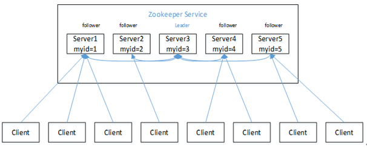
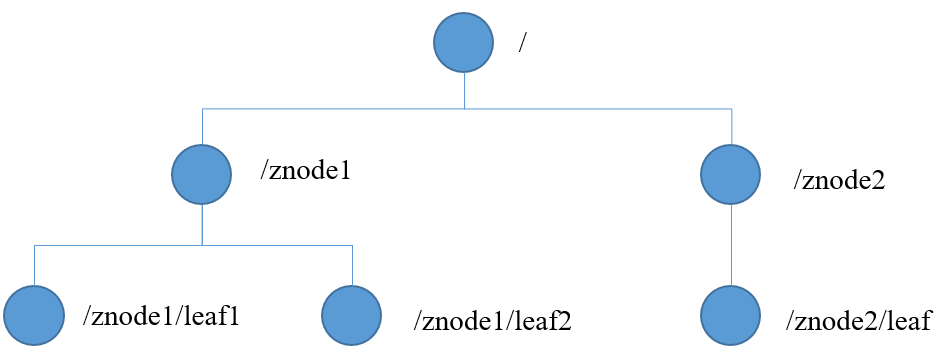
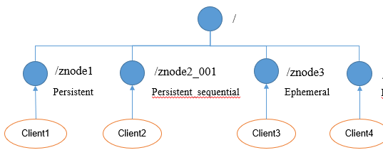
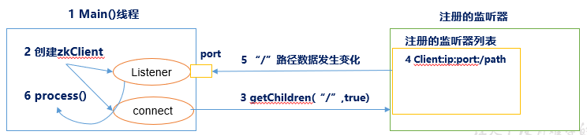
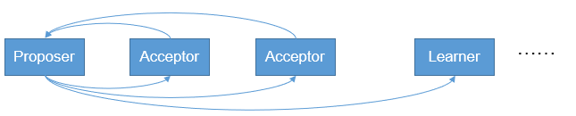

# Zookeeper

## 简介

zookeeper是一个开源的为分布式应用提供协调服务的Apache项目。

1. Zookeeper：一个领导者（Leader），多个跟随者（Follower）组成的集群。
2. 集群中只要有半数以上节点存活，Zookeeper集群就能正常服务。
3. 全局数据一致：每个Server保存一份相同的数据副本，Client无论连接到哪个Server，数据都是一致的。
4. 更新请求顺序进行，来自同一个Client的更新请求按其发送顺序依次执行。
5. 数据更新原子性，一次数据更新要么成功，要么失败。
6. 实时性，在一定时间范围内，Client能读到最新数据。

ZooKeeper数据模型的结构与Unix文件系统很类似，整体上可以看作是一棵树，每个节点称做一个ZNode。每一个ZNode默认能够存储1MB的数据，每个ZNode都可以通过其路径唯一标识。

提供的服务包括：**统一命名服务、统一配置管理、统一集群管理、服务器节点动态上下线、软负载均衡等**。

## 节点类型

持久（Persistent）：客户端和服务器端断开连接后，创建的节点不删除

短暂（Ephemeral）：客户端和服务器端断开连接后，创建的节点自己删除

## 监听器原理

1）首先要有一个main()线程

2）在main线程中创建Zookeeper客户端，这时就会创建两个线程，一个负责网络连接通信（connet），一个负责监听（listener）。

3）通过connect线程将注册的监听事件发送给Zookeeper。

4）在Zookeeper的注册监听器列表中将注册的监听事件添加到列表中。

5）Zookeeper监听到有数据或路径变化，就会将这个消息发送给listener线程。

6）listener线程内部调用了process()方法。

常见的监听：

1）监听节点数据的变化 get path [watch] 

2）监听子节点增减的变化  ls path [watch]

## Paxos算法

Paxos算法一种基于消息传递且具有高度容错特性的一致性算法。

分布式系统中的节点通信存在两种模型：共享内存（Shared memory）和消息传递（Messages passing）。基于消息传递通信模型的分布式系统，不可避免的会发生以下错误：进程可能会慢、被杀死或者重启，消息可能会延迟、丢失、重复，在基础 Paxos 场景中，先不考虑可能出现消息篡改即拜占庭错误的情况。Paxos 算法解决的问题是在一个可能发生上述异常的分布式系统中如何就某个值达成一致，保证不论发生以上任何异常，都不会破坏决议的一致性。

**Paxos算法描述：**

在一个Paxos系统中，首先将所有节点划分为Proposers，Acceptors，和Learners。（注意：每个节点都可以身兼数职）。

一个完整的Paxos算法流程分为三个阶段：

- Prepare阶段

  Proposer向Acceptors发出Prepare请求Promise（承诺）

  Acceptors针对收到的Prepare请求进行Promise承诺

- Accept阶段1

  Proposer收到多数Acceptors承诺的Promise后，向Acceptors发出Propose请求

  Acceptors针对收到的Propose请求进行Accept处理

- Learn阶段：Proposer将形成的决议发送给所有Learners

## 选举机制

（1）半数机制：集群中半数以上机器存活，集群可用。所以Zookeeper适合安装奇数台服务器。

（2）Zookeeper虽然在配置文件中并没有指定Master和Slave。但是，Zookeeper工作时，是有一个节点为Leader，其他则为Follower，Leader是通过内部的选举机制临时产生的。

# Flume

Flume是Cloudera提供的一个高可用的，高可靠的，分布式的海量日志采集、聚合和传输的系统。Flume基于流式架构，灵活简单。

## 组成架构

### Agent

Agent是一个JVM进程，它以事件的形式将数据从源头送至mudidi

有三部分构成：Source，Channel，Sink

### Source

Source是负责接收数据到Flume Agent的组件。Source组件可以处理各种类型、各种格式的日志数据，包括avro、thrift、exec、jms、spooling directory、netcat、sequence generator、syslog、http、legacy。

### Sink

Sink不断地轮询Channel中的事件且批量地移除它们，并将这些事件批量写入到存储或索引系统、或者被发送到另一个Flume Agent。
Sink组件目的地包括hdfs、logger、avro、thrift、ipc、file、HBase、solr、自定义。

### Channel

Channel是位于Source和Sink之间的缓冲区。因此，Channel允许Source和Sink运作在不同的速率上。Channel是线程安全的，可以同时处理几个Source的写入操作和几个Sink的读取操作。
Flume自带两种Channel：Memory Channel和File Channel。

- Memory Channel是内存中的队列。Memory Channel在不需要关心数据丢失的情景下适用。如果需要关心数据丢失，那么Memory Channel就不应该使用，因为程序死亡、机器宕机或者重启都会导致数据丢失。
- File Channel将所有事件写到磁盘。因此在程序关闭或机器宕机的情况下不会丢失数据。

### Event

传输单元，Flume数据传输的基本单元，以Event的形式将数据从源头送至目的地。Event由Header和Body两部分组成，Header用来存放该event的一些属性，为K-V结构，Body用来存放该条数据，形式为字节数组。

### Interceptors

在Flume中允许使用拦截器对传输中的event进行拦截和处理！拦截器必须实现org.apache.flume.interceptor.Interceptor接口。拦截器可以根据开发者的设定修改甚至删除event！Flume同时支持拦截器链，即由多个拦截器组合而成！通过指定拦截器链中拦截器的顺序，event将按照顺序依次被拦截器进行处理！

### Channel Selectors

Channel Selectors用于source组件将event传输给多个channel的场景。常用的有`replicating`（默认）和`multiplexing`两种类型。replicating负责将event复制到多个channel，而multiplexing则根据event的属性和配置的参数进行匹配，匹配成功则发送到指定的channel!

### Sink Processors

用户可以将多个sink组成一个整体（sink组），Sink Processors可用于提供组内的所有sink的负载平衡功能，或在时间故障的情况下实现从一个sink到另一个sink的故障转移。

## 进阶

### Flume事务

### Flume Agent内部原理

重要组件：
1）ChannelSelector
ChannelSelector的作用就是选出Event将要被发往哪个Channel。其共有两种类型，分别是Replicating（复制）和Multiplexing（多路复用）。
ReplicatingSelector会将同一个Event发往所有的Channel，Multiplexing会根据相应的原则，将不同的Event发往不同的Channel。
2）SinkProcessor
SinkProcessor共有三种类型，分别是DefaultSinkProcessor、LoadBalancingSinkProcessor和FailoverSinkProcessor
DefaultSinkProcessor对应的是单个的Sink，LoadBalancingSinkProcessor和FailoverSinkProcessor对应的是Sink Group，LoadBalancingSinkProcessor可以实现负载均衡的功能，FailoverSinkProcessor可以实现故障转移的功能。

## 问答

### 你是如何实现Flume数据传输的监控的

使用第三方框架Ganglia实时监控Flume。

### Flume的Source，Sink，Channel的作用？你们Source是什么类型？

​    1、作用

（1）Source组件是专门用来收集数据的，可以处理各种类型、各种格式的日志数据，包括avro、thrift、exec、jms、spooling directory、netcat、sequence generator、syslog、http、legacy

（2）Channel组件对采集到的数据进行缓存，可以存放在Memory或File中。

（3）Sink组件是用于把数据发送到目的地的组件，目的地包括Hdfs、Logger、avro、thrift、ipc、file、Hbase、solr、自定义。

2、我公司采用的Source类型为：

（1）监控后台日志：exec

（2）监控后台产生日志的端口：netcat

Exec spooldir

### Flume的Channel Selectors

​                               

###  Flume参数调优

1. Source

增加Source个（使用Tair Dir Source时可增加FileGroups个数）可以增大Source的读取数据的能力。例如：当某一个目录产生的文件过多时需要将这个文件目录拆分成多个文件目录，同时配置好多个Source 以保证Source有足够的能力获取到新产生的数据。

batchSize参数决定Source一次批量运输到Channel的event条数，适当调大这个参数可以提高Source搬运Event到Channel时的性能。

2. Channel 

type 选择memory时Channel的性能最好，但是如果Flume进程意外挂掉可能会丢失数据。type选择file时Channel的容错性更好，但是性能上会比memory channel差。

使用file Channel时dataDirs配置多个不同盘下的目录可以提高性能。

Capacity 参数决定Channel可容纳最大的event条数。transactionCapacity 参数决定每次Source往channel里面写的最大event条数和每次Sink从channel里面读的最大event条数。**transactionCapacity需要大于Source和Sink的batchSize参数。**

3. Sink 

增加Sink的个数可以增加Sink消费event的能力。Sink也不是越多越好够用就行，过多的Sink会占用系统资源，造成系统资源不必要的浪费。

batchSize参数决定Sink一次批量从Channel读取的event条数，适当调大这个参数可以提高Sink从Channel搬出event的性能。

### Flume的事务机制

Flume的事务机制（类似数据库的事务机制）：Flume使用两个独立的事务分别负责从Soucrce到Channel，以及从Channel到Sink的事件传递。比如spooling directory source 为文件的每一行创建一个事件，一旦事务中所有的事件全部传递到Channel且提交成功，那么Soucrce就将该文件标记为完成。同理，事务以类似的方式处理从Channel到Sink的传递过程，如果因为某种原因使得事件无法记录，那么事务将会回滚。且所有的事件都会保持到Channel中，等待重新传递。

###  Flume采集数据会丢失吗?

根据Flume的架构原理，Flume是不可能丢失数据的，其内部有完善的事务机制，Source到Channel是事务性的，Channel到Sink是事务性的，因此这两个环节不会出现数据的丢失，唯一可能丢失数据的情况是Channel采用memoryChannel，agent宕机导致数据丢失，或者Channel存储数据已满，导致Source不再写入，未写入的数据丢失。

Flume不会丢失数据，但是有可能造成数据的重复，例如数据已经成功由Sink发出，但是没有接收到响应，Sink会再次发送数据，此时可能会导致数据的重复。

# Kafka

Kafka是一个分布式的基于**发布/订阅模式**的消息队列（Message Queue），主要应用于大数据实时处理领域。

作为一个数据流式传输平台，kafka有以下三大特点：

- 类似于消息队列和商业的消息系统，kafka提供对流式数据的发布和订阅
- kafka提供一种持久的容错的方式存储流式数据
- kafka拥有良好的性能，可以及时地处理流式数据

基于以上三种特点，kafka在以下两种应用之间流行：
	①需要在多个应用和系统间提供高可靠的实时数据通道
	②一些需要实时传输数据及及时计算的应用
此外，kafka还有以下特点：

- Kafka主要集群方式运行在一个或多个可跨多个数据中心的服务器上
- Kafka集群将数据按照类别记录存储，这种类别在kafka中称为主题
- 每条记录由一个键，一个值和一个时间戳组成

## 基础架构

## 核心概念

### Broker

一台kafka服务器就是一个broker。一个集群由多个broker组成。

### Topic

​    Topic 就是数据主题，kafka建议根据业务系统将不同的数据存放在不同的topic中！Kafka中的Topics总是多订阅者模式，一个topic可以拥有一个或者多个消费者来订阅它的数据。一个大的Topic可以分布式存储在多个kafka broker中！Topic可以类比为数据库中的库！

 

### Partitio

​    每个topic可以有多个分区，通过分区的设计，topic可以不断进行扩展！即一个Topic的多个分区分布式存储在多个broker!

此外通过分区还可以让一个topic被多个consumer进行消费！以达到并行处理！分区可以类比为数据库中的表！

kafka只保证按一个partition中的顺序将消息发给consumer，不保证一个topic的整体（多个partition间）的顺序。

### Offset

​    数据会按照时间顺序被不断第追加到分区的一个结构化的commit log中！每个分区中存储的记录都是有序的，且顺序不可变！这个顺序是通过一个称之为offset的id来唯一标识！因此也可以认为offset是有序且不可变的！ 

在每一个消费者端，会唯一保存的元数据是offset（偏移量）,即消费在log中的位置.偏移量由消费者所控制。通常在读取记录后，消费者会以线性的方式增加偏移量，但是实际上，由于这个位置由消费者控制，所以消费者可以采用任何顺序来消费记录。例如，一个消费者可以重置到一个旧的偏移量，从而重新处理过去的数据；也可以跳过最近的记录，从"现在"开始消费。

这些细节说明Kafka 消费者是非常廉价的—消费者的增加和减少，对集群或者其他消费者没有多大的影响。比如，你可以使用命令行工具，对一些topic内容执行 tail操作，并不会影响已存在的消费者消费数据。

​                                                                                 

​                                                                               图1 Topic拓扑结构

​                                                                                 图2 数据流

### 持久化

Kafka 集群保留所有发布的记录—无论他们是否已被消费—并通过一个可配置的参数——保留期限来控制。举个例子， 如果保留策略设置为2天，一条记录发布后两天内，可以随时被消费，两天过后这条记录会被清除并释放磁盘空间。

Kafka的性能和数据大小无关，所以长时间存储数据没有什么问题。

### 1.4.5 副本机

日志的分区partition （分布）在Kafka集群的服务器上。每个服务器在处理数据和请求时，共享这些分区。每一个分区都会在已配置的服务器上进行备份，确保容错性。

每个分区都有一台 server 作为 “leader”，零台或者多台server作为 follwers 。leader server 处理一切对 partition （分区）的读写请求，而follwers只需被动的同步leader上的数据。当leader宕机了，followers 中的一台服务器会自动成为新的 leader。通过这种机制，既可以保证数据有多个副本，也实现了一个高可用的机制！

基于安全考虑，每个分区的Leader和follower一般会错在在不同的broker!

### Producer

消息生产者，就是向kafka broker发消息的客户端。生产者负责将记录分配到topic的指定 partition（分区）中

 

### Consumer

​    消息消费者，向kafka broker取消息的客户端。每个消费者都要维护自己读取数据的offset。低版本0.9之前将offset保存在Zookeeper中，0.9及之后保存在Kafka的“__consumer_offsets”主题中。

 

### Consumer Group

每个消费者都会使用一个消费组名称来进行标识。同一个组中的不同的消费者实例，可以分布在多个进程或多个机器上！

如果所有的消费者实例在同一消费组中，消息记录会负载平衡到每一个消费者实例（单播）。即每个消费者可以同时读取一个topic的不同分区！

如果所有的消费者实例在不同的消费组中，每条消息记录会广播到所有的消费者进程(广播)。

如果需要实现广播，只要每个consumer有一个独立的组就可以了。要实现单播只要所有的consumer在同一个组。

一个topic可以有多个consumer group。topic的消息会复制（不是真的复制，是概念上的）到所有的CG，但每个partion只会把消息发给该CG中的一个consumer。

## Kafka架构深入

# HBase

HBase是一种分布式、可扩展、支持海量数据存储的NoSQL数据库。
Hbase面向列存储，构建于Hadoop之上，类似于Google的BigTable，提供对10亿级别表数据的快速随机实时读写！

