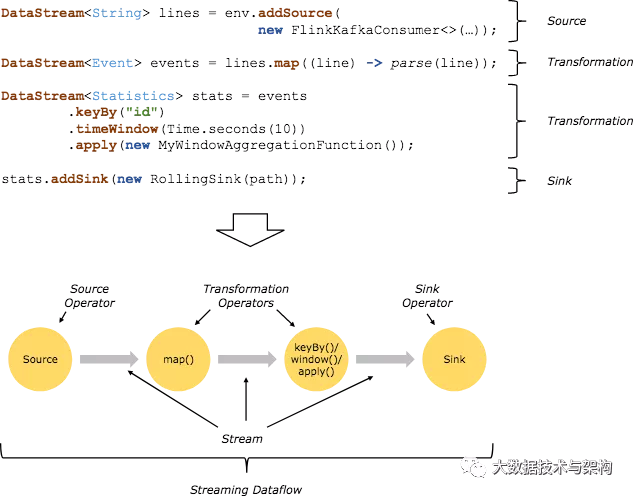

# Linux & Shell

## Linux常用高级命令

| 序号 | 命令                          | 命令解释                               |
| ---- | ----------------------------- | -------------------------------------- |
| 1    | top                           | 查看内存                               |
| 2    | df -h                         | 查看磁盘存储情况                       |
| 3    | iotop                         | 查看磁盘IO读写(yum install iotop安装） |
| 4    | iotop -o                      | 直接查看比较高的磁盘读写程序           |
| 5    | netstat -tunlp \| grep 端口号 | 查看端口占用情况                       |
| 6    | uptime                        | 查看报告系统运行时长及平均负载         |
| 7    | ps -aux                       | 查看进程                               |

## Shell常用工具及写过的脚本

1）awk、sed、cut、sort

2）用Shell写过哪些脚本

​    （1）集群启动，分发脚本

​    （2）数仓与MySQL的导入导出

​    （3）数仓层级内部的导入：ods->dwd->dws->dwt->ads

## Shell中提交了一个脚本，进程号已经不知道了，但是需要kill掉这个进程，怎么操作?

ssh $i "ps -ef | grep XXX | grep -v grep |awk '{print $2}' | xargs kill"

本问题的实质就是按照shell脚本中的任务名称关键字搜索出来，并打印出进程id然后kill掉。

脚本中关键术语解释：

- 管道符"|"用来隔开两个命令，管道符左边命令的输出会作为管道符右边命令的输入。
- "ps -ef" 是linux里查看所有**进程**的命令。这时检索出的进程将作为下一条命令"grep spark"的输入。
- "grep spark" 的输出结果是，**所有**含有关键字"spark"的进程。
- "grep -v grep" 是在列出的进程中去除含有关键字"grep"的进程。
- "awk '{print $2}" 是打印将过滤后的行的第二列，第二列正好是进程号PID。
- "xargs kill -9" 中的 **xargs** 命令是用来把前面命令的输出结果（PID）作为"kill -9"命令的参数，并执行该命令。"kill -9"会强行杀掉指定进程。

##  Shell中单引号和双引号区别

1）在/home/atguigu/bin创建一个test.sh文件

[atguigu@hadoop102 bin]$ vim test.sh 

在文件中添加如下内容

```
#!/bin/bash
do_date=$1

echo '$do_date'
echo "$do_date"
echo "'$do_date'"
echo '"$do_date"'
echo `date`
```

2）查看执行结果

```
[atguigu@hadoop102 bin]$ test.sh 2019-02-10
$do_date
2019-02-10
'2019-02-10'
"$do_date"
2019年 05月 02日 星期四 21:02:08 CST
```

3）总结：

（1）单引号不取变量值

（2）双引号取变量值

（3）反引号`，执行引号中命令

（4）双引号内部嵌套单引号，取出变量值

（5）单引号内部嵌套双引号，不取出变量值

# Zookeeper

## 简介

zookeeper是一个开源的为分布式应用提供协调服务的Apache项目。


1. Zookeeper：一个领导者（Leader），多个跟随者（Follower）组成的集群。
2. 集群中只要有半数以上节点存活，Zookeeper集群就能正常服务。
3. 全局数据一致：每个Server保存一份相同的数据副本，Client无论连接到哪个Server，数据都是一致的。
4. 更新请求顺序进行，来自同一个Client的更新请求按其发送顺序依次执行。
5. 数据更新原子性，一次数据更新要么成功，要么失败。
6. 实时性，在一定时间范围内，Client能读到最新数据。


ZooKeeper数据模型的结构与Unix文件系统很类似，整体上可以看作是一棵树，每个节点称做一个ZNode。每一个ZNode默认能够存储1MB的数据，每个ZNode都可以通过其路径唯一标识。


提供的服务包括：**统一命名服务、统一配置管理、统一集群管理、服务器节点动态上下线、软负载均衡等**。

## 节点类型

持久（Persistent）：客户端和服务器端断开连接后，创建的节点不删除

短暂（Ephemeral）：客户端和服务器端断开连接后，创建的节点自己删除


## 监听器原理

1）首先要有一个main()线程

2）在main线程中创建Zookeeper客户端，这时就会创建两个线程，一个负责网络连接通信（connet），一个负责监听（listener）。

3）通过connect线程将注册的监听事件发送给Zookeeper。

4）在Zookeeper的注册监听器列表中将注册的监听事件添加到列表中。

5）Zookeeper监听到有数据或路径变化，就会将这个消息发送给listener线程。

6）listener线程内部调用了process()方法。

常见的监听：

1）监听节点数据的变化 get path [watch] 

2）监听子节点增减的变化  ls path [watch]


## Paxos算法

Paxos算法一种基于消息传递且具有高度容错特性的一致性算法。

分布式系统中的节点通信存在两种模型：共享内存（Shared memory）和消息传递（Messages passing）。基于消息传递通信模型的分布式系统，不可避免的会发生以下错误：进程可能会慢、被杀死或者重启，消息可能会延迟、丢失、重复，在基础 Paxos 场景中，先不考虑可能出现消息篡改即拜占庭错误的情况。Paxos 算法解决的问题是在一个可能发生上述异常的分布式系统中如何就某个值达成一致，保证不论发生以上任何异常，都不会破坏决议的一致性。

**Paxos算法描述：**

在一个Paxos系统中，首先将所有节点划分为Proposers，Acceptors，和Learners。（注意：每个节点都可以身兼数职）。


一个完整的Paxos算法流程分为三个阶段：

- Prepare阶段

  Proposer向Acceptors发出Prepare请求Promise（承诺）

  Acceptors针对收到的Prepare请求进行Promise承诺

- Accept阶段1

  Proposer收到多数Acceptors承诺的Promise后，向Acceptors发出Propose请求

  Acceptors针对收到的Propose请求进行Accept处理

- Learn阶段：Proposer将形成的决议发送给所有Learners

## 选举机制

（1）半数机制：集群中半数以上机器存活，集群可用。所以Zookeeper适合安装奇数台服务器。

（2）Zookeeper虽然在配置文件中并没有指定Master和Slave。但是，Zookeeper工作时，是有一个节点为Leader，其他则为Follower，Leader是通过内部的选举机制临时产生的。


## 常用命令

​    ls、get、create、delete

## 讲一讲什么是CAP法则？Zookeeper符合了这个法则的哪两个？（扩展）

CAP法则：强一致性、高可用性、分区容错性；

Zookeeper符合强一致性、高可用性！


# Flume

Flume是Cloudera提供的一个高可用的，高可靠的，分布式的海量日志采集、聚合和传输的系统。Flume基于流式架构，灵活简单。

## 组成架构


### Agent

Agent是一个JVM进程，它以事件的形式将数据从源头送至mudidi

有三部分构成：Source，Channel，Sink

### Source

Source是负责接收数据到Flume Agent的组件。Source组件可以处理各种类型、各种格式的日志数据，包括avro、thrift、exec、jms、spooling directory、netcat、sequence generator、syslog、http、legacy。

### Sink

Sink不断地轮询Channel中的事件且批量地移除它们，并将这些事件批量写入到存储或索引系统、或者被发送到另一个Flume Agent。
Sink组件目的地包括hdfs、logger、avro、thrift、ipc、file、HBase、solr、自定义。

### Channel

Channel是位于Source和Sink之间的缓冲区。因此，Channel允许Source和Sink运作在不同的速率上。Channel是线程安全的，可以同时处理几个Source的写入操作和几个Sink的读取操作。
Flume自带两种Channel：Memory Channel和File Channel。

- Memory Channel是内存中的队列。Memory Channel在不需要关心数据丢失的情景下适用。如果需要关心数据丢失，那么Memory Channel就不应该使用，因为程序死亡、机器宕机或者重启都会导致数据丢失。
- File Channel将所有事件写到磁盘。因此在程序关闭或机器宕机的情况下不会丢失数据。

### Event

传输单元，Flume数据传输的基本单元，以Event的形式将数据从源头送至目的地。Event由Header和Body两部分组成，Header用来存放该event的一些属性，为K-V结构，Body用来存放该条数据，形式为字节数组。


### Interceptors

在Flume中允许使用拦截器对传输中的event进行拦截和处理！拦截器必须实现org.apache.flume.interceptor.Interceptor接口。拦截器可以根据开发者的设定修改甚至删除event！Flume同时支持拦截器链，即由多个拦截器组合而成！通过指定拦截器链中拦截器的顺序，event将按照顺序依次被拦截器进行处理！

### Channel Selectors

Channel Selectors用于source组件将event传输给多个channel的场景。常用的有`replicating`（默认）和`multiplexing`两种类型。replicating负责将event复制到多个channel，而multiplexing则根据event的属性和配置的参数进行匹配，匹配成功则发送到指定的channel!

### Sink Processors

用户可以将多个sink组成一个整体（sink组），Sink Processors可用于提供组内的所有sink的负载平衡功能，或在时间故障的情况下实现从一个sink到另一个sink的故障转移。

## 进阶

### Flume事务


### Flume Agent内部原理


重要组件：
1）ChannelSelector
ChannelSelector的作用就是选出Event将要被发往哪个Channel。其共有两种类型，分别是Replicating（复制）和Multiplexing（多路复用）。
ReplicatingSelector会将同一个Event发往所有的Channel，Multiplexing会根据相应的原则，将不同的Event发往不同的Channel。
2）SinkProcessor
SinkProcessor共有三种类型，分别是DefaultSinkProcessor、LoadBalancingSinkProcessor和FailoverSinkProcessor
DefaultSinkProcessor对应的是单个的Sink，LoadBalancingSinkProcessor和FailoverSinkProcessor对应的是Sink Group，LoadBalancingSinkProcessor可以实现负载均衡的功能，FailoverSinkProcessor可以实现故障转移的功能。


## 问答

### 你是如何实现Flume数据传输的监控的

使用第三方框架Ganglia实时监控Flume。

### Flume的Source，Sink，Channel的作用？你们Source是什么类型？

​    1、作用

（1）Source组件是专门用来收集数据的，可以处理各种类型、各种格式的日志数据，包括avro、thrift、exec、jms、spooling directory、netcat、sequence generator、syslog、http、legacy

（2）Channel组件对采集到的数据进行缓存，可以存放在Memory或File中。

（3）Sink组件是用于把数据发送到目的地的组件，目的地包括Hdfs、Logger、avro、thrift、ipc、file、Hbase、solr、自定义。

2、我公司采用的Source类型为：

（1）监控后台日志：exec

（2）监控后台产生日志的端口：netcat

Exec spooldir

### Flume的Channel Selectors

​                               

###  Flume参数调优

1. Source

增加Source个（使用Tair Dir Source时可增加FileGroups个数）可以增大Source的读取数据的能力。例如：当某一个目录产生的文件过多时需要将这个文件目录拆分成多个文件目录，同时配置好多个Source 以保证Source有足够的能力获取到新产生的数据。

batchSize参数决定Source一次批量运输到Channel的event条数，适当调大这个参数可以提高Source搬运Event到Channel时的性能。

2. Channel 

type 选择memory时Channel的性能最好，但是如果Flume进程意外挂掉可能会丢失数据。type选择file时Channel的容错性更好，但是性能上会比memory channel差。

使用file Channel时dataDirs配置多个不同盘下的目录可以提高性能。

Capacity 参数决定Channel可容纳最大的event条数。transactionCapacity 参数决定每次Source往channel里面写的最大event条数和每次Sink从channel里面读的最大event条数。**transactionCapacity需要大于Source和Sink的batchSize参数。**

3. Sink 

增加Sink的个数可以增加Sink消费event的能力。Sink也不是越多越好够用就行，过多的Sink会占用系统资源，造成系统资源不必要的浪费。

batchSize参数决定Sink一次批量从Channel读取的event条数，适当调大这个参数可以提高Sink从Channel搬出event的性能。

### Flume的事务机制

Flume的事务机制（类似数据库的事务机制）：Flume使用两个独立的事务分别负责从Soucrce到Channel，以及从Channel到Sink的事件传递。比如spooling directory source 为文件的每一行创建一个事件，一旦事务中所有的事件全部传递到Channel且提交成功，那么Soucrce就将该文件标记为完成。同理，事务以类似的方式处理从Channel到Sink的传递过程，如果因为某种原因使得事件无法记录，那么事务将会回滚。且所有的事件都会保持到Channel中，等待重新传递。

###  Flume采集数据会丢失吗?

根据Flume的架构原理，Flume是不可能丢失数据的，其内部有完善的事务机制，Source到Channel是事务性的，Channel到Sink是事务性的，因此这两个环节不会出现数据的丢失，唯一可能丢失数据的情况是Channel采用memoryChannel，agent宕机导致数据丢失，或者Channel存储数据已满，导致Source不再写入，未写入的数据丢失。

Flume不会丢失数据，但是有可能造成数据的重复，例如数据已经成功由Sink发出，但是没有接收到响应，Sink会再次发送数据，此时可能会导致数据的重复。

### Flume组成，Put事务，Take事务

1）taildir source 

（1）断点续传、多目录

  （2）哪个Flume版本产生的？Apache1.7、CDH1.6

（3）没有断点续传功能时怎么做的？ 自定义

（4）taildir挂了怎么办？

   不会丢数：断点续传

   重复数据：

（5）怎么处理重复数据？

   不处理：生产环境通常不处理，出现重复的概率比较低。处理会影响传输效率。

   处理

​     自身：在taildirsource里面增加自定义事务，影响效率

​     找兄弟：下一级处理（hive dwd sparkstreaming flink布隆）、去重手段（groupby、开窗取窗口第一条、redis）

（6）taildir source 是否支持递归遍历文件夹读取文件？

   不支持。 自定义 递归遍历文件夹 + 读取文件

2）file channel /memory channel/kafka channel 

（1）File Channel 

​     数据存储于磁盘，优势：可靠性高；劣势：传输速度低

​     默认容量：100万event

注意：FileChannel可以通过配置dataDirs指向多个路径，每个路径对应不同的硬盘，增大Flume吞吐量。

（2）Memory Channel

​     数据存储于内存，优势：传输速度快；劣势：可靠性差

​     默认容量：100个event

（3）Kafka Channel

​     数据存储于Kafka，基于磁盘；

​     优势：可靠性高；

​     传输速度快 Kafka Channel 大于Memory Channel + Kafka Sink 原因省去了Sink阶段

（4）Kafka Channel哪个版本产生的？

​     Flume1.6 版本产生=》并没有火；因为有bug

​     topic-start 数据内容

​     topic-event 数据内容  ture 和false 很遗憾，都不起作用。

​     增加了额外清洗的工作量。

​     Flume1.7解决了这个问题，开始火了。

（5）生产环境如何选择

​     如果下一级是Kafka，优先选择Kafka Channel

​     如果是金融、对钱要求准确的公司，选择File Channel 

​     如果就是普通的日志，通常可以选择Memory Channel

​     每天丢几百万数据  pb级  亿万富翁，掉1块钱会捡？

3）HDFS sink

   （1）时间（1小时-2小时） or 大小128m、event个数（0禁止）

具体参数：hdfs.rollInterval=3600，hdfs.rollSize=134217728，hdfs.rollCount =0

4）事务

​    Source到Channel是Put事务

​    Channel到Sink是Take事务

## Flume拦截器

1）拦截器注意事项

​    项目中自定义了：ETL拦截器。

采用两个拦截器的优缺点：优点，模块化开发和可移植性；缺点，性能会低一些

2）自定义拦截器步骤

（1）实现 Interceptor

（2）重写四个方法

Ø initialize 初始化

Ø public Event intercept(Event event) 处理单个Event

Ø public List<Event> intercept(List<Event> events) 处理多个Event，在这个方法中调用Event intercept(Event event)

Ø close方法

（3）静态内部类，实现Interceptor.Builder

3）拦截器可以不用吗？

   可以不用；需要在下一级hive的dwd层和sparksteaming里面处理

   优势：只处理一次，轻度处理；劣势：影响性能，不适合做实时推荐这种对实时要求比较高的场景。

## Flume Channel选择器

Replicating：默认选择器。功能：将数据发往下一级所有通道

Multiplexing：选择性发往指定通道。

##  Flume监控器

1）采用Ganglia监控器，监控到Flume尝试提交的次数远远大于最终成功的次数，说明Flume运行比较差。

2）解决办法？

（1）自身：增加内存flume-env.sh  4-6g

-Xmx与-Xms最好设置一致，减少内存抖动带来的性能影响，如果设置不一致容易导致频繁fullgc。

（2）找朋友：增加服务器台数

搞活动 618 =》增加服务器=》用完在退出

日志服务器配置：8-16g内存、磁盘8T

##  Flume采集数据会丢失吗?（防止数据丢失的机制）

如果是FileChannel不会，Channel存储可以存储在File中，数据传输自身有事务。

如果是MemoryChannel有可能丢。


# Kafka

Kafka是一个分布式的基于**发布/订阅模式**的消息队列（Message Queue），主要应用于大数据实时处理领域。

作为一个数据流式传输平台，kafka有以下三大特点：

- 类似于消息队列和商业的消息系统，kafka提供对流式数据的发布和订阅
- kafka提供一种持久的容错的方式存储流式数据
- kafka拥有良好的性能，可以及时地处理流式数据

基于以上三种特点，kafka在以下两种应用之间流行：
	①需要在多个应用和系统间提供高可靠的实时数据通道
	②一些需要实时传输数据及及时计算的应用
此外，kafka还有以下特点：

- Kafka主要集群方式运行在一个或多个可跨多个数据中心的服务器上
- Kafka集群将数据按照类别记录存储，这种类别在kafka中称为主题
- 每条记录由一个键，一个值和一个时间戳组成

## 基础架构


## 核心概念

### Broker

一台kafka服务器就是一个broker。一个集群由多个broker组成。

### Topic

​	Topic 就是数据主题，kafka建议根据业务系统将不同的数据存放在不同的topic中！Kafka中的Topics总是多订阅者模式，一个topic可以拥有一个或者多个消费者来订阅它的数据。一个大的Topic可以分布式存储在多个kafka broker中！Topic可以类比为数据库中的库！

 

### Partitio

​    每个topic可以有多个分区，通过分区的设计，topic可以不断进行扩展！即一个Topic的多个分区分布式存储在多个broker!

此外通过分区还可以让一个topic被多个consumer进行消费！以达到并行处理！分区可以类比为数据库中的表！

kafka只保证按一个partition中的顺序将消息发给consumer，不保证一个topic的整体（多个partition间）的顺序。

### Offset

​    数据会按照时间顺序被不断第追加到分区的一个结构化的commit log中！每个分区中存储的记录都是有序的，且顺序不可变！这个顺序是通过一个称之为offset的id来唯一标识！因此也可以认为offset是有序且不可变的！ 

在每一个消费者端，会唯一保存的元数据是offset（偏移量）,即消费在log中的位置.偏移量由消费者所控制。通常在读取记录后，消费者会以线性的方式增加偏移量，但是实际上，由于这个位置由消费者控制，所以消费者可以采用任何顺序来消费记录。例如，一个消费者可以重置到一个旧的偏移量，从而重新处理过去的数据；也可以跳过最近的记录，从"现在"开始消费。

这些细节说明Kafka 消费者是非常廉价的—消费者的增加和减少，对集群或者其他消费者没有多大的影响。比如，你可以使用命令行工具，对一些topic内容执行 tail操作，并不会影响已存在的消费者消费数据。

​                                                                                 

​                                                                               图1 Topic拓扑结构


​                                                                                 图2 数据流

### 持久化

Kafka 集群保留所有发布的记录—无论他们是否已被消费—并通过一个可配置的参数——保留期限来控制。举个例子， 如果保留策略设置为2天，一条记录发布后两天内，可以随时被消费，两天过后这条记录会被清除并释放磁盘空间。

Kafka的性能和数据大小无关，所以长时间存储数据没有什么问题。

###  副本机

日志的分区partition （分布）在Kafka集群的服务器上。每个服务器在处理数据和请求时，共享这些分区。每一个分区都会在已配置的服务器上进行备份，确保容错性。

每个分区都有一台 server 作为 “leader”，零台或者多台server作为 follwers 。leader server 处理一切对 partition （分区）的读写请求，而follwers只需被动的同步leader上的数据。当leader宕机了，followers 中的一台服务器会自动成为新的 leader。通过这种机制，既可以保证数据有多个副本，也实现了一个高可用的机制！

基于安全考虑，每个分区的Leader和follower一般会错在在不同的broker!

### Producer

消息生产者，就是向kafka broker发消息的客户端。生产者负责将记录分配到topic的指定 partition（分区）中

 

### Consumer

​    消息消费者，向kafka broker取消息的客户端。每个消费者都要维护自己读取数据的offset。低版本0.9之前将offset保存在Zookeeper中，0.9及之后保存在Kafka的“__consumer_offsets”主题中。

 

### Consumer Group

每个消费者都会使用一个消费组名称来进行标识。同一个组中的不同的消费者实例，可以分布在多个进程或多个机器上！

如果所有的消费者实例在同一消费组中，消息记录会负载平衡到每一个消费者实例（单播）。即每个消费者可以同时读取一个topic的不同分区！

如果所有的消费者实例在不同的消费组中，每条消息记录会广播到所有的消费者进程(广播)。

如果需要实现广播，只要每个consumer有一个独立的组就可以了。要实现单播只要所有的consumer在同一个组。

一个topic可以有多个consumer group。topic的消息会复制（不是真的复制，是概念上的）到所有的CG，但每个partion只会把消息发给该CG中的一个consumer。

## Kafka架构深入


## Kafka的机器数量

Kafka机器数量 = 2 *（峰值生产速度 * 副本数 / 100）+ 1

## 副本数设定

一般我们设置成2个或3个，很多企业设置为2个。

副本的优势：提高可靠性；副本劣势：增加了网络IO传输

## Kafka压测

Kafka官方自带压力测试脚本（kafka-consumer-perf-test.sh、kafka-producer-perf-test.sh）。Kafka压测时，可以查看到哪个地方出现了瓶颈（CPU，内存，网络IO）。一般都是网络IO达到瓶颈。

## Kafka日志保存时间

默认保存7天；生产环境建议3天

## Kafka中数据量计算

每天总数据量100g，每天产生1亿条日志， 10000万/24/60/60=1150条/每秒钟

平均每秒钟：1150条

低谷每秒钟：50条

高峰每秒钟：1150条*（2-20倍）=2300条-23000条

每条日志大小：0.5k-2k（取1k）

每秒多少数据量：2.0M - 20MB

## Kafka的硬盘大小

每天的数据量100g * 2个副本 * 3天 / 70%

## Kafka监控

公司自己开发的监控器；

开源的监控器：KafkaManager、KafkaMonitor、KafkaEagle

## Kakfa分区数

1）创建一个只有1个分区的topic

2）测试这个topic的producer吞吐量和consumer吞吐量。

3）假设他们的值分别是Tp和Tc，单位可以是MB/s。

4）然后假设总的目标吞吐量是Tt，那么分区数=Tt / min（Tp，Tc）

例如：producer吞吐量=20m/s；consumer吞吐量=50m/s，期望吞吐量100m/s；

分区数=100 / 20 = 5分区

https://blog.csdn.net/weixin_42641909/article/details/89294698

分区数一般设置为：3-10个

## 多少个Topic

通常情况：多少个日志类型就多少个Topic。也有对日志类型进行合并的。

## Kafka的ISR副本同步队列

ISR（In-Sync Replicas），副本同步队列。ISR中包括Leader和Follower。如果Leader进程挂掉，会在ISR队列中选择一个服务作为新的Leader。有replica.lag.max.messages（延迟条数）和replica.lag.time.max.ms（延迟时间）两个参数决定一台服务是否可以加入ISR副本队列，在0.10版本移除了replica.lag.max.messages参数，防止服务频繁的进去队列。

任意一个维度超过阈值都会把Follower剔除出ISR，存入OSR（Outof-Sync Replicas）列表，新加入的Follower也会先存放在OSR中。

## Kafka分区分配策略

在 Kafka内部存在两种默认的分区分配策略：Range和 RoundRobin。

Range是默认策略。Range是对每个Topic而言的（即一个Topic一个Topic分），首先对同一个Topic里面的分区按照序号进行排序，并对消费者按照字母顺序进行排序。然后用Partitions分区的个数除以消费者线程的总数来决定每个消费者线程消费几个分区。如果除不尽，那么前面几个消费者线程将会多消费一个分区。

例如：我们有10个分区，两个消费者（C1，C2），3个消费者线程，10 / 3 = 3而且除不尽。

C1-0 将消费 0, 1, 2, 3 分区

C2-0 将消费 4, 5, 6 分区

C2-1 将消费 7, 8, 9 分区

第一步：将所有主题分区组成TopicAndPartition列表，然后对TopicAndPartition列表按照hashCode进行排序，最后按照轮询的方式发给每一个消费线程。

## Kafka挂掉

1）Flume记录

2）日志有记录

3）短期没事

## Kafka丢不丢数据

Ack = 0，相当于异步发送，消息发送完毕即offset增加，继续生产。

Ack = 1，leader收到leader replica 对一个消息的接受ack才增加offset，然后继续生产。

Ack = -1，leader收到所有replica 对一个消息的接受ack才增加offset，然后继续生产。

## Kafka数据重复

​    幂等性 + ack-1 + 事务

Kafka数据重复，可以再下一级：SparkStreaming、redis或者Hive中dwd层去重，去重的手段：分组、按照id开窗只取第一个值；

## Kafka消息数据积压，Kafka消费能力不足怎么处理？

1）如果是Kafka消费能力不足，则可以考虑增加Topic的分区数，并且同时提升消费组的消费者数量，消费者数 = 分区数。（两者缺一不可）

2）如果是下游的数据处理不及时：提高每批次拉取的数量。批次拉取数据过少（拉取数据/处理时间 < 生产速度），使处理的数据小于生产的数据，也会造成数据积压。

## Kafka参数优化

1）Broker参数配置（server.properties）

1、日志保留策略配置

\# 保留三天，也可以更短 （log.cleaner.delete.retention.ms）

log.retention.hours=72

 

2、Replica相关配置

default.replication.factor:1 默认副本1个

 

3、网络通信延时

replica.socket.timeout.ms:30000 #当集群之间网络不稳定时,调大该参数

replica.lag.time.max.ms= 600000# 如果网络不好,或者kafka集群压力较大,会出现副本丢失,然后会频繁复制副本,导致集群压力更大,此时可以调大该参数

**2）Producer优化（producer.properties）

compression.type:none         gzip snappy lz4 

\#默认发送不进行压缩，推荐配置一种适合的压缩算法，可以大幅度的减缓网络压力和Broker的存储压力。

3）Kafka内存调整（**kafka-server-start.sh**）

默认内存1个G，生产环境尽量不要超过6个G。

export KAFKA_HEAP_OPTS="-Xms4g -Xmx4g"

### 1.5.18 Kafka高效读写数据

1）Kafka本身是分布式集群，同时采用分区技术，并发度高。

2）顺序写磁盘

Kafka的producer生产数据，要写入到log文件中，写的过程是一直追加到文件末端，为顺序写。官网有数据表明，同样的磁盘，顺序写能到600M/s，而随机写只有100K/s。

3）零复制技术

                                   

## Kafka单条日志传输大小

Kafka对于消息体的大小默认为单条最大值是1M但是在我们应用场景中，常常会出现一条消息大于1M，如果不对Kafka进行配置。则会出现生产者无法将消息推送到Kafka或消费者无法去消费Kafka里面的数据，这时我们就要对Kafka进行以下配置：server.properties

`replica.fetch.max.bytes: 1048576 broker可复制的消息的最大字节数, 默认为1M`

`message.max.bytes: 1000012  kafka 会接收单个消息size的最大限制， 默认为1M左右`

*注意：message.max.bytes必须小于等于replica.fetch.max.bytes，否则就会导致replica之间数据同步失败。*

## Kafka过期数据清理

​    保证数据没有被引用（没人消费他）

日志清理保存的策略只有delete和compact两种

log.cleanup.policy = delete启用删除策略

log.cleanup.policy = compact启用压缩策略

https://www.jianshu.com/p/fa6adeae8eb5

## Kafka可以按照时间消费数据

Map<TopicPartition, OffsetAndTimestamp> startOffsetMap = KafkaUtil.fetchOffsetsWithTimestamp(topic, sTime, kafkaProp);

## Kafka消费者角度考虑是拉取数据还是推送数据

拉取数据

## Kafka中的数据是有序的吗

单分区内有序；多分区，分区与分区间无序；

**扩展：**

kafka producer发送消息的时候，可以指定key:

     

这个key的作用是为消息选择存储分区，key可以为空，当指定key且不为空的时候，Kafka是根据key的hash值与分区数取模来决定数据存储到那个分区。

     

**有序解决方案：同一张表的数据** **放到** **同一个** **分区**

​       => ProducerRecord里传入key，会根据key取hash算出分区号

​       => key使用表名，如果有库名，拼接上库名


# Hadoop

## 常用端口号

|                    | hadoop2.x | Hadoop3.x |
| ------------------ | --------- | --------- |
| 访问HDFS端口       | 50070     | 9870      |
| 访问MR执行情况端口 | 8088      | 8088      |
| 历史服务器         | 19888     | 19888     |
| 客户端访问集群端口 | 9000      | 8020      |

##  Hadoop配置文件以及简单的Hadoop集群搭建

（1）配置文件：

Hadoop2.x core-site.xml、hdfs-site.xml、mapred-site.xml、yarn-site.xml  slaves

Hadoop3.x core-site.xml、hdfs-site.xml、mapred-site.xml、yarn-site.xml  workers

（2）简单的集群搭建过程：

​    JDK安装

​    配置SSH免密登录

​	配置hadoop核心文件

​	格式化namenode

## HDFS读写流程

## HDFS小文件处理

1）会有什么影响

​    （1）存储层面：

1个文件块，占用namenode多大内存150字节

1亿个小文件*150字节

1个文件块 * 150字节

128G能存储多少文件块？  128 * 1024*1024*1024byte/150字节 = 9亿文件块

​    （2）计算层面：

​       每个小文件都会起到一个MapTask，占用了大量计算资源

2）怎么解决

（1）采用har归档方式，将小文件归档

（2）采用CombineTextInputFormat

（3）有小文件场景开启JVM重用；如果没有小文件，不要开启JVM重用，因为会一直占用使用到的task卡槽，直到任务完成才释放。

JVM重用可以使得JVM实例在同一个job中重新使用N次，N的值可以在Hadoop的mapred-site.xml文件中进行配置。通常在10-20之间

```
<property>
    <name>mapreduce.job.jvm.numtasks</name>
    <value>10</value>
    <description>How many tasks to run per jvm,if set to -1 ,there is  no limit</description>
</property> 
```

## shuffle及优化

### shuffle过程

### shuffle优化

1）Map阶段

（1）增大环形缓冲区大小。由100m扩大到200m

（2）增大环形缓冲区溢写的比例。由80%扩大到90%

（3）减少对溢写文件的merge次数。（10个文件，一次20个merge）

（4）不影响实际业务的前提下，采用Combiner提前合并，减少 I/O。

2）Reduce阶段

（1）合理设置Map和Reduce数：两个都不能设置太少，也不能设置太多。太少，会导致Task等待，延长处理时间；太多，会导致 Map、Reduce任务间竞争资源，造成处理超时等错误。

（2）设置Map、Reduce共存：调整slowstart.completedmaps参数，使Map运行到一定程度后，Reduce也开始运行，减少Reduce的等待时间。

（3）规避使用Reduce，因为Reduce在用于连接数据集的时候将会产生大量的网络消耗。

（4）增加每个Reduce去Map中拿数据的并行数

（5）集群性能可以的前提下，增大Reduce端存储数据内存的大小。 

3）IO传输

采用数据压缩的方式，减少网络IO的的时间。安装Snappy和LZOP压缩编码器。

压缩：

（1）map输入端主要考虑数据量大小和切片，支持切片的有Bzip2、LZO。注意：LZO要想支持切片必须创建索引；

（2）map输出端主要考虑速度，速度快的snappy、LZO；

（3）reduce输出端主要看具体需求，例如作为下一个mr输入需要考虑切片，永久保存考虑压缩率比较大的gzip。

4）整体

（1）NodeManager默认内存8G，需要根据服务器实际配置灵活调整，例如128G内存，配置为100G内存左右，yarn.nodemanager.resource.memory-mb。

（2）单任务默认内存8G，需要根据该任务的数据量灵活调整，例如128m数据，配置1G内存，yarn.scheduler.maximum-allocation-mb。

（3）mapreduce.map.memory.mb ：控制分配给MapTask内存上限，如果超过会kill掉进程（报：Container is running beyond physical memory limits. Current usage:565MB of512MB physical memory used；Killing Container）。默认内存大小为1G，如果数据量是128m，正常不需要调整内存；如果数据量大于128m，可以增加MapTask内存，最大可以增加到4-5g。

（4）mapreduce.reduce.memory.mb：控制分配给ReduceTask内存上限。默认内存大小为1G，如果数据量是128m，正常不需要调整内存；如果数据量大于128m，可以增加ReduceTask内存大小为4-5g。

（5）mapreduce.map.java.opts：控制MapTask堆内存大小。（如果内存不够，报：java.lang.OutOfMemoryError）

（6）mapreduce.reduce.java.opts：控制ReduceTask堆内存大小。（如果内存不够，报：java.lang.OutOfMemoryError）

（7）可以增加MapTask的CPU核数，增加ReduceTask的CPU核数

（8）增加每个Container的CPU核数和内存大小

（9）在hdfs-site.xml文件中配置多目录（多磁盘）

（10）NameNode有一个工作线程池，用来处理不同DataNode的并发心跳以及客户端并发的元数据操作。$dfs.namenode.handler.count= 20×log^{cluster size}$，比如集群规模为8台时，此参数设置为41。可通过简单的python代码计算该值，代码如下。

```
[atguigu@hadoop102 ~]$ python
Python 2.7.5 (default, Apr 11 2018, 07:36:10) 
[GCC 4.8.5 20150623 (Red Hat 4.8.5-28)] on linux2
Type "help", "copyright", "credits" or "license" for more information.
>>> import math
>>> print int(20*math.log(8))
41
>>> quit()

```

## yarn工作机制

## yarn调度器

1）Hadoop调度器重要分为三类：

FIFO 、Capacity Scheduler（容量调度器）和Fair Sceduler（公平调度器）。

Apache默认的资源调度器是容量调度器；

CDH默认的资源调度器是公平调度器。

2）区别：

FIFO调度器：支持单队列 、先进先出  生产环境不会用。

容量调度器：支持多队列，保证先进入的任务优先执行。

公平调度器：支持多队列，保证每个任务公平享有队列资源。 资源不够时可以按照缺额分配。

3）在生产环境下怎么选择？

   大厂：如果对并发度要求比较高，选择公平，要求服务器性能必须OK；

   中小公司，集群服务器资源不太充裕选择容量。


4）在生产环境怎么创建队列？

（1）调度器默认就1个default队列，不能满足生产要求。

   （2）按照框架：hive /spark/ flink 每个框架的任务放入指定的队列（企业用的不是特别多）

（3）按照业务模块：登录注册、购物车、下单、业务部门1、业务部门2

5）创建多队列的好处？

（1）因为担心员工不小心，写递归死循环代码，把所有资源全部耗尽。

（2）实现任务的**降级**使用，特殊时期保证重要的任务队列资源充足。

业务部门1（重要）=》业务部门2（比较重要）=》下单（一般）=》购物车（一般）=》登录注册（次要）

## 项目经验之基准测试

搭建完Hadoop集群后需要对HDFS读写性能和MR计算能力测试。测试jar包在hadoop的share文件夹下。

集群总吞吐量= 带宽*集群节点个数/副本数

例如：100m/s * 10台/ 3= 333m/s

注意：如果测试数据在本地，那副本数-1。因为这个副本不占集群吞吐量。如果数据在集群外，向该集群上传，需要占用带宽。本公式就不用减1。

##  Hadoop宕机

1）如果MR造成系统宕机。此时要控制Yarn同时运行的任务数，和每个任务申请的最大内存。调整参数：yarn.scheduler.maximum-allocation-mb（单个任务可申请的最多物理内存量，默认是8192MB）

2）如果写入文件过快造成NameNode宕机。那么调高Kafka的存储大小，控制从Kafka到HDFS的写入速度。例如，可以调整Flume每批次拉取数据量的大小参数batchsize。

## Hadoop解决数据倾斜方法

1）提前在map进行combine，减少传输的数据量

在Mapper加上combiner相当于提前进行reduce，即把一个Mapper中的相同key进行了聚合，减少shuffle过程中传输的数据量，以及Reducer端的计算量。

如果导致数据倾斜的key大量分布在不同的mapper的时候，这种方法就不是很有效了。

2）导致数据倾斜的key大量分布在不同的mapper

（1）局部聚合加全局聚合。

第一次在map阶段对那些导致了数据倾斜的key 加上1到n的随机前缀，这样本来相同的key 也会被分到多个Reducer中进行局部聚合，数量就会大大降低。

第二次mapreduce，去掉key的随机前缀，进行全局聚合。

思想：二次mr，第一次将key随机散列到不同reducer进行处理达到负载均衡目的。第二次再根据去掉key的随机前缀，按原key进行reduce处理。

这个方法进行两次mapreduce，性能稍差。

（2）增加Reducer，提升并行度
 JobConf.setNumReduceTasks(int)

（3）实现自定义分区

根据数据分布情况，自定义散列函数，将key均匀分配到不同Reducer

# Hive

## Hive的架构

Hive元数据默认存储在derby数据库，不支持多客户端访问，所以将元数据存储在MySQl，支持多客户端访问。

​                                                                                                                        

## Hive的静态分区和动态分区

**HIVE两种类型的分区**

Hive中支持两种模式的分区：

​      •静态分区SP（static partition）

​      •动态分区DP（dynamic partition）

静态分区与动态分区的主要区别在于静态分区是手动指定，而动态分区是通过数据来进行判断。详细来说，静态分区的列实在编译时期，通过用户传递来决定的；动态分区只有在SQL执行时才能决定。不难看出，Hive分区主要是以缩小数据查询范围，提高查询速度和性能的。

动态分区在默认情况下是禁用的(在hive2.3.4版本中默认是开启的，可以在hive-default.xml.template文件中进行配置)，所以需要将hive.exec.dynamic.partition设为true。默认情况下，用户必须至少指定一个静态分区列，这是为了避免意外覆盖分区。要禁用此限制，可以设置分区模式为非严格模式(即将hive.exec.dynamic.partition.mode设为nonstrict，默认值为strict)。可以选择在命令行终端方式设置：

```
SET hive.exec.dynamic.partition=true;
SET hive.exec.dynamic.partition.mode=nonstrict;
```

或者你可以在hive-site.xml中这样设置：

```
-- Hive默认配置值
-- 开启或关闭动态分区
hive.exec.dynamic.partition=false;
-- 设置为nonstrict模式，让所有分区都动态配置，否则至少需要指定一个分区值
hive.exec.dynamic.partition.mode=strict;
-- 能被mapper或reducer创建的最大动态分区数，超出而报错
hive.exec.max.dynamic.partitions.pernode=100;
-- 一条带有动态分区SQL语句所能创建的最大动态分区总数，超过则报错
hive.exec.max.dynamic.partitions=1000;
-- 全局能被创建文件数目的最大值，通过Hadoop计数器跟踪，若超过则报错
hive.exec.max.created.files=100000;

-- 根据个人需要配置
set hive.exec.dynamic.partition=true;  
set hive.exec.dynamic.partition.mode=nonstrict;
set hive.exec.max.dynamic.partitions.pernode=1000;
set hive.exec.max.dynamic.partitions=10000;
set hive.exec.max.created.files=1000000;
```


### 实战演示

首先我们创建一个表，并导入相关数据，作为源数据。

```
CREATE TABLE student_data(id STRING, name STRING, year INT, major INT) 
ROW FORMAT DELIMITED 
FIELDS TERMINATED BY ',';
```

**静态分区**

创建一个表，用静态分区方式将数据导入此表。

```
CREATE TABLE student_static_partition(id STRING, name STRING) 
PARTITIONED BY (year INT, major INT)
ROW FORMAT DELIMITED 
FIELDS TERMINATED BY ',';
```

使用静态分区方式，将源表中的所有数据导入此表：

```
INSERT INTO TABLE student_static_partition PARTITION(year=2001,major=810) 
SELECT id,name FROM student_data WHERE year=2001 AND major=810;

INSERT INTO TABLE student_static_partition PARTITION(year=2001,major=820) 
SELECT id,name FROM student_data WHERE year=2001 AND major=820;

INSERT INTO TABLE student_static_partition PARTITION(year=2002,major=810) 
SELECT id,name FROM student_data WHERE year=2002 AND major=810;

INSERT INTO TABLE student_static_partition PARTITION(year=2002,major=820) 
SELECT id,name FROM student_data WHERE year=2002 AND major=820;
```

导完后，查询该表的分区信息：

```
SHOW PARTITIONS student_static_partition;
+----------------------+--+
|      partition       |
+----------------------+--+
| year=2001/major=810  |
| year=2001/major=820  |
| year=2002/major=810  |
| year=2002/major=820  |
+----------------------+--+
```

**动态分区**

再创建一个相同表结构的表，准备以动态分区的方式导入数据。

```
CREATE TABLE student_dynamic_partition(id STRING, name STRING) 
PARTITIONED BY (year INT, major INT)
ROW FORMAT DELIMITED 
FIELDS TERMINATED BY ',';
```

使用动态分区前，需要先配置相同的Hive参数，其中最重要的两个参数是：

```
set hive.exec.dynamic.partition=true;
set hive.exec.dynamic.partition.mode=nonstrict;
```

然后以动态分区方式导入数据：

```
INSERT OVERWRITE TABLE student_dynamic_partition PARTITION (year, major) 
SELECT id,name,year,major 
FROM student_data;
```

注意：在SELECT子句的各个字段应刚好与INSERT中的字段以及最后的PARTITION中的字段完全一致,包括顺序。

这里，我们无需指定数据导入到哪一个分区。该语句会自动创建相应分区，并将数据导入相应的分区。

导入完成后，查看该表的分区信息：

```
SHOW PARTITIONS student_dynamic_partition
+----------------------+--+
|      partition       |
+----------------------+--+
| year=2001/major=810  |
| year=2001/major=820  |
| year=2002/major=810  |
| year=2002/major=820  |
+----------------------+--+
```

与动态分区相关的一些参数如下：

```
-- Hive默认配置值
-- 开启或关闭动态分区
hive.exec.dynamic.partition=false;
-- 设置为nonstrict模式，让所有分区都动态配置，否则至少需要指定一个分区值
hive.exec.dynamic.partition.mode=strict;
-- 能被mapper或reducer创建的最大动态分区数，超出而报错
hive.exec.max.dynamic.partitions.pernode=100;
-- 一条带有动态分区SQL语句所能创建的最大动态分区总数，超过则报错
hive.exec.max.dynamic.partitions=1000;
-- 全局能被创建文件数目的最大值，通过Hadoop计数器跟踪，若超过则报错
hive.exec.max.created.files=100000;

-- 根据个人需要配置
set hive.exec.dynamic.partition=true;  
set hive.exec.dynamic.partition.mode=nonstrict;
set hive.exec.max.dynamic.partitions.pernode=1000;
set hive.exec.max.dynamic.partitions=10000;
set hive.exec.max.created.files=1000000;
```

https://mp.weixin.qq.com/s/9ONbQpKYoQPlu5RnuEJNew

### Hive和数据库比较

Hive 和数据库除了拥有类似的查询语言，再无类似之处。

1）数据存储位置

Hive 存储在 HDFS 。数据库将数据保存在块设备或者本地文件系统中。

2）数据更新

Hive中不建议对数据的改写。而数据库中的数据通常是需要经常进行修改的， 

3）执行延迟

Hive 执行延迟较高。数据库的执行延迟较低。当然，这个是有条件的，即数据规模较小，当数据规模大到超过数据库的处理能力的时候，Hive的并行计算显然能体现出优势。

4）数据规模

Hive支持很大规模的数据计算；数据库可以支持的数据规模较小。

### 内部表和外部表

元数据、原始数据

1）删除数据时：

内部表：元数据、原始数据，全删除

外部表：元数据 只删除

2）在公司生产环境下，什么时候创建内部表，什么时候创建外部表？

在公司中绝大多数场景都是外部表。

自己使用的临时表，才会创建内部表；

### 4个By区别

1）Order By：全局排序，只有一个Reducer；

2）Sort By：分区内有序；

3）Distrbute By：类似MR中Partition，进行分区，结合sort by使用。

4） Cluster By：当Distribute by和Sorts by字段相同时，可以使用Cluster by方式。Cluster by除了具有Distribute by的功能外还兼具Sort by的功能。但是排序只能是升序排序，不能指定排序规则为ASC或者DESC。

在生产环境中Order By用的比较少，容易导致OOM。

在生产环境中Sort By + Distrbute By用的多。

### 系统函数

1）date_add、date_sub函数（加减日期）

2）next_day函数（周指标相关）

3）date_format函数（根据格式整理日期）

4）last_day函数（求当月最后一天日期）

5）collect_set函数

6）get_json_object解析json函数

7）NVL（表达式1，表达式2）

如果表达式1为空值，NVL返回值为表达式2的值，否则返回表达式1的值。

### 自定义UDF、UDTF函数

1）在项目中是否自定义过UDF、UDTF函数，以及用他们处理了什么问题，及自定义步骤？

（1）用UDF函数解析公共字段；用UDTF函数解析事件字段。

（2）自定义UDF：继承UDF，重写evaluate方法

​    （3）自定义UDTF：继承自GenericUDTF，重写3个方法：initialize(自定义输出的列名和类型)，process（将结果返回forward(result)），close

2）为什么要自定义UDF/UDTF？

因为自定义函数，可以自己埋点Log打印日志，出错或者数据异常，方便调试。

### 窗口函数

1）Rank

（1）RANK() 排序相同时会重复，总数不会变

（2）DENSE_RANK() 排序相同时会重复，总数会减少

（3）ROW_NUMBER() 会根据顺序计算

2） OVER()：指定分析函数工作的数据窗口大小，这个数据窗口大小可能会随着行的变而变化

（1）CURRENT ROW：当前行

（2）n PRECEDING：往前n行数据

（3） n FOLLOWING：往后n行数据

（4）UNBOUNDED：起点，UNBOUNDED PRECEDING 表示从前面的起点， UNBOUNDED FOLLOWING表示到后面的终点

（5） LAG(col,n)：往前第n行数据

（6）LEAD(col,n)：往后第n行数据

（7） NTILE(n)：把有序分区中的行分发到指定数据的组中，各个组有编号，编号从1开始，对于每一行，NTILE返回此行所属的组的编号。注意：n必须为int类型。

**3）手写TopN**

##  Hive优化

###  Hive优化

1**）MapJoin**

如果不指定MapJoin或者不符合MapJoin的条件，那么Hive解析器会将Join操作转换成Common Join，即：在Reduce阶段完成join。容易发生数据倾斜。可以用MapJoin把小表全部加载到内存在map端进行join，避免reducer处理。

2**）行列过滤**

列处理：在SELECT中，只拿需要的列，如果有，尽量使用分区过滤，少用SELECT *。

行处理：在分区剪裁中，当使用外关联时，如果将副表的过滤条件写在Where后面，那么就会先全表关联，之后再过滤。 

3**）列式存储**

4**）采用分区技术**

5**）合理设置Map数**

mapred.min.split.size: 指的是数据的最小分割单元大小；min的默认值是1B

mapred.max.split.size: 指的是数据的最大分割单元大小；max的默认值是256MB

通过调整max可以起到调整map数的作用，减小max可以增加map数，增大max可以减少map数。

需要提醒的是，直接调整mapred.map.tasks这个参数是没有效果的。

https://www.cnblogs.com/swordfall/p/11037539.html

6**）合理设置Reduce数**

Reduce个数并不是越多越好

（1）过多的启动和初始化Reduce也会消耗时间和资源；

（2）另外，有多少个Reduce，就会有多少个输出文件，如果生成了很多个小文件，那么如果这些小文件作为下一个任务的输入，则也会出现小文件过多的问题；

在设置Reduce个数的时候也需要考虑这两个原则：处理大数据量利用合适的Reduce数；使单个Reduce任务处理数据量大小要合适；

7**）小文件如何产生的？**

（1）动态分区插入数据，产生大量的小文件，从而导致map数量剧增；

（2）reduce数量越多，小文件也越多（reduce的个数和输出文件是对应的）；

（3）数据源本身就包含大量的小文件。

8**）小文件解决方案**

（1）在Map执行前合并小文件，减少Map数：CombineHiveInputFormat具有对小文件进行合并的功能（系统默认的格式）。HiveInputFormat没有对小文件合并功能。

（2**）merge**

// 输出合并小文件

SET hive.merge.mapfiles = true; -- 默认true，在map-only任务结束时合并小文件

SET hive.merge.mapredfiles = true; -- 默认false，在map-reduce任务结束时合并小文件

SET hive.merge.size.per.task = 268435456; -- 默认256M

SET hive.merge.smallfiles.avgsize = 16777216; -- 当输出文件的平均大小小于16m该值时，启动一个独立的map-reduce任务进行文件merge

（3**）开启JVM重用**

set mapreduce.job.jvm.numtasks=10

9**）开启map端combiner（不影响最终业务逻辑）**

set hive.map.aggr=true；

10**）压缩（选择快的）**

设置map端输出、中间结果压缩。（不完全是解决数据倾斜的问题，但是减少了IO读写和网络传输，能提高很多效率）

```
set hive.exec.compress.intermediate=true --启用中间数据压缩
set mapreduce.map.output.compress=true --启用最终数据压缩
set mapreduce.map.outout.compress.codec=…; --设置压缩方式
```

11**）采用tez引擎或者spark引擎**

## Hive解决数据倾斜方法

**怎么产生的数据倾斜？**

（**1）不同数据类型关联产生数据倾斜**

情形：比如用户表中user_id字段为int，log表中user_id字段string类型。当按照user_id进行两个表的Join操作时。

解决方式：把数字类型转换成字符串类型

select * from users a

left outer join logs b

on a.usr_id = cast(b.user_id as string)

bug记录：https://www.jianshu.com/p/2181e00d74dc

（**2）控制空值分布**

在生产环境经常会用大量空值数据进入到一个reduce中去，导致数据倾斜。

解决办法：

自定义分区，将为空的key转变为字符串加随机数或纯随机数，将因空值而造成倾斜的数据分不到多个Reducer。

注意：对于异常值如果不需要的话，最好是提前在where条件里过滤掉，这样可以使计算量大大减少

3**）解决数据倾斜的方法？**

（**1）group by**

注：group by 优于distinct group

解决方式：采用sum() group by的方式来替换count(distinct)完成计算。

（**2）mapjoin**

（**3）开启数据倾斜时负载均衡**

set hive.groupby.skewindata=true;

思想：就是先随机分发并处理，再按照key group by来分发处理。

操作：当选项设定为true，生成的查询计划会有两个MRJob。

第一个MRJob中，Map的输出结果集合会随机分布到Reduce中，每个Reduce做部分聚合操作，并输出结果，这样处理的结果是相同的GroupBy Key有可能被分发到不同的Reduce中，从而达到负载均衡的目的；

第二个MRJob再根据预处理的数据结果按照GroupBy Key分布到Reduce中（这个过程可以保证相同的原始GroupBy Key被分布到同一个Reduce中），最后完成最终的聚合操作。

点评：它使计算变成了两个mapreduce，先在第一个中在shuffle过程partition时随机给 key打标记，使每个key随机均匀分布到各个reduce上计算，但是这样只能完成部分计算，因为相同key没有分配到相同reduce上。

所以需要第二次的mapreduce，这次就回归正常shuffle，但是数据分布不均匀的问题在第一次mapreduce已经有了很大的改善，因此基本解决数据倾斜。因为大量计算已经在第一次mr中随机分布到各个节点完成。

（**4）设置多个reduce个数**

## Hive里边字段的分隔符用的什么？为什么用\t？有遇到过字段里边有\t的情况吗，怎么处理的？

hive 默认的字段分隔符为ascii码的控制符\001（^A）,建表的时候用fields terminated by '\001'。注意：如果采用\t或者\001等为分隔符，需要要求前端埋点和javaEE后台传递过来的数据必须不能出现该分隔符，通过代码规范约束。一旦传输过来的数据含有分隔符，需要在前一级数据中转义或者替换（ETL）。

可以设置参数（导入HDFS同样有效）：

--hive-drop-import-delims 导入到hive时删除 \n, \r, \001 

--hive-delims-replacement 导入到hive时用自定义的字符替换掉 \n, \r, \001

Ø 字段包含分隔符存在的问题：

##  Tez引擎优点？

Tez可以将多个有依赖的作业转换为一个作业，这样只需写一次HDFS，且中间节点较少，从而大大提升作业的计算性能。

Mr/tez/spark区别：

Mr引擎：多job串联，基于磁盘，落盘的地方比较多。虽然慢，但一定能跑出结果。一般处理，周、月、年指标。

Spark引擎：虽然在Shuffle过程中也落盘，但是并不是所有算子都需要Shuffle，尤其是多算子过程，中间过程不落盘  DAG有向无环图。 兼顾了可靠性和效率。一般处理天指标。

Tez引擎：完全基于内存。  注意：如果数据量特别大，慎重使用。容易OOM。一般用于快速出结果，数据量比较小的场景。

### Union与Union all区别

1）union会将联合的结果集去重，效率较union all差

2）union all不会对结果集去重，所以效率高

# Sqoop

##  Sqoop参数

```
/opt/module/sqoop/bin/sqoop import \
--connect \
--username \
--password \
--target-dir \
--delete-target-dir \
--num-mappers \
--fields-terminated-by  \
```

## Sqoop数据导出一致性问题

场景1：如Sqoop在导出到Mysql时，使用4个Map任务，过程中有2个任务失败，那此时MySQL中存储了另外两个Map任务导入的数据，此时老板正好看到了这个报表数据。而开发工程师发现任务失败后，会调试问题并最终将全部数据正确的导入MySQL，那后面老板再次看报表数据，发现本次看到的数据与之前的不一致，这在生产环境是不允许的。

## Sqoop底层运行的任务是什么

只有Map阶段，没有Reduce阶段的任务。默认是4个MapTask。

## Sqoop一天导入多少数据

100万日活=》10万订单，1人10条，每天1g左右业务数据

Sqoop每天将1G的数据量导入到数仓。

## Sqoop数据导出的时候一次执行多长时间

每天晚上00:10开始执行，Sqoop任务一般情况20-30分钟的都有。取决于数据量（11:11，6:18等活动在1个小时左右）。

## Sqoop在导入数据的时候数据倾斜

Sqoop 参数撇嘴： split-by：按照自增主键来切分表的工作单元。

num-mappers：启动N个map来并行导入数据，默认4个；

## Sqoop数据导出Parquet（项目中遇到的问题）

Ads层数据用Sqoop往MySql中导入数据的时候，如果用了orc（Parquet）不能导入，需转化成text格式

（1）创建临时表，把Parquet中表数据导入到临时表，把临时表导出到目标表用于可视化

（2）ads层建表的时候就不要建Parquet表

# Azkaban

## 每天集群运行多少指标?

每天跑100多个指标，有活动时跑200个左右。

##  任务挂了怎么办？

1）运行成功或者失败都会发邮件、发钉钉、集成自动打电话**（项目中遇到的问题）**

2）最主要的解决方案就是重新跑。

3）报警网站http://www.onealert.com/

# HBase


## HBase面试题整理

### HBase的特点是什么？

1）大：一个表可以有数十亿行，上百万列；  
        2）无模式：每行都有一个可排序的主键和任意多的列，列可以根据需要动态的增加，同一张表中不同的行可以有截然不同的列； 
        3）面向列：面向列（族）的存储和权限控制，列（族）独立检索；  
        4）稀疏：空（null）列并不占用存储空间，表可以设计的非常稀疏；  
        5）数据多版本：每个单元中的数据可以有多个版本，默认情况下版本号自动分配，是单元格插入时的时间戳；  
        6）数据类型单一：Hbase中的数据都是字符串，没有类型。  

### HBase和Hive的区别？


 &emsp; Hive和Hbase是两种基于Hadoop的不同技术--Hive是一种类SQL的引擎，并且运行MapReduce任务，Hbase是一种在Hadoop之上的NoSQL 的Key/vale数据库。当然，这两种工具是可以同时使用的。就像用Google来搜索，用FaceBook进行社交一样，Hive可以用来进行统计查询，HBase可以用来进行实时查询，数据也可以从Hive写到Hbase，设置再从Hbase写回Hive。  

### HBase适用于怎样的情景？

&emsp; ① 半结构化或非结构化数据 
&emsp; 对于数据结构字段不够确定或杂乱无章很难按一个概念去进行抽取的数据适合用HBase。以上面的例子为例，当业务发展需要存储author的email，phone，
address信息时RDBMS需要停机维护，而HBase支持动态增加。  
&emsp; ② 记录非常稀疏  
&emsp; RDBMS的行有多少列是固定的，为null的列浪费了存储空间。而如上文提到的，HBase为null的Column不会被存储，这样既节省了空间又提高了读性能。  
&emsp; ③ 多版本数据  
&emsp; 如上文提到的根据Row key和Column key定位到的Value可以有任意数量的版本值，因此对于需要存储变动历史记录的数据，用HBase就非常方便了。
比如上例中的author的Address是会变动的，业务上一般只需要最新的值，但有时可能需要查询到历史值。  
&emsp; ④ 超大数据量  
&emsp; 当数据量越来越大，RDBMS数据库撑不住了，就出现了读写分离策略，通过一个Master专门负责写操作，多个Slave负责读操作，服务器成本倍增。
随着压力增加，Master撑不住了，这时就要分库了，把关联不大的数据分开部署，一些join查询不能用了，需要借助中间层。随着数据量的进一步增加，
一个表的记录越来越大，查询就变得很慢，于是又得搞分表，比如按ID取模分成多个表以减少单个表的记录数。经历过这些事的人都知道过程是多么的折腾。
采用HBase就简单了，只需要加机器即可，HBase会自动水平切分扩展，跟Hadoop的无缝集成保障了其数据可靠性（HDFS）和海量数据分析的高性能（MapReduce）。  

### 描述HBase的rowKey的设计原则？（☆☆☆☆☆）

（1）Rowkey长度原则  
 Rowkey 是一个二进制码流，Rowkey 的长度被很多开发者建议说设计在10~100 个字节，不过建议是越短越好，不要超过16 个字节。 
 原因如下：  
 ① 数据的持久化文件HFile 中是按照KeyValue 存储的，如果Rowkey 过长比如100 个字节，1000 万列数据光Rowkey 就要占用100*1000 万=10 亿个字节，
将近1G 数据，这会极大影响HFile 的存储效率； 
 ② MemStore 将缓存部分数据到内存，如果Rowkey 字段过长内存的有效利用率会降低，系统将无法缓存更多的数据，这会降低检索效率。
因此Rowkey 的字节长度越短越好。  
 ③ 目前操作系统是都是64 位系统，内存8 字节对齐。控制在16 个字节，8 字节的整数倍利用操作系统的最佳特性。  
	（2）Rowkey散列原则  
 如果Rowkey是按时间戳的方式递增，不要将时间放在二进制码的前面，建议将Rowkey的高位作为散列字段，由程序循环生成，低位放时间字段，
这样将提高数据均衡分布在每个Regionserver 实现负载均衡的几率。如果没有散列字段，首字段直接是时间信息将产生所有新数据都在一个 RegionServer 上堆积的
热点现象，这样在做数据检索的时候负载将会集中在个别RegionServer，降低查询效率。  
	（3）Rowkey唯一原则  
 必须在设计上保证其唯一性。 

 **RowKey如何设计**

1）生成随机数、hash、散列值

2）字符串反转


### 描述HBase中scan和get的功能以及实现的异同？（☆☆☆☆☆）

HBase的查询实现只提供两种方式：  
&emsp; 1）按指定RowKey 获取唯一一条记录，get方法（org.apache.hadoop.hbase.client.Get） Get 的方法处理分两种 : 设置了ClosestRowBefore 和
没有设置ClosestRowBefore的rowlock。主要是用来保证行的事务性，即每个get 是以一个row 来标记的。一个row中可以有很多family 和column。  
&emsp; 2）按指定的条件获取一批记录，scan方法(org.apache.Hadoop.hbase.client.Scan）实现条件查询功能使用的就是scan 方式。  
          （1）scan 可以通过setCaching 与setBatch 方法提高速度(以空间换时间)；  
          （2）scan 可以通过setStartRow 与setEndRow 来限定范围([start，end)start 是闭区间，end 是开区间)。范围越小，性能越高。 
          （3）scan 可以通过setFilter 方法添加过滤器，这也是分页、多条件查询的基础。  

### 请描述HBase中scan对象的setCache和setBatch方法的使用？（☆☆☆☆☆）

&emsp; setCache用于设置缓存，即设置一次RPC请求可以获取多行数据。对于缓存操作，如果行的数据量非常大，多行数据有可能超过客户端进程的内存容量，
由此引入批量处理这一解决方案。  
&emsp; setBatch 用于设置批量处理，批量可以让用户选择每一次ResultScanner实例的next操作要取回多少列，例如，在扫描中设置setBatch(5)，
则一次next()返回的Result实例会包括5列。如果一行包括的列数超过了批量中设置的值，则可以将这一行分片，每次next操作返回一片，当一行的列数不能被批量中
设置的值整除时，最后一次返回的Result实例会包含比较少的列，如，一行17列，batch设置为5，则一共返回4个Result实例，这4个实例中包括的列数分别
为5、5、5、2。  
&emsp; 组合使用扫描器缓存和批量大小，可以让用户方便地控制扫描一个范围内的行键所需要的RPC调用次数。Cache设置了服务器一次返回的行数，而Batch设置了服务器一次返回的列数。  
&emsp; 假如我们建立了一张有两个列族的表，添加了10行数据，每个行的每个列族下有10列，这意味着整个表一共有200列（或单元格，因为每个列只有一个版本），
其中每行有20列。  


&emsp; ① Batch参数决定了一行数据分为几个Result，它只针对一行数据，Batch再大，也只能将一行的数据放入一个Result中。所以当一行数据有10列，而Batch为100时，也只能将一行的所有列都放入一个Result，不会混合其他行；  
&emsp; ② 缓存值决定一次RPC返回几个Result，根据Batch划分的Result个数除以缓存个数可以得到RPC消息个数（之前定义缓存值决定一次返回的行数，这是不准确的，准确来说是决定一次RPC返回的Result个数，由于在引入Batch之前，一行封装为一个Result，因此定义缓存值决定一次返回的行数，但引入Batch后，更准确的说法是缓存值决定了一次RPC返回的Result个数）；  
&emsp; &emsp; RPC请求次数 = （行数 * 每行列数） / Min（每行的列数，批量大小） / 扫描器缓存  
&emsp; 下图展示了缓存和批量两个参数如何联动，下图中有一个包含9行数据的表，每行都包含一些列。使用了一个缓存为6、批量大小为3的扫描器，需要三次RPC请求来传送数据：  


### 请详细描述HBase中一个cell的结构？

&emsp; HBase中通过row和columns确定的为一个存贮单元称为cell。  
&emsp; Cell：由{row key, column(=<family> + <label>), version}唯一确定的单元。cell 中的数据是没有类型的，全部是字节码形式存贮。  

### 简述HBase中compact用途是什么，什么时候触发，分为哪两种，有什么区别，有哪些相关配置参数？（☆☆☆☆☆）

&emsp; 在hbase中每当有memstore数据flush到磁盘之后，就形成一个storefile，当storeFile的数量达到一定程度后，就需要将 storefile 文件来
进行 compaction 操作。  
&emsp; Compact 的作用：  
&emsp; ① 合并文件  
&emsp; ② 清除过期，多余版本的数据  
&emsp; ③ 提高读写数据的效率  
&emsp; HBase 中实现了两种 compaction 的方式：minor and major. 这两种 compaction 方式的区别是：  
&emsp; 1）Minor 操作只用来做部分文件的合并操作以及包括 minVersion=0 并且设置 ttl 的过期版本清理，不做任何删除数据、多版本数据的清理工作。   
&emsp; 2）Major 操作是对 Region 下的HStore下的所有StoreFile执行合并操作，最终的结果是整理合并出一个文件。  

### 每天百亿数据存入HBase，如何保证数据的存储正确和在规定的时间里全部录入完毕，不残留数据？（☆☆☆☆☆）

需求分析：  
&emsp; 1）百亿数据：证明数据量非常大；  
&emsp; 2）存入HBase：证明是跟HBase的写入数据有关；  
&emsp; 3）保证数据的正确：要设计正确的数据结构保证正确性；  
&emsp; 4）在规定时间内完成：对存入速度是有要求的。  
解决思路：  
&emsp; 1）数据量百亿条，什么概念呢？假设一整天60x60x24 = 86400秒都在写入数据，那么每秒的写入条数高达100万条，HBase当然是支持不了每秒百万条数据的，
所以这百亿条数据可能不是通过实时地写入，而是批量地导入。批量导入推荐使用BulkLoad方式（推荐阅读：Spark之读写HBase），性能是普通写入方式几倍以上；  
&emsp; 2）存入HBase：普通写入是用JavaAPI put来实现，批量导入推荐使用BulkLoad；  
&emsp; 3）保证数据的正确：这里需要考虑RowKey的设计、预建分区和列族设计等问题；  
&emsp; 4）在规定时间内完成也就是存入速度不能过慢，并且当然是越快越好，使用BulkLoad。  

### 请列举几个HBase优化方法？（☆☆☆☆☆）

1）减少调整  
&emsp; 减少调整这个如何理解呢？HBase中有几个内容会动态调整，如region（分区）、HFile，所以通过一些方法来减少这些会带来I/O开销的调整。  
&emsp; ① Region  
&emsp; &emsp; 如果没有预建分区的话，那么随着region中条数的增加，region会进行分裂，这将增加I/O开销，所以解决方法就是根据你的RowKey设计来进行预建分区，
减少region的动态分裂。  
&emsp; ② HFile  
&emsp; &emsp; HFile是数据底层存储文件，在每个memstore进行刷新时会生成一个HFile，当HFile增加到一定程度时，会将属于一个region的HFile进行合并，
这个步骤会带来开销但不可避免，但是合并后HFile大小如果大于设定的值，那么HFile会重新分裂。为了减少这样的无谓的I/O开销，建议估计项目数据量大小，
给HFile设定一个合适的值。  
2）减少启停  
&emsp; 数据库事务机制就是为了更好地实现批量写入，较少数据库的开启关闭带来的开销，那么HBase中也存在频繁开启关闭带来的问题。  
&emsp; ① 关闭Compaction，在闲时进行手动Compaction。  
&emsp; &emsp; 因为HBase中存在Minor Compaction和Major Compaction，也就是对HFile进行合并，所谓合并就是I/O读写，大量的HFile进行肯定会带来I/O开销，
甚至是I/O风暴，所以为了避免这种不受控制的意外发生，建议关闭自动Compaction，在闲时进行compaction。  
&emsp; ② 批量数据写入时采用BulkLoad。  
&emsp; 如果通过HBase-Shell或者JavaAPI的put来实现大量数据的写入，那么性能差是肯定并且还可能带来一些意想不到的问题，所以当需要写入大量离线数据时
建议使用BulkLoad。  
3）减少数据量  
&emsp; 虽然我们是在进行大数据开发，但是如果可以通过某些方式在保证数据准确性同时减少数据量，何乐而不为呢？  
&emsp; ① 开启过滤，提高查询速度  
&emsp; &emsp; 开启BloomFilter，BloomFilter是列族级别的过滤，在生成一个StoreFile同时会生成一个MetaBlock，用于查询时过滤数据  
&emsp; ② 使用压缩  
&emsp; &emsp; 一般推荐使用Snappy和LZO压缩  
4）合理设计  
&emsp; 在一张HBase表格中RowKey和ColumnFamily的设计是非常重要，好的设计能够提高性能和保证数据的准确性  
&emsp; ① RowKey设计：应该具备以下几个属性  
&emsp; &emsp; 散列性：散列性能够保证相同相似的rowkey聚合，相异的rowkey分散，有利于查询。  
&emsp; &emsp; 简短性：rowkey作为key的一部分存储在HFile中，如果为了可读性将rowKey设计得过长，那么将会增加存储压力。     
&emsp; &emsp; 唯一性：rowKey必须具备明显的区别性。  
&emsp; &emsp; 业务性：举例来说：  
&emsp; &emsp; 假如我的查询条件比较多，而且不是针对列的条件，那么rowKey的设计就应该支持多条件查询。   
&emsp; &emsp; 如果我的查询要求是最近插入的数据优先，那么rowKey则可以采用叫上Long.Max-时间戳的方式，这样rowKey就是递减排列。  
&emsp; ② 列族的设计：列族的设计需要看应用场景     
&emsp; &emsp; 优势：HBase中数据时按列进行存储的，那么查询某一列族的某一列时就不需要全盘扫描，只需要扫描某一列族，减少了读I/O；
其实多列族设计对减少的作用不是很明显，适用于读多写少的场景  
&emsp; &emsp; 劣势：降低了写的I/O性能。原因如下：数据写到store以后是先缓存在memstore中，同一个region中存在多个列族则存在多个store，
每个store都一个memstore，当其实memstore进行flush时，属于同一个region的store中的memstore都会进行flush，增加I/O开销。  

### Region如何预建分区？

&emsp; 预分区的目的主要是在创建表的时候指定分区数，提前规划表有多个分区，以及每个分区的区间范围，这样在存储的时候rowkey按照分区的区间存储，
可以避免region热点问题。  
&emsp; 通常有两种方案：  
&emsp; 方案1：shell 方法  
&emsp; &emsp; create 'tb_splits', {NAME => 'cf',VERSIONS=> 3},{SPLITS => ['10','20','30']}  
&emsp; 方案2：JAVA程序控制  
&emsp; &emsp; ① 取样，先随机生成一定数量的rowkey,将取样数据按升序排序放到一个集合里；  
&emsp; &emsp; ② 根据预分区的region个数，对整个集合平均分割，即是相关的splitKeys；  
&emsp; &emsp; ③ HBaseAdmin.createTable(HTableDescriptor tableDescriptor,byte[][]splitkeys)可以指定预分区的splitKey，
即是指定region间的rowkey临界值。  

### HRegionServer宕机如何处理？（☆☆☆☆☆）

1）ZooKeeper会监控HRegionServer的上下线情况，当ZK发现某个HRegionServer宕机之后会通知HMaster进行失效备援；  
2）该HRegionServer会停止对外提供服务，就是它所负责的region暂时停止对外提供服务；  
3）HMaster会将该HRegionServer所负责的region转移到其他HRegionServer上，并且会对HRegionServer上存在memstore中还未持久化到磁盘中的数据进行恢复；   
4）这个恢复的工作是由WAL重播来完成，这个过程如下：  
&emsp; ① wal实际上就是一个文件，存在/hbase/WAL/对应RegionServer路径下。  
&emsp; ② 宕机发生时，读取该RegionServer所对应的路径下的wal文件，然后根据不同的region切分成不同的临时文件recover.edits。     
&emsp; ③ 当region被分配到新的RegionServer中，RegionServer读取region时会进行是否存在recover.edits，如果有则进行恢复。  

### HBase读写流程？（☆☆☆☆☆）

&emsp; **读**：  
&emsp; ① HRegionServer保存着meta表以及表数据，要访问表数据，首先Client先去访问zookeeper，从zookeeper里面获取meta表所在的位置信息，即找到这个meta表在哪个HRegionServer上保存着。  
&emsp; ② 接着Client通过刚才获取到的HRegionServer的IP来访问Meta表所在的HRegionServer，从而读取到Meta，进而获取到Meta表中存放的元数据。  
&emsp; ③ Client通过元数据中存储的信息，访问对应的HRegionServer，然后扫描所在HRegionServer的Memstore和Storefile来查询数据。  
&emsp; ④ 最后HRegionServer把查询到的数据响应给Client。  
&emsp; **写**：  
&emsp; ① Client先访问zookeeper，找到Meta表，并获取Meta表元数据。  
&emsp; ② 确定当前将要写入的数据所对应的HRegion和HRegionServer服务器。  
&emsp; ③ Client向该HRegionServer服务器发起写入数据请求，然后HRegionServer收到请求并响应。  
&emsp; ④ Client先把数据写入到HLog，以防止数据丢失。  
&emsp; ⑤ 然后将数据写入到Memstore。  
&emsp; ⑥ 如果HLog和Memstore均写入成功，则这条数据写入成功。  
&emsp; ⑦ 如果Memstore达到阈值，会把Memstore中的数据flush到Storefile中。  
&emsp; ⑧ 当Storefile越来越多，会触发Compact合并操作，把过多的Storefile合并成一个大的Storefile。  
&emsp; ⑨ 当Storefile越来越大，Region也会越来越大，达到阈值后，会触发Split操作，将Region一分为二。  

### HBase内部机制是什么？

&emsp; Hbase是一个能适应联机业务的数据库系统  
&emsp; 物理存储：hbase的持久化数据是将数据存储在HDFS上。  
&emsp; 存储管理：一个表是划分为很多region的，这些region分布式地存放在很多regionserver上Region内部还可以划分为store，
store内部有memstore和storefile。  
&emsp; 版本管理：hbase中的数据更新本质上是不断追加新的版本，通过compact操作来做版本间的文件合并Region的split。  
&emsp; 集群管理：ZooKeeper + HMaster + HRegionServer。  

### Hbase中的memstore是用来做什么的？

&emsp; hbase为了保证随机读取的性能，所以hfile里面的rowkey是有序的。当客户端的请求在到达regionserver之后，为了保证写入rowkey的有序性，
所以不能将数据立刻写入到hfile中，而是将每个变更操作保存在内存中，也就是memstore中。memstore能够很方便的支持操作的随机插入，
并保证所有的操作在内存中是有序的。当memstore达到一定的量之后，会将memstore里面的数据flush到hfile中，这样能充分利用hadoop写入大文件的性能优势，
提高写入性能。  
&emsp; 由于memstore是存放在内存中，如果regionserver因为某种原因死了，会导致内存中数据丢失。所有为了保证数据不丢失，
hbase将更新操作在写入memstore之前会写入到一个write ahead log(WAL)中。WAL文件是追加、顺序写入的，WAL每个regionserver只有一个，同一个regionserver上所有region写入同一个的WAL文件。这样当某个regionserver失败时，可以通过WAL文件，将所有的操作顺序重新加载到memstore中。  

### HBase在进行模型设计时重点在什么地方？一张表中定义多少个Column Family最合适？为什么？（☆☆☆☆☆）

&emsp; Column Family的个数具体看表的数据，一般来说划分标准是根据数据访问频度，如一张表里有些列访问相对频繁，而另一些列访问很少，
这时可以把这张表划分成两个列族，分开存储，提高访问效率。  

### 如何提高HBase客户端的读写性能？请举例说明（☆☆☆☆☆）

&emsp; ① 开启bloomfilter过滤器，开启bloomfilter比没开启要快3、4倍  
&emsp; ② Hbase对于内存有特别的需求，在硬件允许的情况下配足够多的内存给它  
&emsp; ③ 通过修改hbase-env.sh中的 export HBASE_HEAPSIZE=3000  #这里默认为1000m  
&emsp; ④ 增大RPC数量  
&emsp; &emsp; 通过修改hbase-site.xml中的hbase.regionserver.handler.count属性，可以适当的放大RPC数量，默认值为10有点小。  

### HBase集群安装注意事项？

&emsp; ① HBase需要HDFS的支持，因此安装HBase前确保Hadoop集群安装完成；  
&emsp; ② HBase需要ZooKeeper集群的支持，因此安装HBase前确保ZooKeeper集群安装完成；  
&emsp; ③ 注意HBase与Hadoop的版本兼容性；  
&emsp; ④ 注意hbase-env.sh配置文件和hbase-site.xml配置文件的正确配置；  
&emsp; ⑤ 注意regionservers配置文件的修改；  
&emsp; ⑥ 注意集群中的各个节点的时间必须同步，否则启动HBase集群将会报错。  

### 直接将时间戳作为行健，在写入单个region 时候会发生热点问题，为什么呢？（☆☆☆☆☆）

&emsp; region中的rowkey是有序存储，若时间比较集中。就会存储到一个region中，这样一个region的数据变多，其它的region数据很少，加载数据就会很慢，直到region分裂，此问题才会得到缓解。  

### 请描述如何解决HBase中region太小和region太大带来的冲突？（☆☆☆☆☆）

&emsp; Region过大会发生多次compaction，将数据读一遍并重写一遍到hdfs 上，占用io，region过小会造成多次split，region 会下线，影响访问服务，最佳的解决方法是调整hbase.hregion. max.filesize 为256m。  

# Spark

## Spark Core & SQL

### Spark解决什么问题

回顾：Hadoop主要解决，海量数据的存储和海量数据的分析计算。

Spark主要解决海量数据的分析计算。

### Spark为什么会有自己的资源调度器

​    Hadoop的Yarn框架比Spark框架诞生的晚，所以Spark自己也设计了一套资源调度框架。


### spark的有几种部署模式，每种模式特点？（☆☆☆☆☆）

1）本地模式  
&emsp; Spark不一定非要跑在hadoop集群，可以在本地，起多个线程的方式来指定。将Spark应用以多线程的方式直接运行在本地，一般都是为了方便调试，本地模式分三类  
&emsp; local：只启动一个executor  
&emsp; local[k]:启动k个executor  
&emsp; local[*]：启动跟cpu数目相同的 executor  
		2）standalone模式  
&emsp; 分布式部署集群，自带完整的服务，资源管理和任务监控是Spark自己监控，这个模式也是其他模式的基础。  
		3）Spark on yarn模式  
&emsp; 分布式部署集群，资源和任务监控交给yarn管理，但是目前仅支持粗粒度资源分配方式，包含cluster和client运行模式，cluster适合生产，driver运行在集群子节点，具有容错功能，client适合调试，dirver运行在客户端。  
		4）Spark On Mesos模式。  
&emsp; 官方推荐这种模式（当然，原因之一是血缘关系）。正是由于Spark开发之初就考虑到支持Mesos，因此，目前而言，Spark运行在Mesos上会比运行在YARN上更加灵活，更加自然。用户可选择两种调度模式之一运行自己的应用程序：  
&emsp; （1）粗粒度模式（Coarse-grained Mode）：每个应用程序的运行环境由一个Dirver和若干个Executor组成，其中，每个Executor占用若干资源，内部可运行多个Task（对应多少个“slot”）。应用程序的各个任务正式运行之前，需要将运行环境中的资源全部申请好，且运行过程中要一直占用这些资源，即使不用，最后程序运行结束后，回收这些资源。  
&emsp; （2）细粒度模式（Fine-grained Mode）：鉴于粗粒度模式会造成大量资源浪费，Spark On Mesos还提供了另外一种调度模式：细粒度模式，这种模式类似于现在的云计算，思想是按需分配。

###  Spark常用端口号

1）4040 spark-shell任务端口

2）7077 内部通讯端口。 类比Hadoop的8020/9000

3）8080 查看任务执行情况端口。 类比Hadoop的8088

4）18080 历史服务器。类比Hadoop的19888

注意：由于Spark只负责计算，所有并没有Hadoop中存储数据的端口50070

### 简述Spark的架构与作业提交流程（画图讲解，注明各个部分的作用）（重点）

​                               

### WordCount

```
package com.atguigu.spark

import org.apache.spark.rdd.RDD
import org.apache.spark.{SparkConf, SparkContext}

object WordCount {
    def main(args: Array[String]): Unit = {
        //1.创建SparkConf并设置App名称
        val conf = new SparkConf().setAppName("WC").setMaster("local[*]")
        //2.创建SparkContext，该对象是提交Spark App的入口
        val sc = new SparkContext(conf)
        //3.读取指定位置文件:hello atguigu atguigu
        val lineRdd: RDD[String] = sc.textFile("input")
        //4.读取的一行一行的数据分解成一个一个的单词（扁平化）(hello)(atguigu)(atguigu)
        val wordRdd: RDD[String] = lineRdd.flatMap(line => line.split(" "))
        //5. 将数据转换结构：(hello,1)(atguigu,1)(atguigu,1)
        val wordToOneRdd: RDD[(String, Int)] = wordRdd.map(word => (word, 1))
        //6.将转换结构后的数据进行聚合处理 atguigu:1、1 =》1+1  (atguigu,2)
        val wordToSumRdd: RDD[(String, Int)] = wordToOneRdd.reduceByKey((v1, v2) => v1 + v2)
        //7.将统计结果采集到控制台打印
        val wordToCountArray: Array[(String, Int)] = wordToSumRdd.collect()
        wordToCountArray.foreach(println)
        //一行搞定
        //sc.textFile(args(0)).flatMap(_.split(" ")).map((_, 1)).reduceByKey(_ + _).saveAsTextFile(args(1))
        //8.关闭连接
        sc.stop()
    }
}

```

### Spark提交作业参数（重点）

参考答案：

https://blog.csdn.net/gamer_gyt/article/details/79135118

1）在提交任务时的几个重要参数

executor-cores —— 每个executor使用的内核数，默认为1，官方建议2-5个，我们企业是4个

num-executors —— 启动executors的数量，默认为2

executor-memory —— executor内存大小，默认1G

driver-cores —— driver使用内核数，默认为1

driver-memory —— driver内存大小，默认512M

2）边给一个提交任务的样式

spark-submit \

 --master local[5] \

 --driver-cores 2  \

 --driver-memory 8g \

 --executor-cores 4 \

 --num-executors 10 \

 --executor-memory 8g \

 --class PackageName.ClassName XXXX.jar \

 --name "Spark Job Name" \

 InputPath   \

 OutputPath

### Spark为什么比mapreduce快？（☆☆☆☆☆）

1）基于内存计算，减少低效的磁盘交互；  
		2）高效的调度算法，基于DAG；  
		3）容错机制Linage，精华部分就是DAG和Lingae  

### 简单说一下hadoop和spark的shuffle相同和差异？（☆☆☆☆☆）

1）从 high-level 的角度来看，两者并没有大的差别。 都是将 mapper（Spark 里是 ShuffleMapTask）的输出进行 partition，不同的 partition 送到不同的 reducer（Spark 里 reducer 可能是下一个 stage 里的 ShuffleMapTask，也可能是 ResultTask）。Reducer 以内存作缓冲区，边 shuffle 边 aggregate 数据，等到数据 aggregate 好以后进行 reduce() （Spark 里可能是后续的一系列操作）。  
&emsp; 2）从 low-level 的角度来看，两者差别不小。 Hadoop MapReduce 是 sort-based，进入 combine() 和 reduce() 的 records 必须先 sort。这样的好处在于 combine/reduce() 可以处理大规模的数据，因为其输入数据可以通过外排得到（mapper 对每段数据先做排序，reducer 的 shuffle 对排好序的每段数据做归并）。目前的 Spark 默认选择的是 hash-based，通常使用 HashMap 来对 shuffle 来的数据进行 aggregate，不会对数据进行提前排序。如果用户需要经过排序的数据，那么需要自己调用类似 sortByKey() 的操作；如果你是Spark 1.1的用户，可以将spark.shuffle.manager设置为sort，则会对数据进行排序。在Spark 1.2中，sort将作为默认的Shuffle实现。  
&emsp; 3）从实现角度来看，两者也有不少差别。 Hadoop MapReduce 将处理流程划分出明显的几个阶段：map(), spill, merge, shuffle, sort, reduce() 等。每个阶段各司其职，可以按照过程式的编程思想来逐一实现每个阶段的功能。在 Spark 中，没有这样功能明确的阶段，只有不同的 stage 和一系列的 transformation()，所以 spill, merge, aggregate 等操作需要蕴含在 transformation() 中。  
&emsp; 如果我们将 map 端划分数据、持久化数据的过程称为 shuffle write，而将 reducer 读入数据、aggregate 数据的过程称为 shuffle read。那么在 Spark 中，问题就变为怎么在 job 的逻辑或者物理执行图中加入 shuffle write 和 shuffle read的处理逻辑？以及两个处理逻辑应该怎么高效实现？  
&emsp; Shuffle write由于不要求数据有序，shuffle write 的任务很简单：将数据 partition 好，并持久化。之所以要持久化，一方面是要减少内存存储空间压力，另一方面也是为了 fault-tolerance。  

### spark工作机制？（☆☆☆☆☆）


① 构建Application的运行环境，Driver创建一个SparkContext


② SparkContext向资源管理器（Standalone、Mesos、Yarn）申请Executor资源，资源管理器启动StandaloneExecutorbackend（Executor）
		③ Executor向SparkContext申请Task
		④ SparkContext将应用程序分发给Executor
		⑤ SparkContext就建成DAG图，DAGScheduler将DAG图解析成Stage，每个Stage有多个task，形成taskset发送给task Scheduler，由task Scheduler将Task发送给Executor运行
		⑥ Task在Executor上运行，运行完释放所有资源

### spark的优化怎么做？ （☆☆☆☆☆）

&emsp; spark调优比较复杂，但是大体可以分为三个方面来进行  
&emsp; 1）平台层面的调优：防止不必要的jar包分发，提高数据的本地性，选择高效的存储格式如parquet  
&emsp; 2）应用程序层面的调优：过滤操作符的优化降低过多小任务，降低单条记录的资源开销，处理数据倾斜，复用RDD进行缓存，作业并行化执行等等  
&emsp; 3）JVM层面的调优：设置合适的资源量，设置合理的JVM，启用高效的序列化方法如kyro，增大off head内存等等  

### 数据本地性是在哪个环节确定的？（☆☆☆☆☆）

&emsp; 具体的task运行在那他机器上，dag划分stage的时候确定的  

### RDD的五大属性


### RDD的弹性表现在哪几点？（☆☆☆☆☆）

1）自动的进行内存和磁盘的存储切换； 
&emsp; 2）基于Lineage的高效容错；  
&emsp; 3）task如果失败会自动进行特定次数的重试；  
&emsp; 4）stage如果失败会自动进行特定次数的重试，而且只会计算失败的分片；   
&emsp; 5）checkpoint和persist，数据计算之后持久化缓存；  
&emsp; 6）数据调度弹性，DAG TASK调度和资源无关；  
&emsp; 7）数据分片的高度弹性。  

### RDD有哪些缺陷？（☆☆☆☆☆）

1）不支持细粒度的写和更新操作（如网络爬虫），spark写数据是粗粒度的。所谓粗粒度，就是批量写入数据，为了提高效率。但是读数据是细粒度的也就是说可以一条条的读。  
&emsp; 2）不支持增量迭代计算，Flink支持  

### Spark的shuffle过程？（☆☆☆☆☆）

从下面三点去展开  
&emsp; 1）shuffle过程的划分  
&emsp; 2）shuffle的中间结果如何存储  
&emsp; 3）shuffle的数据如何拉取过来  
&emsp; 可以参考这篇博文：http://www.cnblogs.com/jxhd1/p/6528540.html  

###  Spark的数据本地性有哪几种？（☆☆☆☆☆）

Spark中的数据本地性有三种：  
&emsp; 1）PROCESS_LOCAL是指读取缓存在本地节点的数据  
&emsp; 2）NODE_LOCAL是指读取本地节点硬盘数据  
&emsp; 3）ANY是指读取非本地节点数据  
&emsp; 通常读取数据PROCESS_LOCAL>NODE_LOCAL>ANY，尽量使数据以PROCESS_LOCAL或NODE_LOCAL方式读取。其中PROCESS_LOCAL还和cache有关，如果RDD经常用的话将该RDD cache到内存中，注意，由于cache是lazy的，所以必须通过一个action的触发，才能真正的将该RDD cache到内存中。  

### Spark为什么要持久化，一般什么场景下要进行persist操作？（☆☆☆）

为什么要进行持久化？  
&emsp; spark所有复杂一点的算法都会有persist身影，spark默认数据放在内存，spark很多内容都是放在内存的，非常适合高速迭代，1000个步骤只有第一个输入数据，中间不产生临时数据，但分布式系统风险很高，所以容易出错，就要容错，rdd出错或者分片可以根据血统算出来，如果没有对父rdd进行persist 或者cache的化，就需要重头做。 
&emsp; 以下场景会使用persist  
&emsp; 1）某个步骤计算非常耗时，需要进行persist持久化  
&emsp; 2）计算链条非常长，重新恢复要算很多步骤，很好使，persist  
&emsp; 3）checkpoint所在的rdd要持久化persist。checkpoint前，要持久化，写个rdd.cache或者rdd.persist，将结果保存起来，再写checkpoint操作，这样执行起来会非常快，不需要重新计算rdd链条了。checkpoint之前一定会进行persist。   
&emsp; 4）shuffle之后要persist，shuffle要进性网络传输，风险很大，数据丢失重来，恢复代价很大  
&emsp; 5）shuffle之前进行persist，框架默认将数据持久化到磁盘，这个是框架自动做的。  

### 介绍一下join操作优化经验？（☆☆☆☆☆）

&emsp; join其实常见的就分为两类： map-side join 和  reduce-side join。当大表和小表join时，用map-side join能显著提高效率。将多份数据进行关联是数据处理过程中非常普遍的用法，不过在分布式计算系统中，这个问题往往会变的非常麻烦，因为框架提供的 join 操作一般会将所有数据根据 key 发送到所有的 reduce 分区中去，也就是 shuffle 的过程。造成大量的网络以及磁盘IO消耗，运行效率极其低下，这个过程一般被称为 reduce-side-join。如果其中有张表较小的话，我们则可以自己实现在 map 端实现数据关联，跳过大量数据进行 shuffle 的过程，运行时间得到大量缩短，根据不同数据可能会有几倍到数十倍的性能提升。   
&emsp; 备注：这个题目面试中非常非常大概率见到，务必搜索相关资料掌握，这里抛砖引玉。  

### 描述Yarn执行一个任务的过程？（☆☆☆☆☆）


1）客户端client向ResouceManager提交Application，ResouceManager接受Application并根据集群资源状况选取一个node来启动Application的任务调度器driver（ApplicationMaster）。  
&emsp; 2）ResouceManager找到那个node，命令其该node上的nodeManager来启动一个新的 JVM进程运行程序的driver（ApplicationMaster）部分，driver（ApplicationMaster）启动时会首先向ResourceManager注册，说明由自己来负责当前程序的运行。  
&emsp; 3）driver（ApplicationMaster）开始下载相关jar包等各种资源，基于下载的jar等信息决定向ResourceManager申请具体的资源内容。  
&emsp; 4）ResouceManager接受到driver（ApplicationMaster）提出的申请后，会最大化的满足 资源分配请求，并发送资源的元数据信息给driver（ApplicationMaster）。  
&emsp; 5）driver（ApplicationMaster）收到发过来的资源元数据信息后会根据元数据信息发指令给具体机器上的NodeManager，让其启动具体的container。  
&emsp; 6）NodeManager收到driver发来的指令，启动container，container启动后必须向driver（ApplicationMaster）注册。  
&emsp; 7）driver（ApplicationMaster）收到container的注册，开始进行任务的调度和计算，直到 任务完成。  
&emsp; 注意：如果ResourceManager第一次没有能够满足driver（ApplicationMaster）的资源请求 ，后续发现有空闲的资源，会主动向driver（ApplicationMaster）发送可用资源的元数据信息以提供更多的资源用于当前程序的运行。  

### Spark on Yarn 模式有哪些优点？（☆☆☆☆☆）

&emsp; 1）与其他计算框架共享集群资源（Spark框架与MapReduce框架同时运行，如果不用Yarn进行资源分配，MapReduce分到的内存资源会很少，效率低下）；资源按需分配，进而提高集群资源利用等。  
&emsp; 2）相较于Spark自带的Standalone模式，Yarn的资源分配更加细致。   
&emsp; 3）Application部署简化，例如Spark，Storm等多种框架的应用由客户端提交后，由Yarn负责资源的管理和调度，利用Container作为资源隔离的单位，以它为单位去使用内存,cpu等。   
&emsp; 4）Yarn通过队列的方式，管理同时运行在Yarn集群中的多个服务，可根据不同类型的应用程序负载情况，调整对应的资源使用量，实现资源弹性管理。  

### 谈谈你对container的理解？（☆☆☆☆☆）

1.  Container作为资源分配和调度的基本单位，其中封装了的资源如内存，CPU，磁盘，网络带宽等。 目前yarn仅仅封装内存和CPU 
2. Container由ApplicationMaster向ResourceManager申请的，由ResouceManager中的资源调度器异步分配ApplicationMaster
3. Container的运行是由ApplicationMaster向资源所在的NodeManager发起的，Container运行时需提供内部执行的任务命令  

### Spark使用parquet文件存储格式能带来哪些好处？（☆☆☆☆☆）

1. 如果说HDFS是大数据时代分布式文件系统首选标准，那么parquet则是整个大数据时代文件存储格式实时首选标准。  
2. 速度更快：从使用spark sql操作普通文件CSV和parquet文件速度对比上看，绝大多数情况会比使用csv等普通文件速度提升10倍左右，在一些普通文件系统无法在spark上成功运行的情况下，使用parquet很多时候可以成功运行。  
3. parquet的压缩技术非常稳定出色，在spark sql中对压缩技术的处理可能无法正常的完成工作（例如会导致lost task，lost executor）但是此时如果使用parquet就可以正常的完成。  
4.  极大的减少磁盘I/o,通常情况下能够减少75%的存储空间，由此可以极大的减少spark sql处理数据的时候的数据输入内容，尤其是在spark1.6x中有个下推过滤器在一些情况下可以极大的减少磁盘的IO和内存的占用，（下推过滤器）。  
5. spark 1.6x parquet方式极大的提升了扫描的吞吐量，极大提高了数据的查找速度spark1.6和spark1.5x相比而言，提升了大约1倍的速度，在spark1.6X中，操作parquet时候cpu也进行了极大的优化，有效的降低了cpu消耗。  
6. 采用parquet可以极大的优化spark的调度和执行。我们测试spark如果用parquet可以有效的减少stage的执行消耗，同时可以优化执行路径。  

### 介绍parition和block有什么关联关系？（☆☆☆☆☆）

1. hdfs中的block是分布式存储的最小单元，等分，可设置冗余，这样设计有一部分磁盘空间的浪费，但是整齐的block大小，便于快速找到、读取对应的内容；  
2. Spark中的partion是弹性分布式数据集RDD的最小单元，RDD是由分布在各个节点上的partion组成的。partion是指的spark在计算过程中，生成的数据在计算空间内最小单元，同一份数据（RDD）的partion大小不一，数量不定，是根据application里的算子和最初读入的数据分块数量决定；  
3. block位于存储空间、partion位于计算空间，block的大小是固定的、partion大小是不固定的，是从2个不同的角度去看数据。  

### Spark应用程序的执行过程是什么？（☆☆☆☆☆）

1. 构建Spark Application的运行环境（启动SparkContext），SparkContext向资源管理器（可以是Standalone、Mesos或YARN）注册并申请运行Executor资源；  
2. 资源管理器分配Executor资源并启动StandaloneExecutorBackend，Executor运行情况将随着心跳发送到资源管理器上；  
3. SparkContext构建成DAG图，将DAG图分解成Stage，并把Taskset发送给Task Scheduler。Executor向SparkContext申请Task，Task Scheduler将Task发放给Executor运行同时SparkContext将应用程序代码发放给Executor；  
4. Task在Executor上运行，运行完毕释放所有资源。  

### 不需要排序的hash shuffle是否一定比需要排序的sort shuffle速度快？（☆☆☆☆☆）

&emsp; 不一定，当数据规模小，Hash shuffle快于Sorted Shuffle数据规模大的时候；当数据量大，sorted Shuffle会比Hash shuffle快很多，因为数量大的有很多小文件，不均匀，甚至出现数据倾斜，消耗内存大，1.x之前spark使用hash，适合处理中小规模，1.x之后，增加了Sorted shuffle，Spark更能胜任大规模处理了。  

### Sort-based shuffle的缺陷? （☆☆☆☆☆）

1.  如果mapper中task的数量过大，依旧会产生很多小文件，此时在shuffle传递数据的过程中reducer段，reduce会需要同时大量的记录进行反序列化，导致大量的内存消耗和GC的巨大负担，造成系统缓慢甚至崩溃。   
2. 如果需要在分片内也进行排序，此时需要进行mapper段和reducer段的两次排序。  

### spark.storage.memoryFraction参数的含义,实际生产中如何调优？（☆☆☆☆☆）

1.  用于设置RDD持久化数据在Executor内存中能占的比例，默认是0.6,，默认Executor 60%的内存，可以用来保存持久化的RDD数据。根据你选择的不同的持久化策略，如果内存不够时，可能数据就不会持久化，或者数据会写入磁盘；  
2.  如果持久化操作比较多，可以提高spark.storage.memoryFraction参数，使得更多的持久化数据保存在内存中，提高数据的读取性能，如果shuffle的操作比较多，有很多的数据读写操作到JVM中，那么应该调小一点，节约出更多的内存给JVM，避免过多的JVM gc发生。在web ui中观察如果发现gc时间很长，可以设置spark.storage.memoryFraction更小一点。  

### 介绍一下你对Unified Memory Management内存管理模型的理解？（☆☆☆☆☆）

Spark中的内存使用分为两部分：执行（execution）与存储（storage）。执行内存主要用于shuffles、joins、sorts和aggregations，存储内存则用于缓存或者跨节点的内部数据传输。1.6之前，对于一个Executor，内存都由以下部分构成

1. ExecutionMemory。这片内存区域是为了解决 shuffles,joins, sorts and aggregations 过程中为了避免频繁IO需要的buffer。 通过spark.shuffle.memoryFraction(默认 0.2) 配置。   
2. StorageMemory。这片内存区域是为了解决 block cache(就是你显示调用rdd.cache, rdd.persist等方法), 还有就是broadcasts,以及task results的存储。可以通过参数 spark.storage.memoryFraction(默认0.6)设置。   
3. OtherMemory。给系统预留的，因为程序本身运行也是需要内存的(默认为0.2)。 
   &emsp; 传统内存管理的不足：  
   &emsp; 1）Shuffle占用内存0.2*0.8，内存分配这么少，可能会将数据spill到磁盘，频繁的磁盘IO是很大的负担，Storage内存占用0.6，主要是为了迭代处理。传统的Spark内存分配对操作人的要求非常高。（Shuffle分配内存：ShuffleMemoryManager, TaskMemoryManager, ExecutorMemoryManager）一个Task获得全部的Execution的Memory，其他Task过来就没有内存了，只能等待；  
   &emsp; 2）默认情况下，Task在线程中可能会占满整个内存，分片数据

### Spark有哪两种算子？

&emsp; Transformation（转化）算子和Action（执行）算子。  

### map和mapPartitions区别

​    1）map：每次处理一条数据

​    2）mapPartitions：每次处理一个分区数据

### Repartition和Coalesce区别

1）关系：

两者都是用来改变RDD的partition数量的，repartition底层调用的就是coalesce方法：coalesce(numPartitions, shuffle = true)

2）区别：

repartition一定会发生shuffle，coalesce根据传入的参数来判断是否发生shuffle

一般情况下增大rdd的partition数量使用repartition，减少partition数量时使用coalesce

### reduceByKey与groupByKey的区别

reduceByKey：具有预聚合操作

groupByKey：没有预聚合

在不影响业务逻辑的前提下，优先采用reduceByKey。

### reduceByKey、foldByKey、aggregateByKey、combineByKey区别

| ReduceByKey    | 没有初始值       | 分区内和分区间逻辑相同     |
| -------------- | ---------------- | -------------------------- |
| foldByKey      | 有初始值         | 分区内和分区间逻辑可以相同 |
| aggregateByKey | 有初始值         | 分区内和分区间逻辑可以不同 |
| combineByKey   | 初始可以变化结构 | 分区内和分区间逻辑不同     |

### Spark有哪些聚合类的算子,我们应该尽量避免什么类型的算子？

&emsp; 在我们的开发过程中，能避免则尽可能避免使用reduceByKey、join、distinct、repartition等会进行shuffle的算子，尽量使用map类的非shuffle算子。这样的话，没有shuffle操作或者仅有较少shuffle操作的Spark作业，可以大大减少性能开销。  

### 如何从Kafka中获取数据？

1. 基于Receiver的方式  
   &emsp; 这种方式使用Receiver来获取数据。Receiver是使用Kafka的高层次Consumer API来实现的。receiver从Kafka中获取的数据都是存储在Spark Executor的内存中的，然后Spark Streaming启动的job会去处理那些数据。  
2. 基于Direct的方式  
   &emsp; 这种新的不基于Receiver的直接方式，是在Spark 1.3中引入的，从而能够确保更加健壮的机制。替代掉使用Receiver来接收数据后，这种方式会周期性地查询Kafka，来获得每个topic+partition的最新的offset，从而定义每个batch的offset的范围。当处理数据的job启动时，就会使用Kafka的简单consumer api来获取Kafka指定offset范围的数据。  

### RDD创建有哪几种方式？

1. 使用程序中的集合创建rdd  
2. 使用本地文件系统创建rdd   
3. 使用hdfs创建rdd  
4. 基于数据库db创建rdd  
5. 基于Nosql创建rdd，如hbase   
6. 基于s3创建rdd   
7. 基于数据流，如socket创建rdd  

### Spark并行度怎么设置比较合适？

&emsp; spark并行度，每个core承载24个partition,如32个core，那么64-128之间的并行度，也就是设置64~128个partion，并行读和数据规模无关，只和内存使用量和cpu使用时间有关。  

### Spark如何处理不能被序列化的对象？

&emsp; 将不能序列化的内容封装成object。 

### Kryo序列化

Kryo序列化比Java序列化更快更紧凑，但Spark默认的序列化是Java序列化并不是Spark序列化，因为Spark并不支持所有序列化类型，而且每次使用都必须进行注册。注册只针对于RDD。在DataFrames和DataSet当中自动实现了Kryo序列化。 

### collect功能是什么，其底层是怎么实现的？

&emsp; driver通过collect把集群中各个节点的内容收集过来汇总成结果，collect返回结果是Array类型的，collect把各个节点上的数据抓过来，抓过来数据是Array型，collect对Array抓过来的结果进行合并，合并后Array中只有一个元素，是tuple类型（KV类型的）的。  

### 为什么Spark Application在没有获得足够的资源，job就开始执行了，可能会导致什么什么问题发生？

&emsp; 会导致执行该job时候集群资源不足，导致执行job结束也没有分配足够的资源，分配了部分Executor，该job就开始执行task，应该是task的调度线程
和Executor资源申请是异步的；如果想等待申请完所有的资源再执行job的：  
&emsp; 需要将  
&emsp; spark.scheduler.maxRegisteredResourcesWaitingTime设置的很大；  
&emsp; spark.scheduler.minRegisteredResourcesRatio 设置为1，但是应该结合实际考虑  
&emsp; 否则很容易出现长时间分配不到资源，job一直不能运行的情况。  

### map与flatMap的区别？

&emsp; map：对RDD每个元素转换，文件中的每一行数据返回一个数组对象。   
&emsp; flatMap：对RDD每个元素转换，然后再扁平化。   
&emsp; 将所有的对象合并为一个对象，文件中的所有行数据仅返回一个数组对象，会抛弃值为null的值。  

### Spark on Mesos中，什么是的粗粒度分配，什么是细粒度分配，各自的优点和缺点是什么？

&emsp; 1）粗粒度：启动时就分配好资源， 程序启动，后续具体使用就使用分配好的资源，不需要再分配资源；优点：作业特别多时，资源复用率高，适合粗粒度；
缺点：容易资源浪费，假如一个job有1000个task，完成了999个，还有一个没完成，那么使用粗粒度，999个资源就会闲置在那里，资源浪费。  
 2）细粒度分配：用资源的时候分配，用完了就立即回收资源，启动会麻烦一点，启动一次分配一次，会比较麻烦。  

### driver的功能是什么？

&emsp; 1）一个Spark作业运行时包括一个Driver进程，也是作业的主进程，具有main函数，并且有SparkContext的实例，是程序的入口点；  
&emsp; 2）功能：负责向集群申请资源，向master注册信息，负责了作业的调度，负责作业的解析、生成Stage并调度Task到Executor上。包括DAGScheduler，
TaskScheduler。  

### Spark技术栈有哪些组件，每个组件都有什么功能，适合什么应用场景？

&emsp; 可以画一个这样的技术栈图先，然后分别解释下每个组件的功能和场景  
&emsp; 1）Spark core：是其它组件的基础，spark的内核，主要包含：有向循环图、RDD、Lingage、Cache、broadcast等，并封装了底层通讯框架，
是Spark的基础。  
&emsp; 2）SparkStreaming是一个对实时数据流进行高通量、容错处理的流式处理系统，可以对多种数据源（如Kafka、Flume、Twitter、Zero和TCP 套接字）
进行类似Map、Reduce和Join等复杂操作，将流式计算分解成一系列短小的批处理作业。  
&emsp; 3）Spark sql：Shark是SparkSQL的前身，Spark SQL的一个重要特点是其能够统一处理关系表和RDD，使得开发人员可以轻松地使用SQL命令进行外部查询，
同时进行更复杂的数据分析。  
&emsp; 4）BlinkDB ：是一个用于在海量数据上运行交互式 SQL 查询的大规模并行查询引擎，它允许用户通过权衡数据精度来提升查询响应时间，其数据的精度
被控制在允许的误差范围内。  
&emsp; 5）MLBase是Spark生态圈的一部分专注于机器学习，让机器学习的门槛更低，让一些可能并不了解机器学习的用户也能方便地使用MLbase。
MLBase分为四部分：MLlib、MLI、ML Optimizer和MLRuntime。  
&emsp; 6）GraphX是Spark中用于图和图并行计算。  

### Spark中Worker的主要工作是什么？

&emsp; 主要功能：管理当前节点内存，CPU的使用状况，接收master分配过来的资源指令，通过ExecutorRunner启动程序分配任务，worker就类似于包工头，
管理分配新进程，做计算的服务，相当于process服务。  
&emsp; 需要注意的是：  
&emsp; 1）worker会不会汇报当前信息给master，worker心跳给master主要只有workid，它不会发送资源信息以心跳的方式给mater，master分配的时候就知道work，
只有出现故障的时候才会发送资源。   
&emsp; 2）worker不会运行代码，具体运行的是Executor是可以运行具体appliaction写的业务逻辑代码，操作代码的节点，它不会运行程序的代码的。  

### Mapreduce和Spark的都是并行计算，那么他们有什么相同和区别？

&emsp; 两者都是用mr模型来进行并行计算:  
&emsp; 1）hadoop的一个作业称为job，job里面分为map task和reduce task，每个task都是在自己的进程中运行的，当task结束时，进程也会结束。  
&emsp; 2）spark用户提交的任务成为application，一个application对应一个SparkContext，app中存在多个job，每触发一次action操作就会产生一个job。  
这些job可以并行或串行执行，每个job中有多个stage，stage是shuffle过程中DAGSchaduler通过RDD之间的依赖关系划分job而来的，每个stage里面有多个task，
组成taskset有TaskSchaduler分发到各个executor中执行，executor的生命周期是和app一样的，即使没有job运行也是存在的，所以task可以快速启动读取内存
进行计算。  
&emsp; 3）hadoop的job只有map和reduce操作，表达能力比较欠缺而且在mr过程中会重复的读写hdfs，造成大量的io操作，多个job需要自己管理关系。  
&emsp; 4）spark的迭代计算都是在内存中进行的，API中提供了大量的RDD操作如join，groupby等，而且通过DAG图可以实现良好的容错。  

### RDD机制？

&emsp; rdd分布式弹性数据集，简单的理解成一种数据结构，是spark框架上的通用货币。  所有算子都是基于rdd来执行的，不同的场景会有不同的rdd实现类，
但是都可以进行互相转换。rdd执行过程中会形成dag图，然后形成lineage保证容错性等。 从物理的角度来看rdd存储的是block和node之间的映射。  

### 什么是RDD宽依赖和窄依赖？

&emsp; RDD和它依赖的parent RDD(s)的关系有两种不同的类型，即窄依赖（narrow dependency）和宽依赖（wide dependency）  
&emsp; 1）窄依赖指的是每一个parent RDD的Partition最多被子RDD的一个Partition使用  
&emsp; 2）宽依赖指的是多个子RDD的Partition会依赖同一个parent RDD的Partition  

宽依赖会产生shuffle

###  Spark任务的划分

（1）Application：初始化一个SparkContext即生成一个Application；

（2）Job：一个Action算子就会生成一个Job；

（3）Stage：Stage等于宽依赖的个数加1；

（4）Task：一个Stage阶段中，最后一个RDD的分区个数就是Task的个数。

###  cache缓存级别

DataFrame的cache默认采用 MEMORY_AND_DISK 

RDD 的cache默认方式采用MEMORY_ONLY

### 释放缓存和缓存

 缓存：(1)dataFrame.cache (2)sparkSession.catalog.cacheTable(“tableName”)

 释放缓存：(1)dataFrame.unpersist (2)sparkSession.catalog.uncacheTable(“tableName”)

### cache和pesist的区别？

&emsp; cache和persist都是用于将一个RDD进行缓存的，这样在之后使用的过程中就不需要重新计算了，可以大大节省程序运行时间  
&emsp; 1） cache只有一个默认的缓存级别MEMORY_ONLY ，cache调用了persist，而persist可以根据情况设置其它的缓存级别；  
&emsp; 2）executor执行的时候，默认60%做cache，40%做task操作，persist是最根本的函数，最底层的函数。  

### 缓存和检查点区别

1）Cache缓存只是将数据保存起来，不切断血缘依赖。Checkpoint检查点切断血缘依赖。

2）Cache缓存的数据通常存储在磁盘、内存等地方，可靠性低。Checkpoint的数据通常存储在HDFS等容错、高可用的文件系统，可靠性高。

3）建议对checkpoint()的RDD使用Cache缓存，这样checkpoint的job只需从Cache缓存中读取数据即可，否则需要再从头计算一次RDD。

###  cache后面能不能接其他算子,它是不是action操作？

&emsp; cache可以接其他算子，但是接了算子之后，起不到缓存应有的效果，因为会重新触发cache。  
&emsp; cache不是action操作。  

### reduceByKey是不是action？

&emsp; 不是，很多人都会以为是action，reduce rdd是action  

###  RDD通过Linage（记录数据更新）的方式为何很高效？

&emsp; 1）lazy记录了数据的来源，RDD是不可变的，且是lazy级别的，且RDD之间构成了链条，lazy是弹性的基石。由于RDD不可变，所以每次操作就产生新的rdd，
不存在全局修改的问题，控制难度下降，所有有计算链条将复杂计算链条存储下来，计算的时候从后往前回溯 900步是上一个stage的结束，要么就checkpoint。  
&emsp; 2）记录原数据，是每次修改都记录，代价很大如果修改一个集合，代价就很小，官方说rdd是粗粒度的操作，是为了效率，为了简化，每次都是操作数据集合，
写或者修改操作，都是基于集合的rdd的写操作是粗粒度的，rdd的读操作既可以是粗粒度的也可以是细粒度，读可以读其中的一条条的记录。  
&emsp; 3）简化复杂度，是高效率的一方面，写的粗粒度限制了使用场景如网络爬虫，现实世界中，大多数写是粗粒度的场景。  

### 为什么要进行序列化序列化？

&emsp; 可以减少数据的体积，减少存储空间，高效存储和传输数据，不好的是使用的时候要反序列化，非常消耗CPU。  

### Yarn中的container是由谁负责销毁的，在Hadoop Mapreduce中container可以复用么？

&emsp; ApplicationMaster负责销毁，在Hadoop Mapreduce不可以复用，在spark on yarn程序container可以复用。  

### 提交任务时，如何指定Spark Application的运行模式？

1）cluster模式：./spark-submit --class xx.xx.xx --master yarn --deploy-mode cluster xx.jar   

2）client模式：./spark-submit --class xx.xx.xx --master yarn --deploy-mode client xx.jar  

### 不启动Spark集群Master和work服务，可不可以运行Spark程序？

&emsp; 可以，只要资源管理器第三方管理就可以，如由yarn管理，spark集群不启动也可以使用spark；spark集群启动的是work和master，这个其实就是资源管理框架，
yarn中的resourceManager相当于master，NodeManager相当于worker，做计算是Executor，和spark集群的work和manager可以没关系，归根接底还是JVM的运行，
只要所在的JVM上安装了spark就可以。  

### spark on yarn Cluster 模式下，ApplicationMaster和driver是在同一个进程么？

&emsp; 是，driver 位于ApplicationMaster进程中。该进程负责申请资源，还负责监控程序、资源的动态情况。  

### 运行在yarn中Application有几种类型的container？

1）运行ApplicationMaster的Container：这是由ResourceManager（向内部的资源调度器）申请和启动的，用户提交应用程序时，可指定唯一的ApplicationMaster所需的资源；  

 2）运行各类任务的Container：这是由ApplicationMaster向ResourceManager申请的，并由ApplicationMaster与NodeManager通信以启动之。  

### Executor启动时，资源通过哪几个参数指定？

1）num-executors是executor的数量  

2）executor-memory 是每个executor使用的内存 

3）executor-cores 是每个executor分配的CPU  

### 8、为什么会产生yarn，解决了什么问题，有什么优势？

1）为什么产生yarn，针对MRV1的各种缺陷提出来的资源管理框架  

2）解决了什么问题，有什么优势，参考这篇博文：http://www.aboutyun.com/forum.php?mod=viewthread&tid=6785  

### 一个task的map数量由谁来决定？

&emsp; 一般情况下，在输入源是文件的时候，一个task的map数量由splitSize来决定的。那么splitSize是由以下几个来决定的   
&emsp; &emsp; goalSize = totalSize / mapred.map.tasks  
&emsp; &emsp; inSize = max {mapred.min.split.size, minSplitSize}  
&emsp; &emsp; splitSize = max (minSize, min(goalSize, dfs.block.size))  
&emsp; 一个task的reduce数量，由partition决定。  

### 列出你所知道的调度器，说明其工作原理？

1. FiFo schedular 默认的调度器  先进先出 
2. Capacity schedular  计算能力调度器  选择占用内存小  优先级高的  
3. Fair schedular 调度器  公平调度器  所有job 占用相同资源  

### 导致Executor产生FULL gc 的原因，可能导致什么问题？

&emsp; 可能导致Executor僵死问题，海量数据的shuffle和数据倾斜等都可能导致full gc。以shuffle为例，伴随着大量的Shuffle写操作，JVM的新生代不断GC，
Eden Space写满了就往Survivor Space写，同时超过一定大小的数据会直接写到老生代，当新生代写满了之后，也会把老的数据搞到老生代，如果老生代空间不足了，就触发FULL GC，还是空间不够，那就OOM错误了，此时线程被Blocked，导致整个Executor处理数据的进程被卡住。  

### Spark累加器有哪些特点？

&emsp; 1）累加器在全局唯一的，只增不减，记录全局集群的唯一状态；  
&emsp; 2）在exe中修改它，在driver读取；  
&emsp; 3）executor级别共享的，广播变量是task级别的共享两个application不可以共享累加器，但是同一个app不同的job可以共享。 

### Spark分区

1）默认采用Hash分区

​    缺点：可能导致每个分区中数据量的不均匀，极端情况下会导致某些分区拥有RDD的全部数据。

2）Ranger分区：

​    要求RDD中的KEY类型必须可以排序。

3）自定义分区

​    根据需求，自定义分区。 

### spark hashParitioner的弊端是什么？

&emsp; HashPartitioner分区的原理很简单，对于给定的key，计算其hashCode，并除于分区的个数取余，如果余数小于0，则用余数+分区的个数，最后返回的值就是
这个key所属的分区ID；弊端是数据不均匀，容易导致数据倾斜，极端情况下某几个分区会拥有rdd的所有数据。  

### RangePartitioner分区的原理？

&emsp; RangePartitioner分区则尽量保证每个分区中数据量的均匀，而且分区与分区之间是有序的，也就是说一个分区中的元素肯定都是比另一个分区内的元素小
或者大；但是分区内的元素是不能保证顺序的。简单的说就是将一定范围内的数映射到某一个分区内。其原理是水塘抽样。  

### rangePartioner分区器特点？

&emsp; rangePartioner尽量保证每个分区中数据量的均匀，而且分区与分区之间是有序的，一个分区中的元素肯定都是比另一个分区内的元素小或者大；
但是分区内的元素是不能保证顺序的。简单的说就是将一定范围内的数映射到某一个分区内。RangePartitioner作用：将一定范围内的数映射到某一个分区内，
在实现中，分界的算法尤为重要。算法对应的函数是rangeBounds。  

### 如何理解Standalone模式下，Spark资源分配是粗粒度的？

&emsp; spark默认情况下资源分配是粗粒度的，也就是说程序在提交时就分配好资源，后面执行的时候使用分配好的资源，除非资源出现了故障才会重新分配。比如Spark shell启动，已提交，一注册，哪怕没有任务，worker都会分配资源给executor。  

### union操作是产生宽依赖还是窄依赖？

&emsp; 产生窄依赖。  

### 窄依赖父RDD的partition和子RDD的parition是不是都是一对一的关系？

&emsp; 不一定，除了一对一的窄依赖，还包含一对固定个数的窄依赖（就是对父RDD的依赖的Partition的数量不会随着RDD数量规模的改变而改变），比如join操作的每个partiion仅仅和已知的partition进行join，这个join操作是窄依赖，依赖固定数量的父rdd，因为是确定的partition关系。  

### Hadoop中，Mapreduce操作的mapper和reducer阶段相当于spark中的哪几个算子？

&emsp; 相当于spark中的map算子和reduceByKey算子，当然还是有点区别的,MR会自动进行排序的，spark要看你用的是什么partitioner。  

### 什么是shuffle，以及为什么需要shuffle？

&emsp; shuffle中文翻译为洗牌，需要shuffle的原因是：某种具有共同特征的数据汇聚到一个计算节点上进行计算。  

### Spark中的HashShufle的有哪些不足？

1）shuffle产生海量的小文件在磁盘上，此时会产生大量耗时的、低效的IO操作；  
&emsp; 2）容易导致内存不够用，由于内存需要保存海量的文件操作句柄和临时缓存信息，如果数据处理规模比较大的话，容易出现OOM； 
&emsp; 3）容易出现数据倾斜，导致OOM。  

###  conslidate是如何优化Hash shuffle时在map端产生的小文件？

&emsp; 1）conslidate为了解决Hash Shuffle同时打开过多文件导致Writer handler内存使用过大以及产生过多文件导致大量的随机读写带来的低效磁盘IO；  
&emsp; 2）conslidate根据CPU的个数来决定每个task shuffle map端产生多少个文件，假设原来有10个task，100个reduce，每个CPU有10个CPU，那么使用hash shuffle会产生10*100=1000个文件，conslidate产生10*10=100个文件  
&emsp; 注意：conslidate部分减少了文件和文件句柄，并行读很高的情况下（task很多时）还是会很多文件。  

### spark.default.parallelism这个参数有什么意义，实际生产中如何设置？

1. 参数用于设置每个stage的默认task数量。这个参数极为重要，如果不设置可能会直接影响你的Spark作业性能；  
2. 很多人都不会设置这个参数，会使得集群非常低效，你的cpu，内存再多，如果task始终为1，那也是浪费，spark官网建议task个数为CPU的核数*executor的个数的2~3倍。  

### spark.shuffle.memoryFraction参数的含义，以及优化经验？

&emsp; 1）spark.shuffle.memoryFraction是shuffle调优中 重要参数，shuffle从上一个task拉去数据过来，要在Executor进行聚合操作，聚合操作时使用Executor内存的比例由该参数决定，默认是20%如果聚合时数据超过了该大小，那么就会spill到磁盘，极大降低性能；  
&emsp; 2）如果Spark作业中的RDD持久化操作较少，shuffle操作较多时，建议降低持久化操作的内存占比，提高shuffle操作的内存占比比例，避免shuffle过程中数据过多时内存不够用，必须溢写到磁盘上，降低了性能。此外，如果发现作业由于频繁的gc导致运行缓慢，意味着task执行用户代码的内存不够用，那么同样建议调低这个参数的值。  

### Spark中standalone模式特点，有哪些优点和缺点？

1）特点：  
&emsp; （1）standalone是master/slave架构，集群由Master与Worker节点组成，程序通过与Master节点交互申请资源，Worker节点启动Executor运行；  
&emsp; （2）standalone调度模式使用FIFO调度方式；  
&emsp; （3）无依赖任何其他资源管理系统，Master负责管理集群资源。   
2）优点：  
&emsp; （1）部署简单；  
&emsp; （2）不依赖其他资源管理系统。  
3）缺点：  
&emsp; （1）默认每个应用程序会独占所有可用节点的资源，当然可以通过spark.cores.max来决定一个应用可以申请的CPU cores个数；  
&emsp; （2）可能有单点故障，需要自己配置master HA。  

### FIFO调度模式的基本原理、优点和缺点？

&emsp; 基本原理：按照先后顺序决定资源的使用，资源优先满足最先来的job。第一个job优先获取所有可用的资源，接下来第二个job再获取剩余资源。  以此类推，如果第一个job没有占用所有的资源，那么第二个job还可以继续获取剩余资源，这样多个job可以并行运行，如果第一个job很大，占用所有资源，则第二job就需要等待，等到第一个job释放所有资源。  
&emsp; 优点和缺点：  
&emsp; &emsp; 1）适合长作业，不适合短作业；  
&emsp; &emsp; 2）适合CPU繁忙型作业（计算时间长，相当于长作业），不利于IO繁忙型作业（计算时间短，相当于短作业）。  

### FAIR调度模式的优点和缺点？

&emsp; 所有的任务拥有大致相当的优先级来共享集群资源，spark多以轮训的方式为任务分配资源，不管长任务还是端任务都可以获得资源，并且获得不错的响应时间，对于短任务，不会像FIFO那样等待较长时间了，通过参数spark.scheduler.mode 为FAIR指定。  

### capcacity调度模式的优点和缺点？

1）原理：  
&emsp; 计算能力调度器支持多个队列，每个队列可配置一定的资源量，每个队列采用 FIFO 调度策略，为了防止同一个用户的作业独占队列中的资源，该调度器会对
同一用户提交的作业所占资源量进行限定。调度时，首先按以下策略选择一个合适队列：计算每个队列中正在运行的任务数与其应该分得的计算资源之间的比值(即比较空闲的队列)，选择一个该比值最小的队列；然后按以下策略选择该队列中一个作业：按照作业优先级和提交时间顺序选择，同时考虑用户资源量限制和内存限制  
2）优点：  
&emsp; （1）计算能力保证。支持多个队列，某个作业可被提交到某一个队列中。每个队列会配置一定比例的计算资源，且所有提交到队列中的作业共享该队列中的资源；   
&emsp; （2）灵活性。空闲资源会被分配给那些未达到资源使用上限的队列，当某个未达到资源的队列需要资源时，一旦出现空闲资源资源，便会分配给他们；  
&emsp; （3）支持优先级。队列支持作业优先级调度（默认是FIFO）；  
&emsp; （4）多重租赁。综合考虑多种约束防止单个作业、用户或者队列独占队列或者集群中的资源；  
&emsp; （5）基于资源的调度。 支持资源密集型作业，允许作业使用的资源量高于默认值，进而可容纳不同资源需求的作业。不过，当前仅支持内存资源的调度。  

### 常见的数压缩方式，你们生产集群采用了什么压缩方式，提升了多少效率？

1）数据压缩，大片连续区域进行数据存储并且存储区域中数据重复性高的状况下，可以使用适当的压缩算法。数组，对象序列化后都可以使用压缩，数更紧凑，减少空间开销。常见的压缩方式有snappy，LZO，gz等  
2）Hadoop生产环境常用的是snappy压缩方式（使用压缩，实际上是CPU换IO吞吐量和磁盘空间，所以如果CPU利用率不高，不忙的情况下，可以大大提升集群处理效率）。snappy压缩比一般20%~30%之间，并且压缩和解压缩效率也非常高（参考数据如下）：  
&emsp; （1）GZIP的压缩率最高，但是其实CPU密集型的，对CPU的消耗比其他算法要多，压缩和解压速度也慢；  
&emsp; （2）LZO的压缩率居中，比GZIP要低一些，但是压缩和解压速度明显要比GZIP快很多，其中解压速度快的更多；  
&emsp; （3）Zippy/Snappy的压缩率最低，而压缩和解压速度要稍微比LZO要快一些。  


&emsp; 提升了多少效率可以从2方面回答：1）数据存储节约多少存储，2）任务执行消耗时间节约了多少，可以举个实际例子展开描述。  

### 使用scala代码实现WordCount？

&emsp; val conf = new SparkConf()   
&emsp; val sc = new SparkContext(conf)   
&emsp; val line = sc.textFile("xxxx.txt") line.flatMap(_.split(" ")).map((_,1)).reduceByKey(_+_). collect().foreach(println) sc.stop()  

### Spark RDD 和 MapReduce2的区别？

&emsp; 1）mr2只有2个阶段，数据需要大量访问磁盘，数据来源相对单一 ,spark RDD ,可以无数个阶段进行迭代计算，数据来源非常丰富，数据落地介质也非常丰富spark计算基于内存；  
&emsp; 2）MapReduce2需要频繁操作磁盘IO，需要大家明确的是如果是SparkRDD的话，你要知道每一种数据来源对应的是什么，RDD从数据源加载数据，将数据放到不同的partition针对这些partition中的数据进行迭代式计算计算完成之后，落地到不同的介质当中。  

### spark和Mapreduce快？ 为什么快呢？ 快在哪里呢？

&emsp; Spark更加快的主要原因有几点：  
&emsp; 1）基于内存计算，减少低效的磁盘交互；  
&emsp; 2）高效的调度算法，基于DAG；  
&emsp; 3）容错机制Lingage，主要是DAG和Lianage，即使spark不使用内存技术，也大大快于mapreduce。  

### Spark sql为什么比hive快呢？

&emsp; 计算引擎不一样，一个是spark计算模型，一个是mapreudce计算模型。  

### RDD的数据结构是怎么样的？

一个RDD对象，包含如下5个核心属性。  
&emsp; 1）一个分区列表，每个分区里是RDD的部分数据（或称数据块）。  
&emsp; 2）一个依赖列表，存储依赖的其他RDD。  
&emsp; 3）一个名为compute的计算函数，用于计算RDD各分区的值。  
&emsp; 4）分区器（可选），用于键/值类型的RDD，比如某个RDD是按散列来分区。  
&emsp; 5）计算各分区时优先的位置列表（可选），比如从HDFS上的文件生成RDD时，RDD分区的位置优先选择数据所在的节点，这样可以避免数据移动带来的开销。  

### RDD算子里操作一个外部map，比如往里面put数据，然后算子外再遍历map，会有什么问题吗？

&emsp; 频繁创建额外对象，容易oom。  

###  说说你对Hadoop生态的认识。

hadoop生态主要分为三大类型，1）分布式文件系统，2）分布式计算引擎，3）周边工具   
&emsp; 1）分布式系统：HDFS，hbase  
&emsp; 2）分布式计算引擎：Spark，MapReduce  
&emsp; 3）周边工具：如zookeeper，pig，hive，oozie，sqoop，ranger，kafka等  

### hbase region多大会分区，spark读取hbase数据是如何划分partition的？

&emsp; region超过了hbase.hregion.max.filesize这个参数配置的大小就会自动裂分，默认值是1G。  
&emsp; 默认情况下，hbase有多少个region，Spark读取时就会有多少个partition  

### 资源运行中的集中情况

&emsp; （1）实践中跑的Spark job，有的特别慢，查看CPU利用率很低，可以尝试减少每个executor占用CPU core的数量，增加并行的executor数量，同时配合增加分片，整体上增加了CPU的利用率，加快数据处理速度。  
&emsp; （2）发现某job很容易发生内存溢出，我们就增大分片数量，从而减少了每片数据的规模，同时还减少并行的executor数量，这样相同的内存资源分配给数量更少的executor，相当于增加了每个task的内存分配，这样运行速度可能慢了些，但是总比OOM强。   
&emsp; （3）数据量特别少，有大量的小文件生成，就减少文件分片，没必要创建那么多task，这种情况，如果只是最原始的input比较小，一般都能被注意到；但是，如果是在运算过程中，比如应用某个reduceBy或者某个filter以后，数据大量减少，这种低效情况就很少被留意到。  

### 运行资源优化配置

&emsp; 一个CPU core同一时间只能执行一个线程。而每个Executor进程上分配到的多个task，都是以每个task一条线程的方式，多线程并发运行的。  
&emsp; 一个应用提交的时候设置多大的内存？设置多少Core？设置几个Executor？  

```xml
        ./bin/spark-submit \  
            --master yarn-cluster \  
            --num-executors 100 \  
            --executor-memory 6G \  
            --executor-cores 4 \  
            --driver-memory 1G \  
            --conf spark.default.parallelism=1000 \  
            --conf spark.storage.memoryFraction=0.5 \  
            --conf spark.shuffle.memoryFraction=0.3 \
```

#### 3.1 运行资源优化配置 `-num-executors`  

&emsp; **参数说明**：该参数用于**设置Spark作业总共要用多少个Executor进程来执行**。Driver在向YARN集群管理器申请资源时，YARN集群管理器会尽可能按照你的设置来在集群的各个工作节点上，启动相应数量的Executor进程。这个参数非常之重要，如果不设置的话，默认只会给你启动少量的Executor进程，此时你的Spark作业的运行速度是非常慢的。       
&emsp; **参数调优建议**：每个Spark作业的运行**一般设置50~100个左右**的Executor进程比较合适，设置太少或太多的Executor进程都不好。设置的太少，无法充分利用集群资源；设置的太多的话，大部分队列可能无法给予充分的资源。  

#### 3.2 运行资源优化配置 `-executor-memory`  

&emsp; **参数说明**：该参数用于**设置每个Executor进程的内存**。Executor内存的大小，很多时候直接决定了Spark作业的性能，而且跟常见的JVM OOM异常，也有直接的关联。      
&emsp; **参数调优建议**：**每个Executor进程的内存设置4G~8G较为合适**。但是这只是一个参考值，具体的设置还是得根据不同部门的资源队列来定。可以看看自己团队的资源队列的最大内存限制是多少，num-executors * executor-memory，是不能超过队列的最大内存量的。此外，如果你是跟团队里其他人共享这个资源队列，那么申请的内存量最好**不要超过资源队列最大总内存的1/3~1/2**，避免你自己的Spark作业占用了队列所有的资源，导致别的同事的作业无法运行。  

#### 3.3 运行资源优化配置 `-executor-cores`

&emsp; **参数说明**：该参数用于**设置每个Executor进程的CPU core数量**。这个参数决定了每个Executor进程并行执行task线程的能力。因为每个CPU core同一时间只能执行一个task线程，因此每个Executor进程的CPU core数量越多，越能够快速地执行完分配给自己的所有task线程。  
&emsp; **参数调优建议**：Executor的CPU core数量**设置为2~4个较为合适**。同样得根据不同部门的资源队列来定，可以看看自己的资源队列的最大CPU core限制是多少，再依据设置的Executor数量，来决定每个Executor进程可以分配到几个CPU core。同样建议，如果是跟他人共享这个队列，那么num-executors * executor-cores不要超过队列总CPU core的1/3~1/2左右比较合适，也是避免影响其他同事的作业运行。 

#### 3.4 运行资源优化配置 `-driver-memory`

&emsp; **参数说明**：该参数用于**设置Driver进程的内存**。       
&emsp; **参数调优建议**：Driver的内存**通常来说不设置，或者设置1G左右**应该就够了。唯一需要注意的一点是，如果需要使用collect算子将RDD的数据全部拉取到Driver上进行处理（或者是用map side join操作），那么必须确保Driver的内存足够大，否则会出现OOM内存溢出的问题。  

#### 3.5 运行资源优化配置 `-spark.default.parallelism`

&emsp; **参数说明**：该参数用于**设置每个stage的默认task数量，也可以认为是分区数**。这个参数极为重要，如果不设置可能会直接影响你的Spark作业性能。      
&emsp; **参数调优建议**：Spark作业的**默认task数量为500~1000个较为合适**。很多人常犯的一个错误就是不去设置这个参数，那么此时就会导致Spark自己根据底层HDFS的block数量来设置task的数量，默认是一个HDFS block对应一个task。通常来说，Spark默认设置的数量是偏少的（比如就几十个task），如果task数量偏少的话，就会导致你前面设置好的Executor的参数都前功尽弃。试想一下，无论你的Executor进程有多少个，内存和CPU有多大，但是task只有1个或者10个，那么90%的Executor进程可能根本就没有task执行，也就是白白浪费了资源！因此Spark官网建议的设置原则是，**设置该参数为num-executors * executor-cores的2~3倍较为合适**，比如Executor的总CPU core数量为300个，那么设置1000个task是可以的，此时可以充分地利用Spark集群的资源。  

#### 3.6 运行资源优化配置 `-spark.storage.memoryFraction`

&emsp; **参数说明**：该参数用于**设置RDD持久化数据在Executor内存中能占的比例，默认是0.6**。也就是说，默认Executor 60%的内存，可以用来保存持久化的RDD数据。根据你选择的不同的持久化策略，如果内存不够时，可能数据就不会持久化，或者数据会写入磁盘。      
&emsp; **参数调优建议**：如果Spark作业中，有较多的RDD持久化操作，该参数的值可以适当提高一些，保证持久化的数据能够容纳在内存中。避免内存不够缓存所有的数据，导致数据只能写入磁盘中，降低了性能。但是如果Spark作业中的shuffle类操作比较多，而持久化操作比较少，那么这个参数的值适当降低一些比较合适。此外，如果发现作业由于频繁的gc导致运行缓慢（通过spark web ui可以观察到作业的gc耗时），意味着task执行用户代码的内存不够用，那么同样建议调低这个参数的值。  

#### 3.7 运行资源优化配置 `-spark.shuffle.memoryFraction`

&emsp; **参数说明**：该参数用于**设置shuffle过程中一个task拉取到上个stage的task的输出后，进行聚合操作时能够使用的Executor内存的比例，默认是0.2**。也就是说，Executor默认只有20%的内存用来进行该操作。shuffle操作在进行聚合时，如果发现使用的内存超出了这个20%的限制，那么多余的数据就会溢写到磁盘文件中去，此时就会极大地降低性能。        
&emsp; **参数调优建议**：如果Spark作业中的RDD持久化操作较少，shuffle操作较多时，建议降低持久化操作的内存占比，提高shuffle操作的内存占比比例，避免shuffle过程中数据过多时内存不够用，必须溢写到磁盘上，降低了性能。此外，如果发现作业由于频繁的gc导致运行缓慢，意味着task执行用户代码的内存不够用，那么同样建议调低这个参数的值。  

**总结**：  
1、`num-executors`：应用运行时executor的数量，推荐50-100左右比较合适  
2、`executor-memory`：应用运行时executor的内存，推荐4-8G比较合适  
3、`executor-cores`：应用运行时executor的CPU核数，推荐2-4个比较合适  
4、`driver-memory`：应用运行时driver的内存量，主要考虑如果使用map side join或者一些类似于collect的操作，那么要相应调大内存量  
5、`spark.default.parallelism`：每个stage默认的task数量，推荐参数为num-executors * executor-cores的2~3倍较为合适  
6、`spark.storage.memoryFraction`：每一个executor中用于RDD缓存的内存比例，如果程序中有大量的数据缓存，可以考虑调大整个的比例，默认为60%  
7、`spark.shuffle.memoryFraction`：每一个executor中用于Shuffle操作的内存比例，默认是20%，如果程序中有大量的Shuffle类算子，那么可以考虑其它的比例  

## Spark程序开发调优

### 程序开发调优 ：避免创建重复的RDD

需要对名为“hello.txt”的HDFS文件进行一次map操作，再进行一次reduce操作。也就是说，需要对一份数据执行两次算子操作。  
**错误的做法**：  
&emsp; 对于同一份数据执行多次算子操作时，创建多个RDD。//这里执行了两次textFile方法，针对同一个HDFS文件，创建了两个RDD出来，然后分别对每个RDD都执行了一个算子操作。  
这种情况下，Spark需要从HDFS上两次加载hello.txt文件的内容，并创建两个单独的RDD；//第二次加载HDFS文件以及创建RDD的性能开销，很明显是白白浪费掉的。  

```scala
    val rdd1 = sc.textFile("hdfs://master:9000/hello.txt")
    rdd1.map(...)
    val rdd2 = sc.textFile("hdfs://master:9000/hello.txt")
    rdd2.reduce(...)
```

**正确的用法**：  
&emsp; 对于一份数据执行多次算子操作时，只使用一个RDD。  

### 程序开发调优 ：尽可能复用同一个RDD

**错误的做法**：  
&emsp; 有一个<long , String>格式的RDD，即rdd1。  
&emsp; 接着由于业务需要，对rdd1执行了一个map操作，创建了一个rdd2，而rdd2中的数据仅仅是rdd1中的value值而已，也就是说，rdd2是rdd1的子集。  

```scala
    JavaPairRDD<long , String> rdd1 = ...
    JavaRDD<string> rdd2 = rdd1.map(...)
```

&emsp; 分别对rdd1和rdd2执行了不同的算子操作。  

```scala
    rdd1.reduceByKey(...)
    rdd2.map(...)
```

**正确的做法**：  
&emsp; rdd2的数据完全就是rdd1的子集而已，却创建了两个rdd，并对两个rdd都执行了一次算子操作。  
&emsp; 此时会因为对rdd1执行map算子来创建rdd2，而多执行一次算子操作，进而增加性能开销。  
&emsp; 其实在这种情况下完全可以复用同一个RDD。  
&emsp; 我们可以使用rdd1，既做reduceByKey操作，也做map操作。  

```scala
    JavaPairRDD<long , String> 
    rdd1 = ...rdd1.reduceByKey(...)
    rdd1.map(tuple._2...)
```

### 程序开发调优 ：对多次使用的RDD进行持久化

**正确的做法**：  
&emsp; cache()方法表示：使用非序列化的方式将RDD中的数据全部尝试持久化到内存中。  
&emsp; 此时再对rdd1执行两次算子操作时，只有在第一次执行map算子时，才会将这个rdd1从源头处计算一次。  
&emsp; 第二次执行reduce算子时，就会直接从内存中提取数据进行计算，不会重复计算一个rdd。  

```scala
    val rdd1 = sc.textFile("hdfs://192.168.0.1:9000/hello.txt").cache()
    rdd1.map(...)
    rdd1.reduce(...)
```

&emsp; 序列化的方式可以减少持久化的数据对内存/磁盘的占用量，进而避免内存被持久化数据占用过多，从而发生频繁GC。  

```scala
    val rdd1 = sc.textFile("hdfs://192.168.0.1:9000/hello.txt")  .persist(StorageLevel.MEMORY_AND_DISK_SER)
    rdd1.map(...)
    rdd1.reduce(...)
```

**注意**：通常不建议使用DISK_ONLY和后缀为_2的级别：因为完全基于磁盘文件进行数据的读写，会导致性能急剧降低，导致网络较大开销  

### 程序开发调优 ：尽量避免使用shuffle类算子

&emsp; 如果有可能的话，要尽量避免使用shuffle类算子，最消耗性能的地方就是shuffle过程。  
&emsp; shuffle过程中，各个节点上的相同key都会先写入本地磁盘文件中，然后其他节点需要通过网络传输拉取各个节点上的磁盘文件中的相同key。而且相同key都拉取到同一个节点进行聚合操作时，还有可能会因为一个节点上处理的key过多，导致内存不够存放，进而溢写到磁盘文件中。因此在shuffle过程中，可能会发生大量的磁盘文件读写的IO操作，以及数据的网络传输操作。磁盘IO和网络数据传输也是shuffle性能较差的主要原因。  
&emsp; **尽可能避免使用reduceByKey、join、distinct、repartition等会进行shuffle的算子，尽量使用map类的非shuffle算子**。  
&emsp; 传统的join操作会导致shuffle操作。  
&emsp; 因为两个RDD中，相同的key都需要通过网络拉取到一个节点上，由一个task进行join操作。  

```scala
    val rdd3 = rdd1.join(rdd2)
```

&emsp; Broadcast+map的join操作，不会导致shuffle操作。  
&emsp; 使用Broadcast将一个数据量较小的RDD作为广播变量。  

```scala
    val rdd2Data = rdd2.collect()
    val rdd2DataBroadcast = sc.broadcast(rdd2Data)
    val rdd3 = rdd1.map(rdd2DataBroadcast...)
```

**注意**：以上操作，建议仅仅在rdd2的数据量比较少（比如几百M，或者一两G）的情况下使用。因为每个Executor的内存中，都会驻留一份rdd2的全量数据。  

### 程序开发调优 ：使用map-side预聚合的shuffle操作

&emsp; 如果因为业务需要，一定要使用shuffle操作，无法用map类的算子来替代，那么尽量使用可以map-side预聚合的算子，类似于MapReduce中的本地combiner。map-side预聚合之后，每个节点本地就只会有一条相同的key，因为多条相同的key都被聚合起来了。其他节点在拉取所有节点上的相同key时，就会大大减少需要拉取的数据数量，从而也就减少了磁盘IO以及网络传输开销。  
&emsp; 建议使用reduceByKey或者aggregateByKey算子来替代掉groupByKey算子  


### 程序开发调优 ：使用高性能的算子

&emsp; 使用reduceByKey/aggregateByKey替代groupByKey              :   map-side  
&emsp; 使用mapPartitions替代普通map                                              :  函数执行频率  
&emsp; 使用foreachPartitions替代foreach                                           :  函数执行频率  
&emsp; 使用filter之后进行coalesce操作                                                :  filter后对分区进行压缩  
&emsp; 使用repartitionAndSortWithinPartitions替代repartition与sort类操作  
&emsp; repartitionAndSortWithinPartitions是Spark官网推荐的一个算子，官方建议，如果需要在repartition重分区之后，还要进行排序，建议直接使用repartitionAndSortWithinPartitions算子  

### 程序开发调优 ：广播大变量

&emsp; 有时在开发过程中，会遇到需要在算子函数中使用外部变量的场景（尤其是大变量，比如100M以上的大集合），那么此时就应该使用Spark的广播（Broadcast）功能来提升性能。  
&emsp; 默认情况下，Spark会将该变量复制多个副本，通过网络传输到task中，此时每个task都有一个变量副本。如果变量本身比较大的话（比如100M，甚至1G），那么大量的变量副本在网络中传输的性能开销，以及在各个节点的Executor中占用过多内存导致的频繁GC，都会极大地影响性能。  
&emsp; 广播后的变量，会保证每个Executor的内存中，只驻留一份变量副本，而Executor中的task执行时共享该Executor中的那份变量副本。  

### 程序开发调优 ：使用Kryo优化序列化性能

&emsp; 1）在算子函数中使用到外部变量时，该变量会被序列化后进行网络传输。  
&emsp; 2）将自定义的类型作为RDD的泛型类型时（比如JavaRDD，Student是自定义类型），所有自定义类型对象，都会进行序列化。因此这种情况下，也要求自定义的类必须实现Serializable接口。   
&emsp; 3）使用可序列化的持久化策略时（比如MEMORY_ONLY_SER），Spark会将RDD中的每个partition都序列化成一个大的字节数组。  
Spark默认使用的是Java的序列化机制，你可以使用Kryo作为序列化类库，效率要比Java的序列化机制要高  

```scala
// 创建SparkConf对象。
val conf = new SparkConf().setMaster(...).setAppName(...)
// 设置序列化器为KryoSerializer。
conf.set("spark.serializer", "org.apache.spark.serializer.KryoSerializer")
// 注册要序列化的自定义类型。
conf.registerKryoClasses(Array(classOf[MyClass1], classOf[MyClass2]))
```

### 程序开发调优 ：分区Shuffle优化

&emsp; 当遇到userData和events进行join时，userData比较大，而且join操作比较频繁，这个时候，可以先将userData调用了 partitionBy()分区，可以极大提高效率。  
&emsp; cogroup()、 groupWith()、join()、leftOuterJoin()、rightOuterJoin()、groupByKey()、reduceByKey()、 combineByKey() 以及 lookup()等都能够受益  


 **总结**：如果遇到一个RDD频繁和其他RDD进行Shuffle类操作，比如 cogroup()、 groupWith()、join()、leftOuterJoin()、rightOuterJoin()、groupByKey()、reduceByKey()、 combineByKey() 以及 lookup()等，那么最好将该RDD通过partitionBy()操作进行预分区，这些操作在Shuffle过程中会减少Shuffle的数据量  

### 程序开发调优 ：优化数据结构

Java中，有三种类型比较耗费内存：  
&emsp; 1）对象，每个Java对象都有对象头、引用等额外的信息，因此比较占用内存空间。   
&emsp; 2）字符串，每个字符串内部都有一个字符数组以及长度等额外信息。         
&emsp; 3）集合类型，比如HashMap、LinkedList等，因为集合类型内部通常会使用一些内部类来封装集合元素，比如Map.Entry  
&emsp; Spark官方建议，在Spark编码实现中，特别是对于算子函数中的代码，尽量不要使用上述三种数据结构，尽量使用字符串替代对象，使用原始类型（比如Int、Long）替代字符串，使用数组替代集合类型，这样尽可能地减少内存占用，从而降低GC频率，提升性能。  

## Spark的Shuffle配置调优

### Shuffle优化配置 `-spark.shuffle.file.buffer`

&emsp; **默认值**：32k  
&emsp; **参数说明**：该参数用于设置shuffle write task的BufferedOutputStream的buffer缓冲大小。将数据写到磁盘文件之前，会先写入buffer缓冲中，待缓冲写满之后，才会溢写到磁盘。         
&emsp; **调优建议**：如果作业可用的内存资源较为充足的话，可以适当增加这个参数的大小（比如64k），从而减少shuffle write过程中溢写磁盘文件的次数，也就可以减少磁盘IO次数，进而提升性能。在实践中发现，合理调节该参数，性能会有1%~5%的提升。  

### Shuffle优化配置 `-spark.reducer.maxSizeInFlight`

&emsp; **默认值**：48m  
&emsp; **参数说明**：该参数用于设置shuffle read task的buffer缓冲大小，而这个buffer缓冲决定了每次能够拉取多少数据。        
&emsp; **调优建议**：如果作业可用的内存资源较为充足的话，可以适当增加这个参数的大小（比如96m），从而减少拉取数据的次数，也就可以减少网络传输的次数，进而提升性能。在实践中发现，合理调节该参数，性能会有1%~5%的提升。 

### Shuffle优化配置 `-spark.shuffle.io.maxRetries`

&emsp; **默认值**：3  
&emsp; **参数说明**：shuffle read task从shuffle write task所在节点拉取属于自己的数据时，如果因为网络异常导致拉取失败，是会自动进行重试的。该参数就代表了可以重试的最大次数。如果在指定次数之内拉取还是没有成功，就可能会导致作业执行失败。        
&emsp; **调优建议**：对于那些包含了特别耗时的shuffle操作的作业，建议增加重试最大次数（比如60次），以避免由于JVM的full gc或者网络不稳定等因素导致的数据拉取失败。在实践中发现，对于针对超大数据量（数十亿~上百亿）的shuffle过程，调节该参数可以大幅度提升稳定性。  

### Shuffle优化配置 `-spark.shuffle.io.retryWait`

&emsp; **默认值**：5s  
&emsp; **参数说明**： shuffle read task从shuffle write task所在节点拉取属于自己的数据时，如果因为网络异常导致拉取失败，是会自动进行重试的，该参数代表了每次重试拉取数据的等待间隔，默认是5s。  
&emsp; **调优建议**：建议加大间隔时长（比如60s），以增加shuffle操作的稳定性。  

### Shuffle优化配置 `-spark.shuffle.memoryFraction`

&emsp; **默认值**：0.2  
&emsp; **参数说明**：该参数代表了Executor内存中，分配给shuffle read task进行聚合操作的内存比例，默认是20%。      
&emsp; **调优建议**：在资源参数调优中讲解过这个参数。如果内存充足，而且很少使用持久化操作，建议调高这个比例，给shuffle read的聚合操作更多内存，以避免由于内存不足导致聚合过程中频繁读写磁盘。在实践中发现，合理调节该参数可以将性能提升10%左右。  

### Shuffle优化配置 `-spark.shuffle.manager`

&emsp; **默认值**：sort  
&emsp; **参数说明**：该参数用于设置ShuffleManager的类型。Spark 1.5以后，有三个可选项：hash、sort和tungsten-sort。HashShuffleManager是Spark 1.2以前的默认选项，但是Spark 1.2以及之后的版本默认都是SortShuffleManager了。tungsten-sort与sort类似，但是使用了tungsten计划中的堆外内存管理机制，内存使用效率更高。       
&emsp; **调优建议**：由于SortShuffleManager默认会对数据进行排序，因此如果你的业务逻辑中需要该排序机制的话，则使用默认的SortShuffleManager就可以；而如果你的业务逻辑不需要对数据进行排序，那么建议参考后面的几个参数调优，通过bypass机制或优化的HashShuffleManager来避免排序操作，同时提供较好的磁盘读写性能。这里要注意的是，tungsten-sort要慎用，因为之前发现了一些相应的bug。  

### Shuffle优化配置 `-spark.shuffle.sort.bypassMergeThreshold`

&emsp; **默认值**：200   
&emsp; **参数说明**：当ShuffleManager为SortShuffleManager时，如果shuffle read task的数量小于这个阈值（默认是200），则shuffle write过程中不会进行排序操作，而是直接按照未经优化的HashShuffleManager的方式去写数据，但是最后会将每个task产生的所有临时磁盘文件都合并成一个文件，并会创建单独的索引文件。      
&emsp; **调优建议**：当你使用SortShuffleManager时，如果的确不需要排序操作，那么建议将这个参数调大一些，大于shuffle read task的数量。那么此时就会自动启用bypass机制，map-side就不会进行排序了，减少了排序的性能开销。但是这种方式下，依然会产生大量的磁盘文件，因此shuffle write性能有待提高。  

### Shuffle优化配置 `-spark.shuffle.consolidateFiles`

&emsp; **默认值**：false  
&emsp; **参数说明**：如果使用HashShuffleManager，该参数有效。如果设置为true，那么就会开启consolidate机制，会大幅度合并shuffle write的输出文件，对于shuffle read task数量特别多的情况下，这种方法可以极大地减少磁盘IO开销，提升性能。       
&emsp; **调优建议**：如果的确不需要SortShuffleManager的排序机制，那么除了使用bypass机制，还可以尝试将spark.shffle.manager参数手动指定为hash，使用HashShuffleManager，同时开启consolidate机制。在实践中尝试过，发现其性能比开启了bypass机制的SortShuffleManager要高出10%~30%。  

### 总结：

&emsp; 1、`spark.shuffle.file.buffer`：主要是设置的Shuffle过程中写文件的缓冲，默认32k，如果内存足够，可以适当调大，来减少写入磁盘的数量。  
&emsp; 2、`spark.reducer.maxSizeInFight`：主要是设置Shuffle过程中读文件的缓冲区，一次能够读取多少数据，如果内存足够，可以适当扩大，减少整个网络传输次数。  
&emsp; 3、`spark.shuffle.io.maxRetries`：主要是设置网络连接失败时，重试次数，适当调大能够增加稳定性。  
&emsp; 4、`spark.shuffle.io.retryWait`：主要设置每次重试之间的间隔时间，可以适当调大，增加程序稳定性。  
&emsp; 5、`spark.shuffle.memoryFraction`：Shuffle过程中的内存占用，如果程序中较多使用了Shuffle操作，那么可以适当调大该区域。  
&emsp; 6、`spark.shuffle.manager`：Hash和Sort方式，Sort是默认，Hash在reduce数量 比较少的时候，效率会很高。  
&emsp; 7、`spark.shuffle.sort. bypassMergeThreshold`：设置的是Sort方式中，启用Hash输出方式的临界值，如果你的程序数据不需要排序，而且reduce数量比较少，那推荐可以适当增大临界值。  
&emsp; 8、`spark. shuffle.cosolidateFiles`：如果你使用Hash shuffle方式，推荐打开该配置，实现更少的文件输出。  

## 数据倾斜调优

### 数据倾斜

&emsp; 数据倾斜指的是，并行处理的数据集中，某一部分（如Spark或Kafka的一个Partition）的数据显著多于其它部分，从而使得该部分的处理速度成为整个数据集处理的瓶颈。  
&emsp; **数据倾斜俩大直接致命后果**。  
&emsp; &emsp; 1、数据倾斜直接会导致一种情况：Out Of Memory。         
&emsp; &emsp; 2、运行速度慢。  
&emsp; 主要是发生在Shuffle阶段。同样Key的数据条数太多了。导致了某个key(下图中的80亿条)所在的Task数据量太大了。远远超过其他Task所处理的数据量。  

 

一个经验结论是：**一般情况下，OOM的原因都是数据倾斜**  

### 如何定位数据倾斜

&emsp; 数据倾斜一般会发生在shuffle过程中。很大程度上是你使用了可能会触发shuffle操作的算子：distinct、groupByKey、reduceByKey、aggregateByKey、join、cogroup、repartition等。  
&emsp; 原因：查看任务->查看Stage->查看代码  
&emsp; 某个task执行特别慢的情况  
&emsp; 某个task莫名其妙内存溢出的情况  
&emsp; 查看导致数据倾斜的key的数据分布情况  


 也可从以下几种情况考虑：  
&emsp; 1、是不是有OOM情况出现，一般是少数内存溢出的问题  
&emsp; 2、是不是应用运行时间差异很大，总体时间很长  
&emsp; 3、需要了解你所处理的数据Key的分布情况，如果有些Key有大量的条数，那么就要小心数据倾斜的问题  
&emsp; 4、一般需要通过Spark Web UI和其他一些监控方式出现的异常来综合判断  
&emsp; 5、看看代码里面是否有一些导致Shuffle的算子出现  

### 数据倾斜的几种典型情况

&emsp; 3.1 数据源中的数据分布不均匀，Spark需要频繁交互  
&emsp; 3.2 数据集中的不同Key由于分区方式，导致数据倾斜  
&emsp; 3.3 JOIN操作中，一个数据集中的数据分布不均匀，另一个数据集较小（主要）  
&emsp; 3.4 聚合操作中，数据集中的数据分布不均匀（主要）  
&emsp; 3.5 JOIN操作中，两个数据集都比较大，其中只有几个Key的数据分布不均匀  
&emsp; 3.6 JOIN操作中，两个数据集都比较大，有很多Key的数据分布不均匀  
&emsp; 3.7 数据集中少数几个key数据量很大，不重要，其他数据均匀  

注意：  
&emsp; 1、需要处理的数据倾斜问题就是Shuffle后数据的分布是否均匀问题  
&emsp; 2、只要保证最后的结果是正确的，可以采用任何方式来处理数据倾斜，只要保证在处理过程中不发生数据倾斜就可以  

### 数据倾斜的处理方法

###  数据源中的数据分布不均匀，Spark需要频繁交互

&emsp; `解决方案`：避免数据源的数据倾斜  
&emsp; `实现原理`：通过在Hive中对倾斜的数据进行预处理，以及在进行kafka数据分发时尽量进行平均分配。这种方案从根源上解决了数据倾斜，彻底避免了在Spark中执行shuffle类算子，那么肯定就不会有数据倾斜的问题了。  
&emsp; `方案优点`：实现起来简单便捷，效果还非常好，完全规避掉了数据倾斜，Spark作业的性能会大幅度提升。   
&emsp; `方案缺点`：治标不治本，Hive或者Kafka中还是会发生数据倾斜。       
&emsp; `适用情况`：在一些Java系统与Spark结合使用的项目中，会出现Java代码频繁调用Spark作业的场景，而且对Spark作业的执行性能要求很高，就比较适合使用这种方案。将数据倾斜提前到上游的Hive ETL，每天仅执行一次，只有那一次是比较慢的，而之后每次Java调用Spark作业时，执行速度都会很快，能够提供更好的用户体验。  
&emsp; **总结**：前台的Java系统和Spark有很频繁的交互，这个时候如果Spark能够在最短的时间内处理数据，往往会给前端有非常好的体验。这个时候可以将数据倾斜的问题抛给数据源端，在数据源端进行数据倾斜的处理。但是这种方案没有真正的处理数据倾斜问题。  

###  数据集中的不同Key由于分区方式，导致数据倾斜

&emsp; `解决方案1`：调整并行度  
&emsp; `实现原理`：增加shuffle read task的数量，可以让原本分配给一个task的多个key分配给多个task，从而让每个task处理比原来更少的数据。  
&emsp; `方案优点`：实现起来比较简单，可以有效缓解和减轻数据倾斜的影响。   
&emsp; `方案缺点`：只是缓解了数据倾斜而已，没有彻底根除问题，根据实践经验来看，其效果有限。       
&emsp; `实践经验`：该方案通常无法彻底解决数据倾斜，因为如果出现一些极端情况，比如某个key对应的数据量有100万，那么无论你的task数量增加到多少，都无法处理。  


&emsp; **总结**：调整并行度：适合于有大量key由于分区算法或者分区数的问题，将key进行了不均匀分区，可以通过调大或者调小分区数来试试是否有效  

解决方案2：  
缓解数据倾斜（自定义Partitioner）  
&emsp; `适用场景`：大量不同的Key被分配到了相同的Task造成该Task数据量过大。   
&emsp; `解决方案`： 使用自定义的Partitioner实现类代替默认的HashPartitioner，尽量将所有不同的Key均匀分配到不同的Task中。   
&emsp; `优势`： 不影响原有的并行度设计。如果改变并行度，后续Stage的并行度也会默认改变，可能会影响后续Stage。   
&emsp; `劣势`： 适用场景有限，只能将不同Key分散开，对于同一Key对应数据集非常大的场景不适用。效果与调整并行度类似，只能缓解数据倾斜而不能完全消除数据倾斜。而且需要根据数据特点自定义专用的Partitioner，不够灵活。   

### JOIN操作中，一个数据集中的数据分布不均匀，另一个数据集较小（主要）

解决方案：Reduce side Join转变为Map side Join  
&emsp; `方案适用场景`：在对RDD使用join类操作，或者是在Spark SQL中使用join语句时，而且join操作中的一个RDD或表的数据量比较小（比如几百M），比较适用此方案。  
&emsp; `方案实现原理`：普通的join是会走shuffle过程的，而一旦shuffle，就相当于会将相同key的数据拉取到一个shuffle read task中再进行join，此时就是reduce join。但是如果一个RDD是比较小的，则可以采用广播小RDD全量数据+map算子来实现与join同样的效果，也就是map join，此时就不会发生shuffle操作，也就不会发生数据倾斜。   
&emsp; `方案优点`：对join操作导致的数据倾斜，效果非常好，因为根本就不会发生shuffle，也就根本不会发生数据倾斜。   
&emsp; `方案缺点`：适用场景较少，因为这个方案只适用于一个大表和一个小表的情况。  

###  聚合操作中，数据集中的数据分布不均匀（主要）

&emsp; `解决方案`：两阶段聚合（局部聚合+全局聚合）  
&emsp; `适用场景`：对RDD执行reduceByKey等聚合类shuffle算子或者在Spark SQL中使用group by语句进行分组聚合时，比较适用这种方案  
&emsp; `实现原理`：将原本相同的key通过附加随机前缀的方式，变成多个不同的key，就可以让原本被一个task处理的数据分散到多个task上去做局部聚合，进而解决单个task处理数据量过多的问题。接着去除掉随机前缀，再次进行全局聚合，就可以得到最终的结果。具体原理见下图。   
&emsp; `优点`：对于聚合类的shuffle操作导致的数据倾斜，效果是非常不错的。通常都可以解决掉数据倾斜，或者至少是大幅度缓解数据倾斜，将Spark作业的性能提升数倍以上。       
&emsp; `缺点`：仅仅适用于聚合类的shuffle操作，适用范围相对较窄。如果是join类的shuffle操作，还得用其他的解决方案将相同key的数据分拆处理  

  

###  JOIN操作中，两个数据集都比较大，其中只有几个Key的数据分布不均匀

&emsp; `解决方案`：为倾斜key增加随机前/后缀  
&emsp; `适用场景`：两张表都比较大，无法使用Map侧Join。其中一个RDD有少数几个Key的数据量过大，另外一个RDD的Key分布较为均匀。  
&emsp; `解决方案`：将有数据倾斜的RDD中倾斜Key对应的数据集单独抽取出来加上随机前缀，另外一个RDD每条数据分别与随机前缀结合形成新的RDD（笛卡尔积，相当于将其数据增到到原来的N倍，N即为随机前缀的总个数），然后将二者Join后去掉前缀。然后将不包含倾斜Key的剩余数据进行Join。最后将两次Join的结果集通过union合并，即可得到全部Join结果。   
&emsp; `优势`：相对于Map侧Join，更能适应大数据集的Join。如果资源充足，倾斜部分数据集与非倾斜部分数据集可并行进行，效率提升明显。且只针对倾斜部分的数据做数据扩展，增加的资源消耗有限。   
&emsp; `劣势`：如果倾斜Key非常多，则另一侧数据膨胀非常大，此方案不适用。而且此时对倾斜Key与非倾斜Key分开处理，需要扫描数据集两遍，增加了开销。   
**注意**：具有倾斜Key的RDD数据集中，key的数量比较少   


###  JOIN操作中，两个数据集都比较大，有很多Key的数据分布不均匀

&emsp; `解决方案`：随机前缀和扩容RDD进行join  
&emsp; `适用场景`：如果在进行join操作时，RDD中有大量的key导致数据倾斜，那么进行分拆key也没什么意义。  
&emsp; `实现思路`：将该RDD的每条数据都打上一个n以内的随机前缀。同时对另外一个正常的RDD进行扩容，将每条数据都扩容成n条数据，扩容出来的每条数据都依次打上一个0~n的前缀。最后将两个处理后的RDD进行join即可。和上一种方案是尽量只对少数倾斜key对应的数据进行特殊处理，由于处理过程需要扩容RDD，因此上一种方案扩容RDD后对内存的占用并不大；而这一种方案是针对有大量倾斜key的情况，没法将部分key拆分出来进行单独处理，因此只能对整个RDD进行数据扩容，对内存资源要求很高。  
&emsp; `优点`：对join类型的数据倾斜基本都可以处理，而且效果也相对比较显著，性能提升效果非常不错。   
&emsp; `缺点`：该方案更多的是缓解数据倾斜，而不是彻底避免数据倾斜。而且需要对整个RDD进行扩容，对内存资源要求很高。   
&emsp; `实践经验`：曾经开发一个数据需求的时候，发现一个join导致了数据倾斜。优化之前，作业的执行时间大约是60分钟左右；使用该方案优化之后，执行时间缩短到10分钟左右，性能提升了6倍。   
**注意**：将倾斜Key添加1-N的随机前缀，并将被Join的数据集相应的扩大N倍（需要将1-N数字添加到每一条数据上作为前缀）


###  数据集中少数几个key数据量很大，不重要，其他数据均匀

`解决方案`：过滤少数倾斜Key  
&emsp; `适用场景`：如果发现导致倾斜的key就少数几个，而且对计算本身的影响并不大的话，那么很适合使用这种方案。比如99%的key就对应10条数据，但是只有一个key对应了100万数据，从而导致了数据倾斜。  
&emsp; `优点`：实现简单，而且效果也很好，可以完全规避掉数据倾斜。   
&emsp; `缺点`：适用场景不多，大多数情况下，导致倾斜的key还是很多的，并不是只有少数几个。        
&emsp; `实践经验`：在项目中我们也采用过这种方案解决数据倾斜。有一次发现某一天Spark作业在运行的时候突然OOM了，追查之后发现，是Hive表中的某一个key在那天数据异常，导致数据量暴增。因此就采取每次执行前先进行采样，计算出样本中数据量最大的几个key之后，直接在程序中将那些key给过滤掉。   

### 更多资料

1. [【大数据哔哔集20210117】Spark面试题灵魂40问](https://mp.weixin.qq.com/s/jtm8KFLjrfbRpe7hqyw6Uw)
2. [独孤九剑-Spark面试80连击(上)](https://mp.weixin.qq.com/s?__biz=MzI0NjU2NDkzMQ==&mid=2247484048&idx=2&sn=3cd9f413eae5aca4f770f786c80ec7dd&chksm=e9bc13bcdecb9aaace0b2739c240ac3ec20ee31db9332bd254c75a8428ca718beaa39e05de37&scene=38#wechat_redirect)
3. [独孤九剑-Spark面试80连击(下)](https://mp.weixin.qq.com/s?__biz=MzI0NjU2NDkzMQ==&mid=2247484048&idx=3&sn=f6f38209b0dae06c1001b1b20f811669&chksm=e9bc13bcdecb9aaaea39249669fbd9e99861cc474342be2485ddb885fb9f9f0d2b3e7d9e0978&scene=38#wechat_redirect)

## Spark资源调优

### 1、资源运行情况


### 2、资源运行中的集中情况  

&emsp; （1）实践中跑的Spark job，有的特别慢，查看CPU利用率很低，可以尝试减少每个executor占用CPU core的数量，增加并行的executor数量，同时配合增加分片，整体上增加了CPU的利用率，加快数据处理速度。  
&emsp; （2）发现某job很容易发生内存溢出，我们就增大分片数量，从而减少了每片数据的规模，同时还减少并行的executor数量，这样相同的内存资源分配给数量更少的executor，相当于增加了每个task的内存分配，这样运行速度可能慢了些，但是总比OOM强。   
&emsp; （3）数据量特别少，有大量的小文件生成，就减少文件分片，没必要创建那么多task，这种情况，如果只是最原始的input比较小，一般都能被注意到；但是，如果是在运算过程中，比如应用某个reduceBy或者某个filter以后，数据大量减少，这种低效情况就很少被留意到。  

### 3、运行资源优化配置

&emsp; 一个CPU core同一时间只能执行一个线程。而每个Executor进程上分配到的多个task，都是以每个task一条线程的方式，多线程并发运行的。  
&emsp; 一个应用提交的时候设置多大的内存？设置多少Core？设置几个Executor？  

```xml
        ./bin/spark-submit \  
            --master yarn-cluster \  
            --num-executors 100 \  
            --executor-memory 6G \  
            --executor-cores 4 \  
            --driver-memory 1G \  
            --conf spark.default.parallelism=1000 \  
            --conf spark.storage.memoryFraction=0.5 \  
            --conf spark.shuffle.memoryFraction=0.3 \
```

#### 3.1 运行资源优化配置 `-num-executors`  

&emsp; **参数说明**：该参数用于**设置Spark作业总共要用多少个Executor进程来执行**。Driver在向YARN集群管理器申请资源时，YARN集群管理器会尽可能按照你的设置来在集群的各个工作节点上，启动相应数量的Executor进程。这个参数非常之重要，如果不设置的话，默认只会给你启动少量的Executor进程，此时你的Spark作业的运行速度是非常慢的。       
&emsp; **参数调优建议**：每个Spark作业的运行**一般设置50~100个左右**的Executor进程比较合适，设置太少或太多的Executor进程都不好。设置的太少，无法充分利用集群资源；设置的太多的话，大部分队列可能无法给予充分的资源。  

#### 3.2 运行资源优化配置 `-executor-memory`  

&emsp; **参数说明**：该参数用于**设置每个Executor进程的内存**。Executor内存的大小，很多时候直接决定了Spark作业的性能，而且跟常见的JVM OOM异常，也有直接的关联。      
&emsp; **参数调优建议**：**每个Executor进程的内存设置4G~8G较为合适**。但是这只是一个参考值，具体的设置还是得根据不同部门的资源队列来定。可以看看自己团队的资源队列的最大内存限制是多少，num-executors * executor-memory，是不能超过队列的最大内存量的。此外，如果你是跟团队里其他人共享这个资源队列，那么申请的内存量最好**不要超过资源队列最大总内存的1/3~1/2**，避免你自己的Spark作业占用了队列所有的资源，导致别的同事的作业无法运行。  

#### 3.3 运行资源优化配置 `-executor-cores`

&emsp; **参数说明**：该参数用于**设置每个Executor进程的CPU core数量**。这个参数决定了每个Executor进程并行执行task线程的能力。因为每个CPU core同一时间只能执行一个task线程，因此每个Executor进程的CPU core数量越多，越能够快速地执行完分配给自己的所有task线程。  
&emsp; **参数调优建议**：Executor的CPU core数量**设置为2~4个较为合适**。同样得根据不同部门的资源队列来定，可以看看自己的资源队列的最大CPU core限制是多少，再依据设置的Executor数量，来决定每个Executor进程可以分配到几个CPU core。同样建议，如果是跟他人共享这个队列，那么num-executors * executor-cores不要超过队列总CPU core的1/3~1/2左右比较合适，也是避免影响其他同事的作业运行。 

#### 3.4 运行资源优化配置 `-driver-memory`

&emsp; **参数说明**：该参数用于**设置Driver进程的内存**。       
&emsp; **参数调优建议**：Driver的内存**通常来说不设置，或者设置1G左右**应该就够了。唯一需要注意的一点是，如果需要使用collect算子将RDD的数据全部拉取到Driver上进行处理（或者是用map side join操作），那么必须确保Driver的内存足够大，否则会出现OOM内存溢出的问题。  

#### 3.5 运行资源优化配置 `-spark.default.parallelism`

&emsp; **参数说明**：该参数用于**设置每个stage的默认task数量，也可以认为是分区数**。这个参数极为重要，如果不设置可能会直接影响你的Spark作业性能。      
&emsp; **参数调优建议**：Spark作业的**默认task数量为500~1000个较为合适**。很多人常犯的一个错误就是不去设置这个参数，那么此时就会导致Spark自己根据底层HDFS的block数量来设置task的数量，默认是一个HDFS block对应一个task。通常来说，Spark默认设置的数量是偏少的（比如就几十个task），如果task数量偏少的话，就会导致你前面设置好的Executor的参数都前功尽弃。试想一下，无论你的Executor进程有多少个，内存和CPU有多大，但是task只有1个或者10个，那么90%的Executor进程可能根本就没有task执行，也就是白白浪费了资源！因此Spark官网建议的设置原则是，**设置该参数为num-executors * executor-cores的2~3倍较为合适**，比如Executor的总CPU core数量为300个，那么设置1000个task是可以的，此时可以充分地利用Spark集群的资源。  

#### 3.6 运行资源优化配置 `-spark.storage.memoryFraction`

&emsp; **参数说明**：该参数用于**设置RDD持久化数据在Executor内存中能占的比例，默认是0.6**。也就是说，默认Executor 60%的内存，可以用来保存持久化的RDD数据。根据你选择的不同的持久化策略，如果内存不够时，可能数据就不会持久化，或者数据会写入磁盘。      
&emsp; **参数调优建议**：如果Spark作业中，有较多的RDD持久化操作，该参数的值可以适当提高一些，保证持久化的数据能够容纳在内存中。避免内存不够缓存所有的数据，导致数据只能写入磁盘中，降低了性能。但是如果Spark作业中的shuffle类操作比较多，而持久化操作比较少，那么这个参数的值适当降低一些比较合适。此外，如果发现作业由于频繁的gc导致运行缓慢（通过spark web ui可以观察到作业的gc耗时），意味着task执行用户代码的内存不够用，那么同样建议调低这个参数的值。  

#### 3.7 运行资源优化配置 `-spark.shuffle.memoryFraction`

&emsp; **参数说明**：该参数用于**设置shuffle过程中一个task拉取到上个stage的task的输出后，进行聚合操作时能够使用的Executor内存的比例，默认是0.2**。也就是说，Executor默认只有20%的内存用来进行该操作。shuffle操作在进行聚合时，如果发现使用的内存超出了这个20%的限制，那么多余的数据就会溢写到磁盘文件中去，此时就会极大地降低性能。        
&emsp; **参数调优建议**：如果Spark作业中的RDD持久化操作较少，shuffle操作较多时，建议降低持久化操作的内存占比，提高shuffle操作的内存占比比例，避免shuffle过程中数据过多时内存不够用，必须溢写到磁盘上，降低了性能。此外，如果发现作业由于频繁的gc导致运行缓慢，意味着task执行用户代码的内存不够用，那么同样建议调低这个参数的值。  

**总结**：  
1、`num-executors`：应用运行时executor的数量，推荐50-100左右比较合适  
2、`executor-memory`：应用运行时executor的内存，推荐4-8G比较合适  
3、`executor-cores`：应用运行时executor的CPU核数，推荐2-4个比较合适  
4、`driver-memory`：应用运行时driver的内存量，主要考虑如果使用map side join或者一些类似于collect的操作，那么要相应调大内存量  
5、`spark.default.parallelism`：每个stage默认的task数量，推荐参数为num-executors * executor-cores的2~3倍较为合适  
6、`spark.storage.memoryFraction`：每一个executor中用于RDD缓存的内存比例，如果程序中有大量的数据缓存，可以考虑调大整个的比例，默认为60%  
7、`spark.shuffle.memoryFraction`：每一个executor中用于Shuffle操作的内存比例，默认是20%，如果程序中有大量的Shuffle类算子，那么可以考虑其它的比例  


## Flink 的 checkpoint 机制对比 spark 有什么不同和优势？

spark streaming 的 checkpoint 仅仅是针对 driver 的故障恢复做了数据和元数据的 checkpoint。而flink 的 checkpoint机制 要复杂了很多，它采用的是轻量级的分布式快照，实现了每个算子的快照，及流动中的数据的快照。	

## 简单介绍一下 Flink

Flink 是一个框架和分布式处理引擎，用于对无界和有界数据流进行有状态计算。并且 Flink 提供了数据分布、容错机制以及资源管理等核心功能。Flink提供了诸多高抽象层的API以便用户编写分布式任务：

DataSet API， 对静态数据进行批处理操作，将静态数据抽象成分布式的数据集，用户可以方便地使用Flink提供的各种操作符对分布式数据集进行处理，支持Java、Scala和Python。

DataStream API，对数据流进行流处理操作，将流式的数据抽象成分布式的数据流，用户可以方便地对分布式数据流进行各种操作，支持Java和Scala。

Table API，对结构化数据进行查询操作，将结构化数据抽象成关系表，并通过类SQL的DSL对关系表进行各种查询操作，支持Java和Scala。

此外，Flink 还针对特定的应用领域提供了领域库，例如： Flink ML，Flink 的机器学习库，提供了机器学习Pipelines API并实现了多种机器学习算法。 Gelly，Flink 的图计算库，提供了图计算的相关API及多种图计算算法实现。

## Flink跟Spark Streaming的区别

这个问题是一个非常宏观的问题，因为两个框架的不同点非常之多。但是在面试时有非常重要的一点一定要回答出来：**Flink** **是标准的实时处理引擎，基于事件驱动。而** **Spark Streaming** **是微批（****Micro-Batch****）的模型。**

下面我们就分几个方面介绍两个框架的主要区别：

1）架构模型Spark Streaming 在运行时的主要角色包括：Master、Worker、Driver、Executor，Flink 在运行时主要包含：Jobmanager、Taskmanager和Slot。

2）任务调度Spark Streaming 连续不断的生成微小的数据批次，构建有向无环图DAG，Spark Streaming 会依次创建 DStreamGraph、JobGenerator、JobScheduler。Flink 根据用户提交的代码生成 StreamGraph，经过优化生成 JobGraph，然后提交给 JobManager进行处理，JobManager 会根据 JobGraph 生成 ExecutionGraph，ExecutionGraph 是 Flink 调度最核心的数据结构，JobManager 根据 ExecutionGraph 对 Job 进行调度。

3）时间机制Spark Streaming 支持的时间机制有限，只支持处理时间。 Flink 支持了流处理程序在时间上的三个定义：处理时间、事件时间、注入时间。同时也支持 watermark 机制来处理滞后数据。

4）容错机制对于 Spark Streaming 任务，我们可以设置 checkpoint，然后假如发生故障并重启，我们可以从上次 checkpoint 之处恢复，但是这个行为只能使得数据不丢失，可能会重复处理，不能做到恰好一次处理语义。Flink 则使用两阶段提交协议来解决这个问题。

##  Flink集群有哪些角色？各自有什么作用？


Flink程序在运行时主要有TaskManager，JobManager，Client三种角色。

JobManager扮演着集群中的管理者Master的角色，它是整个集群的协调者，负责接收Flink Job，协调检查点，Failover 故障恢复等，同时管理Flink集群中从节点TaskManager。

TaskManager是实际负责执行计算的Worker，在其上执行Flink Job的一组Task，每个TaskManager负责管理其所在节点上的资源信息，如内存、磁盘、网络，在启动的时候将资源的状态向JobManager汇报。

Client是Flink程序提交的客户端，当用户提交一个Flink程序时，会首先创建一个Client，该Client首先会对用户提交的Flink程序进行预处理，并提交到Flink集群中处理，所以Client需要从用户提交的Flink程序配置中获取JobManager的地址，并建立到JobManager的连接，将Flink Job提交给JobManager。

## 公司怎么提交的实时任务，有多少Job Manager？

1）我们使用yarn session模式提交任务；另一种方式是每次提交都会创建一个新的Flink 集群，为每一个job提供资源，任务之间互相独立，互不影响，方便管理。任务执行完成之后创建的集群也会消失。线上命令脚本如下：

bin/yarn-session.sh -n 7 -s 8 -jm 3072 -tm 32768 -qu root.*.* -nm *-* -d

其中申请7个 taskManager，每个 8 核，每个 taskmanager 有 32768M 内存。

2）集群默认只有一个 Job Manager。但为了防止单点故障，我们配置了高可用。对于standlone模式，我们公司一般配置一个主 Job Manager，两个备用 Job Manager，然后结合 ZooKeeper 的使用，来达到高可用；对于yarn模式，yarn在Job Mananger故障会自动进行重启，所以只需要一个，我们配置的最大重启次数是10次。

## Flink的并行度了解吗？Flink的并行度设置是怎样的？

Flink中的任务被分为多个并行任务来执行，其中每个并行的实例处理一部分数据。这些并行实例的数量被称为并行度。我们在实际生产环境中可以从四个不同层面设置并行度：

操作算子层面(Operator Level)

执行环境层面(Execution Environment Level)

客户端层面(Client Level)

系统层面(System Level)

需要注意的优先级：算子层面>环境层面>客户端层面>系统层面。

## Flink的Checkpoint 存在哪里

可以是内存，文件系统，或者 RocksDB。

## Flink的三种时间语义

Event Time：是事件创建的时间。它通常由事件中的时间戳描述，例如采集的日志数据中，每一条日志都会记录自己的生成时间，Flink通过时间戳分配器访问事件时间戳。

Ingestion Time：是数据进入Flink的时间。

Processing Time：是每一个执行基于时间操作的算子的本地系统时间，与机器相关，默认的时间属性就是Processing Time。

## 说说Flink中的窗口

来一张官网经典的图：

                                    

Flink 支持两种划分窗口的方式，按照time和count。如果根据时间划分窗口，那么它就是一个time-window 如果根据数据划分窗口，那么它就是一个count-window。flink支持窗口的两个重要属性（size和interval）如果size=interval,那么就会形成tumbling-window(无重叠数据) 如果size>interval,那么就会形成sliding-window(有重叠数据) 如果size< interval, 那么这种窗口将会丢失数据。比如每5秒钟，统计过去3秒的通过路口汽车的数据，将会漏掉2秒钟的数据。通过组合可以得出四种基本窗口：

time-tumbling-window 无重叠数据的时间窗口，设置方式举例：timeWindow(Time.seconds(5))

time-sliding-window有重叠数据的时间窗口，设置方式举例：timeWindow(Time.seconds(5), Time.seconds(3))

count-tumbling-window无重叠数据的数量窗口，设置方式举例：countWindow(5)

count-sliding-window 有重叠数据的数量窗口，设置方式举例：countWindow(5,3)

## Exactly-Once的保证

下级存储支持事务：Flink可以通过实现两阶段提交和状态保存来实现端到端的一致性语义。 分为以下几个步骤：

1）开始事务（beginTransaction）创建一个临时文件夹，来写把数据写入到这个文件夹里面

2）预提交（preCommit）将内存中缓存的数据写入文件并关闭

3）正式提交（commit）将之前写完的临时文件放入目标目录下。这代表着最终的数据会有一些延迟

4）丢弃（abort）丢弃临时文件

5）若失败发生在预提交成功后，正式提交前。可以根据状态来提交预提交的数据，也可删除预提交的数据。

下级存储不支持事务：

具体实现是幂等写入，需要下级存储具有幂等性写入特性。

## 说一下Flink状态机制

Flink在做计算的过程中经常需要存储中间状态，来避免数据丢失和状态恢复。选择的状态存储策略不同，会影响状态持久化如何和 checkpoint 交互。

Flink提供了三种状态存储方式：MemoryStateBackend、FsStateBackend、RocksDBStateBackend。

## Flink 中的Watermark机制

Watermark 是一种衡量 Event Time 进展的机制，可以设定延迟触发

Watermark 是用于处理乱序事件的，而正确的处理乱序事件，通常用Watermark 机制结合 window 来实现；

数据流中的 Watermark 用于表示 timestamp 小于 Watermark 的数据，都已经到达了，因此，window 的执行也是由 Watermark 触发的。

## Flink分布式快照的原理是什么

Flink的容错机制的核心部分是制作分布式数据流和操作算子状态的一致性快照。 这些快照充当一致性checkpoint，系统可以在发生故障时回滚。 Flink用于制作这些快照的机制在“分布式数据流的轻量级异步快照”中进行了描述。 它受到分布式快照的标准Chandy-Lamport算法的启发，专门针对Flink的执行模型而定制。

                                    

barriers在数据流源处被注入并行数据流中。快照n的barriers被插入的位置（我们称之为Sn）是快照所包含的数据在数据源中最大位置。

例如，在Apache Kafka中，此位置将是分区中最后一条记录的偏移量。 将该位置Sn报告给checkpoint协调器（Flink的JobManager）。

然后barriers向下游流动。当一个中间操作算子从其所有输入流中收到快照n的barriers时，它会为快照n发出barriers进入其所有输出流中。 

一旦sink操作算子（流式DAG的末端）从其所有输入流接收到barriers n，它就向checkpoint协调器确认快照n完成。

在所有sink确认快照后，意味快照着已完成。一旦完成快照n，job将永远不再向数据源请求Sn之前的记录，因为此时这些记录（及其后续记录）将已经通过整个数据流拓扑，也即是已经被处理结束。

## 介绍一下Flink的CEP机制

CEP全称为Complex Event Processing，复杂事件处理

Flink CEP是在 Flink 中实现的复杂事件处理（CEP）库

CEP 允许在无休止的事件流中检测事件模式，让我们有机会掌握数据中重要的部分

一个或多个由简单事件构成的事件流通过一定的规则匹配，然后输出用户想得到的数据 —— 满足规则的复杂事件

## Flink CEP 编程中当状态没有到达的时候会将数据保存在哪里？

在流式处理中，CEP 当然是要支持 EventTime 的，那么相对应的也要支持数据的迟到现象，也就是watermark的处理逻辑。CEP对未匹配成功的事件序列的处理，和迟到数据是类似的。在 Flink CEP的处理逻辑中，状态没有满足的和迟到的数据，都会存储在一个Map数据结构中，也就是说，如果我们限定判断事件序列的时长为5分钟，那么内存中就会存储5分钟的数据，这在我看来，也是对内存的极大损伤之一。

# 十道海量数据处理面试题

## 海量日志数据，提取出某日访问百度次数最多的那个IP

此题，在我之前的一篇文章算法里头有所提到，当时给出的方案是：IP的数目还是有限的，最多2^32个，所以可以考虑使用hash将ip直接存入内存，然后进行统计。

再详细介绍下此方案：首先是这一天，并且是访问百度的日志中的IP取出来，逐个写入到一个大文件中。注意到IP是32位的，最多有个2^32个IP。同样可以采用映射的方法，比如模1000，把整个大文件映射为1000个小文件，再找出每个小文中出现频率最大的IP（可以采用hash_map进行频率统计，然后再找出频率最大的几个）及相应的频率。然后再在这1000个最大的IP中，找出那个频率最大的IP，即为所求。

## 搜索引擎会通过日志文件把用户每次检索使用的所有检索串都记录下来，每个查询串的长度为1-255字节。

假设目前有一千万个记录（这些查询串的重复度比较高，虽然总数是1千万，但如果除去重复后，不超过3百万个。一个查询串的重复度越高，说明查询它的用户越多，也就是越热门。），请你统计最热门的10个查询串，要求使用的内存不能超过1G。

典型的Top K算法，还是在这篇文章里头有所阐述。文中，给出的最终算法是：第一步、先对这批海量数据预处理，在O（N）的时间内用Hash表完成排序；然后，第二步、借助堆这个数据结构，找出Top K，时间复杂度为N‘logK。即，借助堆结构，我们可以在log量级的时间内查找和调整/移动。因此，维护一个K(该题目中是10)大小的小根堆，然后遍历300万的Query，分别和根元素进行对比所以，我们最终的时间复杂度是：O（N） + N'*O（logK），（N为1000万，N’为300万）。ok，更多，详情，请参考原文。

或者：采用trie树，关键字域存该查询串出现的次数，没有出现为0。最后用10个元素的最小推来对出现频率进行排序。

## 有一个1G大小的一个文件，里面每一行是一个词，词的大小不超过16字节，内存限制大小是1M。返回频数最高的100个词。

方案：顺序读文件中，对于每个词x，取hash(x)%5000，然后按照该值存到5000个小文件（记为x0,x1,...x4999）中。这样每个文件大概是200k左右。

如果其中的有的文件超过了1M大小，还可以按照类似的方法继续往下分，直到分解得到的小文件的大小都不超过1M。对每个小文件，统计每个文件中出现的词以及相应的频率（可以采用trie树/hash_map等），并取出出现频率最大的100个词（可以用含100个结点的最小堆），并把100个词及相应的频率存入文件，这样又得到了5000个文件。下一步就是把这5000个文件进行归并（类似与归并排序）的过程了。

## 有10个文件，每个文件1G，每个文件的每一行存放的都是用户的query，每个文件的query都可能重复。要求你按照query的频度排序。

还是典型的TOP K算法，解决方案如下：

方案1：顺序读取10个文件，按照hash(query)%10的结果将query写入到另外10个文件（记为）中。这样新生成的文件每个的大小大约也1G（假设hash函数是随机的）。找一台内存在2G左右的机器，依次对用hash_map(query, query_count)来统计每个query出现的次数。利用快速/堆/归并排序按照出现次数进行排序。将排序好的query和对应的query_cout输出到文件中。这样得到了10个排好序的文件（记为）。

对这10个文件进行归并排序（内排序与外排序相结合）。

方案2：一般query的总量是有限的，只是重复的次数比较多而已，可能对于所有的query，一次性就可以加入到内存了。这样，我们就可以采用trie树/hash_map等直接来统计每个query出现的次数，然后按出现次数做快速/堆/归并排序就可以了。

方案3：与方案1类似，但在做完hash，分成多个文件后，可以交给多个文件来处理，采用分布式的架构来处理（比如MapReduce），最后再进行合并。

##  给定a、b两个文件，各存放50亿个url，每个url各占64字节，内存限制是4G，让你找出a、b文件共同的url？

方案1：可以估计每个文件的大小为5G×64=320G，远远大于内存限制的4G。所以不可能将其完全加载到内存中处理。考虑采取分而治之的方法。

遍历文件a，对每个url求取hash(url)%1000，然后根据所取得的值将url分别存储到1000个小文件（记为a0,a1,...,a999）中。这样每个小文件的大约为300M。

遍历文件b，采取和a相同的方式将url分别存储到1000小文件（记为b0,b1,...,b999）。这样处理后，所有可能相同的url都在对应的小文件（a0 vs b0,a1 vs b1,...,a999 vs b999）中，不对应的小文件不可能有相同的url。然后我们只要求出1000对小文件中相同的url即可。

求每对小文件中相同的url时，可以把其中一个小文件的url存储到hash_set中。然后遍历另一个小文件的每个url，看其是否在刚才构建的hash_set中，如果是，那么就是共同的url，存到文件里面就可以了。

方案2：如果允许有一定的错误率，可以使用Bloom filter，4G内存大概可以表示340亿bit。将其中一个文件中的url使用Bloom filter映射为这340亿bit，然后挨个读取另外一个文件的url，检查是否与Bloom filter，如果是，那么该url应该是共同的url（注意会有一定的错误率）。

## 在2.5亿个整数中找出不重复的整数，注，内存不足以容纳这2.5亿个整数。

方案1：采用2-Bitmap（每个数分配2bit，00表示不存在，01表示出现一次，10表示多次，11无意义）进行，共需内存内存，还可以接受。然后扫描这2.5亿个整数，查看Bitmap中相对应位，如果是00变01，01变10，10保持不变。所描完事后，查看bitmap，把对应位是01的整数输出即可。

方案2：也可采用与第1题类似的方法，进行划分小文件的方法。然后在小文件中找出不重复的整数，并排序。然后再进行归并，注意去除重复的元素。

## 腾讯面试题：给40亿个不重复的unsigned int的整数，没排过序的，然后再给一个数，如何快速判断这个数是否在那40亿个数当中？

与上第6题类似，我的第一反应时快速排序+二分查找。以下是其它更好的方法：

方案1：申请512M的内存，一个bit位代表一个unsigned int值。读入40亿个数，设置相应的bit位，读入要查询的数，查看相应bit位是否为1，为1表示存在，为0表示不存在。

方案2：这个问题在《编程珠玑》里有很好的描述，大家可以参考下面的思路，探讨一下：又因为2^32为40亿多，所以给定一个数可能在，也可能不在其中；这里我们把40亿个数中的每一个用32位的二进制来表示假设这40亿个数开始放在一个文件中。

然后将这40亿个数分成两类: 1.最高位为0 2.最高位为1 并将这两类分别写入到两个文件中，其中一个文件中数的个数<=20亿，而另一个>=20亿（这相当于折半了）；与要查找的数的最高位比较并接着进入相应的文件再查找。再然后把这个文件为又分成两类: 1.次最高位为0 2.次最高位为1

并将这两类分别写入到两个文件中，其中一个文件中数的个数<=10亿，而另一个>=10亿（这相当于折半了）；与要查找的数的次最高位比较并接着进入相应的文件再查找。以此类推，就可以找到了,而且时间复杂度为O(logn)，方案2完。

附：这里，再简单介绍下，位图方法：使用位图法判断整形数组是否存在重复 判断集合中存在重复是常见编程任务之一，当集合中数据量比较大时我们通常希望少进行几次扫描，这时双重循环法就不可取了。

位图法比较适合于这种情况，它的做法是按照集合中最大元素max创建一个长度为max+1的新数组，然后再次扫描原数组，遇到几就给新数组的第几位置上1，如遇到5就给新数组的第六个元素置1，这样下次再遇到5想置位时发现新数组的第六个元素已经是1了，这说明这次的数据肯定和以前的数据存在着重复。这种给新数组初始化时置零其后置一的做法类似于位图的处理方法故称位图法。它的运算次数最坏的情况为2N。如果已知数组的最大值即能事先给新数组定长的话效率还能提高一倍。

## 怎么在海量数据中找出重复次数最多的一个？

方案1：先做hash，然后求模映射为小文件，求出每个小文件中重复次数最多的一个，并记录重复次数。然后找出上一步求出的数据中重复次数最多的一个就是所求（具体参考前面的题）。

## 上千万或上亿数据（有重复），统计其中出现次数最多的钱N个数据。

方案1：上千万或上亿的数据，现在的机器的内存应该能存下。所以考虑采用hash_map/搜索二叉树/红黑树等来进行统计次数。然后就是取出前N个出现次数最多的数据了，可以用第2题提到的堆机制完成。

## 一个文本文件，大约有一万行，每行一个词，要求统计出其中最频繁出现的前10个词，请给出思想，给出时间复杂度分析。



[参考]: https://mp.weixin.qq.com/s/9DGva_vgBCNWXTQt5vCYUg


