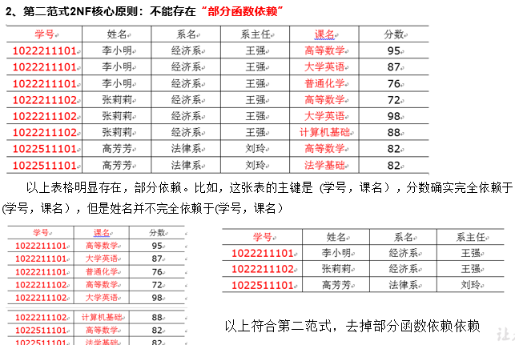
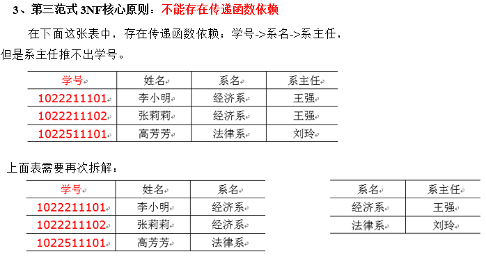
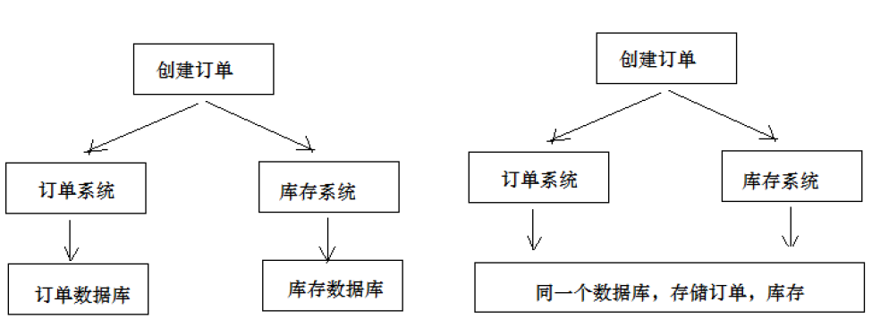
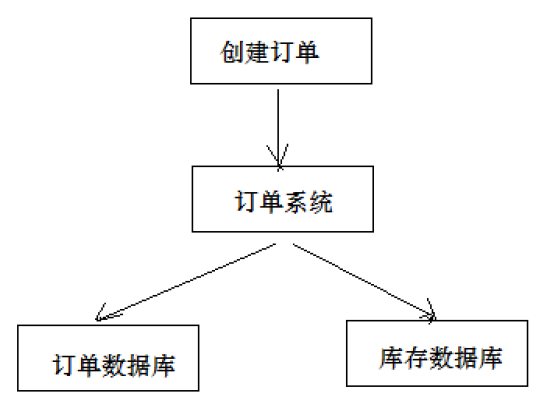
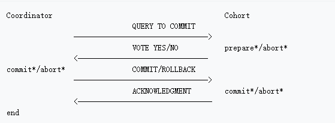
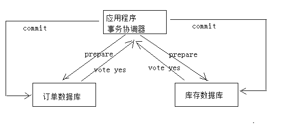

# 一、数据库范式

1. 第一范式

   数据库表中的每一列都是不可再分的原子项

   

2. 第二范式

   在第一范式的基础上，消除了非主属性堆码的部分依赖

   

3. 第三范式

   在第二范式的基础上，消除了传递依赖

   

# 二、分布式事务

1、什么是分布式系统？
部署在不同结点上的系统通过网络交互来完成协同工作的系统。比如：充值加积分的业务，用户在充值系统向自己的账户充钱，在积分系统中自己积分相应的增加。充值系统和积分系统是两个不同的系统，一次充值加积分的业务就需要这两个系统协同工作来完成。
2、什么是事务？
事务是指由一组操作组成的一个工作单元，这个工作单元具有原子性（atomicity）、一致性（consistency）、隔离性（isolation）和持久性（durability）。

- 原子性：执行单元中的操作要么全部执行成功，要么全部失败。如果有一部分成功一部分失败那么成功的操作要全
  部回滚到执行前的状态。 

- 一致性：执行一次事务会使用数据从一个正确的状态转换到另一个正确的状态，执行前后数据都是完整的。

-  隔离性：在该事务执行的过程中，任何数据的改变只存在于该事务之中，对外界没有影响，事务与事务之间是完全的隔离的。只有事务提交后其它事务才可以查询到最新的数据。

-  持久性：事务完成后对数据的改变会永久性的存储起来，即使发生断电宕机数据依然在。

3、什么是本地事务？
本地事务就是用关系数据库来控制事务，关系数据库通常都具有ACID特性，传统的单体应用通常会将数据全部存储在一个数据库中，会借助关系数据库来完成事务控制。
4、什么是分布式事务？
在分布式系统中一次操作由多个系统协同完成，这种一次事务操作涉及多个系统通过网络协同完成的过程称为分布式事务。这里强调的是多个系统通过网络协同完成一个事务的过程，并不强调多个系统访问了不同的数据库，即使多个系统访问的是同一个数据库也是分布式事务，如下图：

另外一种分布式事务的表现是，一个应用程序使用了多个数据源连接了不同的数据库，当一次事务需要操作多个数据源，此时也属于分布式事务，当系统作了数据库拆分后会出现此种情况。

# 三、CAP理论

CAP理论是：分布式系统在设计时只能在一致性(Consistency)、可用性(Availability)、分区容忍性(Partition Tolerance)中满足两种，无法兼顾三种。

通过下图理解CAP理论：

- 一致性(Consistency)：服务A、B、C三个结点都存储了用户数据， 三个结点的数据需要保持同一时刻数据一致性。

- 可用性(Availability)：服务A、B、C三个结点，其中一个结点宕机不影响整个集群对外提供服务，如果只有服务A结点，当服务A宕机整个系统将无法提供服务，增加服务B、C是为了保证系统的可用性。

- 分区容忍性(Partition Tolerance)：分区容忍性就是允许系统通过网络协同工作，分区容忍性要解决由于网络分区导致数据的不完整及无法访问等问题。

  分布式系统不可避免的出现了多个系统通过网络协同工作的场景，结点之间难免会出现网络中断、网延延迟等现象，这种现象一旦出现就导致数据被分散在不同的结点上，这就是网络分区。

**分布式系统能否兼顾C、A、P？**

在保证分区容忍性的前提下一致性和可用性无法兼顾，如果要提高系统的可用性就要增加多个结点，如果要保证数据的一致性就要实现每个结点的数据一致，结点越多可用性越好，但是数据一致性越差。所以，在进行分布式系统设计时，同时满足“一致性”、“可用性”和“分区容忍性”三者是几乎不可能的。

**CAP有哪些组合方式？**

1、CA：放弃分区容忍性，加强一致性和可用性，关系数据库按照CA进行设计。
2、AP：放弃一致性，加强可用性和分区容忍性，追求最终一致性，很多NoSQL数据库按照AP进行设计。

说明：这里放弃一致性是指放弃强一致性，强一致性就是写入成功立刻要查询出最新数据。追求最终一致性是指允许暂时的数据不一致，只要最终在用户接受的时间内数据 一致即可。

3、CP：放弃可用性，加强一致性和分区容忍性，一些强一致性要求的系统按CP进行设计，比如跨行转账，一次转账请求要等待双方银行系统都完成整个事务才算完成。

说明：由于网络问题的存在CP系统可能会出现待等待超时，如果没有处理超时问题则整理系统会出现阻塞。
**总结：**

在分布式系统设计中AP的应用较多，即保证分区容忍性和可用性，牺牲数据的强一致性（写操作后立刻读取到最新数据），保证数据最终一致性。比如：订单退款，今日退款成功，明日账户到账，只要在预定的用户可以接受的时间内退款事务走完即可。

# 四、2PC

为解决分布式系统的数据一致性问题出现了两阶段提交协议（2 Phase Commitment Protocol），两阶段提交由协调者和参与者组成，共经过两个阶段和三个操作，部分关系数据库如Oracle、MySQL支持两阶段提交协议，本节讲解关系数据库两阶段提交协议。

2PC协议流程图：

1）第一阶段：准备阶段（prepare）
协调者通知参与者准备提交订单，参与者开始投票。
协调者完成准备工作向协调者回应Yes。
2）第二阶段：提交(commit)/回滚(rollback)阶段
协调者根据参与者的投票结果发起最终的提交指令。
如果有参与者没有准备好则发起回滚指令。
一个下单减库存的例子：

1、应用程序连接两个数据源。
2、应用程序通过事务协调器向两个库发起prepare，两个数据库收到消息分别执行本地事务（记录日志），但不提交，如果执行成功则回复yes，否则回复no。
3、事务协调器收到回复，只要有一方回复no则分别向参与者发起回滚事务，参与者开始回滚事务。
4、事务协调器收到回复，全部回复yes，此时向参与者发起提交事务。如果参与者有一方提交事务失败则由事务协调器发起回滚事务。

2PC的优点：实现强一致性，部分关系数据库支持（Oracle、MySQL等）。
缺点：整个事务的执行需要由协调者在多个节点之间去协调，增加了事务的执行时间，性能低下。

3PC主要是解决协调者与参与者通信阻塞问题而产生的，它比2PC传递的消息还要多，性能不高。

