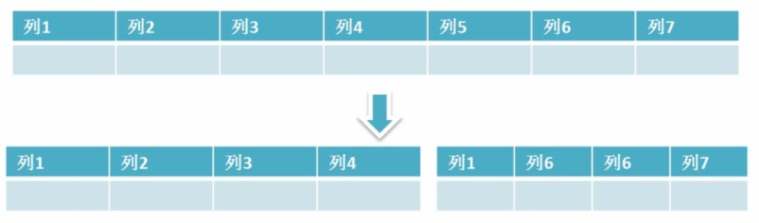

# 数据库

## 数据库范式

1. 第一范式

   数据库表中的每一列都是不可再分的原子项

   

2. 第二范式

   在第一范式的基础上，消除了非主属性堆码的部分依赖

   

3. 第三范式

   在第二范式的基础上，消除了传递依赖

   

## SQL语句执行顺序

### sql语句定义的顺序

```sql
(1) SELECT (2)DISTINCT<select_list>
(3) FROM <left_table>
(4) <join_type> JOIN <right_table>
(5) ON <join_condition>
(6) WHERE <where_condition>
(7) GROUP BY <group_by_list>
(8) WITH {CUBE|ROLLUP}
(9) HAVING <having_condition>
(10) ORDER BY <order_by_condition>
(11) LIMIT <limit_number>
12345678910
```

### sql语句执行顺序

```sql
(8) SELECT (9)DISTINCT<select_list>
(1) FROM <left_table>
(3) <join_type> JOIN <right_table>
(2)         ON <join_condition>
(4) WHERE <where_condition>
(5) GROUP BY <group_by_list>
(6) WITH {CUBE|ROLLUP}
(7) HAVING <having_condition>
(10) ORDER BY <order_by_list>
(11) LIMIT <limit_number>
12345678910
```

**可以看到，一共有十一个步骤，最先执行的是FROM操作，最后执行的是LIMIT操作。每个操作都会产生一个虚拟表，该虚拟表作为一个处理的输入，看下执行顺序：**
(1) FROM:对FROM子句中的左表`<left_table>`和右表`<right_table>`执行笛卡儿积，产生虚拟表VT1;
(2) ON: 对虚拟表VT1进行ON筛选，只有那些符合`<join_condition>`的行才被插入虚拟表VT2;
(3) JOIN: 如果指定了`OUTER JOIN`(如LEFT OUTER JOIN、RIGHT OUTER JOIN)，那么保留表中未匹配的行作为外部行添加到虚拟表VT2，产生虚拟表VT3。如果FROM子句包含两个以上的表，则对上一个连接生成的结果表VT3和下一个表重复执行步骤1~步骤3，直到处理完所有的表;
(4) WHERE: 对虚拟表VT3应用WHERE过滤条件，只有符合`<where_condition>`的记录才会被插入虚拟表VT4;
(5) GROUP By: 根据GROUP BY子句中的列，对VT4中的记录进行分组操作，产生VT5;
(6) CUBE|ROllUP: 对VT5进行CUBE或ROLLUP操作，产生表VT6;
(7) HAVING: 对虚拟表VT6应用HAVING过滤器，只有符合`<having_condition>`的记录才会被插入到VT7;
(8) SELECT: 第二次执行SELECT操作，选择指定的列，插入到虚拟表VT8中;
(9) DISTINCT: 去除重复，产生虚拟表VT9;
(10) ORDER BY: 将虚拟表VT9中的记录按照`<order_by_list>`进行排序操作，产生虚拟表VT10;
(11) LIMIT: 取出指定街行的记录，产生虚拟表VT11，并返回给查询用户

## MySQL

### 什么是MySQL?

MySQL 是一种关系型数据库，在Java企业级开发中非常常用，因为 MySQL 是开源免费的，并且方便扩展。阿里巴巴数据库系统也大量用到了 MySQL，因此它的稳定性是有保障的。MySQL是开放源代码的，因此任何人都可以在 GPL(General Public License) 的许可下下载并根据个性化的需要对其进行修改。MySQL的默认端口号是**3306**。

### 存储引擎

#### 一些常用命令

**查看MySQL提供的所有存储引擎**

```sql
mysql> show engines;
```


从上图我们可以查看出 MySQL 当前默认的存储引擎是InnoDB,并且在5.7版本所有的存储引擎中只有 InnoDB 是事务性存储引擎，也就是说只有 InnoDB 支持事务。

**查看MySQL当前默认的存储引擎**

我们也可以通过下面的命令查看默认的存储引擎。

```sql
mysql> show variables like '%storage_engine%';
```

**查看表的存储引擎**

```sql
show table status like "table_name" ;
```


#### MyISAM和InnoDB区别

MyISAM是MySQL的默认数据库引擎（5.5版之前）。虽然性能极佳，而且提供了大量的特性，包括全文索引、压缩、空间函数等，但MyISAM不支持事务和行级锁，而且最大的缺陷就是崩溃后无法安全恢复。不过，5.5版本之后，MySQL引入了InnoDB（事务性数据库引擎），MySQL 5.5版本后默认的存储引擎为InnoDB。

大多数时候我们使用的都是 InnoDB 存储引擎，但是在某些情况下使用 MyISAM 也是合适的比如读密集的情况下。（如果你不介意 MyISAM 崩溃恢复问题的话）。

**两者的对比：**

1. **是否支持行级锁** : MyISAM 只有表级锁(table-level locking)，而InnoDB 支持行级锁(row-level locking)和表级锁,默认为行级锁。
2. **是否支持事务和崩溃后的安全恢复： MyISAM** 强调的是性能，每次查询具有原子性,其执行速度比InnoDB类型更快，但是不提供事务支持。但是**InnoDB** 提供事务支持事务，外部键等高级数据库功能。 具有事务(commit)、回滚(rollback)和崩溃修复能力(crash recovery capabilities)的事务安全(transaction-safe (ACID compliant))型表。
3. **是否支持外键：** MyISAM不支持，而InnoDB支持。
4. **是否支持MVCC** ：仅 InnoDB 支持。应对高并发事务, MVCC比单纯的加锁更高效;MVCC只在 `READ COMMITTED` 和 `REPEATABLE READ` 两个隔离级别下工作;MVCC可以使用 乐观(optimistic)锁 和 悲观(pessimistic)锁来实现;各数据库中MVCC实现并不统一。推荐阅读：[MySQL-InnoDB-MVCC多版本并发控制](https://segmentfault.com/a/1190000012650596)
5. ......

《MySQL高性能》上面有一句话这样写到:

> 不要轻易相信“MyISAM比InnoDB快”之类的经验之谈，这个结论往往不是绝对的。在很多我们已知场景中，InnoDB的速度都可以让MyISAM望尘莫及，尤其是用到了聚簇索引，或者需要访问的数据都可以放入内存的应用。

一般情况下我们选择 InnoDB 都是没有问题的，但是某些情况下你并不在乎可扩展能力和并发能力，也不需要事务支持，也不在乎崩溃后的安全恢复问题的话，选择MyISAM也是一个不错的选择。但是一般情况下，我们都是需要考虑到这些问题的。

### 字符集及校对规则

字符集指的是一种从二进制编码到某类字符符号的映射。校对规则则是指某种字符集下的排序规则。MySQL中每一种字符集都会对应一系列的校对规则。

MySQL采用的是类似继承的方式指定字符集的默认值，每个数据库以及每张数据表都有自己的默认值，他们逐层继承。比如：某个库中所有表的默认字符集将是该数据库所指定的字符集（这些表在没有指定字符集的情况下，才会采用默认字符集） PS：整理自《Java工程师修炼之道》

详细内容可以参考：   [MySQL字符集及校对规则的理解](https://www.cnblogs.com/geaozhang/p/6724393.html#MySQLyuzifuji)

### 索引

MySQL索引使用的数据结构主要有**BTree索引** 和 **哈希索引** 。对于哈希索引来说，底层的数据结构就是哈希表，因此在绝大多数需求为单条记录查询的时候，可以选择哈希索引，查询性能最快；其余大部分场景，建议选择BTree索引。

MySQL的BTree索引使用的是B树中的B+Tree，但对于主要的两种存储引擎的实现方式是不同的。

- **MyISAM:** B+Tree叶节点的data域存放的是数据记录的地址。在索引检索的时候，首先按照B+Tree搜索算法搜索索引，如果指定的Key存在，则取出其 data 域的值，然后以 data 域的值为地址读取相应的数据记录。这被称为“非聚簇索引”。
- **InnoDB:** 其数据文件本身就是索引文件。相比MyISAM，索引文件和数据文件是分离的，其表数据文件本身就是按B+Tree组织的一个索引结构，树的叶节点data域保存了完整的数据记录。这个索引的key是数据表的主键，因此InnoDB表数据文件本身就是主索引。这被称为“聚簇索引（或聚集索引）”。而其余的索引都作为辅助索引，辅助索引的data域存储相应记录主键的值而不是地址，这也是和MyISAM不同的地方。**在根据主索引搜索时，直接找到key所在的节点即可取出数据；在根据辅助索引查找时，则需要先取出主键的值，再走一遍主索引。** **因此，在设计表的时候，不建议使用过长的字段作为主键，也不建议使用非单调的字段作为主键，这样会造成主索引频繁分裂。** PS：整理自《Java工程师修炼之道》

**更多关于索引的内容可以查看文档首页MySQL目录下关于索引的详细总结。**

### 查询缓存的使用

> 执行查询语句的时候，会先查询缓存。不过，MySQL 8.0 版本后移除，因为这个功能不太实用

my.cnf加入以下配置，重启MySQL开启查询缓存

```properties
query_cache_type=1
query_cache_size=600000
```

MySQL执行以下命令也可以开启查询缓存

```properties
set global  query_cache_type=1;
set global  query_cache_size=600000;
```

如上，**开启查询缓存后在同样的查询条件以及数据情况下，会直接在缓存中返回结果**。这里的查询条件包括查询本身、当前要查询的数据库、客户端协议版本号等一些可能影响结果的信息。因此任何两个查询在任何字符上的不同都会导致缓存不命中。此外，如果查询中包含任何用户自定义函数、存储函数、用户变量、临时表、MySQL库中的系统表，其查询结果也不会被缓存。

缓存建立之后，MySQL的查询缓存系统会跟踪查询中涉及的每张表，如果这些表（数据或结构）发生变化，那么和这张表相关的所有缓存数据都将失效。

**缓存虽然能够提升数据库的查询性能，但是缓存同时也带来了额外的开销，每次查询后都要做一次缓存操作，失效后还要销毁。** 因此，开启缓存查询要谨慎，尤其对于写密集的应用来说更是如此。如果开启，要注意合理控制缓存空间大小，一般来说其大小设置为几十MB比较合适。此外，**还可以通过sql_cache和sql_no_cache来控制某个查询语句是否需要缓存：**

```sql
select sql_no_cache count(*) from usr;
```

### 什么是事务?

**事务是逻辑上的一组操作，要么都执行，要么都不执行。**

事务最经典也经常被拿出来说例子就是转账了。假如小明要给小红转账1000元，这个转账会涉及到两个关键操作就是：将小明的余额减少1000元，将小红的余额增加1000元。万一在这两个操作之间突然出现错误比如银行系统崩溃，导致小明余额减少而小红的余额没有增加，这样就不对了。事务就是保证这两个关键操作要么都成功，要么都要失败。

### 事物的四大特性(ACID)


1. **原子性（Atomicity）：** 事务是最小的执行单位，不允许分割。事务的原子性确保动作要么全部完成，要么完全不起作用；
2. **一致性（Consistency）：** 执行事务前后，数据保持一致，多个事务对同一个数据读取的结果是相同的；
3. **隔离性（Isolation）：** 并发访问数据库时，一个用户的事务不被其他事务所干扰，各并发事务之间数据库是独立的；
4. **持久性（Durability）：** 一个事务被提交之后。它对数据库中数据的改变是持久的，即使数据库发生故障也不应该对其有任何影响。

###  并发事务带来哪些问题?

在典型的应用程序中，多个事务并发运行，经常会操作相同的数据来完成各自的任务（多个用户对同一数据进行操作）。并发虽然是必须的，但可能会导致以下的问题。

- **脏读（Dirty read）:** 当一个事务正在访问数据并且对数据进行了修改，而这种修改还没有提交到数据库中，这时另外一个事务也访问了这个数据，然后使用了这个数据。因为这个数据是还没有提交的数据，那么另外一个事务读到的这个数据是“脏数据”，依据“脏数据”所做的操作可能是不正确的。
- **丢失修改（Lost to modify）:** 指在一个事务读取一个数据时，另外一个事务也访问了该数据，那么在第一个事务中修改了这个数据后，第二个事务也修改了这个数据。这样第一个事务内的修改结果就被丢失，因此称为丢失修改。	例如：事务1读取某表中的数据A=20，事务2也读取A=20，事务1修改A=A-1，事务2也修改A=A-1，最终结果A=19，事务1的修改被丢失。
- **不可重复读（Unrepeatableread）:** 指在一个事务内多次读同一数据。在这个事务还没有结束时，另一个事务也访问该数据。那么，在第一个事务中的两次读数据之间，由于第二个事务的修改导致第一个事务两次读取的数据可能不太一样。这就发生了在一个事务内两次读到的数据是不一样的情况，因此称为不可重复读。
- **幻读（Phantom read）:** 幻读与不可重复读类似。它发生在一个事务（T1）读取了几行数据，接着另一个并发事务（T2）插入了一些数据时。在随后的查询中，第一个事务（T1）就会发现多了一些原本不存在的记录，就好像发生了幻觉一样，所以称为幻读。

**不可重复读和幻读区别：**

不可重复读的重点是修改比如多次读取一条记录发现其中某些列的值被修改，幻读的重点在于新增或者删除比如多次读取一条记录发现记录增多或减少了。

###  事务隔离级别有哪些?MySQL的默认隔离级别是?

**SQL 标准定义了四个隔离级别：**

- **READ-UNCOMMITTED(读取未提交)：** 最低的隔离级别，允许读取尚未提交的数据变更，**可能会导致脏读、幻读或不可重复读**。
- **READ-COMMITTED(读取已提交)：** 允许读取并发事务已经提交的数据，**可以阻止脏读，但是幻读或不可重复读仍有可能发生**。
- **REPEATABLE-READ(可重复读)：**  对同一字段的多次读取结果都是一致的，除非数据是被本身事务自己所修改，**可以阻止脏读和不可重复读，但幻读仍有可能发生**。
- **SERIALIZABLE(可串行化)：** 最高的隔离级别，完全服从ACID的隔离级别。所有的事务依次逐个执行，这样事务之间就完全不可能产生干扰，也就是说，**该级别可以防止脏读、不可重复读以及幻读**。

------

|     隔离级别     | 脏读 | 不可重复读 | 幻影读 |
| :--------------: | :--: | :--------: | :----: |
| READ-UNCOMMITTED |  √   |     √      |   √    |
|  READ-COMMITTED  |  ×   |     √      |   √    |
| REPEATABLE-READ  |  ×   |     ×      |   √    |
|   SERIALIZABLE   |  ×   |     ×      |   ×    |

MySQL InnoDB 存储引擎的默认支持的隔离级别是 **REPEATABLE-READ（可重读）**。我们可以通过`SELECT @@tx_isolation;`命令来查看

```sql
mysql> SELECT @@tx_isolation;
+-----------------+
| @@tx_isolation  |
+-----------------+
| REPEATABLE-READ |
+-----------------+
```

这里需要注意的是：与 SQL 标准不同的地方在于 InnoDB 存储引擎在 **REPEATABLE-READ（可重读）** 
事务隔离级别下使用的是Next-Key Lock 锁算法，因此可以避免幻读的产生，这与其他数据库系统(如 SQL Server)
是不同的。所以说InnoDB 存储引擎的默认支持的隔离级别是 **REPEATABLE-READ（可重读）** 已经可以完全保证事务的隔离性要求，即达到了
 SQL标准的 **SERIALIZABLE(可串行化)** 隔离级别。因为隔离级别越低，事务请求的锁越少，所以大部分数据库系统的隔离级别都是 **READ-COMMITTED(读取提交内容)** ，但是你要知道的是InnoDB 存储引擎默认使用 **REPEAaTABLE-READ（可重读）** 并不会有任何性能损失。

InnoDB 存储引擎在 **分布式事务** 的情况下一般会用到 **SERIALIZABLE(可串行化)** 隔离级别。

###  锁机制与InnoDB锁算法

**MyISAM和InnoDB存储引擎使用的锁：**

- MyISAM采用表级锁(table-level locking)。
- InnoDB支持行级锁(row-level locking)和表级锁,默认为行级锁

**表级锁和行级锁对比：**

- **表级锁：** MySQL中锁定 **粒度最大** 的一种锁，对当前操作的整张表加锁，实现简单，资源消耗也比较少，加锁快，不会出现死锁。其锁定粒度最大，触发锁冲突的概率最高，并发度最低，MyISAM和 InnoDB引擎都支持表级锁。
- **行级锁：** MySQL中锁定 **粒度最小** 的一种锁，只针对当前操作的行进行加锁。 行级锁能大大减少数据库操作的冲突。其加锁粒度最小，并发度高，但加锁的开销也最大，加锁慢，会出现死锁。 

详细内容可以参考： MySQL锁机制简单了解一下：[https://blog.csdn.net/qq_34337272/article/details/80611486](https://blog.csdn.net/qq_34337272/article/details/80611486)

**InnoDB存储引擎的锁的算法有三种：**

- Record lock：单个行记录上的锁
- Gap lock：间隙锁，锁定一个范围，不包括记录本身
- Next-key lock：record+gap 锁定一个范围，包含记录本身

**相关知识点：**

1. innodb对于行的查询使用next-key lock
2. Next-locking keying为了解决Phantom Problem幻读问题
3. 当查询的索引含有唯一属性时，将next-key lock降级为record key
4. Gap锁设计的目的是为了阻止多个事务将记录插入到同一范围内，而这会导致幻读问题的产生
5. 有两种方式显式关闭gap锁：（除了外键约束和唯一性检查外，其余情况仅使用record lock） A. 将事务隔离级别设置为RC B. 将参数innodb_locks_unsafe_for_binlog设置为1

###  大表优化

当MySQL单表记录数过大时，数据库的CRUD性能会明显下降，一些常见的优化措施如下：

####  限定数据的范围

务必禁止不带任何限制数据范围条件的查询语句。比如：我们当用户在查询订单历史的时候，我们可以控制在一个月的范围内；

#### 读/写分离

经典的数据库拆分方案，主库负责写，从库负责读；

#### 垂直分区

 **根据数据库里面数据表的相关性进行拆分。** 例如，用户表中既有用户的登录信息又有用户的基本信息，可以将用户表拆分成两个单独的表，甚至放到单独的库做分库。

 **简单来说垂直拆分是指数据表列的拆分，把一张列比较多的表拆分为多张表。** 如下图所示，这样来说大家应该就更容易理解了。
 

- **垂直拆分的优点：** 可以使得列数据变小，在查询时减少读取的Block数，减少I/O次数。此外，垂直分区可以简化表的结构，易于维护。
- **垂直拆分的缺点：** 主键会出现冗余，需要管理冗余列，并会引起Join操作，可以通过在应用层进行Join来解决。此外，垂直分区会让事务变得更加复杂；

#### 水平分区

**保持数据表结构不变，通过某种策略存储数据分片。这样每一片数据分散到不同的表或者库中，达到了分布式的目的。 水平拆分可以支撑非常大的数据量。** 

 水平拆分是指数据表行的拆分，表的行数超过200万行时，就会变慢，这时可以把一张的表的数据拆成多张表来存放。举个例子：我们可以将用户信息表拆分成多个用户信息表，这样就可以避免单一表数据量过大对性能造成影响。


水平拆分可以支持非常大的数据量。需要注意的一点是：分表仅仅是解决了单一表数据过大的问题，但由于表的数据还是在同一台机器上，其实对于提升MySQL并发能力没有什么意义，所以 **水平拆分最好分库** 。

水平拆分能够 **支持非常大的数据量存储，应用端改造也少**，但 **分片事务难以解决**  ，跨节点Join性能较差，逻辑复杂。《Java工程师修炼之道》的作者推荐 **尽量不要对数据进行分片，因为拆分会带来逻辑、部署、运维的各种复杂度** ，一般的数据表在优化得当的情况下支撑千万以下的数据量是没有太大问题的。如果实在要分片，尽量选择客户端分片架构，这样可以减少一次和中间件的网络I/O。

**下面补充一下数据库分片的两种常见方案：**

- **客户端代理：**  **分片逻辑在应用端，封装在jar包中，通过修改或者封装JDBC层来实现。** 当当网的 **Sharding-JDBC** 、阿里的TDDL是两种比较常用的实现。
- **中间件代理：** **在应用和数据中间加了一个代理层。分片逻辑统一维护在中间件服务中。** 我们现在谈的 **Mycat** 、360的Atlas、网易的DDB等等都是这种架构的实现。

详细内容可以参考： MySQL大表优化方案: [https://segmentfault.com/a/1190000006158186](https://segmentfault.com/a/1190000006158186)

###  解释一下什么是池化设计思想。什么是数据库连接池?为什么需要数据库连接池?

池化设计应该不是一个新名词。我们常见的如java线程池、jdbc连接池、redis连接池等就是这类设计的代表实现。这种设计会初始预设资源，解决的问题就是抵消每次获取资源的消耗，如创建线程的开销，获取远程连接的开销等。就好比你去食堂打饭，打饭的大妈会先把饭盛好几份放那里，你来了就直接拿着饭盒加菜即可，不用再临时又盛饭又打菜，效率就高了。除了初始化资源，池化设计还包括如下这些特征：池子的初始值、池子的活跃值、池子的最大值等，这些特征可以直接映射到java线程池和数据库连接池的成员属性中。这篇文章对[池化设计思想](https://mp.weixin.qq.com/s?__biz=Mzg2OTA0Njk0OA==&mid=2247485679&idx=1&sn=57dbca8c9ad49e1f3968ecff04a4f735&chksm=cea24724f9d5ce3212292fac291234a760c99c0960b5430d714269efe33554730b5f71208582&token=1141994790&lang=zh_CN#rd)介绍的还不错，直接复制过来，避免重复造轮子了。

数据库连接本质就是一个 socket 的连接。数据库服务端还要维护一些缓存和用户权限信息之类的 所以占用了一些内存。我们可以把数据库连接池是看做是维护的数据库连接的缓存，以便将来需要对数据库的请求时可以重用这些连接。为每个用户打开和维护数据库连接，尤其是对动态数据库驱动的网站应用程序的请求，既昂贵又浪费资源。**在连接池中，创建连接后，将其放置在池中，并再次使用它，因此不必建立新的连接。如果使用了所有连接，则会建立一个新连接并将其添加到池中。 **连接池还减少了用户必须等待建立与数据库的连接的时间。

### 分库分表之后,id 主键如何处理？

因为要是分成多个表之后，每个表都是从 1 开始累加，这样是不对的，我们需要一个全局唯一的 id 来支持。

生成全局 id 有下面这几种方式：

- **UUID**：不适合作为主键，因为太长了，并且无序不可读，查询效率低。比较适合用于生成唯一的名字的标示比如文件的名字。
- **数据库自增 id** : 两台数据库分别设置不同步长，生成不重复ID的策略来实现高可用。这种方式生成的 id 有序，但是需要独立部署数据库实例，成本高，还会有性能瓶颈。
- **利用 redis 生成 id :** 性能比较好，灵活方便，不依赖于数据库。但是，引入了新的组件造成系统更加复杂，可用性降低，编码更加复杂，增加了系统成本。
- **Twitter的snowflake算法** ：Github 地址：https://github.com/twitter-archive/snowflake。
- **美团的[Leaf](https://tech.meituan.com/2017/04/21/mt-leaf.html)分布式ID生成系统** ：Leaf 是美团开源的分布式ID生成器，能保证全局唯一性、趋势递增、单调递增、信息安全，里面也提到了几种分布式方案的对比，但也需要依赖关系数据库、Zookeeper等中间件。感觉还不错。美团技术团队的一篇文章：https://tech.meituan.com/2017/04/21/mt-leaf.html 。
- ......

###  一条SQL语句在MySQL中如何执行的

[一条SQL语句在MySQL中如何执行的](<https://mp.weixin.qq.com/s?__biz=Mzg2OTA0Njk0OA==&mid=2247485097&idx=1&sn=84c89da477b1338bdf3e9fcd65514ac1&chksm=cea24962f9d5c074d8d3ff1ab04ee8f0d6486e3d015cfd783503685986485c11738ccb542ba7&token=79317275&lang=zh_CN#rd>)

###  MySQL高性能优化规范建议

[MySQL高性能优化规范建议](<https://mp.weixin.qq.com/s?__biz=Mzg2OTA0Njk0OA==&mid=2247485117&idx=1&sn=92361755b7c3de488b415ec4c5f46d73&chksm=cea24976f9d5c060babe50c3747616cce63df5d50947903a262704988143c2eeb4069ae45420&token=79317275&lang=zh_CN#rd>)

### 一条SQL语句执行得很慢的原因有哪些？

[腾讯面试：一条SQL语句执行得很慢的原因有哪些？---不看后悔系列](https://mp.weixin.qq.com/s?__biz=Mzg2OTA0Njk0OA==&mid=2247485185&idx=1&sn=66ef08b4ab6af5757792223a83fc0d45&chksm=cea248caf9d5c1dc72ec8a281ec16aa3ec3e8066dbb252e27362438a26c33fbe842b0e0adf47&token=79317275&lang=zh_CN#rd)

### 后端程序员必备：书写高质量SQL的30条建议

[后端程序员必备：书写高质量SQL的30条建议](https://mp.weixin.qq.com/s?__biz=Mzg2OTA0Njk0OA==&mid=2247486461&idx=1&sn=60a22279196d084cc398936fe3b37772&chksm=cea24436f9d5cd20a4fa0e907590f3e700d7378b3f608d7b33bb52cfb96f503b7ccb65a1deed&token=1987003517&lang=zh_CN#rd)

## Redis

###  redis 简介

简单来说 redis 就是一个数据库，不过与传统数据库不同的是 redis 的数据是存在内存中的，所以读写速度非常快，因此 redis 被广泛应用于缓存方向。另外，redis 也经常用来做分布式锁。redis 提供了多种数据类型来支持不同的业务场景。除此之外，redis 支持事务 、持久化、LUA脚本、LRU驱动事件、多种集群方案。 

#### 为什么要用 redis/为什么要用缓存

主要从“高性能”和“高并发”这两点来看待这个问题。

**高性能：**

假如用户第一次访问数据库中的某些数据。这个过程会比较慢，因为是从硬盘上读取的。将该用户访问的数据存在缓存中，这样下一次再访问这些数据的时候就可以直接从缓存中获取了。操作缓存就是直接操作内存，所以速度相当快。如果数据库中的对应数据改变的之后，同步改变缓存中相应的数据即可！


**高并发：**

直接操作缓存能够承受的请求是远远大于直接访问数据库的，所以我们可以考虑把数据库中的部分数据转移到缓存中去，这样用户的一部分请求会直接到缓存这里而不用经过数据库。


#### 为什么要用 redis 而不用 map/guava 做缓存?


>下面的内容来自 segmentfault 一位网友的提问，地址：https://segmentfault.com/q/1010000009106416

缓存分为本地缓存和分布式缓存。以 Java 为例，使用自带的 map 或者 guava 实现的是本地缓存，最主要的特点是轻量以及快速，生命周期随着 jvm 的销毁而结束，并且在多实例的情况下，每个实例都需要各自保存一份缓存，缓存不具有一致性。

使用 redis 或 memcached 之类的称为分布式缓存，在多实例的情况下，各实例共用一份缓存数据，缓存具有一致性。缺点是需要保持 redis 或  memcached服务的高可用，整个程序架构上较为复杂。

###  redis 的线程模型

> 参考地址:https://www.javazhiyin.com/22943.html

redis 内部使用文件事件处理器 `file event handler`，这个文件事件处理器是单线程的，所以 redis 才叫做单线程的模型。它采用 IO 多路复用机制同时监听多个 socket，根据 socket 上的事件来选择对应的事件处理器进行处理。

文件事件处理器的结构包含 4 个部分：

- 多个 socket
- IO 多路复用程序
- 文件事件分派器
- 事件处理器（连接应答处理器、命令请求处理器、命令回复处理器）

多个 socket 可能会并发产生不同的操作，每个操作对应不同的文件事件，但是 IO 多路复用程序会监听多个 socket，会将 socket 产生的事件放入队列中排队，事件分派器每次从队列中取出一个事件，把该事件交给对应的事件处理器进行处理。

###   redis 和 memcached 的区别

对于 redis 和 memcached 我总结了下面四点。现在公司一般都是用 redis 来实现缓存，而且 redis 自身也越来越强大了！

1. **redis支持更丰富的数据类型（支持更复杂的应用场景）**：Redis不仅仅支持简单的k/v类型的数据，同时还提供list，set，zset，hash等数据结构的存储。memcache支持简单的数据类型，String。
2. **Redis支持数据的持久化，可以将内存中的数据保持在磁盘中，重启的时候可以再次加载进行使用,而Memecache把数据全部存在内存之中。**
3. **集群模式**：memcached没有原生的集群模式，需要依靠客户端来实现往集群中分片写入数据；但是 redis 目前是原生支持 cluster 模式的.
4. **Memcached是多线程，非阻塞IO复用的网络模型；Redis使用单线程的多路 IO 复用模型。**


> 来自网络上的一张图，这里分享给大家！


###  redis 常见数据结构以及使用场景分析

#### String

> **常用命令:**  set,get,decr,incr,mget 等。

String数据结构是简单的key-value类型，value其实不仅可以是String，也可以是数字。 
常规key-value缓存应用； 
常规计数：微博数，粉丝数等。

#### Hash

> **常用命令：** hget,hset,hgetall 等。

hash 是一个 string 类型的 field 和 value 的映射表，hash 特别适合用于存储对象，后续操作的时候，你可以直接仅仅修改这个对象中的某个字段的值。 比如我们可以 hash 数据结构来存储用户信息，商品信息等等。比如下面我就用 hash 类型存放了我本人的一些信息：

```
key=JavaUser293847
value={
  “id”: 1,
  “name”: “SnailClimb”,
  “age”: 22,
  “location”: “Wuhan, Hubei”
}

```

#### List

> **常用命令:** lpush,rpush,lpop,rpop,lrange等

list 就是链表，Redis list 的应用场景非常多，也是Redis最重要的数据结构之一，比如微博的关注列表，粉丝列表，消息列表等功能都可以用Redis的 list 结构来实现。

Redis list 的实现为一个双向链表，即可以支持反向查找和遍历，更方便操作，不过带来了部分额外的内存开销。

另外可以通过 lrange 命令，就是从某个元素开始读取多少个元素，可以基于 list 实现分页查询，这个很棒的一个功能，基于 redis 实现简单的高性能分页，可以做类似微博那种下拉不断分页的东西（一页一页的往下走），性能高。

#### Set

> **常用命令：**
> sadd,spop,smembers,sunion 等

set 对外提供的功能与list类似是一个列表的功能，特殊之处在于 set 是可以自动排重的。

当你需要存储一个列表数据，又不希望出现重复数据时，set是一个很好的选择，并且set提供了判断某个成员是否在一个set集合内的重要接口，这个也是list所不能提供的。可以基于 set 轻易实现交集、并集、差集的操作。

比如：在微博应用中，可以将一个用户所有的关注人存在一个集合中，将其所有粉丝存在一个集合。Redis可以非常方便的实现如共同关注、共同粉丝、共同喜好等功能。这个过程也就是求交集的过程，具体命令如下：

```
sinterstore key1 key2 key3     将交集存在key1内
```

#### Sorted Set

> **常用命令：** zadd,zrange,zrem,zcard等


和set相比，sorted set增加了一个权重参数score，使得集合中的元素能够按score进行有序排列。

**举例：** 在直播系统中，实时排行信息包含直播间在线用户列表，各种礼物排行榜，弹幕消息（可以理解为按消息维度的消息排行榜）等信息，适合使用 Redis 中的 Sorted Set 结构进行存储。

###  redis 设置过期时间

Redis中有个设置时间过期的功能，即对存储在 redis 数据库中的值可以设置一个过期时间。作为一个缓存数据库，这是非常实用的。如我们一般项目中的 token 或者一些登录信息，尤其是短信验证码都是有时间限制的，按照传统的数据库处理方式，一般都是自己判断过期，这样无疑会严重影响项目性能。

我们 set key 的时候，都可以给一个 expire time，就是过期时间，通过过期时间我们可以指定这个 key 可以存活的时间。

如果假设你设置了一批 key 只能存活1个小时，那么接下来1小时后，redis是怎么对这批key进行删除的？

**定期删除+惰性删除。**

通过名字大概就能猜出这两个删除方式的意思了。

- **定期删除**：redis默认是每隔 100ms 就**随机抽取**一些设置了过期时间的key，检查其是否过期，如果过期就删除。注意这里是随机抽取的。为什么要随机呢？你想一想假如 redis 存了几十万个 key ，每隔100ms就遍历所有的设置过期时间的 key 的话，就会给 CPU 带来很大的负载！
- **惰性删除** ：定期删除可能会导致很多过期 key 到了时间并没有被删除掉。所以就有了惰性删除。假如你的过期 key，靠定期删除没有被删除掉，还停留在内存里，除非你的系统去查一下那个 key，才会被redis给删除掉。这就是所谓的惰性删除，也是够懒的哈！


但是仅仅通过设置过期时间还是有问题的。我们想一下：如果定期删除漏掉了很多过期 key，然后你也没及时去查，也就没走惰性删除，此时会怎么样？如果大量过期key堆积在内存里，导致redis内存块耗尽了。怎么解决这个问题呢？ **redis 内存淘汰机制。**

###  redis 内存淘汰机制(MySQL里有2000w数据，Redis中只存20w的数据，如何保证Redis中的数据都是热点数据?)

redis 配置文件 redis.conf 中有相关注释，我这里就不贴了，大家可以自行查阅或者通过这个网址查看： [http://download.redis.io/redis-stable/redis.conf](http://download.redis.io/redis-stable/redis.conf)

**redis 提供 6种数据淘汰策略：**

1. **volatile-lru**：从已设置过期时间的数据集（server.db[i].expires）中挑选最近最少使用的数据淘汰
2. **volatile-ttl**：从已设置过期时间的数据集（server.db[i].expires）中挑选将要过期的数据淘汰
3. **volatile-random**：从已设置过期时间的数据集（server.db[i].expires）中任意选择数据淘汰
4. **allkeys-lru**：当内存不足以容纳新写入数据时，在键空间中，移除最近最少使用的key（这个是最常用的）
5. **allkeys-random**：从数据集（server.db[i].dict）中任意选择数据淘汰
6. **no-eviction**：禁止驱逐数据，也就是说当内存不足以容纳新写入数据时，新写入操作会报错。这个应该没人使用吧！

4.0版本后增加以下两种：

7. **volatile-lfu**：从已设置过期时间的数据集(server.db[i].expires)中挑选最不经常使用的数据淘汰
8. **allkeys-lfu**：当内存不足以容纳新写入数据时，在键空间中，移除最不经常使用的key

**备注： 关于 redis 设置过期时间以及内存淘汰机制，我这里只是简单的总结一下，后面会专门写一篇文章来总结！**

### redis 持久化机制(怎么保证 redis 挂掉之后再重启数据可以进行恢复)

很多时候我们需要持久化数据也就是将内存中的数据写入到硬盘里面，大部分原因是为了之后重用数据（比如重启机器、机器故障之后恢复数据），或者是为了防止系统故障而将数据备份到一个远程位置。

Redis不同于Memcached的很重一点就是，Redis支持持久化，而且支持两种不同的持久化操作。**Redis的一种持久化方式叫快照（snapshotting，RDB），另一种方式是只追加文件（append-only file,AOF）**。这两种方法各有千秋，下面我会详细这两种持久化方法是什么，怎么用，如何选择适合自己的持久化方法。

**快照（snapshotting）持久化（RDB）**

Redis可以通过创建快照来获得存储在内存里面的数据在某个时间点上的副本。Redis创建快照之后，可以对快照进行备份，可以将快照复制到其他服务器从而创建具有相同数据的服务器副本（Redis主从结构，主要用来提高Redis性能），还可以将快照留在原地以便重启服务器的时候使用。

快照持久化是Redis默认采用的持久化方式，在redis.conf配置文件中默认有此下配置：

```conf
save 900 1           #在900秒(15分钟)之后，如果至少有1个key发生变化，Redis就会自动触发BGSAVE命令创建快照。

save 300 10          #在300秒(5分钟)之后，如果至少有10个key发生变化，Redis就会自动触发BGSAVE命令创建快照。

save 60 10000        #在60秒(1分钟)之后，如果至少有10000个key发生变化，Redis就会自动触发BGSAVE命令创建快照。
```

**AOF（append-only file）持久化**

与快照持久化相比，AOF持久化 的实时性更好，因此已成为主流的持久化方案。默认情况下Redis没有开启AOF（append only file）方式的持久化，可以通过appendonly参数开启：

```conf
appendonly yes
```

开启AOF持久化后每执行一条会更改Redis中的数据的命令，Redis就会将该命令写入硬盘中的AOF文件。AOF文件的保存位置和RDB文件的位置相同，都是通过dir参数设置的，默认的文件名是appendonly.aof。

在Redis的配置文件中存在三种不同的 AOF 持久化方式，它们分别是：

```conf
appendfsync always    #每次有数据修改发生时都会写入AOF文件,这样会严重降低Redis的速度
appendfsync everysec  #每秒钟同步一次，显示地将多个写命令同步到硬盘
appendfsync no        #让操作系统决定何时进行同步
```

为了兼顾数据和写入性能，用户可以考虑 appendfsync everysec选项 ，让Redis每秒同步一次AOF文件，Redis性能几乎没受到任何影响。而且这样即使出现系统崩溃，用户最多只会丢失一秒之内产生的数据。当硬盘忙于执行写入操作的时候，Redis还会优雅的放慢自己的速度以便适应硬盘的最大写入速度。

**Redis 4.0 对于持久化机制的优化**

Redis 4.0 开始支持 RDB 和 AOF 的混合持久化（默认关闭，可以通过配置项 `aof-use-rdb-preamble` 开启）。

如果把混合持久化打开，AOF 重写的时候就直接把 RDB 的内容写到 AOF 文件开头。这样做的好处是可以结合 RDB 和 AOF 的优点, 快速加载同时避免丢失过多的数据。当然缺点也是有的， AOF 里面的 RDB 部分是压缩格式不再是 AOF 格式，可读性较差。

**补充内容：AOF 重写**

AOF重写可以产生一个新的AOF文件，这个新的AOF文件和原有的AOF文件所保存的数据库状态一样，但体积更小。

AOF重写是一个有歧义的名字，该功能是通过读取数据库中的键值对来实现的，程序无须对现有AOF文件进行任何读入、分析或者写入操作。

在执行 BGREWRITEAOF 命令时，Redis 服务器会维护一个 AOF 重写缓冲区，该缓冲区会在子进程创建新AOF文件期间，记录服务器执行的所有写命令。当子进程完成创建新AOF文件的工作之后，服务器会将重写缓冲区中的所有内容追加到新AOF文件的末尾，使得新旧两个AOF文件所保存的数据库状态一致。最后，服务器用新的AOF文件替换旧的AOF文件，以此来完成AOF文件重写操作

**更多内容可以查看我的这篇文章：**

- [Redis持久化](Redis持久化.md)

###  redis 事务

Redis 通过 MULTI、EXEC、WATCH 等命令来实现事务(transaction)功能。事务提供了一种将多个命令请求打包，然后一次性、按顺序地执行多个命令的机制，并且在事务执行期间，服务器不会中断事务而改去执行其他客户端的命令请求，它会将事务中的所有命令都执行完毕，然后才去处理其他客户端的命令请求。

在传统的关系式数据库中，常常用 ACID 性质来检验事务功能的可靠性和安全性。在 Redis 中，事务总是具有原子性（Atomicity）、一致性（Consistency）和隔离性（Isolation），并且当 Redis 运行在某种特定的持久化模式下时，事务也具有持久性（Durability）。

补充内容：

> 1. redis同一个事务中如果有一条命令执行失败，其后的命令仍然会被执行，没有回滚。（来自[issue:关于Redis事务不是原子性问题](https://github.com/Snailclimb/JavaGuide/issues/452) ）

### 缓存雪崩和缓存穿透问题解决方案

#### **缓存雪崩** 

**什么是缓存雪崩？**

简介：缓存同一时间大面积的失效，所以，后面的请求都会落到数据库上，造成数据库短时间内承受大量请求而崩掉。

**有哪些解决办法？**

（中华石杉老师在他的视频中提到过，视频地址在最后一个问题中有提到）：

- 事前：尽量保证整个 redis 集群的高可用性，发现机器宕机尽快补上。选择合适的内存淘汰策略。
- 事中：本地ehcache缓存 + hystrix限流&降级，避免MySQL崩掉
- 事后：利用 redis 持久化机制保存的数据尽快恢复缓存


#### **缓存穿透** 

**什么是缓存穿透？**

缓存穿透说简单点就是大量请求的 key 根本不存在于缓存中，导致请求直接到了数据库上，根本没有经过缓存这一层。举个例子：某个黑客故意制造我们缓存中不存在的 key 发起大量请求，导致大量请求落到数据库。下面用图片展示一下(这两张图片不是我画的，为了省事直接在网上找的，这里说明一下)：

**正常缓存处理流程：**


**缓存穿透情况处理流程：**


一般MySQL 默认的最大连接数在 150 左右，这个可以通过 `show variables like '%max_connections%'; `命令来查看。最大连接数一个还只是一个指标，cpu，内存，磁盘，网络等无力条件都是其运行指标，这些指标都会限制其并发能力！所以，一般 3000 个并发请求就能打死大部分数据库了。

**有哪些解决办法？**

最基本的就是首先做好参数校验，一些不合法的参数请求直接抛出异常信息返回给客户端。比如查询的数据库 id 不能小于 0、传入的邮箱格式不对的时候直接返回错误消息给客户端等等。

**1）缓存无效 key** : 如果缓存和数据库都查不到某个 key 的数据就写一个到 redis 中去并设置过期时间，具体命令如下：`SET key value EX 10086`。这种方式可以解决请求的 key 变化不频繁的情况，如果黑客恶意攻击，每次构建不同的请求key，会导致 redis 中缓存大量无效的 key 。很明显，这种方案并不能从根本上解决此问题。如果非要用这种方式来解决穿透问题的话，尽量将无效的 key 的过期时间设置短一点比如 1 分钟。

另外，这里多说一嘴，一般情况下我们是这样设计 key 的： `表名:列名:主键名:主键值`。

 如果用 Java 代码展示的话，差不多是下面这样的：

```java
public Object getObjectInclNullById(Integer id) {
    // 从缓存中获取数据
    Object cacheValue = cache.get(id);
    // 缓存为空
    if (cacheValue == null) {
        // 从数据库中获取
        Object storageValue = storage.get(key);
        // 缓存空对象
        cache.set(key, storageValue);
        // 如果存储数据为空，需要设置一个过期时间(300秒)
        if (storageValue == null) {
            // 必须设置过期时间，否则有被攻击的风险
            cache.expire(key, 60 * 5);
        }
        return storageValue;
    }
    return cacheValue;
}
```

**2）布隆过滤器：**布隆过滤器是一个非常神奇的数据结构，通过它我们可以非常方便地判断一个给定数据是否存在与海量数据中。我们需要的就是判断 key 是否合法，有没有感觉布隆过滤器就是我们想要找的那个“人”。具体是这样做的：把所有可能存在的请求的值都存放在布隆过滤器中，当用户请求过来，我会先判断用户发来的请求的值是否存在于布隆过滤器中。不存在的话，直接返回请求参数错误信息给客户端，存在的话才会走下面的流程。总结一下就是下面这张图(这张图片不是我画的，为了省事直接在网上找的)：


更多关于布隆过滤器的内容可以看我的这篇原创：[《不了解布隆过滤器？一文给你整的明明白白！》](https://github.com/Snailclimb/JavaGuide/blob/master/docs/dataStructures-algorithms/data-structure/bloom-filter.md) ，强烈推荐，个人感觉网上应该找不到总结的这么明明白白的文章了。

###  如何解决 Redis 的并发竞争 Key 问题

所谓 Redis 的并发竞争 Key 的问题也就是多个系统同时对一个 key 进行操作，但是最后执行的顺序和我们期望的顺序不同，这样也就导致了结果的不同！

推荐一种方案：分布式锁（zookeeper 和 redis 都可以实现分布式锁）。（如果不存在 Redis 的并发竞争 Key 问题，不要使用分布式锁，这样会影响性能）

基于zookeeper临时有序节点可以实现的分布式锁。大致思想为：每个客户端对某个方法加锁时，在zookeeper上的与该方法对应的指定节点的目录下，生成一个唯一的瞬时有序节点。 判断是否获取锁的方式很简单，只需要判断有序节点中序号最小的一个。 当释放锁的时候，只需将这个瞬时节点删除即可。同时，其可以避免服务宕机导致的锁无法释放，而产生的死锁问题。完成业务流程后，删除对应的子节点释放锁。

在实践中，当然是从以可靠性为主。所以首推Zookeeper。

参考：

- https://www.jianshu.com/p/8bddd381de06

###  如何保证缓存与数据库双写时的数据一致性?

> 一般情况下我们都是这样使用缓存的：先读缓存，缓存没有的话，就读数据库，然后取出数据后放入缓存，同时返回响应。这种方式很明显会存在缓存和数据库的数据不一致的情况。

你只要用缓存，就可能会涉及到缓存与数据库双存储双写，你只要是双写，就一定会有数据一致性的问题，那么你如何解决一致性问题？

一般来说，就是如果你的系统不是严格要求缓存+数据库必须一致性的话，缓存可以稍微的跟数据库偶尔有不一致的情况，最好不要做这个方案，读请求和写请求串行化，串到一个内存队列里去，这样就可以保证一定不会出现不一致的情况

串行化之后，就会导致系统的吞吐量会大幅度的降低，用比正常情况下多几倍的机器去支撑线上的一个请求。

更多内容可以查看：https://github.com/doocs/advanced-java/blob/master/docs/high-concurrency/redis-consistence.md

**参考：** Java工程师面试突击第1季（可能是史上最好的Java面试突击课程）-中华石杉老师！公众号后台回复关键字“1”即可获取该视频内容。