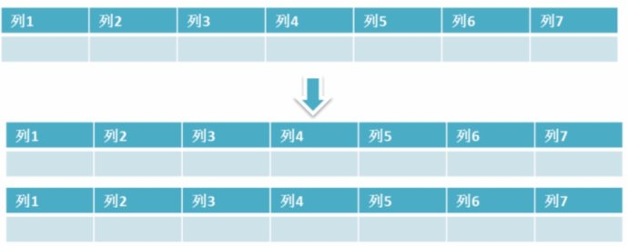
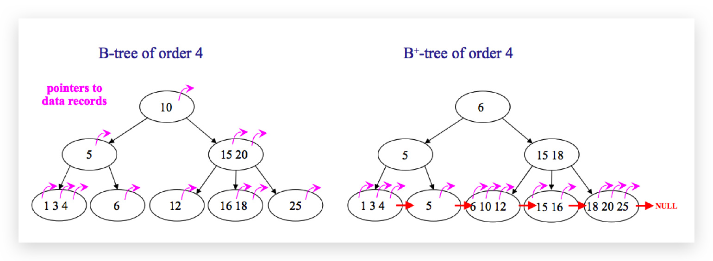
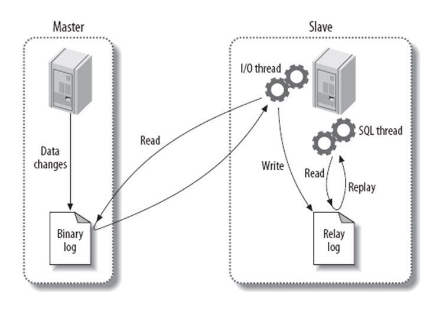

# 数据库

## 数据库范式

1. 第一范式

   数据库表中的每一列都是不可再分的原子项

   

2. 第二范式

   在第一范式的基础上，消除了非主属性堆码的部分依赖

   

3. 第三范式

   在第二范式的基础上，消除了传递依赖

   

## SQL语句执行顺序

### sql语句定义的顺序

```sql
(1) SELECT (2)DISTINCT<select_list>
(3) FROM <left_table>
(4) <join_type> JOIN <right_table>
(5) ON <join_condition>
(6) WHERE <where_condition>
(7) GROUP BY <group_by_list>
(8) WITH {CUBE|ROLLUP}
(9) HAVING <having_condition>
(10) ORDER BY <order_by_condition>
(11) LIMIT <limit_number>
12345678910
```

### sql语句执行顺序

```sql
(8) SELECT (9)DISTINCT<select_list>
(1) FROM <left_table>
(3) <join_type> JOIN <right_table>
(2)         ON <join_condition>
(4) WHERE <where_condition>
(5) GROUP BY <group_by_list>
(6) WITH {CUBE|ROLLUP}
(7) HAVING <having_condition>
(10) ORDER BY <order_by_list>
(11) LIMIT <limit_number>
12345678910
```

**可以看到，一共有十一个步骤，最先执行的是FROM操作，最后执行的是LIMIT操作。每个操作都会产生一个虚拟表，该虚拟表作为一个处理的输入，看下执行顺序：**
(1) FROM:对FROM子句中的左表`<left_table>`和右表`<right_table>`执行笛卡儿积，产生虚拟表VT1;
(2) ON: 对虚拟表VT1进行ON筛选，只有那些符合`<join_condition>`的行才被插入虚拟表VT2;
(3) JOIN: 如果指定了`OUTER JOIN`(如LEFT OUTER JOIN、RIGHT OUTER JOIN)，那么保留表中未匹配的行作为外部行添加到虚拟表VT2，产生虚拟表VT3。如果FROM子句包含两个以上的表，则对上一个连接生成的结果表VT3和下一个表重复执行步骤1~步骤3，直到处理完所有的表;
(4) WHERE: 对虚拟表VT3应用WHERE过滤条件，只有符合`<where_condition>`的记录才会被插入虚拟表VT4;
(5) GROUP By: 根据GROUP BY子句中的列，对VT4中的记录进行分组操作，产生VT5;
(6) CUBE|ROllUP: 对VT5进行CUBE或ROLLUP操作，产生表VT6;
(7) HAVING: 对虚拟表VT6应用HAVING过滤器，只有符合`<having_condition>`的记录才会被插入到VT7;
(8) SELECT: 第二次执行SELECT操作，选择指定的列，插入到虚拟表VT8中;
(9) DISTINCT: 去除重复，产生虚拟表VT9;
(10) ORDER BY: 将虚拟表VT9中的记录按照`<order_by_list>`进行排序操作，产生虚拟表VT10;
(11) LIMIT: 取出指定街行的记录，产生虚拟表VT11，并返回给查询用户

## MySQL

[MySQL数据库面试题（2020最新版）](https://blog.csdn.net/ThinkWon/article/details/104778621?utm_medium=distribute.pc_relevant_bbs_down.none-task--2~all~first_rank_v2~rank_v29-3.nonecase&depth_1-utm_source=distribute.pc_relevant_bbs_down.none-task--2~all~first_rank_v2~rank_v29-3.nonecase)


### 什么是MySQL?

MySQL 是一种关系型数据库，在Java企业级开发中非常常用，因为 MySQL 是开源免费的，并且方便扩展。阿里巴巴数据库系统也大量用到了 MySQL，因此它的稳定性是有保障的。MySQL是开放源代码的，因此任何人都可以在 GPL(General Public License) 的许可下下载并根据个性化的需要对其进行修改。MySQL的默认端口号是**3306**。


和其它数据库相比，MySQL有点与众不同，它的架构可以在多种不同场景中应用并发挥良好作用。主要体现在存储引擎的架构上，**插件式的存储引擎架构将查询处理和其它的系统任务以及数据的存储提取相分离**。这种架构可以根据业务的需求和实际需要选择合适的存储引擎。


- **连接层**：最上层是一些客户端和连接服务。**主要完成一些类似于连接处理、授权认证、及相关的安全方案**。在该层上引入了线程池的概念，为通过认证安全接入的客户端提供线程。同样在该层上可以实现基于SSL的安全链接。服务器也会为安全接入的每个客户端验证它所具有的操作权限。
- **服务层**：第二层服务层，主要完成大部分的核心服务功能， 包括查询解析、分析、优化、缓存、以及所有的内置函数，所有跨存储引擎的功能也都在这一层实现，包括触发器、存储过程、视图等
- **引擎层**：第三层存储引擎层，存储引擎真正的负责了MySQL中数据的存储和提取，服务器通过API与存储引擎进行通信。不同的存储引擎具有的功能不同，这样我们可以根据自己的实际需要进行选取
- **存储层**：第四层为数据存储层，主要是将数据存储在运行于该设备的文件系统之上，并完成与存储引擎的交互

> ❝
>
> 画出 MySQL 架构图，这种变态问题都能问的出来
>
> MySQL 的查询流程具体是？or  一条SQL语句在MySQL中如何执行的？

客户端请求 ---> 连接器（验证用户身份，给予权限）  ---> 查询缓存（存在缓存则直接返回，不存在则执行后续操作） ---> 分析器（对SQL进行词法分析和语法分析操作）  ---> 优化器（主要对执行的sql优化选择最优的执行方案方法）  ---> 执行器（执行时会先看用户是否有执行权限，有才去使用这个引擎提供的接口） ---> 去引擎层获取数据返回（如果开启查询缓存则会缓存查询结果）图：极客时间


### 存储引擎

#### 一些常用命令

**查看MySQL提供的所有存储引擎**

```sql
-- 查看支持的存储引擎
SHOW ENGINES

-- 查看默认存储引擎
SHOW VARIABLES LIKE 'storage_engine'

--查看具体某一个表所使用的存储引擎，这个默认存储引擎被修改了！
show create table tablename

--准确查看某个数据库中的某一表所使用的存储引擎
show table status like 'tablename'
show table status from database where name="tablename"
```


从上图我们可以查看出 MySQL 当前默认的存储引擎是InnoDB,并且在5.7版本所有的存储引擎中只有 InnoDB 是事务性存储引擎，也就是说只有 InnoDB 支持事务。

**查看MySQL当前默认的存储引擎**

我们也可以通过下面的命令查看默认的存储引擎。

```sql
mysql> show variables like '%storage_engine%';
```

**查看表的存储引擎**

```sql
show table status like "table_name" ;
```


#### MyISAM和InnoDB区别

MyISAM是MySQL的默认数据库引擎（5.5版之前）。虽然性能极佳，而且提供了大量的特性，包括全文索引、压缩、空间函数等，但MyISAM不支持事务和行级锁，而且最大的缺陷就是崩溃后无法安全恢复。不过，5.5版本之后，MySQL引入了InnoDB（事务性数据库引擎），MySQL 5.5版本后默认的存储引擎为InnoDB。

大多数时候我们使用的都是 InnoDB 存储引擎，但是在某些情况下使用 MyISAM 也是合适的比如读密集的情况下。（如果你不介意 MyISAM 崩溃恢复问题的话）。

**两者的对比：**

1. **是否支持行级锁** : MyISAM 只有表级锁(table-level locking)，而InnoDB 支持行级锁(row-level locking)和表级锁,默认为行级锁。
2. **是否支持事务和崩溃后的安全恢复： MyISAM** 强调的是性能，每次查询具有原子性,其执行速度比InnoDB类型更快，但是不提供事务支持。但是**InnoDB** 提供事务支持事务，外部键等高级数据库功能。 具有事务(commit)、回滚(rollback)和崩溃修复能力(crash recovery capabilities)的事务安全(transaction-safe (ACID compliant))型表。
3. **是否支持外键：** MyISAM不支持，而InnoDB支持。
4. **是否支持MVCC** ：仅 InnoDB 支持。应对高并发事务, MVCC比单纯的加锁更高效;MVCC只在 `READ COMMITTED` 和 `REPEATABLE READ` 两个隔离级别下工作;MVCC可以使用 乐观(optimistic)锁 和 悲观(pessimistic)锁来实现;各数据库中MVCC实现并不统一。推荐阅读：[MySQL-InnoDB-MVCC多版本并发控制](https://segmentfault.com/a/1190000012650596)
5. ......

《MySQL高性能》上面有一句话这样写到:

> 不要轻易相信“MyISAM比InnoDB快”之类的经验之谈，这个结论往往不是绝对的。在很多我们已知场景中，InnoDB的速度都可以让MyISAM望尘莫及，尤其是用到了聚簇索引，或者需要访问的数据都可以放入内存的应用。

一般情况下我们选择 InnoDB 都是没有问题的，但是某些情况下你并不在乎可扩展能力和并发能力，也不需要事务支持，也不在乎崩溃后的安全恢复问题的话，选择MyISAM也是一个不错的选择。但是一般情况下，我们都是需要考虑到这些问题的。

1. InnoDB 支持事务，MyISAM 不支持事务。这是 MySQL 将默认存储引擎从 MyISAM 变成 InnoDB 的重要原因之一；
2. InnoDB 支持外键，而 MyISAM 不支持。对一个包含外键的 InnoDB 表转为 MYISAM 会失败；
3. InnoDB 是聚簇索引，MyISAM 是非聚簇索引。聚簇索引的文件存放在主键索引的叶子节点上，因此 InnoDB 必须要有主键，通过主键索引效率很高。但是辅助索引需要两次查询，先查询到主键，然后再通过主键查询到数据。因此，主键不应该过大，因为主键太大，其他索引也都会很大。而 MyISAM 是非聚集索引，数据文件是分离的，索引保存的是数据文件的指针。主键索引和辅助索引是独立的。
4. InnoDB 不保存表的具体行数，执行`select count(*) from table` 时需要全表扫描。而 MyISAM 用一个变量保存了整个表的行数，执行上述语句时只需要读出该变量即可，速度很快；
5. InnoDB 最小的锁粒度是行锁，MyISAM 最小的锁粒度是表锁。一个更新语句会锁住整张表，导致其他查询和更新都会被阻塞，因此并发访问受限。这也是 MySQL 将默认存储引擎从 MyISAM 变成 InnoDB 的重要原因之一；

| 对比项   | MyISAM                                                   | InnoDB                                                       |
| :------- | :------------------------------------------------------- | :----------------------------------------------------------- |
| 主外键   | 不支持                                                   | 支持                                                         |
| 事务     | 不支持                                                   | 支持                                                         |
| 行表锁   | 表锁，即使操作一条记录也会锁住整个表，不适合高并发的操作 | 行锁,操作时只锁某一行，不对其它行有影响，适合高并发的操作    |
| 缓存     | 只缓存索引，不缓存真实数据                               | 不仅缓存索引还要缓存真实数据，对内存要求较高，而且内存大小对性能有决定性的影响 |
| 表空间   | 小                                                       | 大                                                           |
| 关注点   | 性能                                                     | 事务                                                         |
| 默认安装 | 是                                                       | 是                                                           |

> ❝
>
> 一张表，里面有ID自增主键，当insert了17条记录之后，删除了第15,16,17条记录，再把Mysql重启，再insert一条记录，这条记录的ID是18还是15 ？

如果表的类型是MyISAM，那么是18。因为MyISAM表会把自增主键的最大ID 记录到数据文件中，重启MySQL自增主键的最大ID也不会丢失；

如果表的类型是InnoDB，那么是15。因为InnoDB 表只是把自增主键的最大ID记录到内存中，所以重启数据库或对表进行OPTION操作，都会导致最大ID丢失。

> ❝
>
> 哪个存储引擎执行 select count(*) 更快，为什么?

MyISAM更快，因为MyISAM内部维护了一个计数器，可以直接调取。

- 在 MyISAM 存储引擎中，把表的总行数存储在磁盘上，当执行 select count(*) from t 时，直接返回总数据。
- 在 InnoDB 存储引擎中，跟 MyISAM 不一样，没有将总行数存储在磁盘上，当执行 select count(*) from t 时，会先把数据读出来，一行一行的累加，最后返回总数量。

InnoDB 中 count(*) 语句是在执行的时候，全表扫描统计总数量，所以当数据越来越大时，语句就越来越耗时了，为什么 InnoDB 引擎不像 MyISAM 引擎一样，将总行数存储到磁盘上？这跟 InnoDB 的事务特性有关，由于多版本并发控制（MVCC）的原因，InnoDB 表“应该返回多少行”也是不确定的。

### 字符集及校对规则

字符集指的是一种从二进制编码到某类字符符号的映射。校对规则则是指某种字符集下的排序规则。MySQL中每一种字符集都会对应一系列的校对规则。

MySQL采用的是类似继承的方式指定字符集的默认值，每个数据库以及每张数据表都有自己的默认值，他们逐层继承。比如：某个库中所有表的默认字符集将是该数据库所指定的字符集（这些表在没有指定字符集的情况下，才会采用默认字符集） PS：整理自《Java工程师修炼之道》

详细内容可以参考：   [MySQL字符集及校对规则的理解](https://www.cnblogs.com/geaozhang/p/6724393.html#MySQLyuzifuji)

### 索引

MySQL索引使用的数据结构主要有**BTree索引** 和 **哈希索引** 。对于哈希索引来说，底层的数据结构就是哈希表，因此在绝大多数需求为单条记录查询的时候，可以选择哈希索引，查询性能最快；其余大部分场景，建议选择BTree索引。

MySQL的BTree索引使用的是B树中的B+Tree，但对于主要的两种存储引擎的实现方式是不同的。

- **MyISAM:** B+Tree叶节点的data域存放的是数据记录的地址。在索引检索的时候，首先按照B+Tree搜索算法搜索索引，如果指定的Key存在，则取出其 data 域的值，然后以 data 域的值为地址读取相应的数据记录。这被称为“非聚簇索引”。
- **InnoDB:** 其数据文件本身就是索引文件。相比MyISAM，索引文件和数据文件是分离的，其表数据文件本身就是按B+Tree组织的一个索引结构，树的叶节点data域保存了完整的数据记录。这个索引的key是数据表的主键，因此InnoDB表数据文件本身就是主索引。这被称为“聚簇索引（或聚集索引）”。而其余的索引都作为辅助索引，辅助索引的data域存储相应记录主键的值而不是地址，这也是和MyISAM不同的地方。**在根据主索引搜索时，直接找到key所在的节点即可取出数据；在根据辅助索引查找时，则需要先取出主键的值，再走一遍主索引。** **因此，在设计表的时候，不建议使用过长的字段作为主键，也不建议使用非单调的字段作为主键，这样会造成主索引频繁分裂。** PS：整理自《Java工程师修炼之道》

**更多关于索引的内容可以查看文档首页MySQL目录下关于索引的详细总结。**

### 查询缓存的使用

> 执行查询语句的时候，会先查询缓存。不过，MySQL 8.0 版本后移除，因为这个功能不太实用

my.cnf加入以下配置，重启MySQL开启查询缓存

```properties
query_cache_type=1
query_cache_size=600000
```

MySQL执行以下命令也可以开启查询缓存

```properties
set global  query_cache_type=1;
set global  query_cache_size=600000;
```

如上，**开启查询缓存后在同样的查询条件以及数据情况下，会直接在缓存中返回结果**。这里的查询条件包括查询本身、当前要查询的数据库、客户端协议版本号等一些可能影响结果的信息。因此任何两个查询在任何字符上的不同都会导致缓存不命中。此外，如果查询中包含任何用户自定义函数、存储函数、用户变量、临时表、MySQL库中的系统表，其查询结果也不会被缓存。

缓存建立之后，MySQL的查询缓存系统会跟踪查询中涉及的每张表，如果这些表（数据或结构）发生变化，那么和这张表相关的所有缓存数据都将失效。

**缓存虽然能够提升数据库的查询性能，但是缓存同时也带来了额外的开销，每次查询后都要做一次缓存操作，失效后还要销毁。** 因此，开启缓存查询要谨慎，尤其对于写密集的应用来说更是如此。如果开启，要注意合理控制缓存空间大小，一般来说其大小设置为几十MB比较合适。此外，**还可以通过sql_cache和sql_no_cache来控制某个查询语句是否需要缓存：**

```sql
select sql_no_cache count(*) from usr;
```

### 什么是事务?

**事务是逻辑上的一组操作，要么都执行，要么都不执行。**

事务最经典也经常被拿出来说例子就是转账了。假如小明要给小红转账1000元，这个转账会涉及到两个关键操作就是：将小明的余额减少1000元，将小红的余额增加1000元。万一在这两个操作之间突然出现错误比如银行系统崩溃，导致小明余额减少而小红的余额没有增加，这样就不对了。事务就是保证这两个关键操作要么都成功，要么都要失败。

### 事物的四大特性(ACID)


1. **原子性（Atomicity）：** 事务是最小的执行单位，不允许分割。事务的原子性确保动作要么全部完成，要么完全不起作用；
2. **一致性（Consistency）：** 执行事务前后，数据保持一致，多个事务对同一个数据读取的结果是相同的；
3. **隔离性（Isolation）：** 并发访问数据库时，一个用户的事务不被其他事务所干扰，各并发事务之间数据库是独立的；
4. **持久性（Durability）：** 一个事务被提交之后。它对数据库中数据的改变是持久的，即使数据库发生故障也不应该对其有任何影响。

###  并发事务带来哪些问题?

在典型的应用程序中，多个事务并发运行，经常会操作相同的数据来完成各自的任务（多个用户对同一数据进行操作）。并发虽然是必须的，但可能会导致以下的问题。

- **脏读（Dirty read）:** 当一个事务正在访问数据并且对数据进行了修改，而这种修改还没有提交到数据库中，这时另外一个事务也访问了这个数据，然后使用了这个数据。因为这个数据是还没有提交的数据，那么另外一个事务读到的这个数据是“脏数据”，依据“脏数据”所做的操作可能是不正确的。
- **丢失修改（Lost to modify）:** 指在一个事务读取一个数据时，另外一个事务也访问了该数据，那么在第一个事务中修改了这个数据后，第二个事务也修改了这个数据。这样第一个事务内的修改结果就被丢失，因此称为丢失修改。	例如：事务1读取某表中的数据A=20，事务2也读取A=20，事务1修改A=A-1，事务2也修改A=A-1，最终结果A=19，事务1的修改被丢失。
- **不可重复读（Unrepeatableread）:** 指在一个事务内多次读同一数据。在这个事务还没有结束时，另一个事务也访问该数据。那么，在第一个事务中的两次读数据之间，由于第二个事务的修改导致第一个事务两次读取的数据可能不太一样。这就发生了在一个事务内两次读到的数据是不一样的情况，因此称为不可重复读。
- **幻读（Phantom read）:** 幻读与不可重复读类似。它发生在一个事务（T1）读取了几行数据，接着另一个并发事务（T2）插入了一些数据时。在随后的查询中，第一个事务（T1）就会发现多了一些原本不存在的记录，就好像发生了幻觉一样，所以称为幻读。

**不可重复读和幻读区别：**

不可重复读的重点是修改比如多次读取一条记录发现其中某些列的值被修改，幻读的重点在于新增或者删除比如多次读取一条记录发现记录增多或减少了。

###  事务隔离级别有哪些?MySQL的默认隔离级别是?

**SQL 标准定义了四个隔离级别：**

- **READ-UNCOMMITTED(读取未提交)：** 最低的隔离级别，允许读取尚未提交的数据变更，**可能会导致脏读、幻读或不可重复读**。
- **READ-COMMITTED(读取已提交)：** 允许读取并发事务已经提交的数据，**可以阻止脏读，但是幻读或不可重复读仍有可能发生**。
- **REPEATABLE-READ(可重复读)：**  对同一字段的多次读取结果都是一致的，除非数据是被本身事务自己所修改，**可以阻止脏读和不可重复读，但幻读仍有可能发生**。
- **SERIALIZABLE(可串行化)：** 最高的隔离级别，完全服从ACID的隔离级别。所有的事务依次逐个执行，这样事务之间就完全不可能产生干扰，也就是说，**该级别可以防止脏读、不可重复读以及幻读**。

------

|     隔离级别     | 脏读 | 不可重复读 | 幻影读 |
| :--------------: | :--: | :--------: | :----: |
| READ-UNCOMMITTED |  √   |     √      |   √    |
|  READ-COMMITTED  |  ×   |     √      |   √    |
| REPEATABLE-READ  |  ×   |     ×      |   √    |
|   SERIALIZABLE   |  ×   |     ×      |   ×    |

MySQL InnoDB 存储引擎的默认支持的隔离级别是 **REPEATABLE-READ（可重读）**。我们可以通过`SELECT @@tx_isolation;`命令来查看

```sql
mysql> SELECT @@tx_isolation;
+-----------------+
| @@tx_isolation  |
+-----------------+
| REPEATABLE-READ |
+-----------------+
```

这里需要注意的是：与 SQL 标准不同的地方在于 InnoDB 存储引擎在 **REPEATABLE-READ（可重读）** 
事务隔离级别下使用的是Next-Key Lock 锁算法，因此可以避免幻读的产生，这与其他数据库系统(如 SQL Server)
是不同的。所以说InnoDB 存储引擎的默认支持的隔离级别是 **REPEATABLE-READ（可重读）** 已经可以完全保证事务的隔离性要求，即达到了
 SQL标准的 **SERIALIZABLE(可串行化)** 隔离级别。因为隔离级别越低，事务请求的锁越少，所以大部分数据库系统的隔离级别都是 **READ-COMMITTED(读取提交内容)** ，但是你要知道的是InnoDB 存储引擎默认使用 **REPEAaTABLE-READ（可重读）** 并不会有任何性能损失。

InnoDB 存储引擎在 **分布式事务** 的情况下一般会用到 **SERIALIZABLE(可串行化)** 隔离级别。

###  锁机制与InnoDB锁算法

**MyISAM和InnoDB存储引擎使用的锁：**

- MyISAM采用表级锁(table-level locking)。
- InnoDB支持行级锁(row-level locking)和表级锁,默认为行级锁

**表级锁和行级锁对比：**

- **表级锁：** MySQL中锁定 **粒度最大** 的一种锁，对当前操作的整张表加锁，实现简单，资源消耗也比较少，加锁快，不会出现死锁。其锁定粒度最大，触发锁冲突的概率最高，并发度最低，MyISAM和 InnoDB引擎都支持表级锁。
- **行级锁：** MySQL中锁定 **粒度最小** 的一种锁，只针对当前操作的行进行加锁。 行级锁能大大减少数据库操作的冲突。其加锁粒度最小，并发度高，但加锁的开销也最大，加锁慢，会出现死锁。 

详细内容可以参考： MySQL锁机制简单了解一下：[https://blog.csdn.net/qq_34337272/article/details/80611486](https://blog.csdn.net/qq_34337272/article/details/80611486)

**InnoDB存储引擎的锁的算法有三种：**

- Record lock：单个行记录上的锁
- Gap lock：间隙锁，锁定一个范围，不包括记录本身
- Next-key lock：record+gap 锁定一个范围，包含记录本身

**相关知识点：**

1. innodb对于行的查询使用next-key lock
2. Next-locking keying为了解决Phantom Problem幻读问题
3. 当查询的索引含有唯一属性时，将next-key lock降级为record key
4. Gap锁设计的目的是为了阻止多个事务将记录插入到同一范围内，而这会导致幻读问题的产生
5. 有两种方式显式关闭gap锁：（除了外键约束和唯一性检查外，其余情况仅使用record lock） A. 将事务隔离级别设置为RC B. 将参数innodb_locks_unsafe_for_binlog设置为1

###  大表优化

当MySQL单表记录数过大时，数据库的CRUD性能会明显下降，一些常见的优化措施如下：

####  限定数据的范围

务必禁止不带任何限制数据范围条件的查询语句。比如：我们当用户在查询订单历史的时候，我们可以控制在一个月的范围内；

#### 读/写分离

经典的数据库拆分方案，主库负责写，从库负责读；

#### 垂直分区

 **根据数据库里面数据表的相关性进行拆分。** 例如，用户表中既有用户的登录信息又有用户的基本信息，可以将用户表拆分成两个单独的表，甚至放到单独的库做分库。

 **简单来说垂直拆分是指数据表列的拆分，把一张列比较多的表拆分为多张表。** 如下图所示，这样来说大家应该就更容易理解了。
 

- **垂直拆分的优点：** 可以使得列数据变小，在查询时减少读取的Block数，减少I/O次数。此外，垂直分区可以简化表的结构，易于维护。
- **垂直拆分的缺点：** 主键会出现冗余，需要管理冗余列，并会引起Join操作，可以通过在应用层进行Join来解决。此外，垂直分区会让事务变得更加复杂；

#### 水平分区

**保持数据表结构不变，通过某种策略存储数据分片。这样每一片数据分散到不同的表或者库中，达到了分布式的目的。 水平拆分可以支撑非常大的数据量。** 

 水平拆分是指数据表行的拆分，表的行数超过200万行时，就会变慢，这时可以把一张的表的数据拆成多张表来存放。举个例子：我们可以将用户信息表拆分成多个用户信息表，这样就可以避免单一表数据量过大对性能造成影响。



水平拆分可以支持非常大的数据量。需要注意的一点是：分表仅仅是解决了单一表数据过大的问题，但由于表的数据还是在同一台机器上，其实对于提升MySQL并发能力没有什么意义，所以 **水平拆分最好分库** 。

水平拆分能够 **支持非常大的数据量存储，应用端改造也少**，但 **分片事务难以解决**  ，跨节点Join性能较差，逻辑复杂。《Java工程师修炼之道》的作者推荐 **尽量不要对数据进行分片，因为拆分会带来逻辑、部署、运维的各种复杂度** ，一般的数据表在优化得当的情况下支撑千万以下的数据量是没有太大问题的。如果实在要分片，尽量选择客户端分片架构，这样可以减少一次和中间件的网络I/O。

**下面补充一下数据库分片的两种常见方案：**

- **客户端代理：**  **分片逻辑在应用端，封装在jar包中，通过修改或者封装JDBC层来实现。** 当当网的 **Sharding-JDBC** 、阿里的TDDL是两种比较常用的实现。
- **中间件代理：** **在应用和数据中间加了一个代理层。分片逻辑统一维护在中间件服务中。** 我们现在谈的 **Mycat** 、360的Atlas、网易的DDB等等都是这种架构的实现。

详细内容可以参考： MySQL大表优化方案: [https://segmentfault.com/a/1190000006158186](https://segmentfault.com/a/1190000006158186)

###  解释一下什么是池化设计思想。什么是数据库连接池?为什么需要数据库连接池?

池化设计应该不是一个新名词。我们常见的如java线程池、jdbc连接池、redis连接池等就是这类设计的代表实现。这种设计会初始预设资源，解决的问题就是抵消每次获取资源的消耗，如创建线程的开销，获取远程连接的开销等。就好比你去食堂打饭，打饭的大妈会先把饭盛好几份放那里，你来了就直接拿着饭盒加菜即可，不用再临时又盛饭又打菜，效率就高了。除了初始化资源，池化设计还包括如下这些特征：池子的初始值、池子的活跃值、池子的最大值等，这些特征可以直接映射到java线程池和数据库连接池的成员属性中。这篇文章对[池化设计思想](https://mp.weixin.qq.com/s?__biz=Mzg2OTA0Njk0OA==&mid=2247485679&idx=1&sn=57dbca8c9ad49e1f3968ecff04a4f735&chksm=cea24724f9d5ce3212292fac291234a760c99c0960b5430d714269efe33554730b5f71208582&token=1141994790&lang=zh_CN#rd)介绍的还不错，直接复制过来，避免重复造轮子了。

数据库连接本质就是一个 socket 的连接。数据库服务端还要维护一些缓存和用户权限信息之类的 所以占用了一些内存。我们可以把数据库连接池是看做是维护的数据库连接的缓存，以便将来需要对数据库的请求时可以重用这些连接。为每个用户打开和维护数据库连接，尤其是对动态数据库驱动的网站应用程序的请求，既昂贵又浪费资源。**在连接池中，创建连接后，将其放置在池中，并再次使用它，因此不必建立新的连接。如果使用了所有连接，则会建立一个新连接并将其添加到池中。 **连接池还减少了用户必须等待建立与数据库的连接的时间。

### 分库分表之后,id 主键如何处理？

因为要是分成多个表之后，每个表都是从 1 开始累加，这样是不对的，我们需要一个全局唯一的 id 来支持。

生成全局 id 有下面这几种方式：

- **UUID**：不适合作为主键，因为太长了，并且无序不可读，查询效率低。比较适合用于生成唯一的名字的标示比如文件的名字。
- **数据库自增 id** : 两台数据库分别设置不同步长，生成不重复ID的策略来实现高可用。这种方式生成的 id 有序，但是需要独立部署数据库实例，成本高，还会有性能瓶颈。
- **利用 redis 生成 id :** 性能比较好，灵活方便，不依赖于数据库。但是，引入了新的组件造成系统更加复杂，可用性降低，编码更加复杂，增加了系统成本。
- **Twitter的snowflake算法** ：Github 地址：https://github.com/twitter-archive/snowflake。
- **美团的[Leaf](https://tech.meituan.com/2017/04/21/mt-leaf.html)分布式ID生成系统** ：Leaf 是美团开源的分布式ID生成器，能保证全局唯一性、趋势递增、单调递增、信息安全，里面也提到了几种分布式方案的对比，但也需要依赖关系数据库、Zookeeper等中间件。感觉还不错。美团技术团队的一篇文章：https://tech.meituan.com/2017/04/21/mt-leaf.html 。
- ......

###  一条SQL语句在MySQL中如何执行的

[一条SQL语句在MySQL中如何执行的](<https://mp.weixin.qq.com/s?__biz=Mzg2OTA0Njk0OA==&mid=2247485097&idx=1&sn=84c89da477b1338bdf3e9fcd65514ac1&chksm=cea24962f9d5c074d8d3ff1ab04ee8f0d6486e3d015cfd783503685986485c11738ccb542ba7&token=79317275&lang=zh_CN#rd>)

###  MySQL高性能优化规范建议

[MySQL高性能优化规范建议](<https://mp.weixin.qq.com/s?__biz=Mzg2OTA0Njk0OA==&mid=2247485117&idx=1&sn=92361755b7c3de488b415ec4c5f46d73&chksm=cea24976f9d5c060babe50c3747616cce63df5d50947903a262704988143c2eeb4069ae45420&token=79317275&lang=zh_CN#rd>)

### 一条SQL语句执行得很慢的原因有哪些？

[腾讯面试：一条SQL语句执行得很慢的原因有哪些？---不看后悔系列](https://mp.weixin.qq.com/s?__biz=Mzg2OTA0Njk0OA==&mid=2247485185&idx=1&sn=66ef08b4ab6af5757792223a83fc0d45&chksm=cea248caf9d5c1dc72ec8a281ec16aa3ec3e8066dbb252e27362438a26c33fbe842b0e0adf47&token=79317275&lang=zh_CN#rd)

### 后端程序员必备：书写高质量SQL的30条建议

[后端程序员必备：书写高质量SQL的30条建议](https://mp.weixin.qq.com/s?__biz=Mzg2OTA0Njk0OA==&mid=2247486461&idx=1&sn=60a22279196d084cc398936fe3b37772&chksm=cea24436f9d5cd20a4fa0e907590f3e700d7378b3f608d7b33bb52cfb96f503b7ccb65a1deed&token=1987003517&lang=zh_CN#rd)


## 数据库基础知识

### 为什么要使用数据库

**数据保存在内存**

优点： 存取速度快

缺点： 数据不能永久保存

**数据保存在文件**

优点： 数据永久保存

缺点：1）速度比内存操作慢，频繁的IO操作。2）查询数据不方便

**数据保存在数据库**

1）数据永久保存

2）使用SQL语句，查询方便效率高。

3）管理数据方便

### 什么是SQL？

结构化查询语言(Structured Query Language)简称SQL，是一种数据库查询语言。

作用：用于存取数据、查询、更新和管理关系数据库系统。

### 什么是MySQL?

MySQL是一个关系型数据库管理系统，由瑞典MySQL AB 公司开发，属于 Oracle 旗下产品。MySQL 是最流行的关系型数据库管理系统之一，在 WEB 应用方面，MySQL是最好的 RDBMS (Relational Database Management System，关系数据库管理系统) 应用软件之一。在Java企业级开发中非常常用，因为 MySQL 是开源免费的，并且方便扩展。

### 数据库三大范式是什么

第一范式：每个列都不可以再拆分。

第二范式：在第一范式的基础上，非主键列完全依赖于主键，而不能是依赖于主键的一部分。

第三范式：在第二范式的基础上，非主键列只依赖于主键，不依赖于其他非主键。

在设计数据库结构的时候，要尽量遵守三范式，如果不遵守，必须有足够的理由。比如性能。事实上我们经常会为了性能而妥协数据库的设计。

### mysql有关权限的表都有哪几个

MySQL服务器通过权限表来控制用户对数据库的访问，权限表存放在mysql数据库里，由mysql_install_db脚本初始化。这些权限表分别user，db，table_priv，columns_priv和host。下面分别介绍一下这些表的结构和内容：

- user权限表：记录允许连接到服务器的用户帐号信息，里面的权限是全局级的。
- db权限表：记录各个帐号在各个数据库上的操作权限。
- table_priv权限表：记录数据表级的操作权限。
- columns_priv权限表：记录数据列级的操作权限。
- host权限表：配合db权限表对给定主机上数据库级操作权限作更细致的控制。这个权限表不受GRANT和REVOKE语句的影响。

### MySQL的binlog有有几种录入格式？分别有什么区别？

有三种格式，statement，row和mixed。

- statement模式下，每一条会修改数据的sql都会记录在binlog中。不需要记录每一行的变化，减少了binlog日志量，节约了IO，提高性能。由于sql的执行是有上下文的，因此在保存的时候需要保存相关的信息，同时还有一些使用了函数之类的语句无法被记录复制。
- row级别下，不记录sql语句上下文相关信息，仅保存哪条记录被修改。记录单元为每一行的改动，基本是可以全部记下来但是由于很多操作，会导致大量行的改动(比如alter table)，因此这种模式的文件保存的信息太多，日志量太大。
- mixed，一种折中的方案，普通操作使用statement记录，当无法使用statement的时候使用row。

此外，新版的MySQL中对row级别也做了一些优化，当表结构发生变化的时候，会记录语句而不是逐行记录。

## 数据类型

### mysql有哪些数据类型

| **分类**             | **类型名称** | **说明**                                                     |
| -------------------- | ------------ | ------------------------------------------------------------ |
| **整数类型**         | tinyInt      | 很小的整数(8位二进制)                                        |
|                      | smallint     | 小的整数(16位二进制)                                         |
|                      | mediumint    | 中等大小的整数(24位二进制)                                   |
|                      | int(integer) | 普通大小的整数(32位二进制)                                   |
| **小数类型**         | float        | 单精度浮点数                                                 |
|                      | double       | 双精度浮点数                                                 |
|                      | decimal(m,d) | 压缩严格的定点数                                             |
| **日期类型**         | year         | YYYY 1901~2155                                               |
|                      | time         | HH:MM:SS -838:59:59~838:59:59                                |
|                      | date         | YYYY-MM-DD 1000-01-01~9999-12-3                              |
|                      | datetime     | YYYY-MM-DD HH:MM:SS 1000-01-01 00:00:00~ 9999-12-31 23:59:59 |
|                      | timestamp    | YYYY-MM-DD HH:MM:SS 19700101 00:00:01 UTC~2038-01-19 03:14:07UTC |
| **文本、二进制类型** | CHAR(M)      | M为0~255之间的整数                                           |
|                      | VARCHAR(M)   | M为0~65535之间的整数                                         |
|                      | TINYBLOB     | 允许长度0~255字节                                            |
|                      | BLOB         | 允许长度0~65535字节                                          |
|                      | MEDIUMBLOB   | 允许长度0~167772150字节                                      |
|                      | LONGBLOB     | 允许长度0~4294967295字节                                     |
|                      | TINYTEXT     | 允许长度0~255字节                                            |
|                      | TEXT         | 允许长度0~65535字节                                          |
|                      | MEDIUMTEXT   | 允许长度0~167772150字节                                      |
|                      | LONGTEXT     | 允许长度0~4294967295字节                                     |
|                      | VARBINARY(M) | 允许长度0~M个字节的变长字节字符串                            |
|                      | BINARY(M)    | 允许长度0~M个字节的定长字节字符串                            |

- `1、整数类型`，包括TINYINT、SMALLINT、MEDIUMINT、INT、BIGINT，分别表示1字节、2字节、3字节、4字节、8字节整数。任何整数类型都可以加上UNSIGNED属性，表示数据是无符号的，即非负整数。
  `长度`：整数类型可以被指定长度，例如：INT(11)表示长度为11的INT类型。长度在大多数场景是没有意义的，它不会限制值的合法范围，只会影响显示字符的个数，而且需要和UNSIGNED ZEROFILL属性配合使用才有意义。
  `例子`，假定类型设定为INT(5)，属性为UNSIGNED ZEROFILL，如果用户插入的数据为12的话，那么数据库实际存储数据为00012。

- `2、实数类型`，包括FLOAT、DOUBLE、DECIMAL。
  DECIMAL可以用于存储比BIGINT还大的整型，能存储精确的小数。
  而FLOAT和DOUBLE是有取值范围的，并支持使用标准的浮点进行近似计算。
  计算时FLOAT和DOUBLE相比DECIMAL效率更高一些，DECIMAL你可以理解成是用字符串进行处理。

- `3、字符串类型`，包括VARCHAR、CHAR、TEXT、BLOB
  VARCHAR用于存储可变长字符串，它比定长类型更节省空间。
  VARCHAR使用额外1或2个字节存储字符串长度。列长度小于255字节时，使用1字节表示，否则使用2字节表示。
  VARCHAR存储的内容超出设置的长度时，内容会被截断。
  CHAR是定长的，根据定义的字符串长度分配足够的空间。
  CHAR会根据需要使用空格进行填充方便比较。
  CHAR适合存储很短的字符串，或者所有值都接近同一个长度。
  CHAR存储的内容超出设置的长度时，内容同样会被截断。

  **使用策略：**
  对于经常变更的数据来说，CHAR比VARCHAR更好，因为CHAR不容易产生碎片。
  对于非常短的列，CHAR比VARCHAR在存储空间上更有效率。
  使用时要注意只分配需要的空间，更长的列排序时会消耗更多内存。
  尽量避免使用TEXT/BLOB类型，查询时会使用临时表，导致严重的性能开销。

- `4、枚举类型（ENUM）`，把不重复的数据存储为一个预定义的集合。
  有时可以使用ENUM代替常用的字符串类型。
  ENUM存储非常紧凑，会把列表值压缩到一个或两个字节。
  ENUM在内部存储时，其实存的是整数。
  尽量避免使用数字作为ENUM枚举的常量，因为容易混乱。
  排序是按照内部存储的整数

- `5、日期和时间类型`，尽量使用timestamp，空间效率高于datetime，
  用整数保存时间戳通常不方便处理。
  如果需要存储微妙，可以使用bigint存储。
  看到这里，这道真题是不是就比较容易回答了。

## 引擎

### MySQL存储引擎MyISAM与InnoDB区别

存储引擎Storage engine：MySQL中的数据、索引以及其他对象是如何存储的，是一套文件系统的实现。

常用的存储引擎有以下：

- **Innodb引擎**：Innodb引擎提供了对数据库ACID事务的支持。并且还提供了行级锁和外键的约束。它的设计的目标就是处理大数据容量的数据库系统。
- **MyIASM引擎**(原本Mysql的默认引擎)：不提供事务的支持，也不支持行级锁和外键。
- **MEMORY引擎**：所有的数据都在内存中，数据的处理速度快，但是安全性不高。

**MyISAM与InnoDB区别**

|                                                              | MyISAM                                                       | Innodb                                                       |
| ------------------------------------------------------------ | ------------------------------------------------------------ | ------------------------------------------------------------ |
| 存储结构                                                     | 每张表被存放在三个文件：frm-表格定义、MYD(MYData)-数据文件、MYI(MYIndex)-索引文件 | 所有的表都保存在同一个数据文件中（也可能是多个文件，或者是独立的表空间文件），InnoDB表的大小只受限于操作系统文件的大小，一般为2GB |
| 存储空间                                                     | MyISAM可被压缩，存储空间较小                                 | InnoDB的表需要更多的内存和存储，它会在主内存中建立其专用的缓冲池用于高速缓冲数据和索引 |
| 可移植性、备份及恢复                                         | 由于MyISAM的数据是以文件的形式存储，所以在跨平台的数据转移中会很方便。在备份和恢复时可单独针对某个表进行操作 | 免费的方案可以是拷贝数据文件、备份 binlog，或者用 mysqldump，在数据量达到几十G的时候就相对痛苦了 |
| 文件格式                                                     | 数据和索引是分别存储的，数据`.MYD`，索引`.MYI`               | 数据和索引是集中存储的，`.ibd`                               |
| 记录存储顺序                                                 | 按记录插入顺序保存                                           | 按主键大小有序插入                                           |
| 外键                                                         | 不支持                                                       | 支持                                                         |
| 事务                                                         | 不支持                                                       | 支持                                                         |
| 锁支持（锁是避免资源争用的一个机制，MySQL锁对用户几乎是透明的） | 表级锁定                                                     | 行级锁定、表级锁定，锁定力度小并发能力高                     |
| SELECT                                                       | MyISAM更优                                                   |                                                              |
| INSERT、UPDATE、DELETE                                       |                                                              | InnoDB更优                                                   |
| select count(*)                                              | myisam更快，因为myisam内部维护了一个计数器，可以直接调取。   |                                                              |
| 索引的实现方式                                               | B+树索引，myisam 是堆表                                      | B+树索引，Innodb 是索引组织表                                |
| 哈希索引                                                     | 不支持                                                       | 支持                                                         |
| 全文索引                                                     | 支持                                                         | 不支持                                                       |

### MyISAM索引与InnoDB索引的区别？

- InnoDB索引是聚簇索引，MyISAM索引是非聚簇索引。
- InnoDB的主键索引的叶子节点存储着行数据，因此主键索引非常高效。
- MyISAM索引的叶子节点存储的是行数据地址，需要再寻址一次才能得到数据。
- InnoDB非主键索引的叶子节点存储的是主键和其他带索引的列数据，因此查询时做到覆盖索引会非常高效。

### InnoDB引擎的4大特性

- 插入缓冲（insert buffer)
- 二次写(double write)
- 自适应哈希索引(ahi)
- 预读(read ahead)

### 存储引擎选择

如果没有特别的需求，使用默认的`Innodb`即可。

MyISAM：以读写插入为主的应用程序，比如博客系统、新闻门户网站。

Innodb：更新（删除）操作频率也高，或者要保证数据的完整性；并发量高，支持事务和外键。比如OA自动化办公系统。

## 索引

### 什么是索引？

索引是一种特殊的文件(InnoDB数据表上的索引是表空间的一个组成部分)，它们包含着对数据表里所有记录的引用指针。

索引是一种数据结构。数据库索引，是数据库管理系统中一个排序的数据结构，以协助快速查询、更新数据库表中数据。索引的实现通常使用B树及其变种B+树。

更通俗的说，索引就相当于目录。为了方便查找书中的内容，通过对内容建立索引形成目录。索引是一个文件，它是要占据物理空间的。

### 索引有哪些优缺点？

索引的优点

- 可以大大加快数据的检索速度，这也是创建索引的最主要的原因。
- 通过使用索引，可以在查询的过程中，使用优化隐藏器，提高系统的性能。

索引的缺点

- 时间方面：创建索引和维护索引要耗费时间，具体地，当对表中的数据进行增加、删除和修改的时候，索引也要动态的维护，会降低增/改/删的执行效率；
- 空间方面：索引需要占物理空间。

### 索引使用场景（重点）

where


上图中，根据`id`查询记录，因为`id`字段仅建立了主键索引，因此此SQL执行可选的索引只有主键索引，如果有多个，最终会选一个较优的作为检索的依据。

```sql
-- 增加一个没有建立索引的字段
alter table innodb1 add sex char(1);
-- 按sex检索时可选的索引为null
EXPLAIN SELECT * from innodb1 where sex='男';
1234
```


> 可以尝试在一个字段未建立索引时，根据该字段查询的效率，然后对该字段建立索引（`alter table 表名 add index(字段名)`），同样的SQL执行的效率，你会发现查询效率会有明显的提升（数据量越大越明显）。

order by

当我们使用`order by`将查询结果按照某个字段排序时，如果该字段没有建立索引，那么执行计划会将查询出的所有数据使用外部排序（将数据从硬盘分批读取到内存使用内部排序，最后合并排序结果），这个操作是很影响性能的，因为需要将查询涉及到的所有数据从磁盘中读到内存（如果单条数据过大或者数据量过多都会降低效率），更无论读到内存之后的排序了。

但是如果我们对该字段建立索引`alter table 表名 add index(字段名)`，那么由于索引本身是有序的，因此直接按照索引的顺序和映射关系逐条取出数据即可。而且如果分页的，那么只用**取出索引表某个范围内的索引对应的数据**，而不用像上述那**取出所有数据**进行排序再返回某个范围内的数据。（从磁盘取数据是最影响性能的）

join

> 对`join`语句匹配关系（`on`）涉及的字段建立索引能够提高效率

索引覆盖

如果要查询的字段都建立过索引，那么引擎会直接在索引表中查询而不会访问原始数据（否则只要有一个字段没有建立索引就会做全表扫描），这叫索引覆盖。因此我们需要尽可能的在`select`后只写必要的查询字段，以增加索引覆盖的几率。

这里值得注意的是不要想着为每个字段建立索引，因为优先使用索引的优势就在于其体积小。

### 索引有哪几种类型？

**主键索引:** 数据列不允许重复，不允许为NULL，一个表只能有一个主键。

**唯一索引:** 数据列不允许重复，允许为NULL值，一个表允许多个列创建唯一索引。

- 可以通过 `ALTER TABLE table_name ADD UNIQUE (column);` 创建唯一索引
- 可以通过 `ALTER TABLE table_name ADD UNIQUE (column1,column2);` 创建唯一组合索引

**普通索引:** 基本的索引类型，没有唯一性的限制，允许为NULL值。

- 可以通过`ALTER TABLE table_name ADD INDEX index_name (column);`创建普通索引
- 可以通过`ALTER TABLE table_name ADD INDEX index_name(column1, column2, column3);`创建组合索引

**全文索引：** 是目前搜索引擎使用的一种关键技术。

- 可以通过`ALTER TABLE table_name ADD FULLTEXT (column);`创建全文索引

### 索引的数据结构（b树，hash）

索引的数据结构和具体存储引擎的实现有关，在MySQL中使用较多的索引有**Hash索引**，**B+树索引**等，而我们经常使用的InnoDB存储引擎的默认索引实现为：B+树索引。对于哈希索引来说，底层的数据结构就是哈希表，因此在绝大多数需求为单条记录查询的时候，可以选择哈希索引，查询性能最快；其余大部分场景，建议选择BTree索引。

1）B树索引

mysql通过存储引擎取数据，基本上90%的人用的就是InnoDB了，按照实现方式分，InnoDB的索引类型目前只有两种：BTREE（B树）索引和HASH索引。B树索引是Mysql数据库中使用最频繁的索引类型，基本所有存储引擎都支持BTree索引。通常我们说的索引不出意外指的就是（B树）索引（实际是用B+树实现的，因为在查看表索引时，mysql一律打印BTREE，所以简称为B树索引）


查询方式：

主键索引区:PI(关联保存的时数据的地址)按主键查询,

普通索引区:si(关联的id的地址,然后再到达上面的地址)。所以按主键查询,速度最快

B+tree性质：

1.）n棵子tree的节点包含n个关键字，不用来保存数据而是保存数据的索引。

2.）所有的叶子结点中包含了全部关键字的信息，及指向含这些关键字记录的指针，且叶子结点本身依关键字的大小自小而大顺序链接。

3.）所有的非终端结点可以看成是索引部分，结点中仅含其子树中的最大（或最小）关键字。

4.）B+ 树中，数据对象的插入和删除仅在叶节点上进行。

5.）B+树有2个头指针，一个是树的根节点，一个是最小关键码的叶节点。

2）哈希索引

简要说下，类似于数据结构中简单实现的HASH表（散列表）一样，当我们在mysql中用哈希索引时，主要就是通过Hash算法（常见的Hash算法有直接定址法、平方取中法、折叠法、除数取余法、随机数法），将数据库字段数据转换成定长的Hash值，与这条数据的行指针一并存入Hash表的对应位置；如果发生Hash碰撞（两个不同关键字的Hash值相同），则在对应Hash键下以链表形式存储。当然这只是简略模拟图。


### 索引的基本原理

索引用来快速地寻找那些具有特定值的记录。如果没有索引，一般来说执行查询时遍历整张表。

索引的原理很简单，就是把无序的数据变成有序的查询

1. 把创建了索引的列的内容进行排序
2. 对排序结果生成倒排表
3. 在倒排表内容上拼上数据地址链
4. 在查询的时候，先拿到倒排表内容，再取出数据地址链，从而拿到具体数据

### 索引算法有哪些？

索引算法有 BTree算法和Hash算法

**BTree算法**

BTree是最常用的mysql数据库索引算法，也是mysql默认的算法。因为它不仅可以被用在=,>,>=,<,<=和between这些比较操作符上，而且还可以用于like操作符，只要它的查询条件是一个不以通配符开头的常量， 例如：

```sql
-- 只要它的查询条件是一个不以通配符开头的常量
select * from user where name like 'jack%'; 
-- 如果一通配符开头，或者没有使用常量，则不会使用索引，例如： 
select * from user where name like '%jack'; 
1234
```

**Hash算法**

Hash Hash索引只能用于对等比较，例如=,<=>（相当于=）操作符。由于是一次定位数据，不像BTree索引需要从根节点到枝节点，最后才能访问到页节点这样多次IO访问，所以检索效率远高于BTree索引。

### 索引设计的原则？

1. 适合索引的列是出现在where子句中的列，或者连接子句中指定的列
2. 基数较小的类，索引效果较差，没有必要在此列建立索引
3. 使用短索引，如果对长字符串列进行索引，应该指定一个前缀长度，这样能够节省大量索引空间
4. 不要过度索引。索引需要额外的磁盘空间，并降低写操作的性能。在修改表内容的时候，索引会进行更新甚至重构，索引列越多，这个时间就会越长。所以只保持需要的索引有利于查询即可。

### 创建索引的原则（重中之重）

索引虽好，但也不是无限制的使用，最好符合一下几个原则

1） 最左前缀匹配原则，组合索引非常重要的原则，mysql会一直向右匹配直到遇到范围查询(>、<、between、like)就停止匹配，比如a = 1 and b = 2 and c > 3 and d = 4 如果建立(a,b,c,d)顺序的索引，d是用不到索引的，如果建立(a,b,d,c)的索引则都可以用到，a,b,d的顺序可以任意调整。

2）较频繁作为查询条件的字段才去创建索引

3）更新频繁字段不适合创建索引

4）若是不能有效区分数据的列不适合做索引列(如性别，男女未知，最多也就三种，区分度实在太低)

5）尽量的扩展索引，不要新建索引。比如表中已经有a的索引，现在要加(a,b)的索引，那么只需要修改原来的索引即可。

6）定义有外键的数据列一定要建立索引。

7）对于那些查询中很少涉及的列，重复值比较多的列不要建立索引。

8）对于定义为text、image和bit的数据类型的列不要建立索引。

### 创建索引的三种方式，删除索引

第一种方式：在执行CREATE TABLE时创建索引

```sql
CREATE TABLE user_index2 (
	id INT auto_increment PRIMARY KEY,
	first_name VARCHAR (16),
	last_name VARCHAR (16),
	id_card VARCHAR (18),
	information text,
	KEY name (first_name, last_name),
	FULLTEXT KEY (information),
	UNIQUE KEY (id_card)
);
12345678910
```

第二种方式：使用ALTER TABLE命令去增加索引

```sql
ALTER TABLE table_name ADD INDEX index_name (column_list);
1
```

ALTER TABLE用来创建普通索引、UNIQUE索引或PRIMARY KEY索引。

其中table_name是要增加索引的表名，column_list指出对哪些列进行索引，多列时各列之间用逗号分隔。

索引名index_name可自己命名，缺省时，MySQL将根据第一个索引列赋一个名称。另外，ALTER TABLE允许在单个语句中更改多个表，因此可以在同时创建多个索引。

第三种方式：使用CREATE INDEX命令创建

```sql
CREATE INDEX index_name ON table_name (column_list);
1
```

CREATE INDEX可对表增加普通索引或UNIQUE索引。（但是，不能创建PRIMARY KEY索引）

删除索引

根据索引名删除普通索引、唯一索引、全文索引：`alter table 表名 drop KEY 索引名`

```sql
alter table user_index drop KEY name;
alter table user_index drop KEY id_card;
alter table user_index drop KEY information;
123
```

删除主键索引：`alter table 表名 drop primary key`（因为主键只有一个）。这里值得注意的是，如果主键自增长，那么不能直接执行此操作（自增长依赖于主键索引）：


需要取消自增长再行删除：

```sql
alter table user_index
-- 重新定义字段
MODIFY id int,
drop PRIMARY KEY
1234
```

但通常不会删除主键，因为设计主键一定与业务逻辑无关。

### 创建索引时需要注意什么？

- 非空字段：应该指定列为NOT NULL，除非你想存储NULL。在mysql中，含有空值的列很难进行查询优化，因为它们使得索引、索引的统计信息以及比较运算更加复杂。你应该用0、一个特殊的值或者一个空串代替空值；
- 取值离散大的字段：（变量各个取值之间的差异程度）的列放到联合索引的前面，可以通过count()函数查看字段的差异值，返回值越大说明字段的唯一值越多字段的离散程度高；
- 索引字段越小越好：数据库的数据存储以页为单位一页存储的数据越多一次IO操作获取的数据越大效率越高。

### 使用索引查询一定能提高查询的性能吗？为什么

通常，通过索引查询数据比全表扫描要快。但是我们也必须注意到它的代价。

- 索引需要空间来存储，也需要定期维护， 每当有记录在表中增减或索引列被修改时，索引本身也会被修改。 这意味着每条记录的INSERT，DELETE，UPDATE将为此多付出4，5 次的磁盘I/O。 因为索引需要额外的存储空间和处理，那些不必要的索引反而会使查询反应时间变慢。使用索引查询不一定能提高查询性能，索引范围查询(INDEX RANGE SCAN)适用于两种情况:
- 基于一个范围的检索，一般查询返回结果集小于表中记录数的30%
- 基于非唯一性索引的检索

### 百万级别或以上的数据如何删除

关于索引：由于索引需要额外的维护成本，因为索引文件是单独存在的文件,所以当我们对数据的增加,修改,删除,都会产生额外的对索引文件的操作,这些操作需要消耗额外的IO,会降低增/改/删的执行效率。所以，在我们删除数据库百万级别数据的时候，查询MySQL官方手册得知删除数据的速度和创建的索引数量是成正比的。

1. 所以我们想要删除百万数据的时候可以先删除索引（此时大概耗时三分多钟）
2. 然后删除其中无用数据（此过程需要不到两分钟）
3. 删除完成后重新创建索引(此时数据较少了)创建索引也非常快，约十分钟左右。
4. 与之前的直接删除绝对是要快速很多，更别说万一删除中断,一切删除会回滚。那更是坑了。

### 前缀索引

语法：`index(field(10))`，使用字段值的前10个字符建立索引，默认是使用字段的全部内容建立索引。

前提：前缀的标识度高。比如密码就适合建立前缀索引，因为密码几乎各不相同。

实操的难度：在于前缀截取的长度。

我们可以利用`select count(*)/count(distinct left(password,prefixLen));`，通过从调整`prefixLen`的值（从1自增）查看不同前缀长度的一个平均匹配度，接近1时就可以了（表示一个密码的前`prefixLen`个字符几乎能确定唯一一条记录）

### 什么是最左前缀原则？什么是最左匹配原则

- 顾名思义，就是最左优先，在创建多列索引时，要根据业务需求，where子句中使用最频繁的一列放在最左边。
- 最左前缀匹配原则，非常重要的原则，mysql会一直向右匹配直到遇到范围查询(>、<、between、like)就停止匹配，比如a = 1 and b = 2 and c > 3 and d = 4 如果建立(a,b,c,d)顺序的索引，d是用不到索引的，如果建立(a,b,d,c)的索引则都可以用到，a,b,d的顺序可以任意调整。
- =和in可以乱序，比如a = 1 and b = 2 and c = 3 建立(a,b,c)索引可以任意顺序，mysql的查询优化器会帮你优化成索引可以识别的形式

### B树和B+树的区别

- 在B树中，你可以将键和值存放在内部节点和叶子节点；但在B+树中，内部节点都是键，没有值，叶子节点同时存放键和值。

- B+树的叶子节点有一条链相连，而B树的叶子节点各自独立。

  

### 使用B树的好处

B树可以在内部节点同时存储键和值，因此，把频繁访问的数据放在靠近根节点的地方将会大大提高热点数据的查询效率。这种特性使得B树在特定数据重复多次查询的场景中更加高效。

### 使用B+树的好处

由于B+树的内部节点只存放键，不存放值，因此，一次读取，可以在内存页中获取更多的键，有利于更快地缩小查找范围。 B+树的叶节点由一条链相连，因此，当需要进行一次全数据遍历的时候，B+树只需要使用O(logN)时间找到最小的一个节点，然后通过链进行O(N)的顺序遍历即可。而B树则需要对树的每一层进行遍历，这会需要更多的内存置换次数，因此也就需要花费更多的时间

### Hash索引和B+树所有有什么区别或者说优劣呢?

首先要知道Hash索引和B+树索引的底层实现原理：

hash索引底层就是hash表，进行查找时，调用一次hash函数就可以获取到相应的键值，之后进行回表查询获得实际数据。B+树底层实现是多路平衡查找树。对于每一次的查询都是从根节点出发，查找到叶子节点方可以获得所查键值，然后根据查询判断是否需要回表查询数据。

那么可以看出他们有以下的不同：

- hash索引进行等值查询更快(一般情况下)，但是却无法进行范围查询。

因为在hash索引中经过hash函数建立索引之后，索引的顺序与原顺序无法保持一致，不能支持范围查询。而B+树的的所有节点皆遵循(左节点小于父节点，右节点大于父节点，多叉树也类似)，天然支持范围。

- hash索引不支持使用索引进行排序，原理同上。
- hash索引不支持模糊查询以及多列索引的最左前缀匹配。原理也是因为hash函数的不可预测。AAAA和AAAAB的索引没有相关性。
- hash索引任何时候都避免不了回表查询数据，而B+树在符合某些条件(聚簇索引，覆盖索引等)的时候可以只通过索引完成查询。
- hash索引虽然在等值查询上较快，但是不稳定。性能不可预测，当某个键值存在大量重复的时候，发生hash碰撞，此时效率可能极差。而B+树的查询效率比较稳定，对于所有的查询都是从根节点到叶子节点，且树的高度较低。

因此，在大多数情况下，直接选择B+树索引可以获得稳定且较好的查询速度。而不需要使用hash索引。

### 数据库为什么使用B+树而不是B树

- B树只适合随机检索，而B+树同时支持随机检索和顺序检索；
- B+树空间利用率更高，可减少I/O次数，磁盘读写代价更低。一般来说，索引本身也很大，不可能全部存储在内存中，因此索引往往以索引文件的形式存储的磁盘上。这样的话，索引查找过程中就要产生磁盘I/O消耗。B+树的内部结点并没有指向关键字具体信息的指针，只是作为索引使用，其内部结点比B树小，盘块能容纳的结点中关键字数量更多，一次性读入内存中可以查找的关键字也就越多，相对的，IO读写次数也就降低了。而IO读写次数是影响索引检索效率的最大因素；
- B+树的查询效率更加稳定。B树搜索有可能会在非叶子结点结束，越靠近根节点的记录查找时间越短，只要找到关键字即可确定记录的存在，其性能等价于在关键字全集内做一次二分查找。而在B+树中，顺序检索比较明显，随机检索时，任何关键字的查找都必须走一条从根节点到叶节点的路，所有关键字的查找路径长度相同，导致每一个关键字的查询效率相当。
- B-树在提高了磁盘IO性能的同时并没有解决元素遍历的效率低下的问题。B+树的叶子节点使用指针顺序连接在一起，只要遍历叶子节点就可以实现整棵树的遍历。而且在数据库中基于范围的查询是非常频繁的，而B树不支持这样的操作。
- 增删文件（节点）时，效率更高。因为B+树的叶子节点包含所有关键字，并以有序的链表结构存储，这样可很好提高增删效率。

### B+树在满足聚簇索引和覆盖索引的时候不需要回表查询数据，

在B+树的索引中，叶子节点可能存储了当前的key值，也可能存储了当前的key值以及整行的数据，这就是聚簇索引和非聚簇索引。 在InnoDB中，只有主键索引是聚簇索引，如果没有主键，则挑选一个唯一键建立聚簇索引。如果没有唯一键，则隐式的生成一个键来建立聚簇索引。

当查询使用聚簇索引时，在对应的叶子节点，可以获取到整行数据，因此不用再次进行回表查询。

### 什么是聚簇索引？何时使用聚簇索引与非聚簇索引

- 聚簇索引：将数据存储与索引放到了一块，找到索引也就找到了数据
- 非聚簇索引：将数据存储于索引分开结构，索引结构的叶子节点指向了数据的对应行，myisam通过key_buffer把索引先缓存到内存中，当需要访问数据时（通过索引访问数据），在内存中直接搜索索引，然后通过索引找到磁盘相应数据，这也就是为什么索引不在key buffer命中时，速度慢的原因

澄清一个概念：innodb中，在聚簇索引之上创建的索引称之为辅助索引，辅助索引访问数据总是需要二次查找，非聚簇索引都是辅助索引，像复合索引、前缀索引、唯一索引，辅助索引叶子节点存储的不再是行的物理位置，而是主键值

何时使用聚簇索引与非聚簇索引


### 非聚簇索引一定会回表查询吗？

不一定，这涉及到查询语句所要求的字段是否全部命中了索引，如果全部命中了索引，那么就不必再进行回表查询。

举个简单的例子，假设我们在员工表的年龄上建立了索引，那么当进行`select age from employee where age < 20`的查询时，在索引的叶子节点上，已经包含了age信息，不会再次进行回表查询。

### 联合索引是什么？为什么需要注意联合索引中的顺序？

MySQL可以使用多个字段同时建立一个索引，叫做联合索引。在联合索引中，如果想要命中索引，需要按照建立索引时的字段顺序挨个使用，否则无法命中索引。

具体原因为:

MySQL使用索引时需要索引有序，假设现在建立了"name，age，school"的联合索引，那么索引的排序为: 先按照name排序，如果name相同，则按照age排序，如果age的值也相等，则按照school进行排序。

当进行查询时，此时索引仅仅按照name严格有序，因此必须首先使用name字段进行等值查询，之后对于匹配到的列而言，其按照age字段严格有序，此时可以使用age字段用做索引查找，以此类推。因此在建立联合索引的时候应该注意索引列的顺序，一般情况下，将查询需求频繁或者字段选择性高的列放在前面。此外可以根据特例的查询或者表结构进行单独的调整。

## 事务

### 什么是数据库事务？

事务是一个不可分割的数据库操作序列，也是数据库并发控制的基本单位，其执行的结果必须使数据库从一种一致性状态变到另一种一致性状态。事务是逻辑上的一组操作，要么都执行，要么都不执行。

事务最经典也经常被拿出来说例子就是转账了。

假如小明要给小红转账1000元，这个转账会涉及到两个关键操作就是：将小明的余额减少1000元，将小红的余额增加1000元。万一在这两个操作之间突然出现错误比如银行系统崩溃，导致小明余额减少而小红的余额没有增加，这样就不对了。事务就是保证这两个关键操作要么都成功，要么都要失败。

### 事物的四大特性(ACID)介绍一下?

关系性数据库需要遵循ACID规则，具体内容如下：


1. **原子性：** 事务是最小的执行单位，不允许分割。事务的原子性确保动作要么全部完成，要么完全不起作用；
2. **一致性：** 执行事务前后，数据保持一致，多个事务对同一个数据读取的结果是相同的；
3. **隔离性：** 并发访问数据库时，一个用户的事务不被其他事务所干扰，各并发事务之间数据库是独立的；
4. **持久性：** 一个事务被提交之后。它对数据库中数据的改变是持久的，即使数据库发生故障也不应该对其有任何影响。

### 什么是脏读？幻读？不可重复读？

- 脏读(Drity Read)：某个事务已更新一份数据，另一个事务在此时读取了同一份数据，由于某些原因，前一个RollBack了操作，则后一个事务所读取的数据就会是不正确的。
- 不可重复读(Non-repeatable read):在一个事务的两次查询之中数据不一致，这可能是两次查询过程中间插入了一个事务更新的原有的数据。
- 幻读(Phantom Read):在一个事务的两次查询中数据笔数不一致，例如有一个事务查询了几列(Row)数据，而另一个事务却在此时插入了新的几列数据，先前的事务在接下来的查询中，就会发现有几列数据是它先前所没有的。

### 什么是事务的隔离级别？MySQL的默认隔离级别是什么？

为了达到事务的四大特性，数据库定义了4种不同的事务隔离级别，由低到高依次为Read uncommitted、Read committed、Repeatable read、Serializable，这四个级别可以逐个解决脏读、不可重复读、幻读这几类问题。

| 隔离级别         | 脏读 | 不可重复读 | 幻影读 |
| ---------------- | ---- | ---------- | ------ |
| READ-UNCOMMITTED | √    | √          | √      |
| READ-COMMITTED   | ×    | √          | √      |
| REPEATABLE-READ  | ×    | ×          | √      |
| SERIALIZABLE     | ×    | ×          | ×      |

**SQL 标准定义了四个隔离级别：**

- **READ-UNCOMMITTED(读取未提交)：** 最低的隔离级别，允许读取尚未提交的数据变更，**可能会导致脏读、幻读或不可重复读**。
- **READ-COMMITTED(读取已提交)：** 允许读取并发事务已经提交的数据，**可以阻止脏读，但是幻读或不可重复读仍有可能发生**。
- **REPEATABLE-READ(可重复读)：** 对同一字段的多次读取结果都是一致的，除非数据是被本身事务自己所修改，**可以阻止脏读和不可重复读，但幻读仍有可能发生**。
- **SERIALIZABLE(可串行化)：** 最高的隔离级别，完全服从ACID的隔离级别。所有的事务依次逐个执行，这样事务之间就完全不可能产生干扰，也就是说，**该级别可以防止脏读、不可重复读以及幻读**。

这里需要注意的是：Mysql 默认采用的 REPEATABLE_READ隔离级别 Oracle 默认采用的 READ_COMMITTED隔离级别

事务隔离机制的实现基于锁机制和并发调度。其中并发调度使用的是MVVC（多版本并发控制），通过保存修改的旧版本信息来支持并发一致性读和回滚等特性。

因为隔离级别越低，事务请求的锁越少，所以大部分数据库系统的隔离级别都是**READ-COMMITTED(读取提交内容):**，但是你要知道的是InnoDB 存储引擎默认使用 **REPEATABLE-READ（可重读）**并不会有任何性能损失。

InnoDB 存储引擎在 **分布式事务** 的情况下一般会用到**SERIALIZABLE(可串行化)**隔离级别。

## 锁

### 对MySQL的锁了解吗

当数据库有并发事务的时候，可能会产生数据的不一致，这时候需要一些机制来保证访问的次序，锁机制就是这样的一个机制。

就像酒店的房间，如果大家随意进出，就会出现多人抢夺同一个房间的情况，而在房间上装上锁，申请到钥匙的人才可以入住并且将房间锁起来，其他人只有等他使用完毕才可以再次使用。

### 隔离级别与锁的关系

在Read Uncommitted级别下，读取数据不需要加共享锁，这样就不会跟被修改的数据上的排他锁冲突

在Read Committed级别下，读操作需要加共享锁，但是在语句执行完以后释放共享锁；

在Repeatable Read级别下，读操作需要加共享锁，但是在事务提交之前并不释放共享锁，也就是必须等待事务执行完毕以后才释放共享锁。

SERIALIZABLE 是限制性最强的隔离级别，因为该级别**锁定整个范围的键**，并一直持有锁，直到事务完成。

### 按照锁的粒度分数据库锁有哪些？锁机制与InnoDB锁算法

在关系型数据库中，可以**按照锁的粒度把数据库锁分**为行级锁(INNODB引擎)、表级锁(MYISAM引擎)和页级锁(BDB引擎 )。

**MyISAM和InnoDB存储引擎使用的锁：**

- MyISAM采用表级锁(table-level locking)。
- InnoDB支持行级锁(row-level locking)和表级锁，默认为行级锁

行级锁，表级锁和页级锁对比

**行级锁** 行级锁是Mysql中锁定粒度最细的一种锁，表示只针对当前操作的行进行加锁。行级锁能大大减少数据库操作的冲突。其加锁粒度最小，但加锁的开销也最大。行级锁分为共享锁 和 排他锁。

特点：开销大，加锁慢；会出现死锁；锁定粒度最小，发生锁冲突的概率最低，并发度也最高。

**表级锁** 表级锁是MySQL中锁定粒度最大的一种锁，表示对当前操作的整张表加锁，它实现简单，资源消耗较少，被大部分MySQL引擎支持。最常使用的MYISAM与INNODB都支持表级锁定。表级锁定分为表共享读锁（共享锁）与表独占写锁（排他锁）。

特点：开销小，加锁快；不会出现死锁；锁定粒度大，发出锁冲突的概率最高，并发度最低。

**页级锁** 页级锁是MySQL中锁定粒度介于行级锁和表级锁中间的一种锁。表级锁速度快，但冲突多，行级冲突少，但速度慢。所以取了折衷的页级，一次锁定相邻的一组记录。

特点：开销和加锁时间界于表锁和行锁之间；会出现死锁；锁定粒度界于表锁和行锁之间，并发度一般

### 从锁的类别上分MySQL都有哪些锁呢？像上面那样子进行锁定岂不是有点阻碍并发效率了

**从锁的类别上来讲**，有共享锁和排他锁。

共享锁: 又叫做读锁。 当用户要进行数据的读取时，对数据加上共享锁。共享锁可以同时加上多个。

排他锁: 又叫做写锁。 当用户要进行数据的写入时，对数据加上排他锁。排他锁只可以加一个，他和其他的排他锁，共享锁都相斥。

用上面的例子来说就是用户的行为有两种，一种是来看房，多个用户一起看房是可以接受的。 一种是真正的入住一晚，在这期间，无论是想入住的还是想看房的都不可以。

锁的粒度取决于具体的存储引擎，InnoDB实现了行级锁，页级锁，表级锁。

他们的加锁开销从大到小，并发能力也是从大到小。

### MySQL中InnoDB引擎的行锁是怎么实现的？

答：InnoDB是基于索引来完成行锁

例: select * from tab_with_index where id = 1 for update;

for update 可以根据条件来完成行锁锁定，并且 id 是有索引键的列，如果 id 不是索引键那么InnoDB将完成表锁，并发将无从谈起

### InnoDB存储引擎的锁的算法有三种

- Record lock：单个行记录上的锁
- Gap lock：间隙锁，锁定一个范围，不包括记录本身
- Next-key lock：record+gap 锁定一个范围，包含记录本身

**相关知识点：**

1. innodb对于行的查询使用next-key lock
2. Next-locking keying为了解决Phantom Problem幻读问题
3. 当查询的索引含有唯一属性时，将next-key lock降级为record key
4. Gap锁设计的目的是为了阻止多个事务将记录插入到同一范围内，而这会导致幻读问题的产生
5. 有两种方式显式关闭gap锁：（除了外键约束和唯一性检查外，其余情况仅使用record lock） A. 将事务隔离级别设置为RC B. 将参数innodb_locks_unsafe_for_binlog设置为1

### 什么是死锁？怎么解决？

死锁是指两个或多个事务在同一资源上相互占用，并请求锁定对方的资源，从而导致恶性循环的现象。

常见的解决死锁的方法

1、如果不同程序会并发存取多个表，尽量约定以相同的顺序访问表，可以大大降低死锁机会。

2、在同一个事务中，尽可能做到一次锁定所需要的所有资源，减少死锁产生概率；

3、对于非常容易产生死锁的业务部分，可以尝试使用升级锁定颗粒度，通过表级锁定来减少死锁产生的概率；

如果业务处理不好可以用分布式事务锁或者使用乐观锁

### 数据库的乐观锁和悲观锁是什么？怎么实现的？

数据库管理系统（DBMS）中的并发控制的任务是确保在多个事务同时存取数据库中同一数据时不破坏事务的隔离性和统一性以及数据库的统一性。乐观并发控制（乐观锁）和悲观并发控制（悲观锁）是并发控制主要采用的技术手段。

**悲观锁**：假定会发生并发冲突，屏蔽一切可能违反数据完整性的操作。在查询完数据的时候就把事务锁起来，直到提交事务。实现方式：使用数据库中的锁机制

**乐观锁**：假设不会发生并发冲突，只在提交操作时检查是否违反数据完整性。在修改数据的时候把事务锁起来，通过version的方式来进行锁定。实现方式：乐一般会使用版本号机制或CAS算法实现。

**两种锁的使用场景**

从上面对两种锁的介绍，我们知道两种锁各有优缺点，不可认为一种好于另一种，像**乐观锁适用于写比较少的情况下（多读场景）**，即冲突真的很少发生的时候，这样可以省去了锁的开销，加大了系统的整个吞吐量。

但如果是多写的情况，一般会经常产生冲突，这就会导致上层应用会不断的进行retry，这样反倒是降低了性能，所以**一般多写的场景下用悲观锁就比较合适。**

## 视图

### 为什么要使用视图？什么是视图？

为了提高复杂SQL语句的复用性和表操作的安全性，MySQL数据库管理系统提供了视图特性。所谓视图，本质上是一种虚拟表，在物理上是不存在的，其内容与真实的表相似，包含一系列带有名称的列和行数据。但是，视图并不在数据库中以储存的数据值形式存在。行和列数据来自定义视图的查询所引用基本表，并且在具体引用视图时动态生成。

视图使开发者只关心感兴趣的某些特定数据和所负责的特定任务，只能看到视图中所定义的数据，而不是视图所引用表中的数据，从而提高了数据库中数据的安全性。

### 视图有哪些特点？

视图的特点如下:

- 视图的列可以来自不同的表，是表的抽象和在逻辑意义上建立的新关系。
- 视图是由基本表(实表)产生的表(虚表)。
- 视图的建立和删除不影响基本表。
- 对视图内容的更新(添加，删除和修改)直接影响基本表。
- 当视图来自多个基本表时，不允许添加和删除数据。

视图的操作包括创建视图，查看视图，删除视图和修改视图。

### 视图的使用场景有哪些？

视图根本用途：简化sql查询，提高开发效率。如果说还有另外一个用途那就是兼容老的表结构。

下面是视图的常见使用场景：

- 重用SQL语句；
- 简化复杂的SQL操作。在编写查询后，可以方便的重用它而不必知道它的基本查询细节；
- 使用表的组成部分而不是整个表；
- 保护数据。可以给用户授予表的特定部分的访问权限而不是整个表的访问权限；
- 更改数据格式和表示。视图可返回与底层表的表示和格式不同的数据。

### 视图的优点

1. 查询简单化。视图能简化用户的操作
2. 数据安全性。视图使用户能以多种角度看待同一数据，能够对机密数据提供安全保护
3. 逻辑数据独立性。视图对重构数据库提供了一定程度的逻辑独立性

### 视图的缺点

1. 性能。数据库必须把视图的查询转化成对基本表的查询，如果这个视图是由一个复杂的多表查询所定义，那么，即使是视图的一个简单查询，数据库也把它变成一个复杂的结合体，需要花费一定的时间。

2. 修改限制。当用户试图修改视图的某些行时，数据库必须把它转化为对基本表的某些行的修改。事实上，当从视图中插入或者删除时，情况也是这样。对于简单视图来说，这是很方便的，但是，对于比较复杂的视图，可能是不可修改的

   这些视图有如下特征：1.有UNIQUE等集合操作符的视图。2.有GROUP BY子句的视图。3.有诸如AVG\SUM\MAX等聚合函数的视图。 4.使用DISTINCT关键字的视图。5.连接表的视图（其中有些例外）

### 什么是游标？

游标是系统为用户开设的一个数据缓冲区，存放SQL语句的执行结果，每个游标区都有一个名字。用户可以通过游标逐一获取记录并赋给主变量，交由主语言进一步处理。

## 存储过程与函数

### 什么是存储过程？有哪些优缺点？

存储过程是一个预编译的SQL语句，优点是允许模块化的设计，就是说只需要创建一次，以后在该程序中就可以调用多次。如果某次操作需要执行多次SQL，使用存储过程比单纯SQL语句执行要快。

**优点**

1）存储过程是预编译过的，执行效率高。

2）存储过程的代码直接存放于数据库中，通过存储过程名直接调用，减少网络通讯。

3）安全性高，执行存储过程需要有一定权限的用户。

4）存储过程可以重复使用，减少数据库开发人员的工作量。

**缺点**

1）调试麻烦，但是用 PL/SQL Developer 调试很方便！弥补这个缺点。

2）移植问题，数据库端代码当然是与数据库相关的。但是如果是做工程型项目，基本不存在移植问题。

3）重新编译问题，因为后端代码是运行前编译的，如果带有引用关系的对象发生改变时，受影响的存储过程、包将需要重新编译（不过也可以设置成运行时刻自动编译）。

4）如果在一个程序系统中大量的使用存储过程，到程序交付使用的时候随着用户需求的增加会导致数据结构的变化，接着就是系统的相关问题了，最后如果用户想维护该系统可以说是很难很难、而且代价是空前的，维护起来更麻烦。

## 触发器

### 什么是触发器？触发器的使用场景有哪些？

触发器是用户定义在关系表上的一类由事件驱动的特殊的存储过程。触发器是指一段代码，当触发某个事件时，自动执行这些代码。

使用场景

- 可以通过数据库中的相关表实现级联更改。
- 实时监控某张表中的某个字段的更改而需要做出相应的处理。
- 例如可以生成某些业务的编号。
- 注意不要滥用，否则会造成数据库及应用程序的维护困难。
- 大家需要牢记以上基础知识点，重点是理解数据类型CHAR和VARCHAR的差异，表存储引擎InnoDB和MyISAM的区别。

### MySQL中都有哪些触发器？

在MySQL数据库中有如下六种触发器：

- Before Insert
- After Insert
- Before Update
- After Update
- Before Delete
- After Delete

## 常用SQL语句

### SQL语句主要分为哪几类

数据定义语言DDL（Data Ddefinition Language）CREATE，DROP，ALTER

主要为以上操作 即对逻辑结构等有操作的，其中包括表结构，视图和索引。

数据查询语言DQL（Data Query Language）SELECT

这个较为好理解 即查询操作，以select关键字。各种简单查询，连接查询等 都属于DQL。

数据操纵语言DML（Data Manipulation Language）INSERT，UPDATE，DELETE

主要为以上操作 即对数据进行操作的，对应上面所说的查询操作 DQL与DML共同构建了多数初级程序员常用的增删改查操作。而查询是较为特殊的一种 被划分到DQL中。

数据控制功能DCL（Data Control Language）GRANT，REVOKE，COMMIT，ROLLBACK

主要为以上操作 即对数据库安全性完整性等有操作的，可以简单的理解为权限控制等。

### 超键、候选键、主键、外键分别是什么？

- 超键：在关系中能唯一标识元组的属性集称为关系模式的超键。一个属性可以为作为一个超键，多个属性组合在一起也可以作为一个超键。超键包含候选键和主键。
- 候选键：是最小超键，即没有冗余元素的超键。
- 主键：数据库表中对储存数据对象予以唯一和完整标识的数据列或属性的组合。一个数据列只能有一个主键，且主键的取值不能缺失，即不能为空值（Null）。
- 外键：在一个表中存在的另一个表的主键称此表的外键。

### SQL 约束有哪几种？

> SQL 约束有哪几种？

- NOT NULL: 用于控制字段的内容一定不能为空（NULL）。
- UNIQUE: 控件字段内容不能重复，一个表允许有多个 Unique 约束。
- PRIMARY KEY: 也是用于控件字段内容不能重复，但它在一个表只允许出现一个。
- FOREIGN KEY: 用于预防破坏表之间连接的动作，也能防止非法数据插入外键列，因为它必须是它指向的那个表中的值之一。
- CHECK: 用于控制字段的值范围。

### 六种关联查询

- 交叉连接（CROSS JOIN）
- 内连接（INNER JOIN）
- 外连接（LEFT JOIN/RIGHT JOIN）
- 联合查询（UNION与UNION ALL）
- 全连接（FULL JOIN）
- 交叉连接（CROSS JOIN）

```
SELECT * FROM A,B(,C)或者SELECT * FROM A CROSS JOIN B (CROSS JOIN C)#没有任何关联条件，结果是笛卡尔积，结果集会很大，没有意义，很少使用内连接（INNER JOIN）SELECT * FROM A,B WHERE A.id=B.id或者SELECT * FROM A INNER JOIN B ON A.id=B.id多表中同时符合某种条件的数据记录的集合，INNER JOIN可以缩写为JOIN
1
```

内连接分为三类

- 等值连接：ON A.id=B.id
- 不等值连接：ON A.id > B.id
- 自连接：SELECT * FROM A T1 INNER JOIN A T2 ON T1.id=T2.pid

外连接（LEFT JOIN/RIGHT JOIN）

- 左外连接：LEFT OUTER JOIN, 以左表为主，先查询出左表，按照ON后的关联条件匹配右表，没有匹配到的用NULL填充，可以简写成LEFT JOIN
- 右外连接：RIGHT OUTER JOIN, 以右表为主，先查询出右表，按照ON后的关联条件匹配左表，没有匹配到的用NULL填充，可以简写成RIGHT JOIN

联合查询（UNION与UNION ALL）

```
SELECT * FROM A UNION SELECT * FROM B UNION ...
1
```

- 就是把多个结果集集中在一起，UNION前的结果为基准，需要注意的是联合查询的列数要相等，相同的记录行会合并
- 如果使用UNION ALL，不会合并重复的记录行
- 效率 UNION 高于 UNION ALL

全连接（FULL JOIN）

- MySQL不支持全连接
- 可以使用LEFT JOIN 和UNION和RIGHT JOIN联合使用

```
SELECT * FROM A LEFT JOIN B ON A.id=B.id UNIONSELECT * FROM A RIGHT JOIN B ON A.id=B.id
1
```

表连接面试题

有2张表，1张R、1张S，R表有ABC三列，S表有CD两列，表中各有三条记录。

R表

| A    | B    | C    |
| ---- | ---- | ---- |
| a1   | b1   | c1   |
| a2   | b2   | c2   |
| a3   | b3   | c3   |

S表

| C    | D    |
| ---- | ---- |
| c1   | d1   |
| c2   | d2   |
| c4   | d3   |

1. 交叉连接(笛卡尔积):

select r.`*`,s.`*` from r,s

| A    | B    | C    | C    | D    |
| ---- | ---- | ---- | ---- | ---- |
| a1   | b1   | c1   | c1   | d1   |
| a2   | b2   | c2   | c1   | d1   |
| a3   | b3   | c3   | c1   | d1   |
| a1   | b1   | c1   | c2   | d2   |
| a2   | b2   | c2   | c2   | d2   |
| a3   | b3   | c3   | c2   | d2   |
| a1   | b1   | c1   | c4   | d3   |
| a2   | b2   | c2   | c4   | d3   |
| a3   | b3   | c3   | c4   | d3   |

1. 内连接结果：

   select r.`*`,s.`*` from r inner join s on r.c=s.c

| A    | B    | C    | C    | D    |
| ---- | ---- | ---- | ---- | ---- |
| a1   | b1   | c1   | c1   | d1   |
| a2   | b2   | c2   | c2   | d2   |

1. 左连接结果：

   select r.`*`,s.`*` from r left join s on r.c=s.c

| A    | B    | C    | C    | D    |
| ---- | ---- | ---- | ---- | ---- |
| a1   | b1   | c1   | c1   | d1   |
| a2   | b2   | c2   | c2   | d2   |
| a3   | b3   | c3   |      |      |

1. 右连接结果：

   select r.`*`,s.`*` from r right join s on r.c=s.c

|      |      |      |      |      |
| ---- | ---- | ---- | ---- | ---- |
| A    | B    | C    | C    | D    |
| a1   | b1   | c1   | c1   | d1   |
| a2   | b2   | c2   | c2   | d2   |
|      |      |      | c4   | d3   |

1. 全表连接的结果（MySql不支持，Oracle支持）：

   select r.`*`,s.`*` from r full join s on r.c=s.c

| A    | B    | C    | C    | D    |
| ---- | ---- | ---- | ---- | ---- |
| a1   | b1   | c1   | c1   | d1   |
| a2   | b2   | c2   | c2   | d2   |
| a3   | b3   | c3   |      |      |
|      |      |      | c4   | d3   |

### 什么是子查询

1. 条件：一条SQL语句的查询结果做为另一条查询语句的条件或查询结果
2. 嵌套：多条SQL语句嵌套使用，内部的SQL查询语句称为子查询。

### 子查询的三种情况

1. 子查询是单行单列的情况：结果集是一个值，父查询使用：=、 <、 > 等运算符

```sql
-- 查询工资最高的员工是谁？ 
select  * from employee where salary=(select max(salary) from employee);   
12
```

1. 子查询是多行单列的情况：结果集类似于一个数组，父查询使用：in 运算符

```sql
-- 查询工资最高的员工是谁？ 
select  * from employee where salary=(select max(salary) from employee);    
12
```

1. 子查询是多行多列的情况：结果集类似于一张虚拟表，不能用于where条件，用于select子句中做为子表

```sql
-- 1) 查询出2011年以后入职的员工信息
-- 2) 查询所有的部门信息，与上面的虚拟表中的信息比对，找出所有部门ID相等的员工。
select * from dept d,  (select * from employee where join_date > '2011-1-1') e where e.dept_id =  d.id;    

-- 使用表连接：
select d.*, e.* from  dept d inner join employee e on d.id = e.dept_id where e.join_date >  '2011-1-1'  
123456
```

### mysql中 in 和 exists 区别

mysql中的in语句是把外表和内表作hash 连接，而exists语句是对外表作loop循环，每次loop循环再对内表进行查询。一直大家都认为exists比in语句的效率要高，这种说法其实是不准确的。这个是要区分环境的。

1. 如果查询的两个表大小相当，那么用in和exists差别不大。
2. 如果两个表中一个较小，一个是大表，则子查询表大的用exists，子查询表小的用in。
3. not in 和not exists：如果查询语句使用了not in，那么内外表都进行全表扫描，没有用到索引；而not extsts的子查询依然能用到表上的索引。所以无论那个表大，用not exists都比not in要快。

### varchar与char的区别

**char的特点**

- char表示定长字符串，长度是固定的；
- 如果插入数据的长度小于char的固定长度时，则用空格填充；
- 因为长度固定，所以存取速度要比varchar快很多，甚至能快50%，但正因为其长度固定，所以会占据多余的空间，是空间换时间的做法；
- 对于char来说，最多能存放的字符个数为255，和编码无关

**varchar的特点**

- varchar表示可变长字符串，长度是可变的；
- 插入的数据是多长，就按照多长来存储；
- varchar在存取方面与char相反，它存取慢，因为长度不固定，但正因如此，不占据多余的空间，是时间换空间的做法；
- 对于varchar来说，最多能存放的字符个数为65532

总之，结合性能角度（char更快）和节省磁盘空间角度（varchar更小），具体情况还需具体来设计数据库才是妥当的做法。

### varchar(50)中50的涵义

最多存放50个字符，varchar(50)和(200)存储hello所占空间一样，但后者在排序时会消耗更多内存，因为order by col采用fixed_length计算col长度(memory引擎也一样)。在早期 MySQL 版本中， 50 代表字节数，现在代表字符数。

### int(20)中20的涵义

是指显示字符的长度。20表示最大显示宽度为20，但仍占4字节存储，存储范围不变；

不影响内部存储，只是影响带 zerofill 定义的 int 时，前面补多少个 0，易于报表展示

### mysql为什么这么设计

对大多数应用没有意义，只是规定一些工具用来显示字符的个数；int(1)和int(20)存储和计算均一样；

### mysql中int(10)和char(10)以及varchar(10)的区别

- int(10)的10表示显示的数据的长度，不是存储数据的大小；chart(10)和varchar(10)的10表示存储数据的大小，即表示存储多少个字符。

  int(10) 10位的数据长度 9999999999，占32个字节，int型4位
  char(10) 10位固定字符串，不足补空格 最多10个字符
  varchar(10) 10位可变字符串，不足补空格 最多10个字符

- char(10)表示存储定长的10个字符，不足10个就用空格补齐，占用更多的存储空间

- varchar(10)表示存储10个变长的字符，存储多少个就是多少个，空格也按一个字符存储，这一点是和char(10)的空格不同的，char(10)的空格表示占位不算一个字符

### FLOAT和DOUBLE的区别是什么？

- FLOAT类型数据可以存储至多8位十进制数，并在内存中占4字节。
- DOUBLE类型数据可以存储至多18位十进制数，并在内存中占8字节。

### drop、delete与truncate的区别

三者都表示删除，但是三者有一些差别：

|          | Delete                                   | Truncate                       | Drop                                                 |
| -------- | ---------------------------------------- | ------------------------------ | ---------------------------------------------------- |
| 类型     | 属于DML                                  | 属于DDL                        | 属于DDL                                              |
| 回滚     | 可回滚                                   | 不可回滚                       | 不可回滚                                             |
| 删除内容 | 表结构还在，删除表的全部或者一部分数据行 | 表结构还在，删除表中的所有数据 | 从数据库中删除表，所有的数据行，索引和权限也会被删除 |
| 删除速度 | 删除速度慢，需要逐行删除                 | 删除速度快                     | 删除速度最快                                         |

因此，在不再需要一张表的时候，用drop；在想删除部分数据行时候，用delete；在保留表而删除所有数据的时候用truncate。

### UNION与UNION ALL的区别？

- 如果使用UNION ALL，不会合并重复的记录行
- 效率 UNION 高于 UNION ALL

## SQL优化

### 如何定位及优化SQL语句的性能问题？创建的索引有没有被使用到?或者说怎么才可以知道这条语句运行很慢的原因？

对于低性能的SQL语句的定位，最重要也是最有效的方法就是使用执行计划，MySQL提供了explain命令来查看语句的执行计划。 我们知道，不管是哪种数据库，或者是哪种数据库引擎，在对一条SQL语句进行执行的过程中都会做很多相关的优化，**对于查询语句，最重要的优化方式就是使用索引**。 而**执行计划，就是显示数据库引擎对于SQL语句的执行的详细情况，其中包含了是否使用索引，使用什么索引，使用的索引的相关信息等**。


执行计划包含的信息 **id** 有一组数字组成。表示一个查询中各个子查询的执行顺序;

- id相同执行顺序由上至下。
- id不同，id值越大优先级越高，越先被执行。
- id为null时表示一个结果集，不需要使用它查询，常出现在包含union等查询语句中。

**select_type** 每个子查询的查询类型，一些常见的查询类型。

| id   | select_type  | description                               |
| ---- | ------------ | ----------------------------------------- |
| 1    | SIMPLE       | 不包含任何子查询或union等查询             |
| 2    | PRIMARY      | 包含子查询最外层查询就显示为 PRIMARY      |
| 3    | SUBQUERY     | 在select或 where字句中包含的查询          |
| 4    | DERIVED      | from字句中包含的查询                      |
| 5    | UNION        | 出现在union后的查询语句中                 |
| 6    | UNION RESULT | 从UNION中获取结果集，例如上文的第三个例子 |

**table** 查询的数据表，当从衍生表中查数据时会显示 x 表示对应的执行计划id **partitions** 表分区、表创建的时候可以指定通过那个列进行表分区。 举个例子：

```sql
create table tmp (
    id int unsigned not null AUTO_INCREMENT,
    name varchar(255),
    PRIMARY KEY (id)
) engine = innodb
partition by key (id) partitions 5;
123456
```

**type**(非常重要，可以看到有没有走索引) 访问类型

- ALL 扫描全表数据
- index 遍历索引
- range 索引范围查找
- index_subquery 在子查询中使用 ref
- unique_subquery 在子查询中使用 eq_ref
- ref_or_null 对Null进行索引的优化的 ref
- fulltext 使用全文索引
- ref 使用非唯一索引查找数据
- eq_ref 在join查询中使用PRIMARY KEYorUNIQUE NOT NULL索引关联。

**possible_keys** 可能使用的索引，注意不一定会使用。查询涉及到的字段上若存在索引，则该索引将被列出来。当该列为 NULL时就要考虑当前的SQL是否需要优化了。

**key** 显示MySQL在查询中实际使用的索引，若没有使用索引，显示为NULL。

**TIPS**:查询中若使用了覆盖索引(覆盖索引：索引的数据覆盖了需要查询的所有数据)，则该索引仅出现在key列表中

**key_length** 索引长度

**ref** 表示上述表的连接匹配条件，即哪些列或常量被用于查找索引列上的值

**rows** 返回估算的结果集数目，并不是一个准确的值。

**extra** 的信息非常丰富，常见的有：

1. Using index 使用覆盖索引
2. Using where 使用了用where子句来过滤结果集
3. Using filesort 使用文件排序，使用非索引列进行排序时出现，非常消耗性能，尽量优化。
4. Using temporary 使用了临时表 sql优化的目标可以参考阿里开发手册

```
【推荐】SQL性能优化的目标：至少要达到 range 级别，要求是ref级别，如果可以是consts最好。 
说明： 
1） consts 单表中最多只有一个匹配行（主键或者唯一索引），在优化阶段即可读取到数据。 
2） ref 指的是使用普通的索引（normal index）。 
3） range 对索引进行范围检索。 
反例：explain表的结果，type=index，索引物理文件全扫描，速度非常慢，这个index级别比较range还低，与全表扫描是小巫见大巫。
123456
```

### SQL的生命周期？

1. 应用服务器与数据库服务器建立一个连接

2. 数据库进程拿到请求sql

3. 解析并生成执行计划，执行

4. 读取数据到内存并进行逻辑处理

5. 通过步骤一的连接，发送结果到客户端

6. 关掉连接，释放资源

   

### 大表数据查询，怎么优化

1. 优化shema、sql语句+索引；
2. 第二加缓存，memcached, redis；
3. 主从复制，读写分离；
4. 垂直拆分，根据你模块的耦合度，将一个大的系统分为多个小的系统，也就是分布式系统；
5. 水平切分，针对数据量大的表，这一步最麻烦，最能考验技术水平，要选择一个合理的sharding key, 为了有好的查询效率，表结构也要改动，做一定的冗余，应用也要改，sql中尽量带sharding key，将数据定位到限定的表上去查，而不是扫描全部的表；

### 超大分页怎么处理？

超大的分页一般从两个方向上来解决.

- 数据库层面,这也是我们主要集中关注的(虽然收效没那么大),类似于`select * from table where age > 20 limit 1000000,10`这种查询其实也是有可以优化的余地的. 这条语句需要load1000000数据然后基本上全部丢弃,只取10条当然比较慢. 当时我们可以修改为`select * from table where id in (select id from table where age > 20 limit 1000000,10)`.这样虽然也load了一百万的数据,但是由于索引覆盖,要查询的所有字段都在索引中,所以速度会很快. 同时如果ID连续的好,我们还可以`select * from table where id > 1000000 limit 10`,效率也是不错的,优化的可能性有许多种,但是核心思想都一样,就是减少load的数据.
- 从需求的角度减少这种请求…主要是不做类似的需求(直接跳转到几百万页之后的具体某一页.只允许逐页查看或者按照给定的路线走,这样可预测,可缓存)以及防止ID泄漏且连续被人恶意攻击.

解决超大分页,其实主要是靠缓存,可预测性的提前查到内容,缓存至redis等k-V数据库中,直接返回即可.

在阿里巴巴《Java开发手册》中,对超大分页的解决办法是类似于上面提到的第一种.

```sql
【推荐】利用延迟关联或者子查询优化超多分页场景。 

说明：MySQL并不是跳过offset行，而是取offset+N行，然后返回放弃前offset行，返回N行，那当offset特别大的时候，效率就非常的低下，要么控制返回的总页数，要么对超过特定阈值的页数进行SQL改写。 

正例：先快速定位需要获取的id段，然后再关联： 

SELECT a.* FROM 表1 a, (select id from 表1 where 条件 LIMIT 100000,20 ) b where a.id=b.id
1234567
```

### mysql 分页

LIMIT 子句可以被用于强制 SELECT 语句返回指定的记录数。LIMIT 接受一个或两个数字参数。参数必须是一个整数常量。如果给定两个参数，第一个参数指定第一个返回记录行的偏移量，第二个参数指定返回记录行的最大数目。初始记录行的偏移量是 0(而不是 1)

```
mysql> SELECT * FROM table LIMIT 5,10; // 检索记录行 6-15 
1
```

为了检索从某一个偏移量到记录集的结束所有的记录行，可以指定第二个参数为 -1：

```
mysql> SELECT * FROM table LIMIT 95,-1; // 检索记录行 96-last. 
1
```

如果只给定一个参数，它表示返回最大的记录行数目：

```
mysql> SELECT * FROM table LIMIT 5; //检索前 5 个记录行 
1
```

换句话说，LIMIT n 等价于 LIMIT 0,n。

### 慢查询日志

> 用于记录执行时间超过某个临界值的SQL日志，用于快速定位慢查询，为我们的优化做参考。

开启慢查询日志

配置项：`slow_query_log`

可以使用`show variables like ‘slov_query_log’`查看是否开启，如果状态值为`OFF`，可以使用`set GLOBAL slow_query_log = on`来开启，它会在`datadir`下产生一个`xxx-slow.log`的文件。

设置临界时间

配置项：`long_query_time`

查看：`show VARIABLES like 'long_query_time'`，单位秒

设置：`set long_query_time=0.5`

实操时应该从长时间设置到短的时间，即将最慢的SQL优化掉

查看日志，一旦SQL超过了我们设置的临界时间就会被记录到`xxx-slow.log`中

### 关心过业务系统里面的sql耗时吗？统计过慢查询吗？对慢查询都怎么优化过？

在业务系统中，除了使用主键进行的查询，其他的我都会在测试库上测试其耗时，慢查询的统计主要由运维在做，会定期将业务中的慢查询反馈给我们。

慢查询的优化首先要搞明白慢的原因是什么？ 是查询条件没有命中索引？是load了不需要的数据列？还是数据量太大？

所以优化也是针对这三个方向来的，

- 首先分析语句，看看是否load了额外的数据，可能是查询了多余的行并且抛弃掉了，可能是加载了许多结果中并不需要的列，对语句进行分析以及重写。
- 分析语句的执行计划，然后获得其使用索引的情况，之后修改语句或者修改索引，使得语句可以尽可能的命中索引。
- 如果对语句的优化已经无法进行，可以考虑表中的数据量是否太大，如果是的话可以进行横向或者纵向的分表。

### 为什么要尽量设定一个主键？

主键是数据库确保数据行在整张表唯一性的保障，即使业务上本张表没有主键，也建议添加一个自增长的ID列作为主键。设定了主键之后，在后续的删改查的时候可能更加快速以及确保操作数据范围安全。

### 主键使用自增ID还是UUID？

推荐使用自增ID，不要使用UUID。

因为在InnoDB存储引擎中，主键索引是作为聚簇索引存在的，也就是说，主键索引的B+树叶子节点上存储了主键索引以及全部的数据(按照顺序)，如果主键索引是自增ID，那么只需要不断向后排列即可，如果是UUID，由于到来的ID与原来的大小不确定，会造成非常多的数据插入，数据移动，然后导致产生很多的内存碎片，进而造成插入性能的下降。

总之，在数据量大一些的情况下，用自增主键性能会好一些。

关于主键是聚簇索引，如果没有主键，InnoDB会选择一个唯一键来作为聚簇索引，如果没有唯一键，会生成一个隐式的主键。

### 字段为什么要求定义为not null？

null值会占用更多的字节，且会在程序中造成很多与预期不符的情况。

### 如果要存储用户的密码散列，应该使用什么字段进行存储？

密码散列，盐，用户身份证号等固定长度的字符串应该使用char而不是varchar来存储，这样可以节省空间且提高检索效率。

### 优化查询过程中的数据访问

- 访问数据太多导致查询性能下降
- 确定应用程序是否在检索大量超过需要的数据，可能是太多行或列
- 确认MySQL服务器是否在分析大量不必要的数据行
- 避免犯如下SQL语句错误
- 查询不需要的数据。解决办法：使用limit解决
- 多表关联返回全部列。解决办法：指定列名
- 总是返回全部列。解决办法：避免使用SELECT *
- 重复查询相同的数据。解决办法：可以缓存数据，下次直接读取缓存
- 是否在扫描额外的记录。解决办法：
- 使用explain进行分析，如果发现查询需要扫描大量的数据，但只返回少数的行，可以通过如下技巧去优化：
- 使用索引覆盖扫描，把所有的列都放到索引中，这样存储引擎不需要回表获取对应行就可以返回结果。
- 改变数据库和表的结构，修改数据表范式
- 重写SQL语句，让优化器可以以更优的方式执行查询。

### 优化长难的查询语句

- 一个复杂查询还是多个简单查询
- MySQL内部每秒能扫描内存中上百万行数据，相比之下，响应数据给客户端就要慢得多
- 使用尽可能小的查询是好的，但是有时将一个大的查询分解为多个小的查询是很有必要的。
- 切分查询
- 将一个大的查询分为多个小的相同的查询
- 一次性删除1000万的数据要比一次删除1万，暂停一会的方案更加损耗服务器开销。
- 分解关联查询，让缓存的效率更高。
- 执行单个查询可以减少锁的竞争。
- 在应用层做关联更容易对数据库进行拆分。
- 查询效率会有大幅提升。
- 较少冗余记录的查询。

### 优化特定类型的查询语句

- count(*)会忽略所有的列，直接统计所有列数，不要使用count(列名)
- MyISAM中，没有任何where条件的count(*)非常快。
- 当有where条件时，MyISAM的count统计不一定比其它引擎快。
- 可以使用explain查询近似值，用近似值替代count(*)
- 增加汇总表
- 使用缓存

### 优化关联查询

- 确定ON或者USING子句中是否有索引。
- 确保GROUP BY和ORDER BY只有一个表中的列，这样MySQL才有可能使用索引。

### 优化子查询

- 用关联查询替代
- 优化GROUP BY和DISTINCT
- 这两种查询据可以使用索引来优化，是最有效的优化方法
- 关联查询中，使用标识列分组的效率更高
- 如果不需要ORDER BY，进行GROUP BY时加ORDER BY NULL，MySQL不会再进行文件排序。
- WITH ROLLUP超级聚合，可以挪到应用程序处理

### 优化LIMIT分页

- LIMIT偏移量大的时候，查询效率较低
- 可以记录上次查询的最大ID，下次查询时直接根据该ID来查询

### 优化UNION查询

- UNION ALL的效率高于UNION

### 优化WHERE子句

解题方法

对于此类考题，先说明如何定位低效SQL语句，然后根据SQL语句可能低效的原因做排查，先从索引着手，如果索引没有问题，考虑以上几个方面，数据访问的问题，长难查询句的问题还是一些特定类型优化的问题，逐一回答。

SQL语句优化的一些方法？

- 1.对查询进行优化，应尽量避免全表扫描，首先应考虑在 where 及 order by 涉及的列上建立索引。
- 2.应尽量避免在 where 子句中对字段进行 null 值判断，否则将导致引擎放弃使用索引而进行全表扫描，如：

```sql
select id from t where num is null
-- 可以在num上设置默认值0，确保表中num列没有null值，然后这样查询：
select id from t where num=
123
```

- 3.应尽量避免在 where 子句中使用!=或<>操作符，否则引擎将放弃使用索引而进行全表扫描。
- 4.应尽量避免在 where 子句中使用or 来连接条件，否则将导致引擎放弃使用索引而进行全表扫描，如：

```sql
select id from t where num=10 or num=20
-- 可以这样查询：
select id from t where num=10 union all select id from t where num=20
123
```

- 5.in 和 not in 也要慎用，否则会导致全表扫描，如：

```sql
select id from t where num in(1,2,3) 
-- 对于连续的数值，能用 between 就不要用 in 了：
select id from t where num between 1 and 3
123
```

- 6.下面的查询也将导致全表扫描：select id from t where name like ‘%李%’若要提高效率，可以考虑全文检索。
- 7.如果在 where 子句中使用参数，也会导致全表扫描。因为SQL只有在运行时才会解析局部变量，但优化程序不能将访问计划的选择推迟到运行时；它必须在编译时进行选择。然 而，如果在编译时建立访问计划，变量的值还是未知的，因而无法作为索引选择的输入项。如下面语句将进行全表扫描：

```sql
select id from t where num=@num
-- 可以改为强制查询使用索引：
select id from t with(index(索引名)) where num=@num
123
```

- 8.应尽量避免在 where 子句中对字段进行表达式操作，这将导致引擎放弃使用索引而进行全表扫描。如：

```sql
select id from t where num/2=100
-- 应改为:
select id from t where num=100*2
123
```

- 9.应尽量避免在where子句中对字段进行函数操作，这将导致引擎放弃使用索引而进行全表扫描。如：

```sql
select id from t where substring(name,1,3)=’abc’
-- name以abc开头的id应改为:
select id from t where name like ‘abc%’
123
```

- 10.不要在 where 子句中的“=”左边进行函数、算术运算或其他表达式运算，否则系统将可能无法正确使用索引。

## 数据库优化

### 为什么要优化

- 系统的吞吐量瓶颈往往出现在数据库的访问速度上
- 随着应用程序的运行，数据库的中的数据会越来越多，处理时间会相应变慢
- 数据是存放在磁盘上的，读写速度无法和内存相比

优化原则：减少系统瓶颈，减少资源占用，增加系统的反应速度。

### 数据库结构优化

一个好的数据库设计方案对于数据库的性能往往会起到事半功倍的效果。

需要考虑数据冗余、查询和更新的速度、字段的数据类型是否合理等多方面的内容。

**将字段很多的表分解成多个表**

对于字段较多的表，如果有些字段的使用频率很低，可以将这些字段分离出来形成新表。

因为当一个表的数据量很大时，会由于使用频率低的字段的存在而变慢。

**增加中间表**

对于需要经常联合查询的表，可以建立中间表以提高查询效率。

通过建立中间表，将需要通过联合查询的数据插入到中间表中，然后将原来的联合查询改为对中间表的查询。

**增加冗余字段**

设计数据表时应尽量遵循范式理论的规约，尽可能的减少冗余字段，让数据库设计看起来精致、优雅。但是，合理的加入冗余字段可以提高查询速度。

表的规范化程度越高，表和表之间的关系越多，需要连接查询的情况也就越多，性能也就越差。

**注意：**

**冗余字段的值在一个表中修改了，就要想办法在其他表中更新，否则就会导致数据不一致的问题。**

### MySQL数据库cpu飙升到500%的话他怎么处理？

当 cpu 飙升到 500%时，先用操作系统命令 top 命令观察是不是 mysqld 占用导致的，如果不是，找出占用高的进程，并进行相关处理。

如果是 mysqld 造成的， show processlist，看看里面跑的 session 情况，是不是有消耗资源的 sql 在运行。找出消耗高的 sql，看看执行计划是否准确， index 是否缺失，或者实在是数据量太大造成。

一般来说，肯定要 kill 掉这些线程(同时观察 cpu 使用率是否下降)，等进行相应的调整(比如说加索引、改 sql、改内存参数)之后，再重新跑这些 SQL。

也有可能是每个 sql 消耗资源并不多，但是突然之间，有大量的 session 连进来导致 cpu 飙升，这种情况就需要跟应用一起来分析为何连接数会激增，再做出相应的调整，比如说限制连接数等

### 大表怎么优化？某个表有近千万数据，CRUD比较慢，如何优化？分库分表了是怎么做的？分表分库了有什么问题？有用到中间件么？他们的原理知道么？

当MySQL单表记录数过大时，数据库的CRUD性能会明显下降，一些常见的优化措施如下：

1. **限定数据的范围：** 务必禁止不带任何限制数据范围条件的查询语句。比如：我们当用户在查询订单历史的时候，我们可以控制在一个月的范围内。；
2. **读/写分离：** 经典的数据库拆分方案，主库负责写，从库负责读；
3. **缓存：** 使用MySQL的缓存，另外对重量级、更新少的数据可以考虑使用应用级别的缓存；

还有就是通过分库分表的方式进行优化，主要有垂直分表和水平分表

1. **垂直分区：**

   **根据数据库里面数据表的相关性进行拆分。** 例如，用户表中既有用户的登录信息又有用户的基本信息，可以将用户表拆分成两个单独的表，甚至放到单独的库做分库。

   **简单来说垂直拆分是指数据表列的拆分，把一张列比较多的表拆分为多张表。** 如下图所示，这样来说大家应该就更容易理解了。

   

   **垂直拆分的优点：** 可以使得行数据变小，在查询时减少读取的Block数，减少I/O次数。此外，垂直分区可以简化表的结构，易于维护。

   **垂直拆分的缺点：** 主键会出现冗余，需要管理冗余列，并会引起Join操作，可以通过在应用层进行Join来解决。此外，垂直分区会让事务变得更加复杂；

   #### 垂直分表

   把主键和一些列放在一个表，然后把主键和另外的列放在另一个表中

   

   ##### 适用场景

   - 1、如果一个表中某些列常用，另外一些列不常用
   - 2、可以使数据行变小，一个数据页能存储更多数据，查询时减少I/O次数

   ##### 缺点

   - 有些分表的策略基于应用层的逻辑算法，一旦逻辑算法改变，整个分表逻辑都会改变，扩展性较差
   - 对于应用层来说，逻辑算法增加开发成本
   - 管理冗余列，查询所有数据需要join操作

2. **水平分区：**

   **保持数据表结构不变，通过某种策略存储数据分片。这样每一片数据分散到不同的表或者库中，达到了分布式的目的。 水平拆分可以支撑非常大的数据量。**

   水平拆分是指数据表行的拆分，表的行数超过200万行时，就会变慢，这时可以把一张的表的数据拆成多张表来存放。举个例子：我们可以将用户信息表拆分成多个用户信息表，这样就可以避免单一表数据量过大对性能造成影响。

   

   水品拆分可以支持非常大的数据量。需要注意的一点是:分表仅仅是解决了单一表数据过大的问题，但由于表的数据还是在同一台机器上，其实对于提升MySQL并发能力没有什么意义，所以 **水平拆分最好分库** 。

   水平拆分能够 **支持非常大的数据量存储，应用端改造也少**，但 **分片事务难以解决** ，跨界点Join性能较差，逻辑复杂。

   《Java工程师修炼之道》的作者推荐 **尽量不要对数据进行分片，因为拆分会带来逻辑、部署、运维的各种复杂度** ，一般的数据表在优化得当的情况下支撑千万以下的数据量是没有太大问题的。如果实在要分片，尽量选择客户端分片架构，这样可以减少一次和中间件的网络I/O。

   #### 水平分表：

   表很大，分割后可以降低在查询时需要读的数据和索引的页数，同时也降低了索引的层数，提高查询次数

   

   ##### 适用场景

   - 1、表中的数据本身就有独立性，例如表中分表记录各个地区的数据或者不同时期的数据，特别是有些数据常用，有些不常用。
   - 2、需要把数据存放在多个介质上。

   ##### 水平切分的缺点

   - 1、给应用增加复杂度，通常查询时需要多个表名，查询所有数据都需UNION操作
   - 2、在许多数据库应用中，这种复杂度会超过它带来的优点，查询时会增加读一个索引层的磁盘次数

   **下面补充一下数据库分片的两种常见方案：**

   - **客户端代理：** **分片逻辑在应用端，封装在jar包中，通过修改或者封装JDBC层来实现。** 当当网的 **Sharding-JDBC** 、阿里的TDDL是两种比较常用的实现。
   - **中间件代理：** **在应用和数据中间加了一个代理层。分片逻辑统一维护在中间件服务中。** 我们现在谈的 **Mycat** 、360的Atlas、网易的DDB等等都是这种架构的实现。

**分库分表后面临的问题**

- **事务支持** 分库分表后，就成了分布式事务了。如果依赖数据库本身的分布式事务管理功能去执行事务，将付出高昂的性能代价； 如果由应用程序去协助控制，形成程序逻辑上的事务，又会造成编程方面的负担。

- **跨库join**

  只要是进行切分，跨节点Join的问题是不可避免的。但是良好的设计和切分却可以减少此类情况的发生。解决这一问题的普遍做法是分两次查询实现。在第一次查询的结果集中找出关联数据的id,根据这些id发起第二次请求得到关联数据。 分库分表方案产品

- **跨节点的count,order by,group by以及聚合函数问题** 这些是一类问题，因为它们都需要基于全部数据集合进行计算。多数的代理都不会自动处理合并工作。解决方案：与解决跨节点join问题的类似，分别在各个节点上得到结果后在应用程序端进行合并。和join不同的是每个结点的查询可以并行执行，因此很多时候它的速度要比单一大表快很多。但如果结果集很大，对应用程序内存的消耗是一个问题。

- **数据迁移，容量规划，扩容等问题** 来自淘宝综合业务平台团队，它利用对2的倍数取余具有向前兼容的特性（如对4取余得1的数对2取余也是1）来分配数据，避免了行级别的数据迁移，但是依然需要进行表级别的迁移，同时对扩容规模和分表数量都有限制。总得来说，这些方案都不是十分的理想，多多少少都存在一些缺点，这也从一个侧面反映出了Sharding扩容的难度。

- **ID问题**

- 一旦数据库被切分到多个物理结点上，我们将不能再依赖数据库自身的主键生成机制。一方面，某个分区数据库自生成的ID无法保证在全局上是唯一的；另一方面，应用程序在插入数据之前需要先获得ID,以便进行SQL路由. 一些常见的主键生成策略

**UUID** 使用UUID作主键是最简单的方案，但是缺点也是非常明显的。由于UUID非常的长，除占用大量存储空间外，最主要的问题是在索引上，在建立索引和基于索引进行查询时都存在性能问题。 **Twitter的分布式自增ID算法Snowflake** 在分布式系统中，需要生成全局UID的场合还是比较多的，twitter的snowflake解决了这种需求，实现也还是很简单的，除去配置信息，核心代码就是毫秒级时间41位 机器ID 10位 毫秒内序列12位。

- 跨分片的排序分页

  般来讲，分页时需要按照指定字段进行排序。当排序字段就是分片字段的时候，我们通过分片规则可以比较容易定位到指定的分片，而当排序字段非分片字段的时候，情况就会变得比较复杂了。为了最终结果的准确性，我们需要在不同的分片节点中将数据进行排序并返回，并将不同分片返回的结果集进行汇总和再次排序，最后再返回给用户。如下图所示：

  

### MySQL的复制原理以及流程

主从复制：将主数据库中的DDL和DML操作通过二进制日志（BINLOG）传输到从数据库上，然后将这些日志重新执行（重做）；从而使得从数据库的数据与主数据库保持一致。

**主从复制的作用**

1. 主数据库出现问题，可以切换到从数据库。
2. 可以进行数据库层面的读写分离。
3. 可以在从数据库上进行日常备份。

**MySQL主从复制解决的问题**

- 数据分布：随意开始或停止复制，并在不同地理位置分布数据备份
- 负载均衡：降低单个服务器的压力
- 高可用和故障切换：帮助应用程序避免单点失败
- 升级测试：可以用更高版本的MySQL作为从库

**MySQL主从复制工作原理**

- 在主库上把数据更高记录到二进制日志
- 从库将主库的日志复制到自己的中继日志
- 从库读取中继日志的事件，将其重放到从库数据中

**基本原理流程，3个线程以及之间的关联**

**主**：binlog线程——记录下所有改变了数据库数据的语句，放进master上的binlog中；

**从**：io线程——在使用start slave 之后，负责从master上拉取 binlog 内容，放进自己的relay log中；

**从**：sql执行线程——执行relay log中的语句；

**复制过程**



Binary log：主数据库的二进制日志

Relay log：从服务器的中继日志

第一步：master在每个事务更新数据完成之前，将该操作记录串行地写入到binlog文件中。

第二步：salve开启一个I/O Thread，该线程在master打开一个普通连接，主要工作是binlog dump process。如果读取的进度已经跟上了master，就进入睡眠状态并等待master产生新的事件。I/O线程最终的目的是将这些事件写入到中继日志中。

第三步：SQL Thread会读取中继日志，并顺序执行该日志中的SQL事件，从而与主数据库中的数据保持一致。

### 读写分离有哪些解决方案？

读写分离是依赖于主从复制，而主从复制又是为读写分离服务的。因为主从复制要求`slave`不能写只能读（如果对`slave`执行写操作，那么`show slave status`将会呈现`Slave_SQL_Running=NO`，此时你需要按照前面提到的手动同步一下`slave`）。

**方案一**

使用mysql-proxy代理

优点：直接实现读写分离和负载均衡，不用修改代码，master和slave用一样的帐号，mysql官方不建议实际生产中使用

缺点：降低性能， 不支持事务

**方案二**

使用AbstractRoutingDataSource+aop+annotation在dao层决定数据源。
如果采用了mybatis， 可以将读写分离放在ORM层，比如mybatis可以通过mybatis plugin拦截sql语句，所有的insert/update/delete都访问master库，所有的select 都访问salve库，这样对于dao层都是透明。 plugin实现时可以通过注解或者分析语句是读写方法来选定主从库。不过这样依然有一个问题， 也就是不支持事务， 所以我们还需要重写一下DataSourceTransactionManager， 将read-only的事务扔进读库， 其余的有读有写的扔进写库。

**方案三**

使用AbstractRoutingDataSource+aop+annotation在service层决定数据源，可以支持事务.

缺点：类内部方法通过this.xx()方式相互调用时，aop不会进行拦截，需进行特殊处理。

### 备份计划，mysqldump以及xtranbackup的实现原理

**(1)备份计划**

视库的大小来定，一般来说 100G 内的库，可以考虑使用 mysqldump 来做，因为 mysqldump更加轻巧灵活，备份时间选在业务低峰期，可以每天进行都进行全量备份(mysqldump 备份出来的文件比较小，压缩之后更小)。

100G 以上的库，可以考虑用 xtranbackup 来做，备份速度明显要比 mysqldump 要快。一般是选择一周一个全备，其余每天进行增量备份，备份时间为业务低峰期。

**(2)备份恢复时间**

物理备份恢复快，逻辑备份恢复慢

这里跟机器，尤其是硬盘的速率有关系，以下列举几个仅供参考

20G的2分钟（mysqldump）

80G的30分钟(mysqldump)

111G的30分钟（mysqldump)

288G的3小时（xtra)

3T的4小时（xtra)

逻辑导入时间一般是备份时间的5倍以上

**(3)备份恢复失败如何处理**

首先在恢复之前就应该做足准备工作，避免恢复的时候出错。比如说备份之后的有效性检查、权限检查、空间检查等。如果万一报错，再根据报错的提示来进行相应的调整。

**(4)mysqldump和xtrabackup实现原理**

mysqldump

mysqldump 属于逻辑备份。加入–single-transaction 选项可以进行一致性备份。后台进程会先设置 session 的事务隔离级别为 RR(SET SESSION TRANSACTION ISOLATION LEVELREPEATABLE READ)，之后显式开启一个事务(START TRANSACTION /*!40100 WITH CONSISTENTSNAPSHOT */)，这样就保证了该事务里读到的数据都是事务事务时候的快照。之后再把表的数据读取出来。如果加上–master-data=1 的话，在刚开始的时候还会加一个数据库的读锁(FLUSH TABLES WITH READ LOCK),等开启事务后，再记录下数据库此时 binlog 的位置(showmaster status)，马上解锁，再读取表的数据。等所有的数据都已经导完，就可以结束事务

Xtrabackup:

xtrabackup 属于物理备份，直接拷贝表空间文件，同时不断扫描产生的 redo 日志并保存下来。最后完成 innodb 的备份后，会做一个 flush engine logs 的操作(老版本在有 bug，在5.6 上不做此操作会丢数据)，确保所有的 redo log 都已经落盘(涉及到事务的两阶段提交

概念，因为 xtrabackup 并不拷贝 binlog，所以必须保证所有的 redo log 都落盘，否则可能会丢最后一组提交事务的数据)。这个时间点就是 innodb 完成备份的时间点，数据文件虽然不是一致性的，但是有这段时间的 redo 就可以让数据文件达到一致性(恢复的时候做的事

情)。然后还需要 flush tables with read lock，把 myisam 等其他引擎的表给备份出来，备份完后解锁。这样就做到了完美的热备。

### 数据表损坏的修复方式有哪些？

使用 myisamchk 来修复，具体步骤：

- 1）修复前将mysql服务停止。
- 2）打开命令行方式，然后进入到mysql的/bin目录。
- 3）执行myisamchk –recover 数据库所在路径/*.MYI

使用repair table 或者 OPTIMIZE table命令来修复，REPAIR TABLE table_name 修复表 OPTIMIZE TABLE table_name 优化表 REPAIR TABLE 用于修复被破坏的表。 OPTIMIZE TABLE 用于回收闲置的数据库空间，当表上的数据行被删除时，所占据的磁盘空间并没有立即被回收，使用了OPTIMIZE TABLE命令后这些空间将被回收，并且对磁盘上的数据行进行重排（注意：是磁盘上，而非数据库）


## Redis

###  redis 简介

简单来说 redis 就是一个数据库，不过与传统数据库不同的是 redis 的数据是存在内存中的，所以读写速度非常快，因此 redis 被广泛应用于缓存方向。另外，redis 也经常用来做分布式锁。redis 提供了多种数据类型来支持不同的业务场景。除此之外，redis 支持事务 、持久化、LUA脚本、LRU驱动事件、多种集群方案。 

#### 为什么要用 redis/为什么要用缓存

主要从“高性能”和“高并发”这两点来看待这个问题。

**高性能：**

假如用户第一次访问数据库中的某些数据。这个过程会比较慢，因为是从硬盘上读取的。将该用户访问的数据存在缓存中，这样下一次再访问这些数据的时候就可以直接从缓存中获取了。操作缓存就是直接操作内存，所以速度相当快。如果数据库中的对应数据改变的之后，同步改变缓存中相应的数据即可！


**高并发：**

直接操作缓存能够承受的请求是远远大于直接访问数据库的，所以我们可以考虑把数据库中的部分数据转移到缓存中去，这样用户的一部分请求会直接到缓存这里而不用经过数据库。


#### 为什么要用 redis 而不用 map/guava 做缓存?


>下面的内容来自 segmentfault 一位网友的提问，地址：https://segmentfault.com/q/1010000009106416

缓存分为本地缓存和分布式缓存。以 Java 为例，使用自带的 map 或者 guava 实现的是本地缓存，最主要的特点是轻量以及快速，生命周期随着 jvm 的销毁而结束，并且在多实例的情况下，每个实例都需要各自保存一份缓存，缓存不具有一致性。

使用 redis 或 memcached 之类的称为分布式缓存，在多实例的情况下，各实例共用一份缓存数据，缓存具有一致性。缺点是需要保持 redis 或  memcached服务的高可用，整个程序架构上较为复杂。

###  redis 的线程模型

> 参考地址:https://www.javazhiyin.com/22943.html

redis 内部使用文件事件处理器 `file event handler`，这个文件事件处理器是单线程的，所以 redis 才叫做单线程的模型。它采用 IO 多路复用机制同时监听多个 socket，根据 socket 上的事件来选择对应的事件处理器进行处理。

文件事件处理器的结构包含 4 个部分：

- 多个 socket
- IO 多路复用程序
- 文件事件分派器
- 事件处理器（连接应答处理器、命令请求处理器、命令回复处理器）

多个 socket 可能会并发产生不同的操作，每个操作对应不同的文件事件，但是 IO 多路复用程序会监听多个 socket，会将 socket 产生的事件放入队列中排队，事件分派器每次从队列中取出一个事件，把该事件交给对应的事件处理器进行处理。

###   redis 和 memcached 的区别

对于 redis 和 memcached 我总结了下面四点。现在公司一般都是用 redis 来实现缓存，而且 redis 自身也越来越强大了！

1. **redis支持更丰富的数据类型（支持更复杂的应用场景）**：Redis不仅仅支持简单的k/v类型的数据，同时还提供list，set，zset，hash等数据结构的存储。memcache支持简单的数据类型，String。
2. **Redis支持数据的持久化，可以将内存中的数据保持在磁盘中，重启的时候可以再次加载进行使用,而Memecache把数据全部存在内存之中。**
3. **集群模式**：memcached没有原生的集群模式，需要依靠客户端来实现往集群中分片写入数据；但是 redis 目前是原生支持 cluster 模式的.
4. **Memcached是多线程，非阻塞IO复用的网络模型；Redis使用单线程的多路 IO 复用模型。**


> 来自网络上的一张图，这里分享给大家！


###  redis 常见数据结构以及使用场景分析

#### String

> **常用命令:**  set,get,decr,incr,mget 等。

String数据结构是简单的key-value类型，value其实不仅可以是String，也可以是数字。 
常规key-value缓存应用； 
常规计数：微博数，粉丝数等。

#### Hash

> **常用命令：** hget,hset,hgetall 等。

hash 是一个 string 类型的 field 和 value 的映射表，hash 特别适合用于存储对象，后续操作的时候，你可以直接仅仅修改这个对象中的某个字段的值。 比如我们可以 hash 数据结构来存储用户信息，商品信息等等。比如下面我就用 hash 类型存放了我本人的一些信息：

```
key=JavaUser293847
value={
  “id”: 1,
  “name”: “SnailClimb”,
  “age”: 22,
  “location”: “Wuhan, Hubei”
}

```

#### List

> **常用命令:** lpush,rpush,lpop,rpop,lrange等

list 就是链表，Redis list 的应用场景非常多，也是Redis最重要的数据结构之一，比如微博的关注列表，粉丝列表，消息列表等功能都可以用Redis的 list 结构来实现。

Redis list 的实现为一个双向链表，即可以支持反向查找和遍历，更方便操作，不过带来了部分额外的内存开销。

另外可以通过 lrange 命令，就是从某个元素开始读取多少个元素，可以基于 list 实现分页查询，这个很棒的一个功能，基于 redis 实现简单的高性能分页，可以做类似微博那种下拉不断分页的东西（一页一页的往下走），性能高。

#### Set

> **常用命令：**
> sadd,spop,smembers,sunion 等

set 对外提供的功能与list类似是一个列表的功能，特殊之处在于 set 是可以自动排重的。

当你需要存储一个列表数据，又不希望出现重复数据时，set是一个很好的选择，并且set提供了判断某个成员是否在一个set集合内的重要接口，这个也是list所不能提供的。可以基于 set 轻易实现交集、并集、差集的操作。

比如：在微博应用中，可以将一个用户所有的关注人存在一个集合中，将其所有粉丝存在一个集合。Redis可以非常方便的实现如共同关注、共同粉丝、共同喜好等功能。这个过程也就是求交集的过程，具体命令如下：

```
sinterstore key1 key2 key3     将交集存在key1内
```

#### Sorted Set

> **常用命令：** zadd,zrange,zrem,zcard等


和set相比，sorted set增加了一个权重参数score，使得集合中的元素能够按score进行有序排列。

**举例：** 在直播系统中，实时排行信息包含直播间在线用户列表，各种礼物排行榜，弹幕消息（可以理解为按消息维度的消息排行榜）等信息，适合使用 Redis 中的 Sorted Set 结构进行存储。

###  redis 设置过期时间

Redis中有个设置时间过期的功能，即对存储在 redis 数据库中的值可以设置一个过期时间。作为一个缓存数据库，这是非常实用的。如我们一般项目中的 token 或者一些登录信息，尤其是短信验证码都是有时间限制的，按照传统的数据库处理方式，一般都是自己判断过期，这样无疑会严重影响项目性能。

我们 set key 的时候，都可以给一个 expire time，就是过期时间，通过过期时间我们可以指定这个 key 可以存活的时间。

如果假设你设置了一批 key 只能存活1个小时，那么接下来1小时后，redis是怎么对这批key进行删除的？

**定期删除+惰性删除。**

通过名字大概就能猜出这两个删除方式的意思了。

- **定期删除**：redis默认是每隔 100ms 就**随机抽取**一些设置了过期时间的key，检查其是否过期，如果过期就删除。注意这里是随机抽取的。为什么要随机呢？你想一想假如 redis 存了几十万个 key ，每隔100ms就遍历所有的设置过期时间的 key 的话，就会给 CPU 带来很大的负载！
- **惰性删除** ：定期删除可能会导致很多过期 key 到了时间并没有被删除掉。所以就有了惰性删除。假如你的过期 key，靠定期删除没有被删除掉，还停留在内存里，除非你的系统去查一下那个 key，才会被redis给删除掉。这就是所谓的惰性删除，也是够懒的哈！


但是仅仅通过设置过期时间还是有问题的。我们想一下：如果定期删除漏掉了很多过期 key，然后你也没及时去查，也就没走惰性删除，此时会怎么样？如果大量过期key堆积在内存里，导致redis内存块耗尽了。怎么解决这个问题呢？ **redis 内存淘汰机制。**

###  redis 内存淘汰机制(MySQL里有2000w数据，Redis中只存20w的数据，如何保证Redis中的数据都是热点数据?)

redis 配置文件 redis.conf 中有相关注释，我这里就不贴了，大家可以自行查阅或者通过这个网址查看： [http://download.redis.io/redis-stable/redis.conf](http://download.redis.io/redis-stable/redis.conf)

**redis 提供 6种数据淘汰策略：**

1. **volatile-lru**：从已设置过期时间的数据集（server.db[i].expires）中挑选最近最少使用的数据淘汰
2. **volatile-ttl**：从已设置过期时间的数据集（server.db[i].expires）中挑选将要过期的数据淘汰
3. **volatile-random**：从已设置过期时间的数据集（server.db[i].expires）中任意选择数据淘汰
4. **allkeys-lru**：当内存不足以容纳新写入数据时，在键空间中，移除最近最少使用的key（这个是最常用的）
5. **allkeys-random**：从数据集（server.db[i].dict）中任意选择数据淘汰
6. **no-eviction**：禁止驱逐数据，也就是说当内存不足以容纳新写入数据时，新写入操作会报错。这个应该没人使用吧！

4.0版本后增加以下两种：

7. **volatile-lfu**：从已设置过期时间的数据集(server.db[i].expires)中挑选最不经常使用的数据淘汰
8. **allkeys-lfu**：当内存不足以容纳新写入数据时，在键空间中，移除最不经常使用的key

**备注： 关于 redis 设置过期时间以及内存淘汰机制，我这里只是简单的总结一下，后面会专门写一篇文章来总结！**

### redis 持久化机制(怎么保证 redis 挂掉之后再重启数据可以进行恢复)

很多时候我们需要持久化数据也就是将内存中的数据写入到硬盘里面，大部分原因是为了之后重用数据（比如重启机器、机器故障之后恢复数据），或者是为了防止系统故障而将数据备份到一个远程位置。

Redis不同于Memcached的很重一点就是，Redis支持持久化，而且支持两种不同的持久化操作。**Redis的一种持久化方式叫快照（snapshotting，RDB），另一种方式是只追加文件（append-only file,AOF）**。这两种方法各有千秋，下面我会详细这两种持久化方法是什么，怎么用，如何选择适合自己的持久化方法。

**快照（snapshotting）持久化（RDB）**

Redis可以通过创建快照来获得存储在内存里面的数据在某个时间点上的副本。Redis创建快照之后，可以对快照进行备份，可以将快照复制到其他服务器从而创建具有相同数据的服务器副本（Redis主从结构，主要用来提高Redis性能），还可以将快照留在原地以便重启服务器的时候使用。

快照持久化是Redis默认采用的持久化方式，在redis.conf配置文件中默认有此下配置：

```conf
save 900 1           #在900秒(15分钟)之后，如果至少有1个key发生变化，Redis就会自动触发BGSAVE命令创建快照。

save 300 10          #在300秒(5分钟)之后，如果至少有10个key发生变化，Redis就会自动触发BGSAVE命令创建快照。

save 60 10000        #在60秒(1分钟)之后，如果至少有10000个key发生变化，Redis就会自动触发BGSAVE命令创建快照。
```

**AOF（append-only file）持久化**

与快照持久化相比，AOF持久化 的实时性更好，因此已成为主流的持久化方案。默认情况下Redis没有开启AOF（append only file）方式的持久化，可以通过appendonly参数开启：

```conf
appendonly yes
```

开启AOF持久化后每执行一条会更改Redis中的数据的命令，Redis就会将该命令写入硬盘中的AOF文件。AOF文件的保存位置和RDB文件的位置相同，都是通过dir参数设置的，默认的文件名是appendonly.aof。

在Redis的配置文件中存在三种不同的 AOF 持久化方式，它们分别是：

```conf
appendfsync always    #每次有数据修改发生时都会写入AOF文件,这样会严重降低Redis的速度
appendfsync everysec  #每秒钟同步一次，显示地将多个写命令同步到硬盘
appendfsync no        #让操作系统决定何时进行同步
```

为了兼顾数据和写入性能，用户可以考虑 appendfsync everysec选项 ，让Redis每秒同步一次AOF文件，Redis性能几乎没受到任何影响。而且这样即使出现系统崩溃，用户最多只会丢失一秒之内产生的数据。当硬盘忙于执行写入操作的时候，Redis还会优雅的放慢自己的速度以便适应硬盘的最大写入速度。

**Redis 4.0 对于持久化机制的优化**

Redis 4.0 开始支持 RDB 和 AOF 的混合持久化（默认关闭，可以通过配置项 `aof-use-rdb-preamble` 开启）。

如果把混合持久化打开，AOF 重写的时候就直接把 RDB 的内容写到 AOF 文件开头。这样做的好处是可以结合 RDB 和 AOF 的优点, 快速加载同时避免丢失过多的数据。当然缺点也是有的， AOF 里面的 RDB 部分是压缩格式不再是 AOF 格式，可读性较差。

**补充内容：AOF 重写**

AOF重写可以产生一个新的AOF文件，这个新的AOF文件和原有的AOF文件所保存的数据库状态一样，但体积更小。

AOF重写是一个有歧义的名字，该功能是通过读取数据库中的键值对来实现的，程序无须对现有AOF文件进行任何读入、分析或者写入操作。

在执行 BGREWRITEAOF 命令时，Redis 服务器会维护一个 AOF 重写缓冲区，该缓冲区会在子进程创建新AOF文件期间，记录服务器执行的所有写命令。当子进程完成创建新AOF文件的工作之后，服务器会将重写缓冲区中的所有内容追加到新AOF文件的末尾，使得新旧两个AOF文件所保存的数据库状态一致。最后，服务器用新的AOF文件替换旧的AOF文件，以此来完成AOF文件重写操作

**更多内容可以查看我的这篇文章：**

- [Redis持久化](Redis持久化.md)

###  redis 事务

Redis 通过 MULTI、EXEC、WATCH 等命令来实现事务(transaction)功能。事务提供了一种将多个命令请求打包，然后一次性、按顺序地执行多个命令的机制，并且在事务执行期间，服务器不会中断事务而改去执行其他客户端的命令请求，它会将事务中的所有命令都执行完毕，然后才去处理其他客户端的命令请求。

在传统的关系式数据库中，常常用 ACID 性质来检验事务功能的可靠性和安全性。在 Redis 中，事务总是具有原子性（Atomicity）、一致性（Consistency）和隔离性（Isolation），并且当 Redis 运行在某种特定的持久化模式下时，事务也具有持久性（Durability）。

补充内容：

> 1. redis同一个事务中如果有一条命令执行失败，其后的命令仍然会被执行，没有回滚。（来自[issue:关于Redis事务不是原子性问题](https://github.com/Snailclimb/JavaGuide/issues/452) ）

### 缓存雪崩和缓存穿透问题解决方案

#### **缓存雪崩** 

**什么是缓存雪崩？**

简介：缓存同一时间大面积的失效，所以，后面的请求都会落到数据库上，造成数据库短时间内承受大量请求而崩掉。

**有哪些解决办法？**

（中华石杉老师在他的视频中提到过，视频地址在最后一个问题中有提到）：

- 事前：尽量保证整个 redis 集群的高可用性，发现机器宕机尽快补上。选择合适的内存淘汰策略。
- 事中：本地ehcache缓存 + hystrix限流&降级，避免MySQL崩掉
- 事后：利用 redis 持久化机制保存的数据尽快恢复缓存


#### **缓存穿透** 

**什么是缓存穿透？**

缓存穿透说简单点就是大量请求的 key 根本不存在于缓存中，导致请求直接到了数据库上，根本没有经过缓存这一层。举个例子：某个黑客故意制造我们缓存中不存在的 key 发起大量请求，导致大量请求落到数据库。下面用图片展示一下(这两张图片不是我画的，为了省事直接在网上找的，这里说明一下)：

**正常缓存处理流程：**


**缓存穿透情况处理流程：**


一般MySQL 默认的最大连接数在 150 左右，这个可以通过 `show variables like '%max_connections%'; `命令来查看。最大连接数一个还只是一个指标，cpu，内存，磁盘，网络等无力条件都是其运行指标，这些指标都会限制其并发能力！所以，一般 3000 个并发请求就能打死大部分数据库了。

**有哪些解决办法？**

最基本的就是首先做好参数校验，一些不合法的参数请求直接抛出异常信息返回给客户端。比如查询的数据库 id 不能小于 0、传入的邮箱格式不对的时候直接返回错误消息给客户端等等。

**1）缓存无效 key** : 如果缓存和数据库都查不到某个 key 的数据就写一个到 redis 中去并设置过期时间，具体命令如下：`SET key value EX 10086`。这种方式可以解决请求的 key 变化不频繁的情况，如果黑客恶意攻击，每次构建不同的请求key，会导致 redis 中缓存大量无效的 key 。很明显，这种方案并不能从根本上解决此问题。如果非要用这种方式来解决穿透问题的话，尽量将无效的 key 的过期时间设置短一点比如 1 分钟。

另外，这里多说一嘴，一般情况下我们是这样设计 key 的： `表名:列名:主键名:主键值`。

 如果用 Java 代码展示的话，差不多是下面这样的：

```java
public Object getObjectInclNullById(Integer id) {
    // 从缓存中获取数据
    Object cacheValue = cache.get(id);
    // 缓存为空
    if (cacheValue == null) {
        // 从数据库中获取
        Object storageValue = storage.get(key);
        // 缓存空对象
        cache.set(key, storageValue);
        // 如果存储数据为空，需要设置一个过期时间(300秒)
        if (storageValue == null) {
            // 必须设置过期时间，否则有被攻击的风险
            cache.expire(key, 60 * 5);
        }
        return storageValue;
    }
    return cacheValue;
}
```

**2）布隆过滤器：**布隆过滤器是一个非常神奇的数据结构，通过它我们可以非常方便地判断一个给定数据是否存在与海量数据中。我们需要的就是判断 key 是否合法，有没有感觉布隆过滤器就是我们想要找的那个“人”。具体是这样做的：把所有可能存在的请求的值都存放在布隆过滤器中，当用户请求过来，我会先判断用户发来的请求的值是否存在于布隆过滤器中。不存在的话，直接返回请求参数错误信息给客户端，存在的话才会走下面的流程。总结一下就是下面这张图(这张图片不是我画的，为了省事直接在网上找的)：


更多关于布隆过滤器的内容可以看我的这篇原创：[《不了解布隆过滤器？一文给你整的明明白白！》](https://github.com/Snailclimb/JavaGuide/blob/master/docs/dataStructures-algorithms/data-structure/bloom-filter.md) ，强烈推荐，个人感觉网上应该找不到总结的这么明明白白的文章了。

###  如何解决 Redis 的并发竞争 Key 问题

所谓 Redis 的并发竞争 Key 的问题也就是多个系统同时对一个 key 进行操作，但是最后执行的顺序和我们期望的顺序不同，这样也就导致了结果的不同！

推荐一种方案：分布式锁（zookeeper 和 redis 都可以实现分布式锁）。（如果不存在 Redis 的并发竞争 Key 问题，不要使用分布式锁，这样会影响性能）

基于zookeeper临时有序节点可以实现的分布式锁。大致思想为：每个客户端对某个方法加锁时，在zookeeper上的与该方法对应的指定节点的目录下，生成一个唯一的瞬时有序节点。 判断是否获取锁的方式很简单，只需要判断有序节点中序号最小的一个。 当释放锁的时候，只需将这个瞬时节点删除即可。同时，其可以避免服务宕机导致的锁无法释放，而产生的死锁问题。完成业务流程后，删除对应的子节点释放锁。

在实践中，当然是从以可靠性为主。所以首推Zookeeper。

参考：

- https://www.jianshu.com/p/8bddd381de06

###  如何保证缓存与数据库双写时的数据一致性?

> 一般情况下我们都是这样使用缓存的：先读缓存，缓存没有的话，就读数据库，然后取出数据后放入缓存，同时返回响应。这种方式很明显会存在缓存和数据库的数据不一致的情况。

你只要用缓存，就可能会涉及到缓存与数据库双存储双写，你只要是双写，就一定会有数据一致性的问题，那么你如何解决一致性问题？

一般来说，就是如果你的系统不是严格要求缓存+数据库必须一致性的话，缓存可以稍微的跟数据库偶尔有不一致的情况，最好不要做这个方案，读请求和写请求串行化，串到一个内存队列里去，这样就可以保证一定不会出现不一致的情况

串行化之后，就会导致系统的吞吐量会大幅度的降低，用比正常情况下多几倍的机器去支撑线上的一个请求。

更多内容可以查看：https://github.com/doocs/advanced-java/blob/master/docs/high-concurrency/redis-consistence.md

**参考：** Java工程师面试突击第1季（可能是史上最好的Java面试突击课程）-中华石杉老师！公众号后台回复关键字“1”即可获取该视频内容。

### 应用场景⭐

1. 缓存
2. 共享Session
3. 消息队列系统
4. 分布式锁

### redis 为什么是单线程的？

因为 cpu 不是 Redis 的瓶颈，Redis 的瓶颈最有可能是机器内存或者网络带宽。既然单线程容易实现，而且 cpu 又不会成为瓶颈，那就顺理成章地采用单线程的方案了。 可以避免多线程上下文切换。

### 为什么Redis这么快？⭐

完全基于内存,绝大部分请求是纯粹的内存操作,执行效率高
采用单线程,单线程也能处理高并发请求,想多核也可启动多实例

单线程反而避免了多线程的频繁上下文切换问题，预防了多线程可能产生的竞争问题。 

核心是基于非阻塞的 IO 多路复用机制。 

### 数据过期策略⭐

**定期删除+惰性删除。**

通过名字大概就能猜出这两个删除方式的意思了。

- **定期删除**：redis默认是每隔 100ms 就**随机抽取**一些设置了过期时间的key，检查其是否过期，如果过期就删除。注意这里是随机抽取的。为什么要随机呢？你想一想假如 redis 存了几十万个 key ，每隔100ms就遍历所有的设置过期时间的 key 的话，就会给 CPU 带来很大的负载！
- **惰性删除** ：定期删除可能会导致很多过期 key 到了时间并没有被删除掉。所以就有了惰性删除。假如你的过期 key，靠定期删除没有被删除掉，还停留在内存里，除非你的系统去查一下那个 key，才会被redis给删除掉。

但是仅仅通过设置过期时间还是有问题的。我们想一下：如果定期删除漏掉了很多过期 key，然后你也没及时去查，也就没走惰性删除，此时会怎么样？如果大量过期key堆积在内存里，导致redis内存块耗尽了。怎么解决这个问题呢？ **redis 内存淘汰机制。**

### 数据淘汰机制⭐

当内存到达最大内存限制时进行的数据淘汰策略

1. 新写入操作会报错。（Redis 默认策略）
2. 在键空间中，移除最近最少使用的 Key。（LRU推荐使用）
3. 在键空间中，随机移除某个 Key。
4. 在设置了过期时间的键空间中，移除最近最少使用的 Key。这种情况一般是把 Redis 既当缓存，又做持久化存储的时候才用。
5. 在设置了过期时间的键空间中，随机移除某个 Key。
6. 在设置了过期时间的键空间中，有更早过期时间的 Key 优先移除。

**LRU 算法实现**：1.通过双向链表来实现，新数据插入到链表头部；2.每当缓存命中（即缓存数据被访问），则将数据移到链表头部；3.当链表满的时候，将链表尾部的数据丢弃。
LinkedHashMap：HashMap 和双向链表合二为一即是 LinkedHashMap。HashMap 是无序的，LinkedHashMap 通过维护一个额外的双向链表保证了迭代顺序。该迭代顺序可以是插入顺序（默认），也可以是访问顺序。

### Redis的LRU具体实现：

传统的LRU是使用栈的形式，每次都将最新使用的移入栈顶，但是用栈的形式会导致执行select *的时候大量非热点数据占领头部数据，所以需要改进。Redis每次按key获取一个值的时候，都会更新value中的lru字段为当前秒级别的时间戳。Redis初始的实现算法很简单，随机从dict中取出五个key,淘汰一个lru字段值最小的。在3.0的时候，又改进了一版算法，首先第一次随机选取的key都会放入一个pool中(pool的大小为16),pool中的key是按lru大小顺序排列的。接下来每次随机选取的keylru值必须小于pool中最小的lru才会继续放入，直到将pool放满。放满之后，每次如果有新的key需要放入，需要将pool中lru最大的一个key取出。淘汰的时候，直接从pool中选取一个lru最小的值然后将其淘汰。

### Redis 持久化的两种方式RDB和AOF⭐

- RDB：快照形式是直接把内存中的数据保存到一个dump的文件中，定时保存，保存策略。 当Redis需要做持久化时，Redis会fork一个子进程，子进程将数据写到磁盘上一个临时RDB文件中。当子进程完成写临时文件后，将原来的RDB替换掉。 
- AOF：把所有的对Redis的服务器进行修改的命令都存到一个文件里，命令的集合。 使用AOF做持久化，每一个写命令都通过write函数追加到appendonly.aof中。aof的默认策略是每秒钟fsync一次，在这种配置下，就算发生故障停机，也最多丢失一秒钟的数据。 缺点是对于相同的数据集来说，AOF的文件体积通常要大于RDB文件的体积。根据所使用的fsync策略，AOF的速度可能会慢于RDB。对于主从同步来说，主从刚刚连接的时候，进行全量同步（RDB）；全同步结束后，进行增量同步(AOF)。 

如果同时使用 RDB 和 AOF 两种持久化机制，那么在 redis 重启的时候，会使用 **AOF** 来重新构建数据，因为 AOF 中的**数据更加完整**。

**RDB 持久化优点**
RDB是一个紧凑压缩的二进制文件，存储效率高
RDB恢复数据速度比AOF快 

 **RDB持久化缺点**
无法做到实时持久化，具有较大可能丢失数据
存储数量较大时，效率较低，I／O性能较低
基于fork创建子进程，内存产生额外消耗
宕机带来的数据丢失风险 

**AOF 优点**

- AOF 可以更好的保护 数据不丢失，一般 AOF 会每隔 1 秒，最多丢失 1 秒钟的数据。 
- 写入性能非常高，而且文件不容易破损 
- **适合做灾难性的误删除的紧急恢复**。 

**AOF 缺点**

 对于同一份数据来说，AOF 日志文件通常比 RDB 数据快照文件更大。 

 恢复速度较慢 

#### RDB 与 AOF 如何选择

对数据非常敏感，建议使用默认的AOF持久化方案
AOF策略使用everysec，每秒fsync一次，该策略仍可保持很好性能，出现问题最多丢失一秒内的数据
数据可以做到阶段内无丢失，且恢复较快，阶段点数据恢复通常使用RDB方案

综合：
如果不能承受分钟内的数据丢失，对业务数据非常敏感，选用AOF
如果能承受分钟内的数据丢失，且追求大数据集的恢复速度选用RDB，RDB 非常适合灾难恢复。 
双保险策略，同时开启RDB和AOF，重启后Redis优先使用AOF来恢复数据，降低丢失数据量

### 为什么要用缓存？

用缓存，主要有两个用途：**高性能**、**高并发**。


### 现分布式锁？

Redis 分布式锁其实就是在系统里面占一个“坑”，其他程序也要占“坑”的时候，占用成功了就可以继续执行，失败了就只能放弃或稍后重试。

占坑一般使用 setnx(set if not exists)指令，只允许被一个程序占有，使用完调用 del 释放锁

也可以配合`EXPIRE key seconds`自动释放锁
设置key的生存时间,当key过期时(生存时间为0) ,会被自动删除
风险/ **缺陷** ：原子性没有得到满足，所以不建议。

### 缓存雪崩


**在一个较短的时间内，缓存中较多的key集中过期或者缓存挂了**，导致了**数据库服务器崩溃**

缓存雪崩的事前事中事后的解决方案如下：

在批量往Redis存数据的时候，把每个Key的失效时间都加个随机值就好了，这样可以保证数据不会再同一时间大面积失效。如果 Redis 是集群部署，将热点数据均匀分布在不同的 Redis 库中也能避免全部失效。或者设置热点数据永不过期，有更新操作就更新缓存就好了

### 缓存穿透

 **原因：** 

1. Redis中大面积出现未命中
2. 出现非正常URL访问

 解决方案：最简单粗暴的方法如果一个查询返回的数据为空（不管是数据不存在，还是系统故障），我们就把这个空结果进行缓存，但它的过期时间会很短，最长不超过五分钟。 

 **布隆过滤器（Bloom Filter）**这个也能很好的预防缓存穿透的发生，就是利用高效的数据结构和算法快速判断出你这个Key是否在数据库中存在，不存在你return就好了，存在你就去查DB刷新KV再return 

###  缓存击穿

缓存击穿是指一个Key非常热点，在不停地扛着大量的请求，大并发集中对这一个点进行访问，当这个Key在失效的瞬间，持续的大并发直接落到了数据库上，就在这个Key的点上击穿了缓存。 

解决：设置热点数据永不过期，或者加上个锁就搞定了。

**假如 Redis  里面有 1  亿个 key ，其中有 10w 个 个 key  是以某个固定的已知的前缀开头的，如**
**果将它们全部找出来？**
使用 keys 指令可以扫出指定模式的 key 列表。
对方接着追问：如果这个 redis 正在给线上的业务提供服务，那使用 keys 指令会有什么问
题？
这个时候你要回答 redis 关键的一个特性：redis 的单线程的。keys 指令会导致线程阻塞一
段时间，线上服务会停顿，直到指令执行完毕，服务才能恢复。这个时候可以使用 scan 指
令，scan 指令可以无阻塞的提取出指定模式的 key 列表，但是会有一定的重复概率，在客
户端做一次去重就可以了，但是整体所花费的时间会比直接用 keys 指令长。

### 实际项目中使用缓存有遇到什么问题或者会遇到什么问题你知道吗？ 

 缓存和数据库数据一致性问题 

### 主从复制

**作用：**
读写分离：master写、slave读，提高服务器的读写负载能力
负载均衡：基于主从结构，配合读写分离，由slave分担master负载，并根据需求的变化，改变slave的数量，通过多个从节点分担数据读取负载，大大提高Redis服务器并发量与数据吞吐量
故障恢复：当master出现问题时，由slave提供服务，实现快速的故障恢复
数据冗余：实现数据热备份，是持久化之外的一种数据冗余方式
高可用基石：基于主从复制，构建哨兵模式与集群，实现Redis的高可用方案

**过程：**

- 从节点执行 **slaveof IP，port** 发送指令
- 主节点响应
- 从节点保存主节点信息（IP，port），建立和主节点的 Socket 连接。
- 从节点发送 Ping 信号，主节点返回 Pong，确定两边能互相通信。
- 连接建立后，主节点将所有数据发送给从节点（数据同步）。
- 主节点把当前的数据同步给从节点后，便完成了复制的建立过程。接下来，主节点就会持续的把写命令发送给从节点，保证主从数据一致性。

**复制/数据同步过程分为两个阶段**

1. 全量复制：
   slave接收到master生成的RDB文件，先清空自身的旧数据，然后执行RDB恢复过程，然后告知master已经恢复完毕。 
2. 部分复制（增量复制）
   主节点发送数据给从节点过程中，主节点还会进行一些写操作，这时候的数据存储在复制缓冲区中。master把自己之前创建的复制缓冲区的数据发送到slave，slave接收到aof指令后执行重写操作，恢复数据。

**主从复制会存在以下问题：**

- 一旦主节点宕机，从节点晋升为主节点，同时需要修改应用方的主节点地址，还需要命令所有从节点去复制新的主节点，整个过程需要人工干预。
- 主节点的写能力受到单机的限制。
- 主节点的存储能力受到单机的限制。

**哨兵：**

哨兵(sentinel) 是一个分布式系统，用于对主从结构中的每台服务器进行监控，当出现故障时通过投票机制选择新的master并将所有slave连接到新的master。 

**作用：**

**监控**
 不断的检查master和slave是否正常运行。
 master存活检测、master与slave运行情况检测

**通知（提醒）**
 当被监控的服务器出现问题时，向其他（哨兵间，客户端）发送通知。

**自动故障转移**
断开master与slave连接，选取一个slave作为master，将其他slave连接到新的master，并告知客户端新的服务器地址