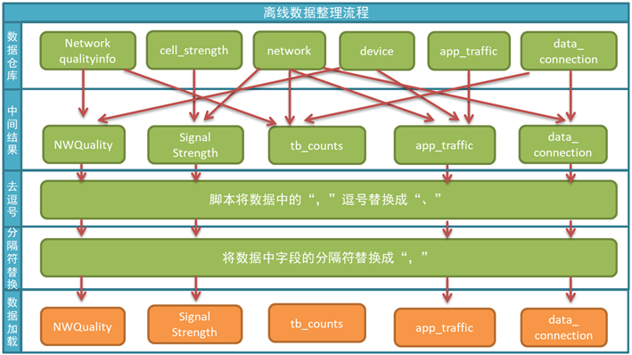

# 项目背景

项目主要包括三个方面：

1. 数仓搭建
2. 实时计算
3. 离线计算

手机已经是人们生活中不可缺少的重要通信、咨询、娱乐的工具。手机在带来方便的同时也带来了烦恼，就是信号质量差手机上网速度慢等问题。针对这一问题，如何为用户提供更好的服务是需要重点关注的问题。
以中国移动为例，全国基站数量462万个，5G基站38万个（全国约70万个），明年预计新建60万，总数约100万个。每个基站覆盖距离，5-10公里(2G)，2-5公里(3G)，1-3公里(4G)，500-800米(5G)。相同的环境下建站的成本翻倍。如何优化无线网络，降低建设成本提升用户体验就变得至关重要。

# 数据来源

## 日志数据

每个用户的手机会给上报基站的信息，包含用户的信号强度，上下行流量，网络制式，运营商信息，经纬度位置信息。

1. 确定每个小区需要集群规模（假设每台服务器8T硬盘，128G内存）每10ms资源调度一次，1s调度100次，每次参与调度的用户最多1200个，
2. 一个基站1s收到的信息做多是1200×100=120000条日志，每天产生日志约24×3600×120000≈100亿条，每条日志1K左右，每个基站每天日志大小10T；
3. ODS层采用LZO压缩，10:1压缩，需要1000G；DWD层需要1000G；DWS轻度数据聚合（不压缩），大概5000G；保存3个副本，（1000G+1000G+5000G）×3=21000G=21T

## Kafka中的数据

1. 每天10T×2（副本数）=20T
2. 保存3天3×20T=60T
3. 预留30%，60T/0.7=90T

# 项目简介

## 5G无线网络覆盖提升和性能优化系统

- 小区用户数，基站配置、小区资源使用率、
- 小区性能分析，高干扰、覆盖性能不足、网络拥塞


原始表：

1. 无线网络信号质量表
2. 用户app使用信息表
3. 基站信息表
4. 用户入网状态表
5. 终端信息表
6. 运营商信息表


## 运营商用户数据分析及定制化套餐系统

- 套餐使用情况，通话、短信、流量、热门App、使用时间
- 针对用户现有套餐的不足，实时个性化套餐推荐


原始表：

1. 终端偏好：品牌、尺寸、型号、价格、操作系统
2. 位置信息：常住地、活动范围、归属地
3. 消费信息：缴费、付费类型、消费水平
4. 行为信息：流量使用情况、在网时长、活跃度、交友圈（主叫、被叫）、常用联系人
5. 身份信息：年龄段、星座、职业、会员积分、性别
6. 使用习惯：常用APP、使用时间段

### 需求

#### 用户主题

1. 活跃设备数（日、周、月）
2. 每日新增设备
3. 沉默用户数
4. 本周回流用户数
5. 流失用户数
6. 留存率
7. 最近三周活跃用户数
8. 最近1天连续三天活跃用户数

#### 套餐使用情况主题

1. 短信、流量、语音使用情况
2. 经常使用时间段和使用地点范围
3. 经常使用的APP和使用习惯

# 数仓

主要分四层：

	• ODS（Operation Data Store）原始数据层，直接加载原始日志、数据，数据保持原貌不变
	• DWD（Data Warehose Detail）明细数据层，结构和ODS保持一致，对ODS进行数据清洗ETL（去除空置，脏数据，超出极限范围的数据）
	• DWS（Data Warehouse Service）服务数据层，以DWD为基础，进行轻度汇总
分四层的原因：为了隔离数据然后还能复用上一层计算的结果；另一方面为了数据备份

1. 首先是ods层 : ods层的数据来源主要是log⽇志和业务系统的数据,业务系统的数据值得就是从Mysql数据库导⼊过来的数据,log⽇志主要是通过采集系统采集过来的;

  

## Flume


1. Flume在1.7以后提供了⼀个TailDirSource⽤来⽀持多⽬录和断点续传功能;

   (1) 断点续传主要保证在服务器挂掉的情况下,再次启动服务数据不会丢失的问题;其原理就是在底层维护了⼀个offset偏移量(也就是每次读取⽂件的偏移量)Flume会通过这个偏移量来找到上次⽂件读取的位置从⽽实现了断点续传的功能;

   (2) 在1.6以前这个实现断点续传是需要⼿⼯维护这个偏移量的会⽐较麻烦;

2. Channel的种类⽐较多主要有:

   (1) MemoryChannel : 数据放在内存中,会在Flume宕机的时候丢失数据,可以⽤在对数据安全性要求没有那么⾼的场景中⽐如⽇志数据;

   (2) FileChannel : 不会丢失数据,因为数据是放在磁盘上边的⽽且⽀持多⽬录配置可以提⾼写⼊的性能,同时因为有落盘的操作所以效率⽐较低,适合⽤在对数据安全性要求⽐较⾼的场景⽐如⾦融类的数据;

   (3) KafkaChannel : 主要是为了对接Kafka,使⽤这个可以节省Sink组件也可以提升效率的,我们项⽬中使⽤的就是这个Channel,因为下⼀层是使⽤Kafka来传递消息的;

在Flume这⼀层我们还做了⼀个拦截器,主要是对收集到的⽇志做了⼀层过滤,因为⽇志在后台都是以Json的格式进⾏存储的,在拦截器⾥边对格式不合法的Json进⾏了⼀次简单清洗;

还做了⼀个分类型的拦截器,在这个拦截器⾥边我们对数据进⾏类型的区分,主要是做了⼀个打标签的功能对不同的⽇志数据打上不同的标签,然后通过后续的选择器Multiplexing将不同标签的数据放到不同的t opic⾥边,⽅便下游对数据进⾏处理;


## Kafka

下游采用Kafka作为消息队列传输消息，使用Kafka的原因是Kafka的高吞吐量以及可以对数据按照不同的topic进行分区，一部分数据放到HDFS作离线处理，一部分通过SparkStreaming做实时批处理

为什么选择Kafka作为消息队列：主要是考虑到高吞吐量

Kafka为什么可以这么快：

1. 生产者发送数据是按照批而不是一条一条的发送

2. 生产者生产一条消息会进入到一个拦截器，从拦截器里出来后进入到序列化器，在序列化器里将数据转换成一个二进制流的形式放入到Broker中

3. 经过序列化后会经过分区器，Kafka的分区器是hash分区器：有三种分区器

   （a）数据带有key，则根据key计算hash

   （b）数据本身带有分区号

   （c）还有个叫累加器的东西，这个分区器其实是一个hashmap，key是分区号，value是一个双端队列，如果发送失败，则会进入队列再次发送

所需Kafka数量=2×（峰值生产速度×副本数/100）+1

Kafka内存一般设置为4-5G

**Kafka架构：**


Kafka主要包含Broker和Consumer，其中Broker是集群的，一个Broker可以包含多个Topic，topic主要用来存储数据同时分为多个partition，用来增加数据传递的并发度，Broker和Consumer的信息都存储在Zookeeper 中

生产者将消息发送到Broker的过程可能会出现消息的重复或者丢失的情况，主要是ACK的配置决定的：

1. ACK=-1这种情况是不会丢失数据的,因为Broker包含T opic,T opic⼜包含Part it ion,⽽Part it ion⾥边还有副本,这⾥就会有Leader和Follower的概念,此时⽣产者发送消息后Leader会等待所有Follower的响应后才会向⽣产者响应,此时是不会丢失数据的,但是会有数据重复的问题这个问题可以在下游消费数据的时候进⾏处理⼀般都是采⽤去重的操作;
2. Ack = 0 : 此时相当于是消息的异步发送,⽣产者发送消息以后不会等待Leader这边的任何响应,如果在发送消息后系统发⽣停电或者宕机此时是会丢失数据的但是这种机制的特点是效率特别⾼;
3. Ack = 1 : 此时⽣产者会等待Leader响应,但是Leader响应的时间是在接受到数据后⽽不是所有的Follower成功后继续你那个响应,如果在Leader刚响应并且Follower没有来得及进⾏同步,此时服务器宕机也会丢失数据的;

ISR副本同步队列,在这个队列⾥边包含了Leader和Follower,主要解决的问题就是Leader挂了以后谁来做Leader的问题

Flume往Kafka传递消息时，会遇到小文件问题，Flume默认根据event的数量生成文件，多少个event就产生多少个文件，小文你见过多产生的危害：

1. 对namenode占用大量存储空间，影响其性能
2. 影响计算性能，因为每个小文件单独生成一个map任务，小文件过多会导致maptask任务过多从而影响计算的性能

解决项文件过多的方法：

1. rollIntercal，设置文件滚动生成时间
2. rollSize，设置文件滚动大小
3. rollCount按照滚动文件个数

## 数仓


### ODS

1. 数据缓冲层，只涉及一个字段进行存储，方便管理和备份
2. 采用LZO压缩
3. 按照日期进行分区

### DWD

1. 多上一层数据进行分解
2. 数据脱敏和过滤
3. 对数据进行降维降级

### DWS

## Hive

### 数据倾斜

#### 原因：

1)、key分布不均匀

2)、业务数据本身的特性

3)、建表时考虑不周

4)、某些SQL语句本身就有数据倾斜

#### 表现：

任务进度长时间维持在99%（或100%），查看任务监控页面，发现只有少量（1个或几个）reduce子任务未完成。因为其处理的数据量和其他reduce差异过大。

单一reduce的记录数与平均记录数差异过大，通常可能达到3倍甚至更多。 最长时长远大于平均时长。

#### 解决办法

（1）不同数据类型关联产生数据倾斜

情形：比如用户表中user_id字段为int，log表中user_id字段string类型。当按照user_id进行两个表的Join操作时。

解决方式：把数字类型转换成字符串类型

```
select * from users a
left outer join logs b
on a.usr_id = cast(b.user_id as string)

bug记录：https://www.jianshu.com/p/2181e00d74dc
```

（2）控制空值分布

在生产环境经常会用大量空值数据进入到一个reduce中去，导致数据倾斜。

解决办法：

自定义分区，将为空的key转变为字符串加随机数或纯随机数，将因空值而造成倾斜的数据分不到多个Reducer。

注意：对于异常值如果不需要的话，最好是提前在where条件里过滤掉，这样可以使计算量大大减少

（3）解决数据倾斜的方法？

1、group by

注：group by 优于distinct group

解决方式：采用sum() group by的方式来替换count(distinct)完成计算。

2、mapjoin

3、开启数据倾斜时负载均衡

set hive.groupby.skewindata=true;

思想：就是先随机分发并处理，再按照key group by来分发处理。

操作：当选项设定为true，生成的查询计划会有两个MRJob。

第一个MRJob中，Map的输出结果集合会随机分布到Reduce中，每个Reduce做部分聚合操作，并输出结果，这样处理的结果是相同的GroupBy Key有可能被分发到不同的Reduce中，从而达到负载均衡的目的；

第二个MRJob再根据预处理的数据结果按照GroupBy Key分布到Reduce中（这个过程可以保证相同的原始GroupBy Key被分布到同一个Reduce中），最后完成最终的聚合操作。

> 点评：它使计算变成了两个mapreduce，先在第一个中在shuffle过程partition时随机给 key打标记，使每个key随机均匀分布到各个reduce上计算，但是这样只能完成部分计算，因为相同key没有分配到相同reduce上。

所以需要第二次的mapreduce，这次就回归正常shuffle，但是数据分布不均匀的问题在第一次mapreduce已经有了很大的改善，因此基本解决数据倾斜。因为大量计算已经在第一次mr中随`机分布到各`个节点完成。

（4）设置多个reduce个数

# Spark

## 数据倾斜

### 数据倾斜产生的的原因

我们以Spark和Hive的使用场景为例。

他们在做数据运算的时候会涉及到，count distinct、group by、join on等操作，这些都会触发Shuffle动作。一旦触发Shuffle，所有相同key的值就会被拉到一个或几个Reducer节点上，容易发生单点计算问题，导致数据倾斜。

一般来说，数据倾斜原因有以下几方面：

1）key分布不均匀                           

2）建表时考虑不周

我们举一个例子，就说数据默认值的设计吧，假设我们有两张表：

user（用户信息表）：userid，register_ip

ip（IP表）：ip，register_user_cnt

这可能是两个不同的人开发的数据表。如果我们的数据规范不太完善的话，会出现一种情况：

user表中的register_ip字段，如果获取不到这个信息，我们默认为null；

但是在ip表中，我们在统计这个值的时候，为了方便，我们把获取不到ip的用户，统一认为他们的ip为0。

两边其实都没有错的，但是一旦我们做关联了，这个任务会在做关联的阶段，也就是sql的on的阶段卡死。

3）业务数据激增

比如订单场景，我们在某一天在北京和上海两个城市多了强力的推广，结果可能是这两个城市的订单量增长了10000%，其余城市的数据量不变。

然后我们要统计不同城市的订单情况，这样，一做group操作，可能直接就数据倾斜了。

### 数据倾斜解决方案


# 分析的指标

使用的表：



## 网络质量信息表

| 序号 | 字段               | 类型   | 说明                          | 样例数据                       |
| ---- | ------------------ | ------ | ----------------------------- | ------------------------------ |
| 1    | Id                 | int    | 自增,key                      | 1                              |
| 2    | ping               | string | 延迟（ms）                    | 100                            |
| 3    | ave_downloadSpeed  | string | 平均下载速度（kb/s）          | 152                            |
| 4    | max_downloadSpeed  | string | 最大下载速度（kb/s）          | 1923                           |
| 5    | ave_uploadSpeed    | string | 平均上传速度（kb/s）          | 385                            |
| 6    | max_uploadSpeed    | string | 最大上传速度（kb/s）          | 511                            |
| 7    | rssi               | string | 信号                          | -58                            |
| 8    | gps_lat            | string | GPS纬度                       | 39.961248                      |
| 9    | gps_lon            | string | GPS经度                       | 116.358825                     |
| 10   | location_type      | string | 网络或WiFi                    | \N                             |
| 11   | imei               | string | 手机IMEI                      | 3.57242E+14                    |
| 12   | server_url         | string | 服务URL                       | http://ccpn.3322.org/speedtest |
| 13   | ant_version        | string | app 版本                      | 3.0h                           |
| 14   | detail             | string | 细节                          | \N                             |
| 15   | time_client_test   | string | 手机测试时间                  | 2017-5-19 20:11                |
| 16   | time_server_insert | string | 插入服务器时间                | 2017-5-19 20:12                |
| 17   | networkType        | string | wifi/3G/2G                    | Wi-Fi                          |
| 18   | operator_name      | string | （网络名称）CMCC/CUCC/CTCC    | CUCC                           |
| 19   | wifi_bss_id        | string | wifi bssid                    | 00:1b:2f:63:97:aa              |
| 20   | cell_id            | string | plmn+lac+cid/plmn+sid+bid+nid | 4.60015E+11                    |
| 21   | province           | string | 用户所在省                    | 北京市                         |
| 22   | city               | string | 用户所在城市                  | 北京市                         |
| 23   | mobile_type        | string | 细节类型                      | \N                             |
| 24   | street             | string | 所在街道地址                  | \N                             |
| 25   | location_detail    | string | 详细位置地址                  | \N                             |
| 26   | upload_trafflic    | string | 上传流量                      |                                |
| 27   | download_traffic   | string | 下载流量                      | 1                              |

## App业务信息统计

| 序号 | 字段             | 类型   | 说明                   | 样例数据             |
| ---- | ---------------- | ------ | ---------------------- | -------------------- |
| 1    | id               | int    | 自增,key               | 86000001             |
| 2    | package_name     | string | 应用程序包名称         | all                  |
| 3    | app_name         | string | 应用程序名称           | phoneTotalTraffic    |
| 4    | uid              | string | 应用程序的uid          | -1000                |
| 5    | network_type     | string | （网络类型）wifi/2G/3G | mobile               |
| 6    | mobile_type      | string | 详细类型               | HSDPA                |
| 7    | cell_id          | string | gsm 或cdma的cellID     | 46001-45866-62471030 |
| 8    | wifi_bssid       | string | wifi 的 bssid          | null                 |
| 9    | start_time       | string | 开始时间               | 2018-7-11 20:11      |
| 10   | end_time         | string | 结束时间               | 2018-7-11 20:11      |
| 11   | upload_traffic   | string | 上传流量               | 10138                |
| 12   | download_traffic | string | 下载流量               | 20654                |
| 13   | date             | string | 数据成产日期           | 2018-7-11            |
| 14   | time_index       | string | 数据成产时间           | 2018-7-11 20:11      |
| 15   | imei             | string | 移动网络IMEI码         | 3.56871E+14          |
| 16   | sdk_version      | string | SDK 版本               | passive-yasuo-test-m |
| 17   | user_lat         | string | 用户纬度               | 43.848316            |
| 18   | user_lon         | string | 用户经度               | 126.577612           |
| 19   | location_type    | string | 位置类型               | Network -1842.       |

## 小区信息统计表

| 序号 | 字段               | 类型   | 说明                   | 样例数据            |
| ---- | ------------------ | ------ | ---------------------- | ------------------- |
| 1    | id                 | int    | 自增,key               | 24                  |
| 2    | network_id         | string | gsm 或 wifi的ID        | 46001-41023-5228355 |
| 3    | network_type       | string | （网络类型）wifi/2G/3G | HSDPA               |
| 4    | gsm_strength       | string | GMS的信号强度          | 17                  |
| 5    | cdma_dbm           | string | CDMA的信号强度         | -1                  |
| 6    | evdo_dbm           | string | EVDO信号强度           | -1                  |
| 7    | gsm_bit_errorrate  | string | 误码率                 | -1                  |
| 8    | cdma_ecio          | string | CDMA的ECIO（网络质量） | -1                  |
| 9    | evdo_ecio          | string | EVDO的ECIO（网络质量） | -1                  |
| 10   | user_lat           | string | 用户的纬度             | 0                   |
| 11   | user_lon           | string | 用户的经度             | 0                   |
| 12   | user_location_info | string | 用户位置信息           | gcj02-UNKNOWN       |
| 13   | bs_lat             | string | 基站纬度               | -1                  |
| 14   | bs_lon             | string | 基站经度               | -1                  |
| 15   | time_index         | string | 信号强度收集时间       | 2017-7-8 17:16      |
| 16   | imei               | string | 手机IMEI               | 3.57841E+14         |

## 用户终端入网连接信息

| 序号 | 字段                | 类型   | 说明                                                   | 样例数据              |
| ---- | ------------------- | ------ | :----------------------------------------------------- | --------------------- |
| 1    | Id                  | int    | 自增,key                                               | 13                    |
| 2    | imei                | string | 手机IMEI                                               | 8.67747E+14           |
| 3    | network_type        | string | （网络类型）wifi/2G/3G                                 | Wi-Fi                 |
| 4    | wifi_bssid          | string | Wifi的 bssid                                           | 00:24:a5:f0:1e:92     |
| 5    | wifi_state          | string | WiFi的状态                                             | CONNECTED             |
| 6    | wifi_rssi           | string | WiFi信号                                               | null                  |
| 7    | mobile_state        | string | 移动的状态                                             | -1                    |
| 8    | mobile_network_type | string | 移动网络详情                                           | mobile                |
| 9    | network_id          | string | gsm 或 cdma 的cellID                                   | 4600*                 |
| 10   | gsm_strength        | string | GSM信号强度                                            | 99                    |
| 11   | cdma_dbm            | string | CDMA信号强度                                           | -1                    |
| 12   | evdo_dbm            | string | EVDO信号强度                                           | -1                    |
| 13   | internal_ip         | string | 内网IP                                                 | 192.168.102.98        |
| 14   | web_url             | string | web url                                                | http://192.168.102.65 |
| 15   | ping_value          | string | 1	表示成功     0  表示失败     结果以字符串形式返回 | 0                     |
| 16   | user_lat            | string | 用户的纬度                                             | 39.98949              |
| 17   | user_lon            | string | 用户的经度                                             | 116.33172             |
| 18   | user_location_info  | string | 用户位置信息                                           | bd09ll-Network -40.0  |
| 19   | bs_lat              | string | 基站纬度                                               | -1                    |
| 20   | bs_lon              | string | 基站经度                                               | -1                    |
| 21   | time_index_client   | string | 测试时间                                               | 2015-2-2 16:41        |
| 22   | version             | string | UNOSDK 版本                                            | anttest6.3.3-docomo   |
| 23   | time_server_insert  | string | 插入服务器的时间                                       | 2015-2-2 16:40        |

## 终端信息表

| 序号 | 字段         | 类型   | 说明            | 样例数据                    |
| ---- | ------------ | ------ | --------------- | --------------------------- |
| 1    | id           | int    | 自增,key        | 1                           |
| 2    | imei         | string | 手机IMEI        | 3.57242E+14                 |
| 3    | company      | string | 手机品牌        | samsung                     |
| 4    | model        | string | 手机型号        | GT-I9000                    |
| 5    | os           | string | 操作系统        | android                     |
| 6    | os_version   | string | 操作系统版本    | 4.0.3                       |
| 7    | sdk_version  | string | Android SDK版本 | 15                          |
| 8    | cpu          | string | CPU信息         | ARMv7 Processor rev 2 (v7l) |
| 9    | total_memory | string | 总内存          | 335172kB                    |
| 10   | free_memory  | string | 可用内存        | 67248KB                     |
| 11   | display      | string | 手机显示屏      | 480*800                     |
| 12   | time_first   | string | 首次插入时间    | 2017-5-17 16:14             |
| 13   | time_last    | string | 最后插入时间    | 2017-7-15 14:38             |

## 网络信息表

| 序号 | 字段         | 类型   | 说明     | 样例数据 |
| ---- | ------------ | ------ | -------- | -------- |
| 1    | network_id   | int    | 网络ID   | 46000    |
| 2    | network_name | string | 网络名称 | CMCC     |

1. 实时上下行平均速率统计、连接用户数、用户地理分布、流量地理分布、信号强度热力地图
2. 热门App使用，各App使用流量分布
3. 热门手机使用情况和分布、异常终端识别、移动用户位置分布
4. 用户、新增用户、活跃用户、周活、日活、月活、沉默用户、连续活跃用户、忠诚用户、流失用户、留存用户

# 面试必问问题

1. 离职原因：个人原因，家庭原因
2. 加班的看法 住的地方近
3. 个人优缺点：全力以赴，适应能力
4. 项目中遇到的难题，讲述自己最大的成就
5. 项目的介绍


